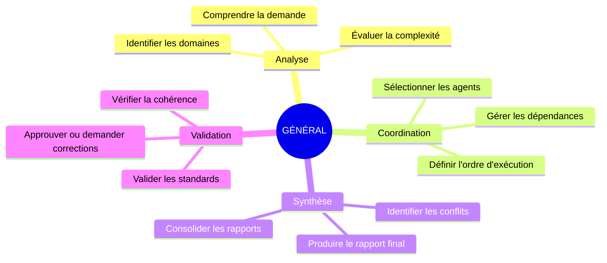
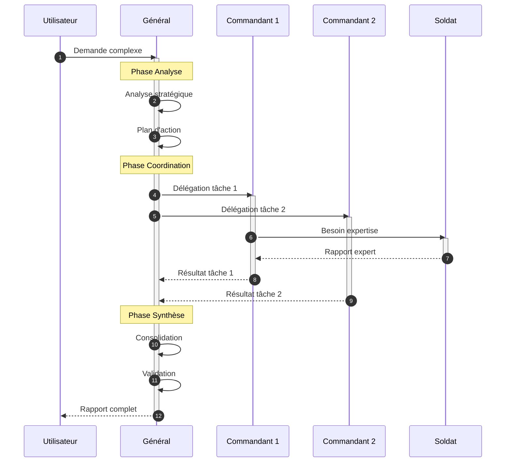
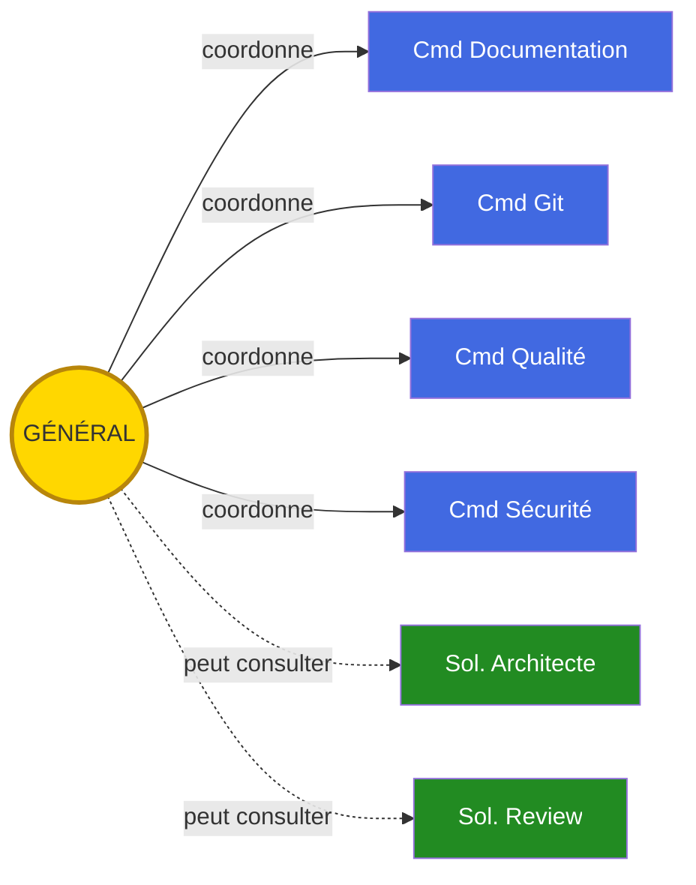

# Général - Orchestrateur Suprême

## Carte d'Identité

| Attribut | Valeur |
|----------|--------|
| **Rang** | État-Major |
| **Fichier** | `.claude/agents/general_agent.md` |
| **Invocation** | `@general_agent` |
| **Domaine** | Coordination globale |
| **Autonomie** | Haute |

---

## Mission

Le **Général** est l'agent orchestrateur suprême d'Army2077. Sa mission est de :

1. **Analyser** les demandes complexes et déterminer la stratégie optimale
2. **Coordonner** les agents spécialisés d'Army2077 pour accomplir les tâches
3. **Synthétiser** les résultats en un rapport cohérent
4. **Valider** la qualité globale du travail produit

---

## Diagramme de Responsabilités



---

## Flux de Travail



---

## Cas d'Utilisation

### Quand invoquer le Général ?

| Situation | Recommandé |
|-----------|:----------:|
| Feature complexe multi-domaines | Oui |
| Validation finale avant merge | Oui |
| Coordination tests + docs + commits | Oui |
| Simple bug fix | Non |
| Documentation seule | Non |
| Commits uniquement | Non |

### Exemples de Commandes

=== "Feature Complète"

    ```bash
    @general_agent "J'ai terminé le système ECS.

                    Code dans: src/ecs/

                    Assure-toi que:
                    - Architecture solide
                    - Tests complets (>80%)
                    - Sécurité validée
                    - Documentation complète
                    - Commits atomiques"
    ```

=== "Validation Avant Merge"

    ```bash
    @general_agent "Valide ma branche feature/particles avant merge.

                    Vérifie tous les aspects:
                    - Qualité du code
                    - Tests passent
                    - Documentation à jour
                    - Pas de vulnérabilités"
    ```

=== "Audit Global"

    ```bash
    @general_agent "Audit complet du module Network.

                    Focus sur:
                    - Architecture
                    - Performance
                    - Sécurité
                    - Maintenabilité"
    ```

---

## Format de Rapport

Le Général produit des rapports structurés :

```markdown
# RAPPORT DE MISSION - [Titre]

## Résumé Exécutif
**Statut Global**: [PRÊT/EN COURS/BLOQUÉ]
**Score Qualité**: [XX/100]

---

## 1. [Domaine 1] (Agent X)
**Statut**: [VALIDÉ/EN ATTENTE/ÉCHEC]

[Détails...]

## 2. [Domaine 2] (Agent Y)
**Statut**: [VALIDÉ/EN ATTENTE/ÉCHEC]

[Détails...]

---

## Actions Recommandées
1. [REQUIS] Action obligatoire
2. [OPTIONNEL] Suggestion d'amélioration

---

## Prochaines Étapes
- [ ] Étape 1
- [ ] Étape 2
```

---

## Interactions avec les Autres Agents



---

## Principes Fondamentaux

1. **Vision Globale** : Le Général voit l'ensemble, pas juste les détails
2. **Délégation Intelligente** : Sait quand déléguer et à qui
3. **Qualité Sans Compromis** : N'approuve pas un travail insuffisant
4. **Communication Claire** : Rapports structurés et actionnables
5. **Efficacité** : Parallélise quand possible, séquentialise quand nécessaire

---

## Limitations

!!! warning "Ce que le Général ne fait PAS"
    - Écriture directe de code (délègue)
    - Modifications Git directes (délègue au Cmd Git)
    - Tests unitaires (délègue au Cmd Qualité)
    - Documentation technique (délègue au Cmd Documentation)

---

## Voir Aussi

- [Architecture de la Ruche](../architecture.md)
- [Workflows](../workflows.md)
- [Commandant Documentation](commander-documentation.md)
- [Commandant Qualité](commander-quality.md)
