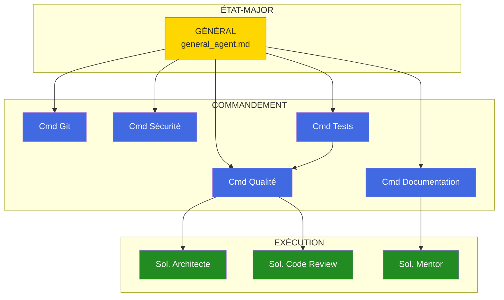

# Documentation des Agents

Cette section contient la documentation détaillée de chaque agent d'Army2077.

---

## Hiérarchie des Agents

---

## État-Major

-   :material-crown:{ .lg .middle } **Général - Orchestrateur**

    ---

    Agent suprême coordonnant l'ensemble de la Ruche.

    [:octicons-arrow-right-24: Documentation](general.md)

---

## Commandants

-   :material-file-document-multiple:{ .lg .middle } **Commandant Documentation**

    ---

    Expert en documentation technique MkDocs Material.

    [:octicons-arrow-right-24: Documentation](commander-documentation.md)

-   :material-source-branch:{ .lg .middle } **Commandant Git**

    ---

    Expert en versioning et gestion des commits.

    [:octicons-arrow-right-24: Documentation](commander-git.md)

-   :material-test-tube:{ .lg .middle } **Commandant Qualité**

    ---

    Expert en tests et standards de qualité.

    [:octicons-arrow-right-24: Documentation](commander-quality.md)

-   :material-shield-check:{ .lg .middle } **Commandant Sécurité**

    ---

    Expert en sécurité et CI/CD.

    [:octicons-arrow-right-24: Documentation](commander-security.md)

-   :material-test-tube-empty:{ .lg .middle } **Commandant Tests**

    ---

    Expert en tests unitaires et couverture (GTest).

    [:octicons-arrow-right-24: Documentation](commander-tests.md)

---

## Soldats Spécialisés

-   :material-sitemap:{ .lg .middle } **Soldat Architecte**

    ---

    Spécialiste en conception et design patterns.

    [:octicons-arrow-right-24: Documentation](soldier-architecture.md)

-   :material-magnify-scan:{ .lg .middle } **Soldat Code Review**

    ---

    Spécialiste en revue de code critique.

    [:octicons-arrow-right-24: Documentation](soldier-code-review.md)

-   :material-school:{ .lg .middle } **Soldat Mentor**

    ---

    Conseiller d'apprentissage technique.

    [:octicons-arrow-right-24: Documentation](soldier-learning-advisor.md)

---

## Tableau Comparatif

| Agent | Fichier | Domaine | Autonomie |
|-------|---------|---------|-----------|
| **Général** | `general_agent.md` | Coordination | Haute |
| **Cmd Documentation** | `commander_documentation.md` | Documentation | Haute |
| **Cmd Git** | `commander_git.md` | Versioning | Haute |
| **Cmd Qualité** | `commander_quality.md` | Tests/Qualité | Moyenne |
| **Cmd Sécurité** | `commander_security.md` | Sécurité/CI | Moyenne |
| **Cmd Tests** | `commander_tests.md` | Tests/Couverture | Haute |
| **Sol. Architecte** | `soldier_architecture.md` | Architecture | Moyenne |
| **Sol. Code Review** | `soldier_code_review.md` | Review | Moyenne |
| **Sol. Mentor** | `soldier_learning_advisor.md` | Apprentissage | Moyenne |

---

## Navigation

- [Introduction à la Ruche](../introduction.md)
- [Architecture](../architecture.md)
- [Workflows](../workflows.md)
- [Référence Rapide](../quick-reference.md)
