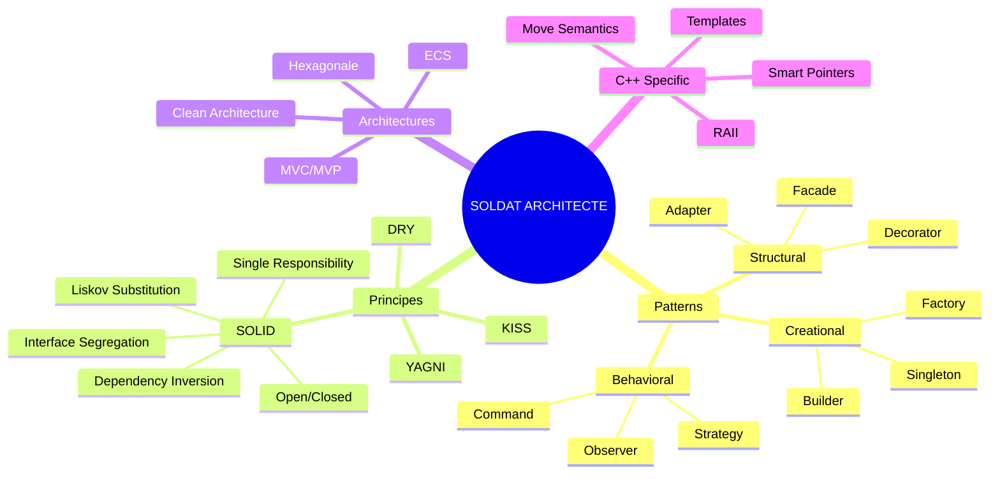
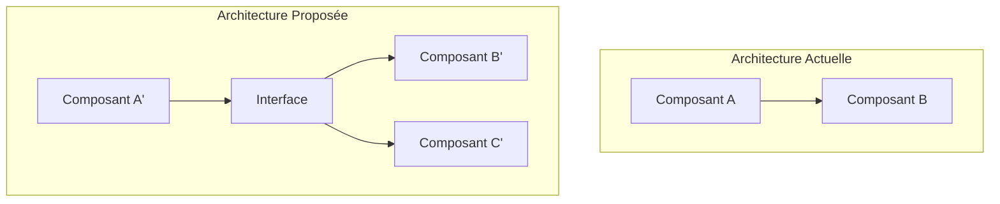
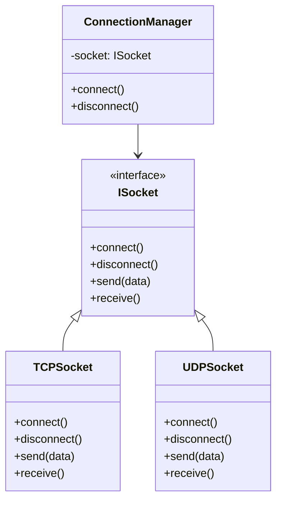
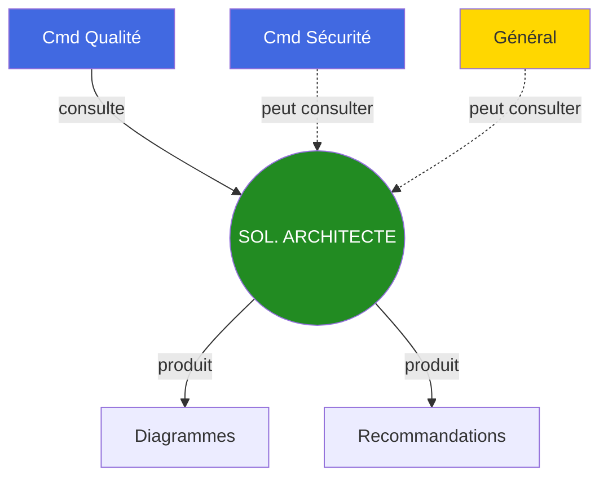

# Soldat Architecte

## Carte d'Identité

| Attribut | Valeur |
|----------|--------|
| **Rang** | Soldat Spécialisé |
| **Fichier** | `.claude/agents/soldier_architecture.md` |
| **Invocation** | `@soldier_architecture` |
| **Domaine** | Conception & Design |
| **Autonomie** | Moyenne |
| **Supérieur** | Commandant Qualité |

---

## Mission

Le **Soldat Architecte** est le spécialiste en conception logicielle. Sa mission est de :

1. **Analyser** l'architecture existante et proposer des améliorations
2. **Concevoir** des solutions respectant les patterns et principes SOLID
3. **Valider** les choix architecturaux
4. **Guider** vers une architecture maintenable et évolutive

---

## Expertise



---

## Principes SOLID Expliqués

### S - Single Responsibility Principle

```cpp
// MAUVAIS : Classe avec trop de responsabilités
class NetworkManager {
    void connect();
    void disconnect();
    void serialize(Packet p);      // Responsabilité 2
    void deserialize(data);        // Responsabilité 2
    void handleProtocol(msg);      // Responsabilité 3
};

// BON : Une responsabilité par classe
class ConnectionManager {
    void connect();
    void disconnect();
};

class PacketSerializer {
    std::vector<uint8_t> serialize(const Packet& p);
    Packet deserialize(const std::vector<uint8_t>& data);
};

class ProtocolHandler {
    void handleMessage(const Message& msg);
};
```

### O - Open/Closed Principle

```cpp
// MAUVAIS : Modification requise pour chaque nouveau type
void render(Shape& shape) {
    if (shape.type == "circle") drawCircle();
    else if (shape.type == "square") drawSquare();
    // Ajouter ici pour nouveau type...
}

// BON : Extension sans modification
class IShape {
public:
    virtual void draw() const = 0;
};

class Circle : public IShape {
    void draw() const override { /* ... */ }
};

class Square : public IShape {
    void draw() const override { /* ... */ }
};
```

### D - Dependency Inversion Principle

```cpp
// MAUVAIS : Dépendance concrète
class GameEngine {
    SFMLRenderer renderer;  // Couplé à SFML
};

// BON : Dépendance abstraite
class GameEngine {
    std::unique_ptr<IRenderer> renderer;  // Peut être n'importe quoi

public:
    GameEngine(std::unique_ptr<IRenderer> r)
        : renderer(std::move(r)) {}
};
```

---

## Commandes Types

=== "Proposition Architecture"

    ```bash
    @soldier_architecture "Propose une architecture pour le système ECS.

                           Requirements:
                           - Performance (10k+ entités)
                           - Extensibilité
                           - Testabilité

                           Contraintes:
                           - C++23
                           - Pas de dépendances externes"
    ```

=== "Review Architecture"

    ```bash
    @soldier_architecture "Review l'architecture du module Network.

                           Fichiers: src/network/

                           Vérifie:
                           - Respect SOLID
                           - Découplage
                           - Patterns appropriés"
    ```

=== "Refactoring"

    ```bash
    @soldier_architecture "Propose un refactoring pour NetworkManager.

                           Problème: Classe trop grosse (500 lignes)
                           Objectif: Séparer les responsabilités"
    ```

---

## Format de Rapport Architecture

```markdown
# RAPPORT ARCHITECTURE - [Module]

## Vue d'Ensemble



## Analyse de l'Existant

### Points Positifs
- [Point 1]
- [Point 2]

### Points à Améliorer
- **Violation SRP**: NetworkManager a 5 responsabilités
- **Couplage fort**: Dépendance directe à SFML

## Proposition

### Architecture Cible

```
NetworkModule/
├── interfaces/
│   ├── ISocket.hpp
│   └── ISerializer.hpp
├── core/
│   ├── ConnectionManager.hpp
│   └── ProtocolHandler.hpp
└── impl/
    ├── TCPSocket.hpp
    └── UDPSocket.hpp
```

### Patterns Recommandés
1. **Factory** : Création des sockets
2. **Strategy** : Protocoles interchangeables
3. **Observer** : Events réseau

### Diagramme de Classes



## Plan de Migration

1. **Étape 1**: Extraire interface ISocket
2. **Étape 2**: Adapter TCPSocket existant
3. **Étape 3**: Créer ConnectionManager
4. **Étape 4**: Migrer les appels
5. **Étape 5**: Tests

## Métriques Attendues

| Métrique | Avant | Après |
|----------|-------|-------|
| Classes | 1 | 4 |
| Lignes/classe | 500 | <100 |
| Couplage | Fort | Faible |
| Testabilité | Difficile | Facile |
```

---

## Patterns Recommandés pour R-Type

| Contexte | Pattern | Usage |
|----------|---------|-------|
| **ECS** | Entity-Component-System | Gameplay |
| **Plugins** | Strategy + Factory | Graphiques |
| **Events** | Observer | Input, Network |
| **Création entités** | Factory | PlayerFactory, EnemyFactory |
| **States** | State Machine | Scènes, AI |
| **Resources** | Flyweight | Textures, Sons |

---

## Interactions



---

## Checklist Architecture

- [ ] Responsabilités clairement séparées
- [ ] Pas de dépendances circulaires
- [ ] Interfaces pour découplage
- [ ] Injection de dépendances
- [ ] Patterns appropriés au contexte
- [ ] Extensible sans modification
- [ ] Testable unitairement

---

## Voir Aussi

- [Commandant Qualité](commander-quality.md)
- [Soldat Code Review](soldier-code-review.md)
- [Architecture Hexagonale](/guides/hexagonal-architecture.md)
- [Architecture Générale](/guides/architecture.md)
