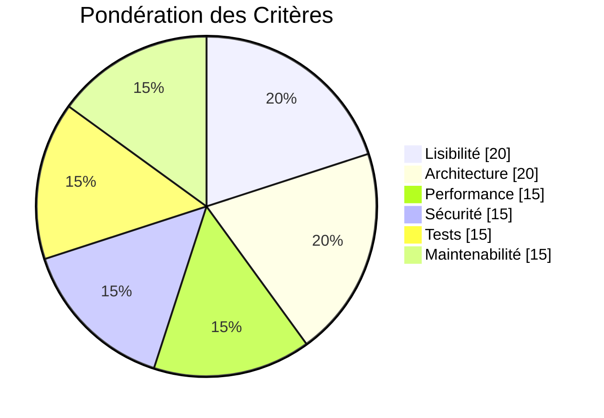
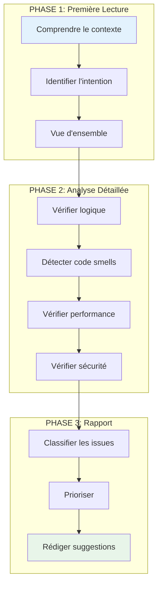
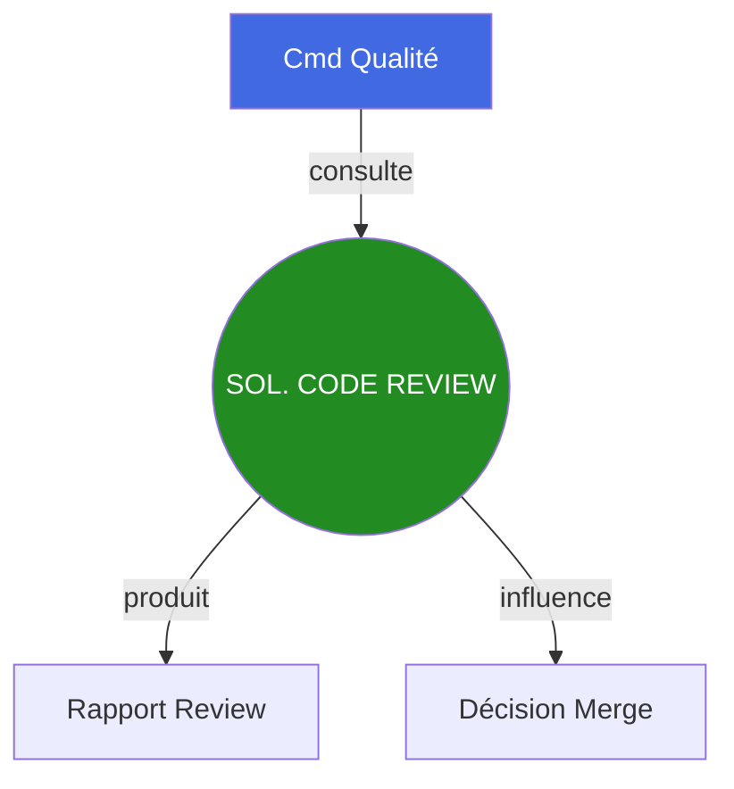

# Soldat Code Review

## Carte d'Identité

| Attribut | Valeur |
|----------|--------|
| **Rang** | Soldat Spécialisé |
| **Fichier** | `.claude/agents/soldier_code_review.md` |
| **Invocation** | `@soldier_code_review` |
| **Domaine** | Revue de Code |
| **Autonomie** | Moyenne |
| **Supérieur** | Commandant Qualité |

---

## Mission

Le **Soldat Code Review** est le spécialiste en revue de code critique. Sa mission est de :

1. **Analyser** le code de manière critique et constructive
2. **Détecter** les code smells, bugs potentiels et problèmes de qualité
3. **Suggérer** des améliorations concrètes et actionnables
4. **Éduquer** en expliquant le "pourquoi" des suggestions

---

## Critères d'Évaluation



---

## Code Smells Détectés

### Catégories

| Catégorie | Exemples | Sévérité |
|-----------|----------|----------|
| **Bloaters** | Méthodes longues, Classes géantes | Moyenne |
| **OO Abusers** | Switch statements, Temporary field | Moyenne |
| **Change Preventers** | Divergent change, Shotgun surgery | Haute |
| **Dispensables** | Dead code, Speculative generality | Basse |
| **Couplers** | Feature envy, Inappropriate intimacy | Haute |

### Exemples Concrets

```cpp
// CODE SMELL: Méthode trop longue
void processEverything() {
    // 200 lignes de code...
}

// SOLUTION: Extraire en méthodes
void processEverything() {
    validateInput();
    processData();
    formatOutput();
    sendResult();
}

// CODE SMELL: Magic Numbers
if (health < 25) {
    setColor(0xFF0000);
}

// SOLUTION: Constantes nommées
constexpr float CRITICAL_HEALTH_THRESHOLD = 25.0f;
constexpr uint32_t COLOR_DANGER = 0xFF0000;

if (health < CRITICAL_HEALTH_THRESHOLD) {
    setColor(COLOR_DANGER);
}

// CODE SMELL: Feature Envy
class Order {
    float calculateDiscount(Customer& c) {
        if (c.getAge() > 65) return c.getDiscount() * 1.1;
        if (c.getLoyaltyPoints() > 1000) return c.getDiscount() * 1.2;
        return c.getDiscount();
    }
};

// SOLUTION: Déplacer dans Customer
class Customer {
    float calculateDiscount() const {
        float discount = baseDiscount_;
        if (age_ > 65) discount *= 1.1;
        if (loyaltyPoints_ > 1000) discount *= 1.2;
        return discount;
    }
};
```

---

## Commandes Types

=== "Review Standard"

    ```bash
    @soldier_code_review "Review le fichier src/ecs/Entity.cpp"
    ```

=== "Review Détaillée"

    ```bash
    @soldier_code_review "Review détaillée du module ECS.

                          Fichiers:
                          - src/ecs/Entity.hpp
                          - src/ecs/World.hpp
                          - src/ecs/ComponentPool.hpp

                          Focus:
                          - Performance
                          - Memory management
                          - Thread safety"
    ```

=== "Review avec Checklist"

    ```bash
    @soldier_code_review "Review src/network/TCPClient.cpp

                          Checklist:
                          - [ ] Clean Code
                          - [ ] SOLID
                          - [ ] Error handling
                          - [ ] Resource management
                          - [ ] Thread safety"
    ```

---

## Flux de Review



---

## Format de Review

```markdown
# CODE REVIEW - [Fichier/Module]

## Résumé
**Score**: [X/10]
**Issues**: [X critiques, Y importantes, Z mineures]
**Verdict**: [APPROVE / REQUEST CHANGES / COMMENT]

---

## Points Positifs
- Utilisation correcte de RAII
- Bonne séparation des responsabilités
- Nommage clair et explicite

---

## Issues Détectées

### CRITIQUE - Buffer overflow potentiel

**Fichier**: `PacketHandler.cpp`
**Ligne**: 45

```cpp
// Problème
void handleData(const char* data, size_t len) {
    char buffer[256];
    memcpy(buffer, data, len);  // len peut être > 256 !
}
```

**Pourquoi c'est un problème**:
- `len` n'est pas validé
- Peut écraser la stack
- Vulnérabilité de sécurité

**Suggestion**:
```cpp
void handleData(const char* data, size_t len) {
    if (len > MAX_BUFFER_SIZE) {
        throw std::invalid_argument("Data too large");
    }
    std::vector<char> buffer(data, data + len);
}
```

---

### IMPORTANTE - Code dupliqué

**Fichiers**: `LoginHandler.cpp`, `RegisterHandler.cpp`
**Lignes**: 23-45, 67-89

**Problème**: 22 lignes identiques de validation

**Suggestion**: Extraire dans `ValidationUtils`

---

### MINEURE - Magic number

**Fichier**: `GameLoop.cpp`
**Ligne**: 12

```cpp
if (deltaTime > 0.1f) deltaTime = 0.1f;
```

**Suggestion**:
```cpp
constexpr float MAX_DELTA_TIME = 0.1f;
if (deltaTime > MAX_DELTA_TIME) deltaTime = MAX_DELTA_TIME;
```

---

## Checklist
- [x] Compilation sans warnings
- [x] Nommage explicite
- [ ] Documentation des fonctions publiques
- [x] Error handling
- [ ] Tests associés
- [x] Pas de memory leaks
```

---

## Niveaux de Sévérité

| Niveau | Icône | Description | Action |
|--------|-------|-------------|--------|
| **Critique** | 🔴 | Bug, sécurité, crash | Bloque merge |
| **Importante** | 🟠 | Qualité significative | À corriger |
| **Normale** | 🟡 | Amélioration | Recommandé |
| **Mineure** | 🟢 | Style, nitpick | Optionnel |
| **Positive** | 🔵 | Point positif | Info |

---

## Bonnes Pratiques de Review

!!! tip "Conseils pour une review efficace"

    1. **Commencer positif** : Mentionner ce qui est bien fait
    2. **Être constructif** : Proposer des solutions, pas juste critiquer
    3. **Expliquer le pourquoi** : Éduquer, pas juste corriger
    4. **Rester objectif** : Standards du projet, pas préférences personnelles
    5. **Prioriser** : Distinguer critique vs nice-to-have

---

## Interactions



---

## Checklist Review Standard

### Fonctionnalité
- [ ] Le code fait ce qu'il est censé faire
- [ ] Les edge cases sont gérés
- [ ] L'erreur handling est approprié

### Qualité
- [ ] Code lisible et compréhensible
- [ ] Nommage explicite
- [ ] Pas de code mort
- [ ] Pas de duplication

### Architecture
- [ ] Respect des patterns du projet
- [ ] Découplage approprié
- [ ] Single Responsibility

### Performance
- [ ] Pas d'opérations coûteuses inutiles
- [ ] Complexité algorithmique raisonnable
- [ ] Gestion mémoire correcte

### Sécurité
- [ ] Inputs validés
- [ ] Pas de vulnérabilités évidentes
- [ ] Ressources correctement libérées

---

## Voir Aussi

- [Commandant Qualité](commander-quality.md)
- [Soldat Architecte](soldier-architecture.md)
- [Guide de contribution](/development/contributing.md)
