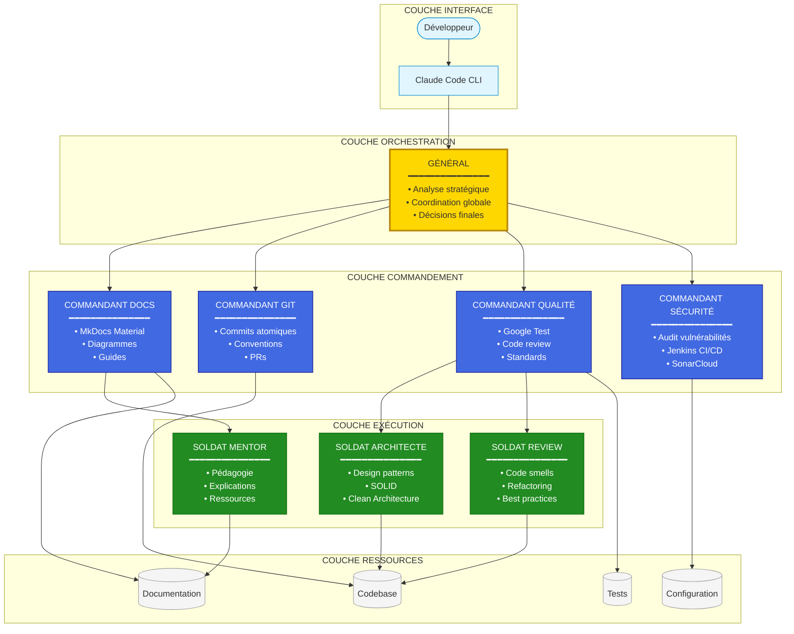
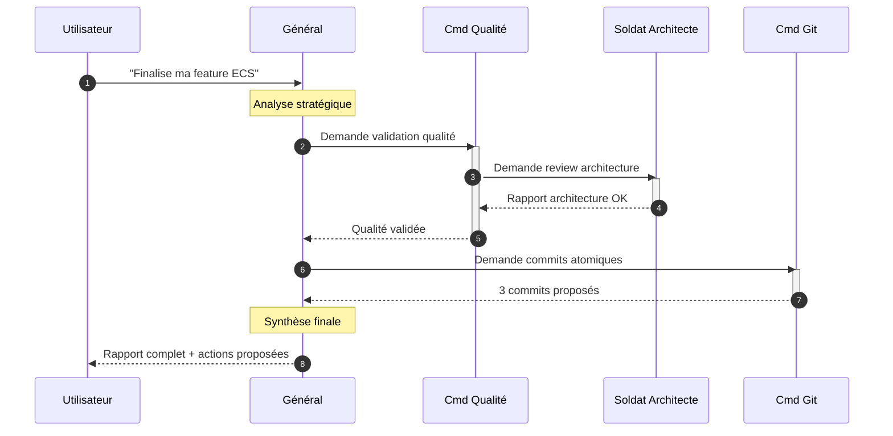
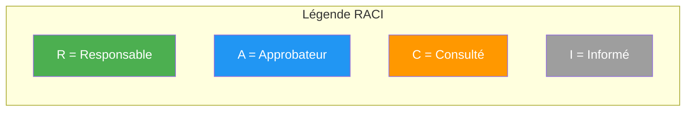
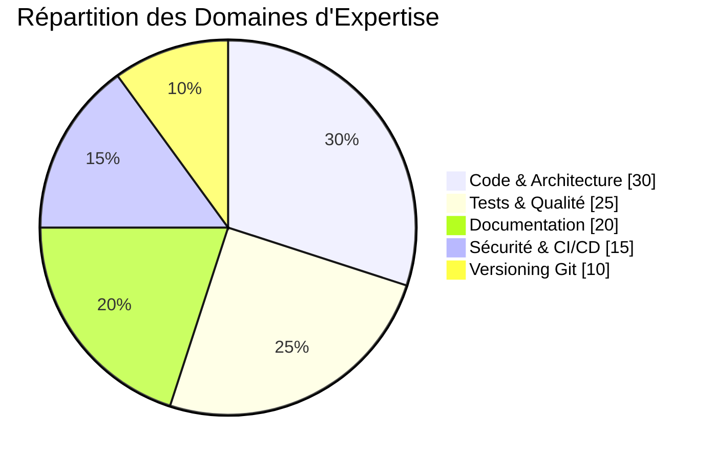
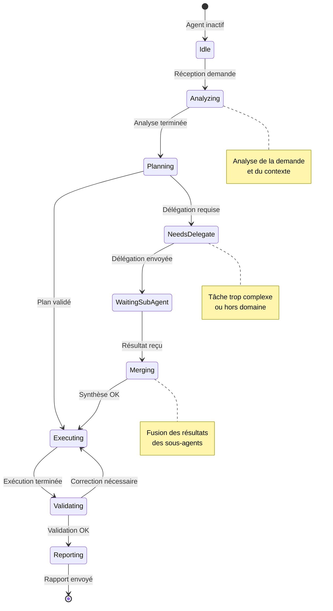
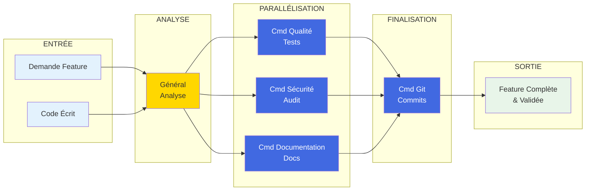
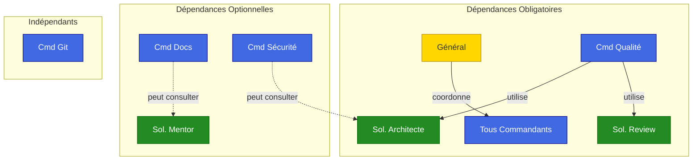
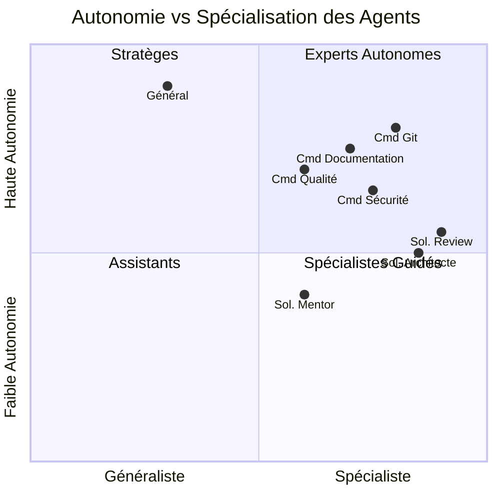
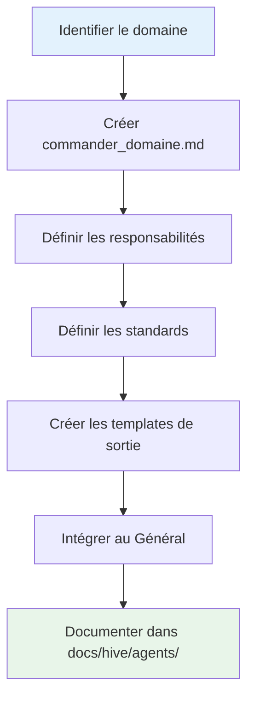
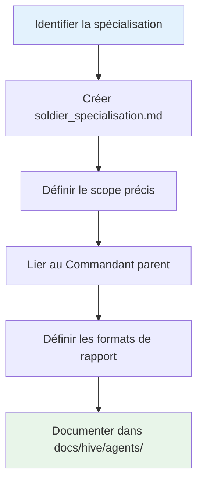

# Architecture Army2077 - Conception Détaillée

## Vue d'Ensemble de l'Architecture

Army2077 utilise une architecture en couches inspirée de l'organisation militaire, avec des canaux de communication bien définis et des responsabilités clairement séparées.

---

## Diagramme d'Architecture Complet



---

## Communication Inter-Agents

### Modèle de Communication



---

## Matrice de Responsabilités (RACI)



| Tâche | Général | Cmd Docs | Cmd Git | Cmd Qualité | Cmd Sécurité | Sol. Arch | Sol. Review | Sol. Mentor |
|-------|:-------:|:--------:|:-------:|:-----------:|:------------:|:---------:|:-----------:|:-----------:|
| **Stratégie globale** | R/A | I | I | I | I | - | - | - |
| **Documentation** | A | R | I | C | I | - | - | C |
| **Commits** | A | - | R | C | I | - | - | - |
| **Tests unitaires** | A | I | I | R | C | C | C | - |
| **Code review** | A | - | I | R | C | C | R | - |
| **Sécurité** | A | I | I | C | R | C | C | - |
| **Architecture** | A | I | I | R | C | R | C | I |
| **Apprentissage** | I | C | - | I | - | C | C | R |

---

## Zones de Responsabilité



---

## États et Transitions d'un Agent



---

## Flux de Données

### Flux d'une Feature Complète



---

## Dépendances Entre Agents



---

## Niveaux de Confiance et Autonomie



---

## Architecture des Fichiers Agents

```
.claude/agents/
├── README.md                      # Vue d'ensemble du système
│
├── general_agent.md               # État-Major
│   └── Orchestrateur suprême
│
├── commander_documentation.md     # Commandant
│   └── Expert Documentation
│
├── commander_git.md               # Commandant
│   └── Expert Versioning
│
├── commander_quality.md           # Commandant
│   └── Expert Qualité
│
├── commander_security.md          # Commandant
│   └── Expert Sécurité
│
├── soldier_architecture.md        # Soldat
│   └── Spécialiste Architecture
│
├── soldier_code_review.md         # Soldat
│   └── Spécialiste Review
│
└── soldier_learning_advisor.md    # Soldat
    └── Conseiller Apprentissage
```

---

## Conventions de Nommage

| Type | Pattern | Exemple |
|------|---------|---------|
| **Général** | `general_*.md` | `general_agent.md` |
| **Commandant** | `commander_*.md` | `commander_documentation.md` |
| **Soldat** | `soldier_*.md` | `soldier_architecture.md` |

---

## Extensibilité

### Ajouter un Nouveau Commandant



### Ajouter un Nouveau Soldat



---

## Métriques et Monitoring

### KPIs par Agent

| Agent | Métrique Clé | Objectif |
|-------|--------------|----------|
| **Général** | Taux de succès coordination | > 95% |
| **Cmd Documentation** | Couverture documentation | > 90% |
| **Cmd Git** | Commits conventionnels | 100% |
| **Cmd Qualité** | Couverture tests | > 80% |
| **Cmd Sécurité** | Vulnérabilités critiques | 0 |
| **Sol. Architecte** | Respect SOLID | > 90% |
| **Sol. Review** | Issues détectées avant merge | > 85% |
| **Sol. Mentor** | Satisfaction pédagogique | > 4/5 |

---

## Voir Aussi

- [Introduction à la Ruche](introduction.md)
- [Workflows Détaillés](workflows.md)
- [Référence Rapide](quick-reference.md)
- [Agents Individuels](agents/)
