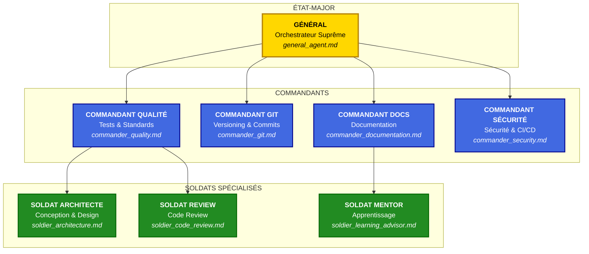
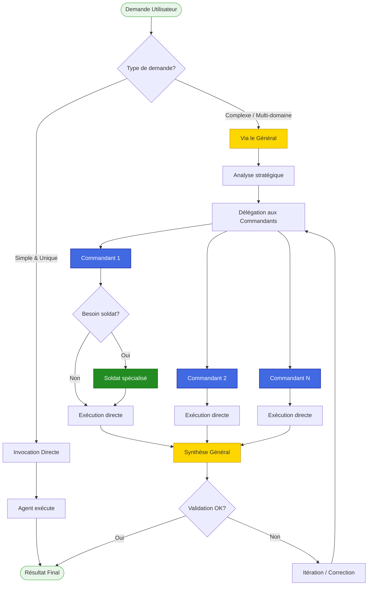

# Army2077 - Système d'Assistance Militaire IA

## Vue d'Ensemble

**Army2077** est un système d'assistance au développement de niveau professionnel, basé sur **Claude Code**, utilisant une **hiérarchie militaire** pour maximiser l'efficacité, la qualité et la cohérence du projet R-Type.

!!! info "Philosophie"
    Inspirée des structures militaires d'élite, Army2077 utilise une chaîne de commandement claire où chaque agent a un rôle précis, des responsabilités définies et des standards stricts à respecter.

---

## Architecture Hiérarchique



---

## Les Grades et Leurs Rôles

### Général - Orchestrateur Suprême

| Attribut | Valeur |
|----------|--------|
| **Fichier** | `.claude/agents/general_agent.md` |
| **Rang** | État-Major |
| **Mission** | Coordination globale et prise de décision stratégique |
| **Autorité** | Peut invoquer et coordonner tous les commandants et soldats |

**Responsabilités clés :**

- Analyser la demande utilisateur et déterminer la stratégie optimale
- Déléguer aux agents appropriés selon la complexité
- Assurer la cohérence globale du travail produit
- Prendre les décisions finales en cas de conflit

---

### Commandants - Experts de Domaine

Les commandants sont des **experts spécialisés** dans leur domaine respectif.

<div class="grid cards" markdown>

-   :material-file-document:{ .lg .middle } **Commandant Documentation**

    ---

    Expert en documentation technique MkDocs Material.

    - Documentation professionnelle et complète
    - Diagrammes Mermaid
    - Exemples de code fonctionnels

    [:octicons-arrow-right-24: Détails](agents/commander-documentation.md)

-   :material-source-commit:{ .lg .middle } **Commandant Git**

    ---

    Expert en versioning et gestion de commits.

    - Commits atomiques et conventionnels
    - Historique Git propre
    - Pull Requests structurées

    [:octicons-arrow-right-24: Détails](agents/commander-git.md)

-   :material-test-tube:{ .lg .middle } **Commandant Qualité**

    ---

    Expert en tests et qualité de code.

    - Tests unitaires Google Test
    - Couverture de code
    - Standards C++23

    [:octicons-arrow-right-24: Détails](agents/commander-quality.md)

-   :material-shield-lock:{ .lg .middle } **Commandant Sécurité**

    ---

    Expert en sécurité et CI/CD.

    - Audit de vulnérabilités
    - Pipeline Jenkins
    - SonarCloud

    [:octicons-arrow-right-24: Détails](agents/commander-security.md)

</div>

---

### Soldats - Spécialistes Techniques

Les soldats sont des **spécialistes pointus** dans des domaines techniques précis.

<div class="grid cards" markdown>

-   :material-sitemap:{ .lg .middle } **Soldat Architecte**

    ---

    Spécialiste en conception logicielle.

    - Patterns de conception
    - Architecture hexagonale
    - SOLID et Clean Code

    [:octicons-arrow-right-24: Détails](agents/soldier-architecture.md)

-   :material-magnify:{ .lg .middle } **Soldat Code Review**

    ---

    Spécialiste en revue de code.

    - Analyse critique constructive
    - Détection de code smells
    - Suggestions d'amélioration

    [:octicons-arrow-right-24: Détails](agents/soldier-code-review.md)

-   :material-school:{ .lg .middle } **Soldat Mentor**

    ---

    Conseiller d'apprentissage technique.

    - Explication pédagogique
    - Guide sans modifier le code
    - Ressources d'apprentissage

    [:octicons-arrow-right-24: Détails](agents/soldier-learning-advisor.md)

</div>

---

## Comment Invoquer les Agents

### Méthode Directe

Utilisez la syntaxe `@nom_du_fichier` dans Claude Code :

```bash
# Invoquer le Général pour une tâche complexe
@general_agent "Analyse mon projet et propose un plan d'amélioration"

# Invoquer un Commandant spécifique
@commander_git "Propose des commits atomiques pour mes changements"

# Invoquer un Soldat pour une tâche spécialisée
@soldier_learning_advisor "Explique-moi le pattern Observer"
```

### Via le Général (Recommandé)

Pour les tâches complexes, passez par le Général qui coordonnera les agents :

```bash
@general_agent "J'ai terminé le système de particules,
                assure-toi que tout est parfait (code, tests, docs, commits)"
```

Le Général va :

1. Analyser la demande
2. Invoquer le **Commandant Qualité** pour les tests
3. Invoquer le **Commandant Sécurité** pour l'audit
4. Invoquer le **Commandant Documentation** pour la doc
5. Invoquer le **Commandant Git** pour les commits
6. Synthétiser et valider le tout

---

## Flux de Décision



---

## Principes Fondamentaux

### Standards Communs à Tous les Agents

| Critère | Standard |
|---------|----------|
| **Langue** | Français (code en anglais) |
| **Format commits** | Conventional Commits (FEAT, FIX, DOCS...) |
| **Tests** | Couverture >= 80% |
| **Documentation** | Complète avec exemples |
| **Code** | C++23, RAII, Modern C++ |
| **Sécurité** | 0 vulnérabilité critique |

### Règles d'Engagement

1. **Clarté** : Chaque agent explique ses actions et décisions
2. **Transparence** : Les agents signalent ce qu'ils ne peuvent pas faire
3. **Qualité** : Aucun compromis sur les standards
4. **Respect** : Les agents ne modifient jamais sans accord explicite
5. **Apprentissage** : Les agents fournissent des explications pédagogiques

---

## Navigation

<div class="grid cards" markdown>

-   :material-map:{ .lg .middle } **Architecture Détaillée**

    ---

    Diagrammes complets et interactions entre agents.

    [:octicons-arrow-right-24: architecture.md](architecture.md)

-   :material-cog:{ .lg .middle } **Workflows**

    ---

    Processus et workflows pour chaque type de tâche.

    [:octicons-arrow-right-24: workflows.md](workflows.md)

-   :material-lightning-bolt:{ .lg .middle } **Référence Rapide**

    ---

    Commandes et exemples d'utilisation.

    [:octicons-arrow-right-24: quick-reference.md](quick-reference.md)

-   :material-account-group:{ .lg .middle } **Agents Détaillés**

    ---

    Documentation complète de chaque agent.

    [:octicons-arrow-right-24: agents/](agents/)

</div>

---

## Prochaines Étapes

1. **Découvrez l'architecture** : [architecture.md](architecture.md)
2. **Apprenez les workflows** : [workflows.md](workflows.md)
3. **Consultez la référence rapide** : [quick-reference.md](quick-reference.md)
4. **Explorez chaque agent** : [agents/](agents/)

---

## Structure du Dossier `.claude/`

Le dossier `.claude/` contient toute l'infrastructure technique du système d'agents. Voici son organisation :

```
.claude/
├── agents/                    # Définitions des 8 agents d'analyse
│   ├── analyzer.md            # Agent d'analyse d'impact
│   ├── security.md            # Agent de sécurité (CWE, vulnérabilités)
│   ├── reviewer.md            # Agent de code review
│   ├── risk.md                # Agent de calcul de risque
│   ├── synthesis.md           # Agent de synthèse des rapports
│   ├── sonar.md               # Agent d'enrichissement SonarQube
│   ├── meta-synthesis.md      # Agent de fusion/dédoublonnage
│   └── web-synthesizer.md     # Agent d'export JSON pour le web
│
├── commands/                  # Commandes slash personnalisées
│   └── analyze.md             # /analyze - Lance l'analyse incrémentale
│
├── config/                    # Configuration
│   └── agentdb.yaml           # Config AgentDB (seuils, pénalités, etc.)
│
├── mcp/                       # Serveurs MCP (Model Context Protocol)
│   ├── agentdb/               # Serveur MCP pour AgentDB
│   │   ├── server.py          # Point d'entrée du serveur
│   │   └── tools.py           # Outils exposés (file_context, etc.)
│   └── jira/                  # Serveur MCP pour Jira
│       ├── server.py
│       └── tools.py
│
├── scripts/                   # Scripts Python utilitaires
│   ├── bootstrap.py           # Initialisation/mise à jour AgentDB
│   ├── transform-sonar.py     # Transformation des rapports SonarQube
│   ├── import-bug-history.py  # Import de l'historique des bugs
│   ├── maintenance.py         # Nettoyage et maintenance
│   └── update.py              # Mise à jour incrémentale
│
├── agentdb/                   # Base de données AgentDB
│   ├── db.sqlite              # Base SQLite (symboles, métriques, etc.)
│   └── query.sh               # Script d'interface pour les agents
│
├── reports/                   # Rapports générés par /analyze
│   └── YYYY-MM-DD-<commit>/   # Un dossier par analyse
│       ├── analyzer.md
│       ├── security.md
│       ├── reviewer.md
│       ├── risk.md
│       ├── REPORT.md          # Rapport de synthèse principal
│       ├── sonar.md           # Rapport SonarQube (si disponible)
│       └── meta-synthesis.json
│
├── sonar/                     # Intégration SonarQube
│   └── issues.json            # Export des issues SonarQube
│
├── logs/                      # Logs des agents et scripts
├── tests/                     # Tests du système
├── settings.json              # Configuration Claude Code
└── settings.local.json        # Secrets locaux (non commité)
```

---

### Les 8 Agents d'Analyse

Le système utilise 8 agents spécialisés exécutés en 4 phases :

<div class="grid cards" markdown>

-   :material-magnify:{ .lg .middle } **Phase 1 - Parallèle**

    ---

    | Agent | Rôle |
    |-------|------|
    | **ANALYZER** | Analyse d'impact (appelants, dépendances) |
    | **SECURITY** | Audit sécurité (CWE, régressions) |
    | **REVIEWER** | Code review (patterns, conventions) |

-   :material-calculator:{ .lg .middle } **Phase 2 - Séquentiel puis Parallèle**

    ---

    | Agent | Rôle |
    |-------|------|
    | **RISK** | Calcul du score de risque (0-100) |
    | **SYNTHESIS** | Agrégation des 4 rapports |
    | **SONAR** | Enrichissement des issues SonarQube |

-   :material-merge:{ .lg .middle } **Phase 3 - Fusion**

    ---

    | Agent | Rôle |
    |-------|------|
    | **META-SYNTHESIS** | Dédoublonnage et fusion finale |

-   :material-export:{ .lg .middle } **Phase 4 - Export**

    ---

    | Agent | Rôle |
    |-------|------|
    | **WEB-SYNTHESIZER** | Export JSON pour l'interface web |

</div>

---

### Outils AgentDB (MCP)

AgentDB expose des outils via le protocole MCP que les agents utilisent :

| Outil | Description |
|-------|-------------|
| `get_file_context` | Contexte complet d'un fichier (symboles, deps, erreurs) |
| `get_symbol_callers` | Trouve tous les appelants d'un symbole |
| `get_symbol_callees` | Trouve ce qu'un symbole appelle |
| `get_file_impact` | Calcule l'impact d'une modification |
| `get_error_history` | Historique des bugs d'un fichier/module |
| `get_patterns` | Patterns de code applicables |
| `get_architecture_decisions` | ADRs pour un module |
| `search_symbols` | Recherche de symboles par pattern |
| `get_file_metrics` | Métriques (complexité, lignes) |
| `get_module_summary` | Vue d'ensemble d'un module |

---

### Commande `/analyze`

La commande principale pour lancer l'analyse :

```bash
# Analyse incrémentale (depuis le dernier checkpoint)
/analyze

# Analyse complète (depuis le merge-base)
/analyze --all

# Reset du checkpoint à HEAD
/analyze --reset

# Analyse de fichiers spécifiques
/analyze --files src/server/UDPServer.cpp
```

**Verdicts possibles :**

| Score | Verdict | Action |
|-------|---------|--------|
| ≥80 | 🟢 APPROVE | Peut être mergé |
| ≥60 | 🟡 REVIEW | Review humaine recommandée |
| ≥40 | 🟠 CAREFUL | Review approfondie requise |
| <40 | 🔴 REJECT | Ne pas merger |

---

!!! success "Bienvenue dans Army2077"
    Le système d'agents IA est conçu pour vous assister, pas vous remplacer. Vous restez le décideur final. Les agents sont là pour augmenter votre productivité et garantir la qualité du projet.
