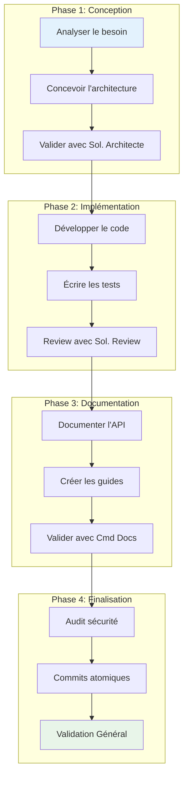
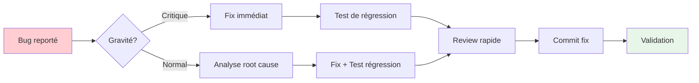
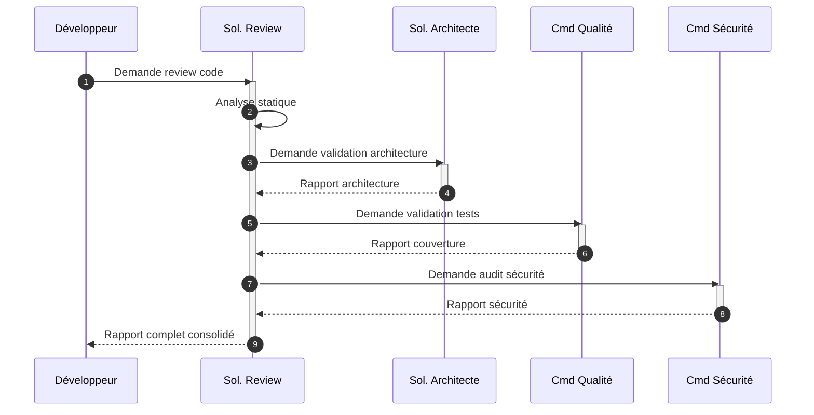
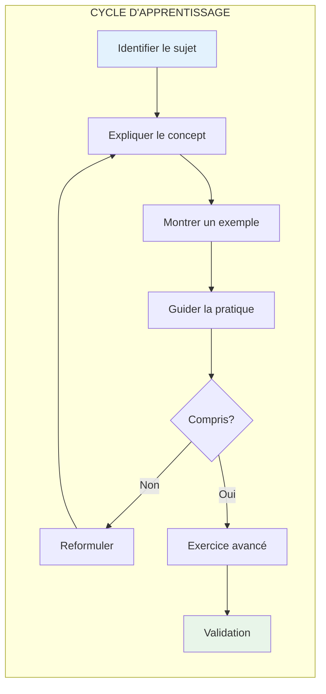
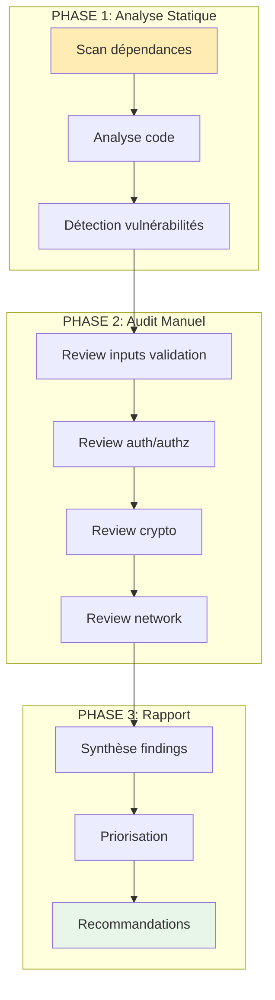
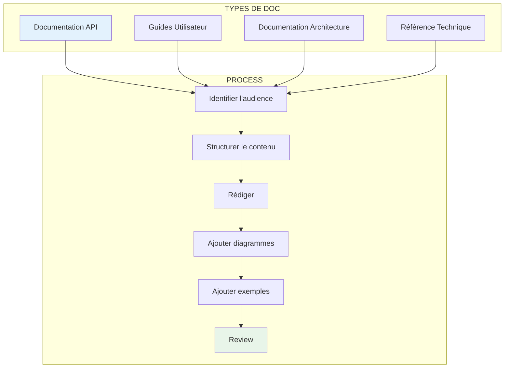
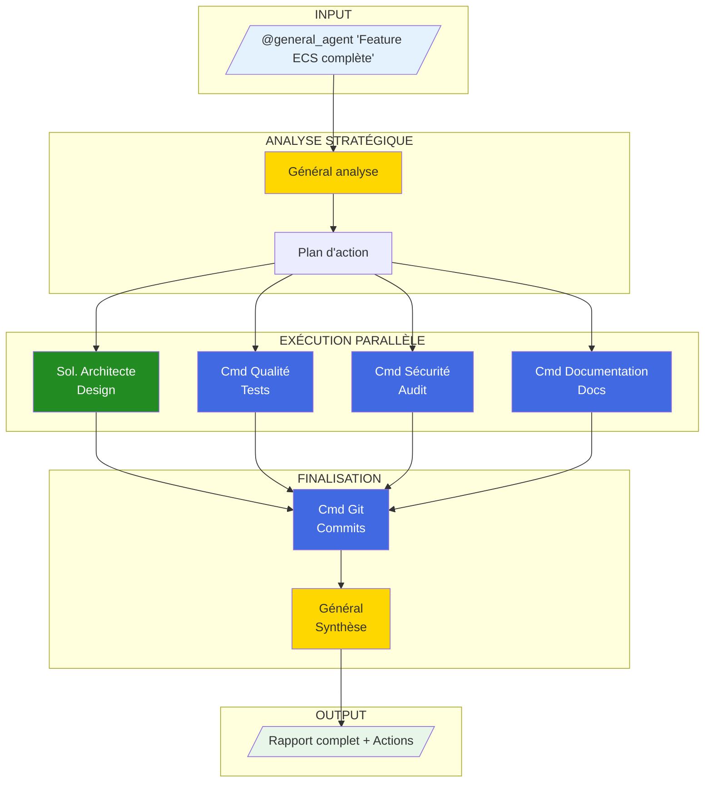

# Workflows Army2077 - Processus et Procédures

Ce guide détaille les workflows optimaux pour chaque type de tâche avec Army2077.

---

## Workflow 1 : Développement d'une Feature

### Vue d'Ensemble



### Étapes Détaillées

=== "Phase 1: Conception"

    **Objectif** : Définir une architecture solide avant de coder.

    ```bash
    # Demander une analyse architecturale
    @soldier_architecture "J'ai besoin d'implémenter [FEATURE].
                           Voici les requirements: [REQUIREMENTS].
                           Propose une architecture."
    ```

    **Output attendu** :
    - Diagramme d'architecture proposé
    - Patterns recommandés
    - Points d'attention

=== "Phase 2: Implémentation"

    **Objectif** : Code de qualité avec tests complets.

    ```bash
    # Après avoir codé, demander une review
    @soldier_code_review "Review mon implémentation de [FEATURE]
                          dans les fichiers: [FICHIERS]"
    ```

    **Output attendu** :
    - Code smells identifiés
    - Suggestions d'amélioration
    - Points positifs

=== "Phase 3: Documentation"

    **Objectif** : Documentation complète et professionnelle.

    ```bash
    # Demander la documentation
    @commander_documentation "Documente la feature [FEATURE].
                              Inclus: API, exemples, diagrammes."
    ```

    **Output attendu** :
    - Page de documentation MkDocs
    - Exemples de code
    - Diagrammes Mermaid

=== "Phase 4: Finalisation"

    **Objectif** : Commits propres et validation finale.

    ```bash
    # Audit sécurité
    @commander_security "Audite le code de [FEATURE]"

    # Puis commits
    @commander_git "Propose des commits atomiques pour [FEATURE]"
    ```

    **Output attendu** :
    - Rapport de sécurité
    - Commits proposés au format Conventional

---

## Workflow 2 : Bug Fix

### Vue d'Ensemble



### Procédure Standard

```bash
# 1. Analyser le bug avec le Commandant Qualité
@commander_quality "Analyse ce bug: [DESCRIPTION]
                    Erreur: [ERROR_MESSAGE]
                    Fichier: [FICHIER]"

# 2. Après le fix, créer le test de régression
@commander_quality "Crée un test de régression pour le bug [BUG_ID]"

# 3. Review du fix
@soldier_code_review "Review mon fix pour [BUG_ID] dans [FICHIER]"

# 4. Commit
@commander_git "Commit le fix pour [BUG_ID]"
```

### Template de Commit Bug Fix

```
FIX(<scope>): correction [description courte]

Problème:
- [Description du bug]
- [Impact sur les utilisateurs]

Solution:
- [Description de la solution]
- [Fichiers modifiés]

Tests:
- [Tests ajoutés/modifiés]

Closes #[BUG_ID]
```

---

## Workflow 3 : Code Review Complet

### Diagramme de Processus



### Checklist de Review

```bash
# Review complète avec le Soldat Review
@soldier_code_review "Review complète de [MODULE/FEATURE].
                       Fichiers: [LISTE_FICHIERS]

                       Vérifie:
                       - [ ] Clean Code
                       - [ ] SOLID principles
                       - [ ] Performance
                       - [ ] Error handling
                       - [ ] Edge cases"
```

### Critères d'Évaluation

| Critère | Poids | Description |
|---------|-------|-------------|
| **Lisibilité** | 20% | Code clair, nommage explicite |
| **Architecture** | 20% | Respect des patterns, découplage |
| **Tests** | 20% | Couverture, qualité des tests |
| **Performance** | 15% | Complexité algorithmique, ressources |
| **Sécurité** | 15% | Vulnérabilités, validation inputs |
| **Documentation** | 10% | Commentaires, docstrings |

---

## Workflow 4 : Apprentissage Guidé

### Diagramme Pédagogique



### Utilisation du Soldat Mentor

```bash
# Demander une explication pédagogique
@soldier_learning_advisor "Explique-moi [CONCEPT] dans le contexte de notre projet.

                           Mon niveau: [débutant/intermédiaire/avancé]

                           Ce que je veux comprendre:
                           - [Point 1]
                           - [Point 2]"
```

### Format de Réponse Pédagogique

Le Soldat Mentor structure ses réponses ainsi :

1. **Concept** : Explication théorique simple
2. **Pourquoi** : Justification dans le contexte
3. **Exemple** : Code illustratif (dans la doc, pas dans les sources)
4. **Exercice** : Suggestion de pratique
5. **Ressources** : Liens pour approfondir

!!! warning "Important"
    Le Soldat Mentor **n'écrit JAMAIS de code** dans les fichiers sources. Il guide, explique, et documente uniquement.

---

## Workflow 5 : Sécurité et Audit

### Pipeline d'Audit



### Commandes d'Audit

```bash
# Audit complet
@commander_security "Audit de sécurité complet du module [MODULE].

                     Focus:
                     - Injection (SQL, Command, XSS)
                     - Buffer overflow
                     - Auth/Authz
                     - Crypto"

# Audit ciblé réseau
@commander_security "Audit du code réseau dans src/network/.

                     Vérifie:
                     - Validation des paquets entrants
                     - Rate limiting
                     - Timeouts
                     - TLS/SSL"
```

### Classification des Vulnérabilités

| Sévérité | Couleur | Action | Délai |
|----------|---------|--------|-------|
| **Critique** | Rouge | Fix immédiat | < 24h |
| **Haute** | Orange | Fix prioritaire | < 1 semaine |
| **Moyenne** | Jaune | Fix planifié | < 1 mois |
| **Basse** | Vert | Backlog | Quand possible |

---

## Workflow 6 : Documentation Complète

### Structure de Documentation



### Templates de Documentation

=== "API Documentation"

    ```bash
    @commander_documentation "Documente l'API de [MODULE].

                              Structure:
                              1. Vue d'ensemble
                              2. Installation/Setup
                              3. Référence des méthodes
                              4. Exemples d'utilisation
                              5. FAQ"
    ```

=== "Guide Utilisateur"

    ```bash
    @commander_documentation "Crée un guide utilisateur pour [FEATURE].

                              Public cible: [débutant/développeur/admin]

                              Inclure:
                              - Prérequis
                              - Étapes pas à pas
                              - Screenshots/diagrammes
                              - Troubleshooting"
    ```

=== "Documentation Architecture"

    ```bash
    @commander_documentation "Documente l'architecture de [SYSTÈME].

                              Inclure:
                              - Diagramme C4 (Context, Container, Component)
                              - Flux de données
                              - Décisions techniques
                              - ADRs (Architecture Decision Records)"
    ```

---

## Workflow 7 : Git et Versioning

### Flow de Commits

```mermaid
gitgraph
    commit id: "Initial"
    branch feature/ecs
    checkout feature/ecs
    commit id: "FEAT: add Entity class"
    commit id: "FEAT: add ComponentPool"
    commit id: "TEST: add Entity tests"
    checkout main
    merge feature/ecs id: "Merge: ECS System"
    branch fix/collision
    checkout fix/collision
    commit id: "FIX: collision detection"
    commit id: "TEST: regression test"
    checkout main
    merge fix/collision id: "Merge: Fix collision"
```

### Commandes Git avec les Agents

```bash
# Analyser les changements et proposer des commits
@commander_git "Analyse mes changements et propose des commits atomiques.

                Contexte: [CONTEXTE DE LA FEATURE]"

# Créer une PR
@commander_git "Prépare une PR pour [FEATURE].

                Branche source: [BRANCH]
                Branche cible: main

                Inclure:
                - Résumé des changements
                - Tests effectués
                - Screenshots si pertinent"
```

### Convention de Commits

| Type | Description | Exemple |
|------|-------------|---------|
| `FEAT` | Nouvelle fonctionnalité | `FEAT(ecs): add Entity class` |
| `FIX` | Correction de bug | `FIX(network): resolve timeout issue` |
| `DOCS` | Documentation | `DOCS(api): add auth endpoint docs` |
| `REFACTOR` | Refactoring | `REFACTOR(core): extract GameLoop` |
| `TEST` | Tests | `TEST(ecs): add Entity unit tests` |
| `BUILD` | Build/CI | `BUILD(cmake): add SFML linkage` |
| `PERF` | Performance | `PERF(render): optimize sprite batch` |
| `CHORE` | Maintenance | `CHORE: update dependencies` |

---

## Workflow 8 : Orchestration Complète (Via Général)

### Cas d'Usage : Feature End-to-End



### Commande Type

```bash
@general_agent "J'ai terminé la feature [FEATURE].

                Code dans: [FICHIERS]

                Assure-toi que:
                1. L'architecture est solide
                2. Les tests sont complets (>80%)
                3. La sécurité est validée
                4. La documentation est complète
                5. Les commits sont atomiques et conventionnels

                Donne-moi un rapport complet avec les actions à effectuer."
```

### Exemple de Rapport du Général

```markdown
# RAPPORT DE MISSION - Feature ECS

## Résumé Exécutif
**Statut Global**: PRÊT POUR MERGE (avec recommandations)
**Score Qualité**: 87/100

---

## 1. Architecture (Sol. Architecte)
**Statut**: VALIDÉE

- Pattern ECS correctement implémenté
- Découplage respecté
- Suggestion: Extraire ComponentRegistry

## 2. Tests (Cmd Qualité)
**Statut**: VALIDÉS

- Couverture: 84%
- 12 tests unitaires
- 3 tests d'intégration
- Suggestion: Ajouter tests edge cases

## 3. Sécurité (Cmd Sécurité)
**Statut**: VALIDÉE

- Aucune vulnérabilité critique
- 1 warning mineur (bounds check)

## 4. Documentation (Cmd Documentation)
**Statut**: COMPLÈTE

- Guide créé: docs/guides/ecs.md
- API documentée
- 3 diagrammes Mermaid

## 5. Commits Proposés (Cmd Git)
1. `FEAT(ecs): add Entity and EntityManager`
2. `FEAT(ecs): add ComponentPool template`
3. `FEAT(ecs): add World facade`
4. `TEST(ecs): add comprehensive test suite`
5. `DOCS(ecs): add architecture guide`

---

## Actions Recommandées
1. [OPTIONNEL] Extraire ComponentRegistry
2. [OPTIONNEL] Ajouter 2 tests edge cases
3. [REQUIS] Corriger bounds check ligne 45
4. Valider les commits et merge
```

---

## Navigation

- [Retour à l'Introduction](introduction.md)
- [Architecture Détaillée](architecture.md)
- [Référence Rapide](quick-reference.md)
- [Agents Individuels](agents/)
