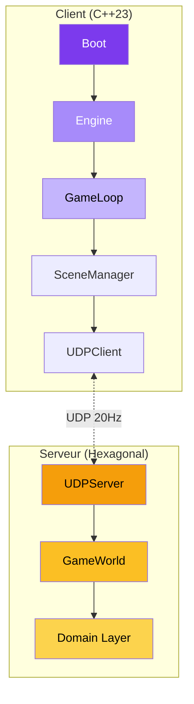

---
hide:
  - navigation
  - toc
---

<div class="hero">
  <div class="hero-content animate-fade-in">
    <h1>R-Type</h1>
    <p>Jeu multijoueur client-serveur moderne en C++23 avec architecture hexagonale et système graphique multi-backend.</p>
    <div class="hero-buttons">
      <a href="guide/quickstart/" class="btn btn-primary">
        Commencer
      </a>
      <a href="technique/" class="btn btn-secondary">
        Documentation technique
      </a>
    </div>
  </div>
</div>

<div class="stats-grid animate-fade-in">
  <div class="stat-item">
    <div class="number">15k+</div>
    <div class="label">Lignes de code</div>
  </div>
  <div class="stat-item">
    <div class="number">C++23</div>
    <div class="label">Standard moderne</div>
  </div>
  <div class="stat-item">
    <div class="number">2</div>
    <div class="label">Backends graphiques</div>
  </div>
  <div class="stat-item">
    <div class="number">UDP/TCP</div>
    <div class="label">Temps réel</div>
  </div>
</div>

---

## Fonctionnalités

<div class="grid-cards">
  <div class="card animate-fade-in">
    <div class="card-icon">🎮</div>
    <h3>Multi-Backend Graphique</h3>
    <p>SDL2 et SFML supportés via système de plugins dynamiques. Changez de backend sans modifier le code.</p>
  </div>

  <div class="card animate-fade-in">
    <div class="card-icon">🌐</div>
    <h3>Architecture Réseau</h3>
    <p>UDP pour le gameplay temps réel (20Hz), TCP pour l'authentification. Boost.ASIO thread-safe.</p>
  </div>

  <div class="card animate-fade-in">
    <div class="card-icon">🏗️</div>
    <h3>Architecture Hexagonale</h3>
    <p>Domain-Driven Design avec séparation claire : Domain, Application, Infrastructure.</p>
  </div>

  <div class="card animate-fade-in">
    <div class="card-icon">♿</div>
    <h3>Accessibilité</h3>
    <p>Modes daltonien (protanopie, deutéranopie, tritanopie), remapping clavier, vitesse ajustable.</p>
  </div>

  <div class="card animate-fade-in">
    <div class="card-icon">📊</div>
    <h3>Logging Professionnel</h3>
    <p>12 loggers spdlog (6 client + 6 serveur) avec rotation automatique et multi-sink.</p>
  </div>

  <div class="card animate-fade-in">
    <div class="card-icon">🔧</div>
    <h3>CI/CD Jenkins</h3>
    <p>Pipeline automatisé avec build, tests, sanitizers et analyse SonarCloud.</p>
  </div>
</div>

---

## Stack Technique

<div class="tech-badges">
  <span class="tech-badge">C++23</span>
  <span class="tech-badge">CMake</span>
  <span class="tech-badge">SDL2</span>
  <span class="tech-badge">SFML 3.0</span>
  <span class="tech-badge">Boost.ASIO</span>
  <span class="tech-badge">spdlog</span>
  <span class="tech-badge">Google Test</span>
  <span class="tech-badge">Jenkins</span>
  <span class="tech-badge">vcpkg</span>
</div>

---

## Démarrage Rapide

```bash
# Cloner le projet
git clone https://github.com/Pluenet-Killian/rtype.git && cd rtype

# Installer les dépendances et compiler
./scripts/build.sh
./scripts/compile.sh

# Lancer le serveur
./artifacts/server/linux/rtype_server

# Lancer le client (dans un autre terminal)
./artifacts/client/linux/rtype_client
```

!!! tip "Nouveau sur R-Type ?"
    Consultez le [guide de démarrage rapide](guide/quickstart.md) pour une installation complète en 5 minutes.

---

## Architecture



---

## Navigation

<div class="grid-cards">
  <div class="card">
    <div class="card-icon">📖</div>
    <h3><a href="guide/">Guide Utilisateur</a></h3>
    <p>Installation, configuration et prise en main.</p>
  </div>

  <div class="card">
    <div class="card-icon">🔧</div>
    <h3><a href="technique/">Documentation Technique</a></h3>
    <p>Architecture, API et références.</p>
  </div>

  <div class="card">
    <div class="card-icon">🎨</div>
    <h3><a href="technique/graphiques/">Librairies Graphiques</a></h3>
    <p>SDL2, SFML, AssetManager.</p>
  </div>

  <div class="card">
    <div class="card-icon">📚</div>
    <h3><a href="reference/">Référence</a></h3>
    <p>Glossaire, FAQ et changelog.</p>
  </div>
</div>
