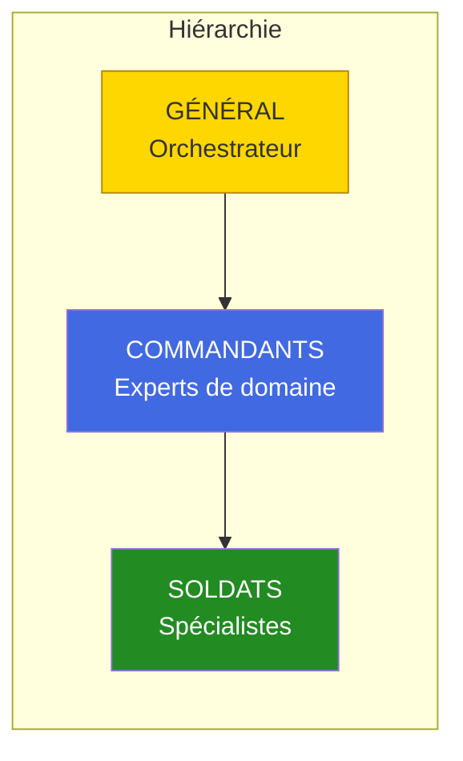
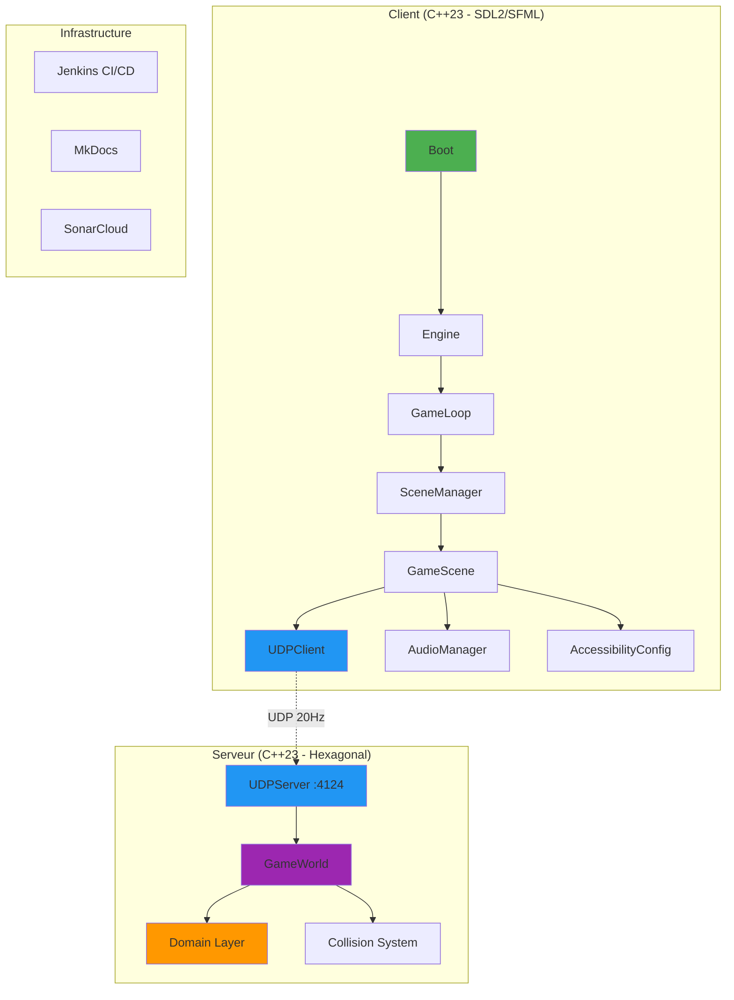

# Documentation R-Type

Bienvenue dans la documentation officielle du projet **R-Type**, un jeu multijoueur client-serveur moderne développé en C++23 avec une architecture hexagonale et des technologies de pointe.

## 🚀 Démarrage Ultra-Rapide

```bash
git clone https://github.com/Pluenet-Killian/rtype.git && cd rtype
./scripts/launch_ci_cd.sh  # Infrastructure (Jenkins + Docs)
./scripts/build.sh          # Installation dépendances
./scripts/compile.sh        # Compilation
./artifacts/server/linux/rtype_server  # Lancement serveur
```

**Accès:**
- 📚 Documentation: http://localhost:8000
- 🔧 Jenkins CI/CD: http://localhost:8081
- 🎮 Serveur: localhost:4124 (UDP gameplay) / localhost:3000 (TCP auth)

[→ Guide complet de démarrage](getting-started/index.md){ .md-button .md-button--primary }

---

## 🚧 État du Projet

!!! success "Phase Actuelle: Gameplay Foundation - v0.5.0"
    Le projet est en **phase gameplay** avec client SDL2/SFML multi-backend fonctionnel et serveur de jeu complet.

    **Infrastructure:** ✅ 100% complété
    **Système de Logging:** ✅ 100% complété (12 loggers)
    **Serveur (Domain, Auth, Network, Gameplay):** ✅ 95% complété
    **Client (Core, Graphics, Network, Audio):** ✅ 85% complété
    **Gameplay (Missiles, Enemies, Collisions):** ✅ 90% complété
    **ECS Library:** ✅ 100% (Blob-ECS - non intégré)

📊 [Voir l'état détaillé du projet](project-status.md)

---

## ✨ Fonctionnalités Récentes

### 🆕 Système de Logging Professionnel (spdlog)

Le projet intègre maintenant un système de logging centralisé de niveau production:

=== "Client (6 loggers)"
    - **NetworkLogger** - Connexions, paquets (DEBUG)
    - **EngineLogger** - Lifecycle du moteur (INFO)
    - **GraphicsLogger** - Rendu, textures (INFO)
    - **SceneLogger** - Transitions de scènes (INFO)
    - **UILogger** - Interactions utilisateur (INFO)
    - **BootLogger** - Initialisation (INFO)

=== "Serveur (6 loggers)"
    - **NetworkLogger** - TCP/UDP, connexions (DEBUG)
    - **AuthLogger** - Authentification, sécurité (INFO)
    - **DomainLogger** - Logique métier (INFO)
    - **PersistenceLogger** - MongoDB, requêtes (INFO)
    - **GameLogger** - Sessions de jeu (INFO)
    - **MainLogger** - Démarrage, arrêt (INFO)

**Caractéristiques:**
- ✅ Multi-sink: Console couleur + Fichiers rotatifs (10MB)
- ✅ Thread-safe par défaut
- ✅ Formatage type-safe (syntaxe fmt)
- ✅ Niveaux configurables (trace, debug, info, warn, error, critical)
- ✅ Performance optimisée (overhead <1%)

```cpp
// Exemple d'utilisation
auto logger = client::logging::Logger::getNetworkLogger();
logger->info("Connecting to {}:{}...", host, port);
logger->error("Connection failed: {}", error.message());
```

[→ Documentation complète du logging](development/logging.md){ .md-button }

---

## 🎖️ Army2077 - Système d'Assistance Militaire IA

!!! tip "Nouveau : Système d'Agents Intelligents"
    Le projet intègre **Army2077**, un système d'agents IA basé sur Claude Code, utilisant une hiérarchie militaire pour maximiser l'efficacité du développement.



### Agents Disponibles

<div class="grid cards" markdown>

-   :material-crown:{ .lg .middle } **Général**

    ---

    Orchestrateur suprême coordonnant tous les agents.

-   :material-file-document:{ .lg .middle } **Cmd Documentation**

    ---

    Expert documentation MkDocs Material.

-   :material-source-commit:{ .lg .middle } **Cmd Git**

    ---

    Expert commits atomiques et PRs.

-   :material-test-tube:{ .lg .middle } **Cmd Qualité**

    ---

    Expert tests et standards C++23.

-   :material-shield-lock:{ .lg .middle } **Cmd Sécurité**

    ---

    Expert sécurité et CI/CD Jenkins.

-   :material-school:{ .lg .middle } **Soldats Spécialisés**

    ---

    Architecture, Code Review, Mentorat.

</div>

**Utilisation rapide :**

```bash
# Via le Général (coordination complète)
@general_agent "Finalise ma feature avec tests, docs et commits"

# Directement vers un agent
@commander_git "Propose des commits atomiques"
@soldier_learning_advisor "Explique-moi le pattern Observer"
```

[→ Documentation complète Army2077](hive/introduction.md){ .md-button .md-button--primary }
[→ Référence rapide](hive/quick-reference.md){ .md-button }

---

## 🏗️ Architecture du Projet



### Organisation du Code

```
rtype/
├── src/
│   ├── client/                    # Client de jeu (62 fichiers)
│   │   ├── include/
│   │   │   ├── core/             # Engine, GameLoop, Boot, Logger
│   │   │   ├── graphics/         # IWindow, IDrawable, Graphics
│   │   │   ├── scenes/           # IScene, GameScene, SceneManager
│   │   │   ├── network/          # UDPClient
│   │   │   ├── gameplay/         # EntityManager, GameObject, Missile
│   │   │   ├── audio/            # AudioManager (SDL_mixer)
│   │   │   ├── accessibility/    # AccessibilityConfig
│   │   │   └── events/           # Event, Signal
│   │   └── lib/
│   │       ├── sfml/             # Backend SFML
│   │       └── sdl2/             # Backend SDL2 (défaut)
│   │
│   ├── server/                    # Serveur de jeu (45 fichiers)
│   │   ├── domain/               # Entités, Value Objects, Exceptions
│   │   ├── application/          # Use Cases, Ports
│   │   └── infrastructure/
│   │       ├── game/             # GameWorld (missiles, enemies, collisions)
│   │       └── adapters/in/network/  # UDPServer
│   │
│   ├── common/                    # Code partagé
│   │   ├── protocol/             # Protocol.hpp (14 message types)
│   │   └── collision/            # AABB.hpp (hitboxes)
│   │
│   └── ECS/                       # Blob-ECS (non intégré)
│
├── tests/                         # Tests unitaires (Google Test)
├── docs/                          # Documentation (vous êtes ici!)
└── scripts/                       # Scripts de build/déploiement
```

[→ Architecture détaillée](guides/architecture.md)

---

## 🎯 Guides par Profil

### Pour les Nouveaux

<div class="grid cards" markdown>

-   :material-rocket-launch:{ .lg .middle } **Installation**

    ---

    Installez les prérequis et configurez votre environnement en 15 minutes.

    [:octicons-arrow-right-24: Guide d'installation](getting-started/installation.md)

-   :material-flash:{ .lg .middle } **Quickstart**

    ---

    Lancez le projet en 5 minutes avec notre guide de démarrage rapide.

    [:octicons-arrow-right-24: Démarrage rapide](getting-started/quickstart.md)

-   :material-hammer-wrench:{ .lg .middle } **Compilation**

    ---

    Compilez le projet avec CMake, sanitizers, et options avancées.

    [:octicons-arrow-right-24: Guide de compilation](getting-started/building.md)

-   :material-help-circle:{ .lg .middle } **FAQ**

    ---

    Réponses aux questions fréquentes et résolution de problèmes.

    [:octicons-arrow-right-24: Voir la FAQ](reference/faq.md)

</div>

### Pour les Développeurs

<div class="grid cards" markdown>

-   :material-code-braces:{ .lg .middle } **Architecture Client**

    ---

    Explorez l'architecture du client: Core, Graphics, Network.

    [:octicons-arrow-right-24: Documentation client](client/index.md)

-   :material-server:{ .lg .middle } **Architecture Hexagonale**

    ---

    Comprenez l'architecture hexagonale du serveur.

    [:octicons-arrow-right-24: Guide hexagonal](guides/hexagonal-architecture.md)

-   :material-console:{ .lg .middle } **Système de Logging**

    ---

    Utilisez spdlog pour un logging professionnel.

    [:octicons-arrow-right-24: Documentation logging](development/logging.md)

-   :material-test-tube:{ .lg .middle } **Tests & Qualité**

    ---

    Google Test, sanitizers, et bonnes pratiques de testing.

    [:octicons-arrow-right-24: Guide des tests](development/testing.md)

</div>

### Pour les Contributeurs

<div class="grid cards" markdown>

-   :material-git:{ .lg .middle } **Contribuer**

    ---

    Workflow Git, standards de code, et processus de contribution.

    [:octicons-arrow-right-24: Guide de contribution](development/contributing.md)

-   :material-source-commit:{ .lg .middle } **Politiques de Commit**

    ---

    Conventions AREA et format des messages de commit.

    [:octicons-arrow-right-24: Politiques](development/COMMIT_POLICES.md)

-   :material-robot-industrial:{ .lg .middle } **CI/CD Jenkins**

    ---

    Pipeline automatisé et builder permanent.

    [:octicons-arrow-right-24: Documentation CI/CD](development/ci-cd.md)

-   :material-chart-line:{ .lg .middle } **SonarCloud**

    ---

    Analyse de qualité de code et métriques.

    [:octicons-arrow-right-24: Guide SonarCloud](guides/sonarqube.md)

</div>

---

## 🛠️ Technologies Utilisées

<div class="grid" markdown>

| Catégorie | Technologies | Version |
|-----------|--------------|---------|
| **Langage** | C++23 | GCC 11+ / Clang 15+ |
| **Build** | CMake, Ninja, vcpkg | 3.30+ |
| **Réseau** | Boost.ASIO | Latest |
| **Graphics** | SDL2 + SDL2_image (défaut), SFML 3.0+ | Multi-backend |
| **Audio** | SDL2_mixer | Latest |
| **Logging** | spdlog | Latest |
| **Database** | MongoDB C++ Driver | Latest |
| **Tests** | Google Test, Sanitizers | Latest |
| **CI/CD** | Jenkins, Docker | LTS |
| **Qualité** | SonarCloud | Cloud |
| **Docs** | MkDocs Material | 1.5+ |

</div>

[→ Stack technique complète](guides/architecture.md#technologies)

---

## 📊 Métriques du Projet

<div class="grid" markdown>

| Métrique | Valeur |
|----------|--------|
| **Lignes de code** | ~15,000+ |
| **Fichiers sources** | 110+ (client: 62, server: 45, common: 2, ECS: 6) |
| **Types de messages** | 14 (Protocol.hpp) |
| **Types d'ennemis** | 5 (Basic, Tracker, Zigzag, Fast, Bomber) |
| **Loggers implémentés** | 12 (6 client + 6 serveur) |
| **Value Objects** | 9 (avec validation) |
| **Use Cases** | 3 (Login, Register, MovePlayer) |
| **Commits** | 150+ |
| **Documentation** | 81 pages |

</div>

---

## 🎮 Fonctionnalités Implémentées

### Client

- [x] **Boot System** - Initialisation et connexion serveur
- [x] **Engine** - Orchestration + chargement dynamique de plugins graphiques
- [x] **GameLoop** - Boucle de jeu 60 FPS avec deltaTime (std::chrono)
- [x] **SceneManager** - Gestion des scènes avec GameContext
- [x] **UDPClient** - Communication temps réel (thread-safe, Boost.ASIO)
- [x] **Multi-Backend Graphics** - SDL2 (défaut) et SFML via plugins dynamiques
- [x] **AudioManager** - Musique + effets sonores (SDL2_mixer)
- [x] **AccessibilityConfig** - Remapping clavier, modes daltonien, vitesse de jeu
- [x] **GameScene** - Gameplay complet avec HUD, missiles, ennemis, étoiles animées
- [x] **EntityManager** - Gestion entités avec template spawn<T>()
- [x] **Event System** - std::variant (KeyPressed, KeyReleased, WindowClosed)
- [x] **Logging** - Système centralisé spdlog (6 loggers)
- [x] **Death Screen** - Overlay quand le joueur meurt
- [x] **Health Bar HUD** - Barre de vie colorée (vert/jaune/rouge)
- [x] **Blob-ECS** - Librairie ECS complète (51.3M ops/s, non intégrée)

### Serveur

- [x] **UDPServer** - Serveur UDP asynchrone (port 4124, broadcast 20Hz)
- [x] **GameWorld** - État de jeu centralisé (joueurs, missiles, ennemis)
- [x] **Architecture Hexagonale** - Domain, Application, Infrastructure
- [x] **5 Types d'Ennemis** - Basic, Tracker, Zigzag, Fast, Bomber (IA unique)
- [x] **Système de Missiles** - Joueur et ennemis, destruction automatique
- [x] **Collision System** - AABB avec damage events et death broadcasts
- [x] **Wave Spawning** - Vagues d'ennemis (6-12s, 2-6 ennemis)
- [x] **Protocol Binaire** - 14 types de messages avec byte order network
- [x] **Player Entity** - Position, Health, PlayerId
- [x] **Value Objects** - 9 VOs avec validation
- [x] **Use Cases** - Login, Register, MovePlayer
- [x] **Logging** - Système centralisé spdlog (6 loggers)

### Infrastructure

- [x] **Jenkins CI/CD** - Pipeline automatisé
- [x] **Builder Permanent** - Workspaces isolés, cache vcpkg
- [x] **Docker** - Conteneurisation complète
- [x] **MkDocs** - Documentation exhaustive (81 pages)
- [x] **SonarCloud** - Analyse qualité de code
- [x] **Google Test** - Framework de tests
- [x] **Sanitizers** - ASan, TSan, LSan, UBSan
- [x] **vcpkg** - Gestion dépendances

---

## 🔗 Liens Rapides

<div class="grid cards" markdown>

-   **Repository**

    [:fontawesome-brands-github: GitHub](https://github.com/Pluenet-Killian/rtype)

-   **CI/CD**

    [:material-wrench: Jenkins Local](http://localhost:8081)

-   **Documentation**

    [:material-book-open-page-variant: Docs Local](http://localhost:8000)

-   **Qualité**

    [:material-chart-box: SonarCloud](https://sonarcloud.io)

</div>

---

## 📚 Structure de la Documentation

Cette documentation est organisée en plusieurs sections pour faciliter la navigation:

=== "Essentiels"
    - **[Pour Commencer](getting-started/index.md)** - Installation, quickstart, compilation
    - **[État du Projet](project-status.md)** - Avancement et roadmap
    - **[FAQ](reference/faq.md)** - Questions fréquentes

=== "Client"
    - **[Architecture Client](client/index.md)** - Vue d'ensemble
    - **[Core](client/core/index.md)** - Engine, GameLoop, Scenes
    - **[Graphics](client/graphics/index.md)** - Multi-backend SDL2/SFML
    - **[Network](client/network/index.md)** - UDPClient temps réel

=== "Guides"
    - **[Architecture Générale](guides/architecture.md)** - Vue d'ensemble du système
    - **[Architecture Hexagonale](guides/hexagonal-architecture.md)** - Serveur DDD
    - **[Architecture Réseau](guides/network-architecture.md)** - TCP/UDP, Boost.ASIO
    - **[Authentification](guides/authentication.md)** - User entity, sécurité

=== "Développement"
    - **[Contribuer](development/contributing.md)** - Workflow et standards
    - **[Logging](development/logging.md)** - Système spdlog 🆕
    - **[Tests](development/testing.md)** - Google Test, sanitizers
    - **[CI/CD](development/ci-cd.md)** - Jenkins, Docker
    - **[Changelog](development/changelog.md)** - Historique des versions

=== "Army2077"
    - **[Introduction](hive/introduction.md)** - Vue d'ensemble du système d'agents
    - **[Architecture](hive/architecture.md)** - Diagrammes et interactions
    - **[Workflows](hive/workflows.md)** - Processus par type de tâche
    - **[Référence Rapide](hive/quick-reference.md)** - Commandes et exemples
    - **[Agents](hive/agents/)** - Documentation détaillée de chaque agent

---

## 💬 Support et Contribution

### Besoin d'Aide?

1. 📖 Consultez la [FAQ](reference/faq.md)
2. 🔍 Utilisez la recherche (en haut à droite)
3. 🐛 Vérifiez les [Issues GitHub](https://github.com/Pluenet-Killian/rtype/issues)
4. 💬 Contactez l'équipe de développement

### Contribuer au Projet

Nous accueillons chaleureusement les contributions! Pour commencer:

1. Lisez le [Guide de Contribution](development/contributing.md)
2. Comprenez les [Politiques de Commit](development/COMMIT_POLICES.md)
3. Explorez les [Issues "Good First Issue"](https://github.com/Pluenet-Killian/rtype/labels/good%20first%20issue)
4. Créez votre Pull Request!

[→ Guide complet de contribution](development/contributing.md){ .md-button .md-button--primary }

---

## 🎓 Projet Pédagogique EPITECH

Ce projet est développé dans le cadre d'un cursus EPITECH par l'équipe AREA.

**Objectifs pédagogiques:**
- Architecture logicielle moderne (hexagonale, SOLID)
- C++23 et programmation avancée
- Réseau asynchrone et temps réel
- Tests automatisés et qualité de code
- CI/CD et DevOps
- Documentation technique professionnelle

---

## 📝 Licence

Ce projet est développé dans un contexte pédagogique EPITECH.

---

<div class="grid" markdown style="text-align: center; padding: 2rem 0;">

**Prêt à commencer?**

[Installation](getting-started/installation.md){ .md-button .md-button--primary }
[Quickstart](getting-started/quickstart.md){ .md-button }
[Architecture](guides/architecture.md){ .md-button }

</div>
