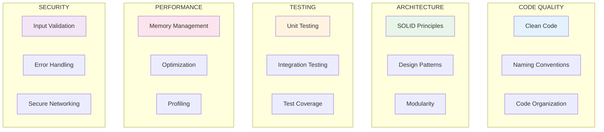

# Bonnes Pratiques

Cette section compile les meilleures pratiques adaptees a votre projet R-Type et aux technologies utilisees.

---

## Categories de Bonnes Pratiques



---

## Pratiques par Domaine

### Clean Code C++

| Pratique | Description | Priorite |
|----------|-------------|----------|
| RAII | Gestion des ressources par scope | Critique |
| const-correctness | Utiliser `const` partout ou possible | Haute |
| Smart pointers | Preferer aux pointeurs bruts | Haute |
| Move semantics | Optimiser les copies inutiles | Moyenne |
| Range-based for | Preferer aux boucles indexees | Basse |

### Architecture ECS

| Pratique | Description | Priorite |
|----------|-------------|----------|
| Components purs | Donnees sans logique | Critique |
| Systems decouples | Un system = une responsabilite | Haute |
| Sparse sets | Pour les components rares | Moyenne |
| Cache-friendly | Organisation memoire lineaire | Moyenne |

### Networking

| Pratique | Description | Priorite |
|----------|-------------|----------|
| Validation stricte | Valider tous les paquets entrants | Critique |
| Timeouts | Definir des timeouts explicites | Haute |
| Rate limiting | Limiter les requetes | Haute |
| Encryption | Chiffrer les donnees sensibles | Moyenne |

### Testing

| Pratique | Description | Priorite |
|----------|-------------|----------|
| Test isolation | Tests independants | Critique |
| AAA Pattern | Arrange-Act-Assert | Haute |
| Mocking | Isoler les dependances | Haute |
| Coverage > 80% | Couverture de code | Moyenne |

---

## Demander des Conseils

```bash
# Demander les best practices pour un sujet
@soldier_learning_advisor "Quelles sont les best practices pour [SUJET] ?"

# Exemples
@soldier_learning_advisor "Best practices pour la gestion memoire en C++"
@soldier_learning_advisor "Best practices pour le networking UDP"
@soldier_learning_advisor "Best practices pour les tests unitaires"
```

---

## Format des Guides

Chaque guide de bonnes pratiques suit cette structure :

```markdown
# Best Practices: [Sujet]

## Contexte
[Pourquoi ces pratiques sont importantes]

## Regles d'Or
[Les pratiques essentielles - resumees]

## Pratiques Detaillees

### Pratique 1: [Nom]
**Priorite**: [Critique/Haute/Moyenne/Basse]

**Le Probleme**
[Ce qui arrive sans cette pratique]

**La Solution**
[Description de la bonne approche]

**Dans Notre Projet**
[Ou et comment l'appliquer]

**Anti-Pattern a Eviter**
[Ce qu'il ne faut pas faire]

## Checklist Rapide
- [ ] Point 1
- [ ] Point 2
- [ ] Point 3

## Ressources
[Liens pour approfondir]
```

---

## Guides Disponibles

!!! info "Section Auto-alimentee"
    Cette section sera automatiquement mise a jour avec les guides generes.

*Aucun guide pour le moment. Demandez des conseils au Soldat Mentor !*

---

## Navigation

- [Retour au Centre d'Apprentissage](../index.md)
- [Analyses de Code](../analyses/index.md)
- [Concepts Techniques](../concepts/index.md)
