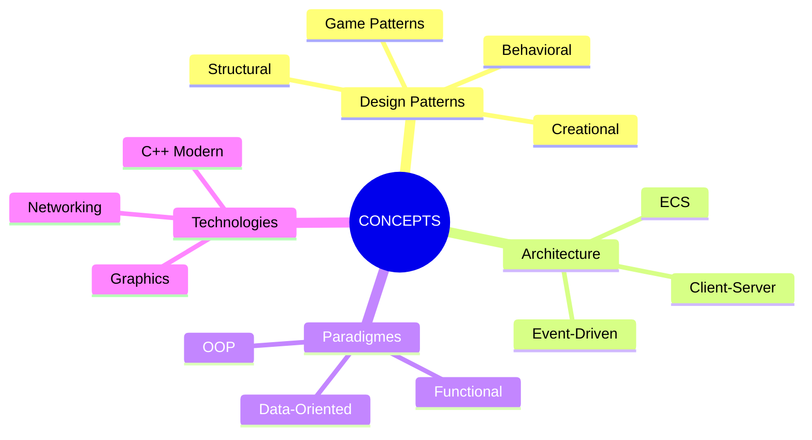

# Concepts Techniques

Cette section contient des explications approfondies des concepts de programmation dans le contexte de votre projet R-Type.

---

## Organisation des Concepts



---

## Categories

### Design Patterns

Patterns de conception appliques au developpement de jeux :

| Pattern | Categorie | Usage dans R-Type |
|---------|-----------|-------------------|
| Entity-Component-System | Architectural | Coeur du moteur de jeu |
| Observer | Behavioral | Systeme d'evenements |
| Factory | Creational | Creation d'entites |
| Object Pool | Creational | Gestion des projectiles |
| State Machine | Behavioral | Etats du jeu |
| Command | Behavioral | Input handling |

### Principes d'Architecture

Concepts fondamentaux pour structurer le code :

- **SOLID** - Les 5 principes de la POO
- **DRY** - Don't Repeat Yourself
- **KISS** - Keep It Simple, Stupid
- **YAGNI** - You Aren't Gonna Need It
- **Separation of Concerns** - Separation des responsabilites

### Concepts C++ Modernes

Features C++17/20 utilises dans le projet :

- Smart Pointers (`unique_ptr`, `shared_ptr`)
- Move Semantics
- Templates et SFINAE
- Concepts (C++20)
- Ranges (C++20)
- Coroutines

### Concepts Reseau

Fondamentaux du networking pour jeux :

- TCP vs UDP
- Serialisation/Deserialisation
- Latency Compensation
- Client-Side Prediction
- Server Reconciliation

---

## Demander une Explication

```bash
# Demander l'explication d'un concept
@soldier_learning_advisor "Explique-moi [CONCEPT] dans le contexte de notre projet"

# Exemples
@soldier_learning_advisor "Explique-moi le pattern ECS"
@soldier_learning_advisor "Explique-moi les smart pointers en C++"
@soldier_learning_advisor "Explique-moi la prediction client-side"
```

---

## Format des Explications

Chaque concept est explique selon cette structure :

```markdown
# Concept: [Nom]

## En Une Phrase
[Definition concise]

## Analogie
[Comparaison avec le monde reel]

## Pourquoi C'est Important
[Contexte et benefices]

## Comment Ca Fonctionne
[Explication technique avec diagrammes]

## Dans Notre Projet
[Exemples concrets du codebase]

## Pieges a Eviter
[Anti-patterns et erreurs communes]

## Pour Aller Plus Loin
[Ressources et concepts avances]
```

---

## Concepts Documentes

!!! info "Section Auto-alimentee"
    Cette section sera automatiquement mise a jour avec les concepts expliques.

*Aucun concept documente pour le moment. Demandez une explication au Soldat Mentor !*

---

## Navigation

- [Retour au Centre d'Apprentissage](../index.md)
- [Analyses de Code](../analyses/index.md)
- [Bonnes Pratiques](../best-practices/index.md)
