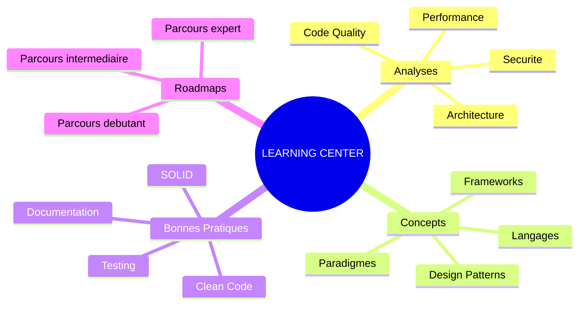
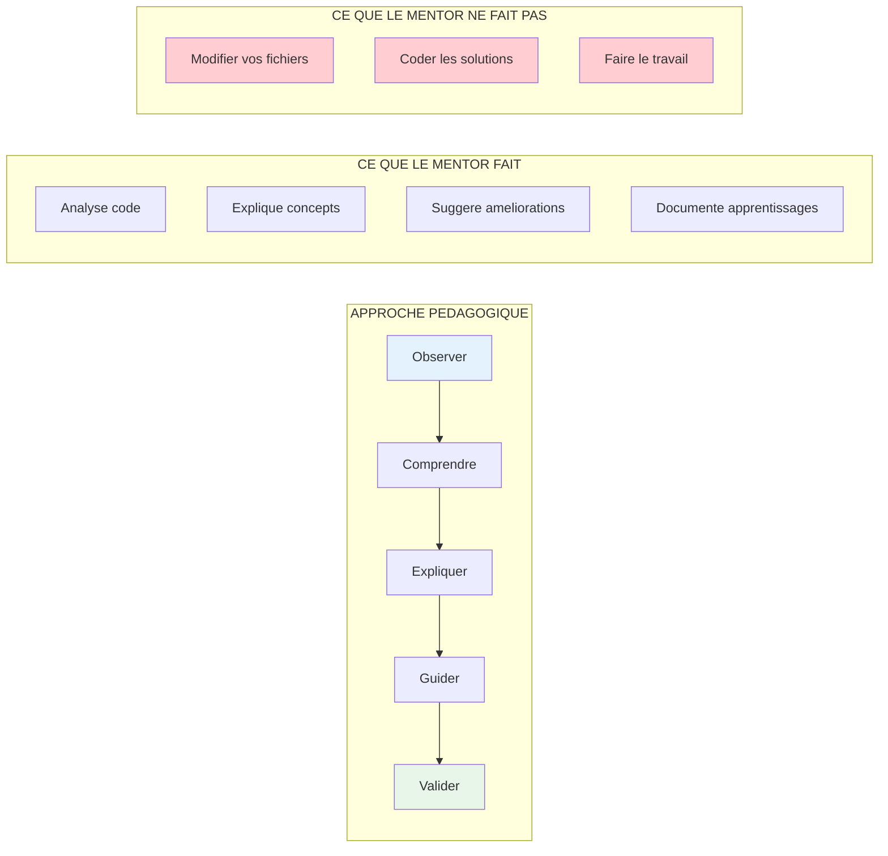

# Centre d'Apprentissage - Army2077

Bienvenue dans le **Centre d'Apprentissage** d'Army2077. Cette section est alimentee par le **Soldat Mentor** et contient des analyses pedagogiques, explications de concepts, bonnes pratiques et parcours d'apprentissage personnalises.

---

## Organisation du Centre



---

## Sections Disponibles

<div class="grid cards" markdown>

-   :material-magnify-scan:{ .lg .middle } **Analyses de Code**

    ---

    Analyses pedagogiques detaillees de votre code avec explications des problemes et suggestions d'amelioration.

    [:octicons-arrow-right-24: Voir les analyses](analyses/index.md)

-   :material-school:{ .lg .middle } **Concepts Techniques**

    ---

    Explications approfondies des concepts de programmation dans le contexte de votre projet.

    [:octicons-arrow-right-24: Explorer les concepts](concepts/index.md)

-   :material-check-decagram:{ .lg .middle } **Bonnes Pratiques**

    ---

    Guides des meilleures pratiques adaptees a votre codebase et vos technologies.

    [:octicons-arrow-right-24: Consulter les pratiques](best-practices/index.md)

-   :material-map-marker-path:{ .lg .middle } **Parcours d'Apprentissage**

    ---

    Roadmaps personnalises pour progresser selon votre niveau et vos objectifs.

    [:octicons-arrow-right-24: Suivre un parcours](roadmaps/index.md)

</div>

---

## Comment Utiliser ce Centre

### Demander une Analyse

```bash
@soldier_learning_advisor "Analyse mon code dans [FICHIER] et cree une page d'apprentissage"
```

Le Soldat Mentor va :

1. **Analyser** votre code en profondeur
2. **Identifier** les points d'amelioration
3. **Expliquer** les concepts sous-jacents
4. **Creer** une page documentee dans la section appropriee
5. **Indexer** automatiquement la nouvelle page

### Types de Demandes

| Type | Commande | Resultat |
|------|----------|----------|
| Analyse de code | `"Analyse [FICHIER]"` | Page dans `analyses/` |
| Explication concept | `"Explique [CONCEPT]"` | Page dans `concepts/` |
| Bonnes pratiques | `"Best practices pour [SUJET]"` | Page dans `best-practices/` |
| Parcours | `"Roadmap pour apprendre [SUJET]"` | Page dans `roadmaps/` |

---

## Philosophie Pedagogique

!!! quote "Le Mentor ne code pas, il guide"
    Le Soldat Mentor **n'ecrit jamais de code** dans vos fichiers sources. Il vous guide vers la comprehension pour que **vous** implementiez les solutions.

### Principes Fondamentaux



---

## Structure des Pages d'Apprentissage

Chaque page generee suit une structure pedagogique standard :

### Template Analyse

```markdown
# Analyse: [Titre]

## Resume
- Fichiers analyses
- Score global
- Points cles

## Observations
### Ce qui est bien fait
### Points d'amelioration

## Concepts a Approfondir
[Liens vers concepts/]

## Exercices Suggeres
[Sans solutions - pour pratiquer]

## Ressources
[Liens externes pertinents]
```

### Template Concept

```markdown
# Concept: [Nom]

## Definition Simple
[Explication accessible]

## Pourquoi C'est Important
[Contexte projet]

## Comment ca Fonctionne
[Explication detaillee avec diagrammes]

## Exemples dans le Projet
[References a votre code]

## Anti-Patterns a Eviter
[Ce qu'il ne faut pas faire]

## Pour Aller Plus Loin
[Ressources avancees]
```

---

## Historique des Apprentissages

Cette section garde une trace de toutes les analyses et apprentissages generes pour votre projet. Utilisez-la comme reference et pour suivre votre progression.

!!! tip "Conseil"
    Revisitez regulierement les analyses precedentes pour consolider vos apprentissages et verifier que vous avez bien integre les concepts.

---

## Navigation

- [Introduction a Army2077](../hive/introduction.md)
- [Documentation du Soldat Mentor](../hive/agents/soldier-learning-advisor.md)
- [Workflows d'Apprentissage](../hive/workflows.md#workflow-4--apprentissage-guide)
