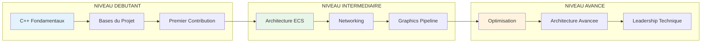
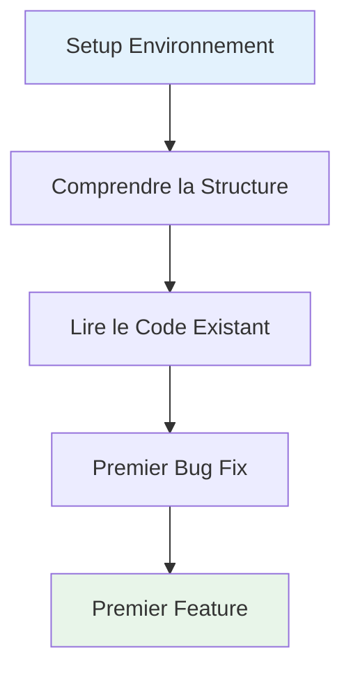
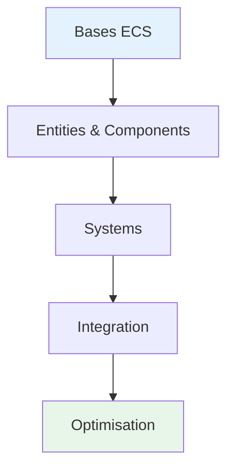
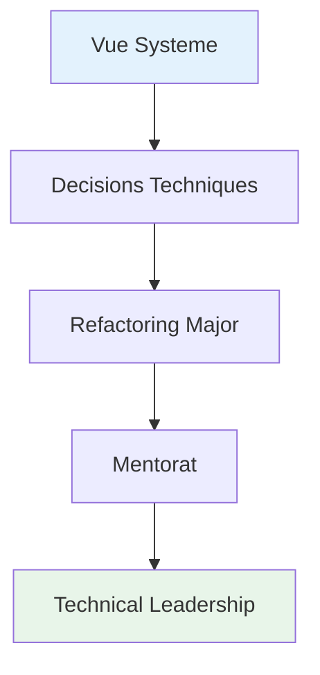

# Parcours d'Apprentissage

Cette section propose des roadmaps personnalises pour progresser selon votre niveau et vos objectifs dans le projet R-Type.

---

## Parcours Disponibles



---

## Types de Parcours

### Par Niveau

| Niveau | Public | Duree Estimee | Focus |
|--------|--------|---------------|-------|
| Debutant | Nouveaux sur le projet | Variable | Fondamentaux |
| Intermediaire | Contributeurs reguliers | Variable | Expertise domaine |
| Avance | Developpeurs seniors | Variable | Architecture & Leadership |

### Par Domaine

| Domaine | Description | Prerequis |
|---------|-------------|-----------|
| ECS | Maitriser l'Entity-Component-System | C++ intermediaire |
| Network | Developper les features reseau | Bases TCP/UDP |
| Graphics | Travailler sur le rendu | Notions de rendering |
| Core | Contribuer au coeur du moteur | ECS + Architecture |

---

## Demander un Parcours

```bash
# Demander un roadmap personnalise
@soldier_learning_advisor "Cree-moi un roadmap pour [OBJECTIF]"

# Exemples
@soldier_learning_advisor "Roadmap pour maitriser l'architecture ECS"
@soldier_learning_advisor "Roadmap pour devenir expert networking"
@soldier_learning_advisor "Roadmap pour un debutant C++ sur le projet"
```

---

## Structure d'un Parcours

```markdown
# Parcours: [Titre]

## Objectif
[Ce que vous saurez faire a la fin]

## Prerequis
[Connaissances necessaires avant de commencer]

## Vue d'Ensemble
[Diagramme du parcours]

## Etapes

### Etape 1: [Titre]
**Duree estimee**: Variable
**Objectifs**:
- [ ] Objectif 1
- [ ] Objectif 2

**Ressources**:
- [Lien 1]
- [Lien 2]

**Exercices**:
1. Exercice sans solution
2. Exercice pratique

**Validation**:
[Comment savoir qu'on maitrise cette etape]

### Etape 2: [Titre]
[...]

## Points de Controle
[Jalons pour mesurer la progression]

## Pour Aller Plus Loin
[Parcours avances lies]
```

---

## Parcours Pre-definis

### Parcours Debutant: Premiers Pas



**Etapes cles**:

1. Configurer l'environnement de dev
2. Comprendre l'architecture du projet
3. Lire et analyser le code existant
4. Corriger un bug simple
5. Implementer une petite feature

### Parcours Intermediaire: Specialisation ECS



**Etapes cles**:

1. Comprendre le pattern ECS
2. Maitriser Entities et Components
3. Developper des Systems
4. Integrer avec le reste du moteur
5. Optimiser les performances

### Parcours Avance: Architecture Globale



**Etapes cles**:

1. Vision globale du systeme
2. Prendre des decisions architecturales
3. Mener des refactorings majeurs
4. Mentorer les autres developpeurs
5. Leadership technique

---

## Parcours Personnalises

!!! info "Section Auto-alimentee"
    Cette section sera automatiquement mise a jour avec les parcours generes.

*Aucun parcours personnalise pour le moment. Demandez un roadmap au Soldat Mentor !*

---

## Conseils pour Progresser

!!! tip "Cles du Succes"
    1. **Pratiquez regulierement** - La theorie seule ne suffit pas
    2. **Lisez du code** - Le code des autres est une source d'apprentissage
    3. **Posez des questions** - Le Soldat Mentor est la pour vous guider
    4. **Documentez** - Ecrire ce qu'on apprend aide a consolider
    5. **Iterez** - Revoyez vos anciens codes avec vos nouvelles connaissances

---

## Navigation

- [Retour au Centre d'Apprentissage](../index.md)
- [Analyses de Code](../analyses/index.md)
- [Concepts Techniques](../concepts/index.md)
- [Bonnes Pratiques](../best-practices/index.md)
