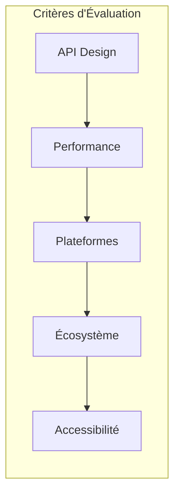
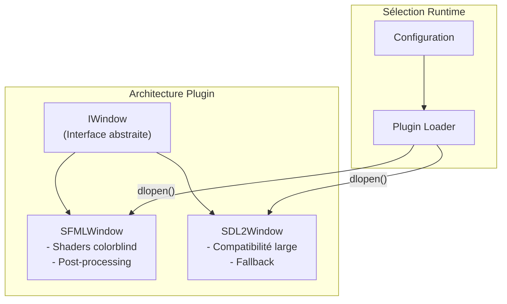
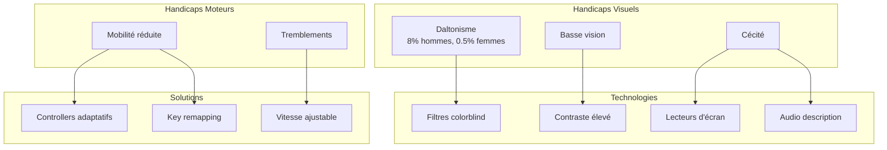

# Compétence 1 : Veille Technologique

> **Mettre en place une veille légale et réglementaire prenant en compte les besoins des PSH en menant des recherches fréquentes sur les usages liés aux technologies, en recensant les aspects légaux et réglementaires parus et en participant régulièrement aux rencontres de la communauté professionnelle afin de minimiser la dette technique pour les aspects couverts par le projet.**

---

## Observable 1.1 : Étude Comparative des Technologies

### Contexte du Choix Technologique

Le projet R-Type nécessite une bibliothèque graphique multimédia performante pour le rendu 2D, la gestion audio et les entrées utilisateur. Trois solutions majeures ont été évaluées : **SFML**, **SDL2** et **Raylib**.

### Comparatif Technique



#### Tableau Comparatif Détaillé

| Critère | SFML | SDL2 | Raylib |
|---------|------|------|--------|
| **Langage natif** | C++ (OOP) | C (C-compatible) | C (simple) |
| **Courbe d'apprentissage** | Douce | Moyenne | Très douce |
| **Accélération GPU** | OpenGL par défaut | Optionnel (SDL_Renderer) | OpenGL intégré |
| **Modules intégrés** | Graphics, Audio, Network, System, Window | Core uniquement (extensions séparées) | Tout intégré |
| **Networking** | Intégré (sf::TcpSocket, sf::UdpSocket) | Non inclus | Non inclus |
| **Shaders** | GLSL natif | Via extensions | OpenGL abstrait |
| **Support mobile** | Android/iOS (SFML 2.2+) | Android/iOS/WebAssembly | Limité |
| **Jeux commerciaux** | Quelques indie | Portal, Left 4 Dead 2, Amnesia | Éducatif principalement |
| **Maturité** | ~15 ans | ~25 ans | ~9 ans |
| **Licence** | zlib/png | zlib | zlib |

#### Analyse API Design

**SFML** adopte une approche orientée objet pure C++ :
```cpp
// SFML : API C++ moderne et intuitive
sf::RenderWindow window(sf::VideoMode({1920, 1080}), "R-Type");
sf::Sprite ship;
ship.setTexture(texture);
window.draw(ship);
```

**SDL2** utilise une API C procédurale :
```cpp
// SDL2 : API C bas niveau
SDL_Window* window = SDL_CreateWindow("R-Type", ...);
SDL_Renderer* renderer = SDL_CreateRenderer(window, -1, SDL_RENDERER_ACCELERATED);
SDL_RenderCopy(renderer, texture, NULL, &destRect);
```

**Raylib** privilégie la simplicité extrême :
```cpp
// Raylib : API minimaliste
InitWindow(1920, 1080, "R-Type");
DrawTexture(texture, x, y, WHITE);
```

#### Performances et Rendu

| Aspect | SFML | SDL2 | Raylib |
|--------|------|------|--------|
| **Rendu par défaut** | Hardware (OpenGL) | Software (ou hardware opt-in) | Hardware (OpenGL) |
| **Shapes primitifs** | 10+ types | 4 types (Point, Line, Rect, Fill) | 40+ fonctions |
| **Batch rendering** | Automatique | Manuel | Semi-automatique |
| **Post-processing** | Shaders GLSL | Via extension | OpenGL pur |

### Justification du Double-Backend SFML + SDL2

Le projet R-Type implémente une **architecture multi-backend** permettant d'utiliser SFML ou SDL2 selon le contexte :



**Raisons du choix dual :**

1. **SFML comme backend principal** :
   - API C++ native parfaitement adaptée au projet
   - Support des shaders pour les filtres daltonisme
   - Module réseau intégré (utilisé initialement)
   - Accélération hardware par défaut

2. **SDL2 comme backend de fallback** :
   - Compatibilité maximale (25 ans de maturité)
   - Support WebAssembly pour portage futur
   - Preuves industrielles (jeux AAA)
   - Alternative quand SFML non disponible

**Implémentation** (`src/client/include/graphics/IWindow.hpp:20-62`) :
```cpp
class IWindow {
    virtual void drawSprite(const std::string& textureKey, float x, float y,
                           float width, float height) = 0;
    virtual bool loadShader(const std::string& key, const std::string& vertexPath,
                           const std::string& fragmentPath) = 0;
    virtual void setPostProcessShader(const std::string& key) = 0;
    virtual bool supportsShaders() const = 0;  // SFML: true, SDL2: false
};
```

### Conclusion Observable 1.1

L'étude comparative a permis de sélectionner une **architecture hybride SFML/SDL2** qui combine :
- La modernité et les fonctionnalités avancées de SFML (shaders, API C++)
- La robustesse et la compatibilité éprouvée de SDL2
- Une abstraction permettant d'ajouter d'autres backends (Raylib, custom OpenGL)

Cette approche minimise la dette technique en évitant le vendor lock-in sur une seule bibliothèque.

---

## Observable 1.2 : Technologies d'Accessibilité pour les PSH

L'étude des technologies existantes pour les personnes en situation de handicap a guidé l'implémentation des fonctionnalités d'accessibilité dans R-Type.

### Cadre Réglementaire 2025

Le **RGAA 2025** (Référentiel Général d'Amélioration de l'Accessibilité) impose de nouvelles obligations :

| Aspect | Exigence RGAA 2025 |
|--------|-------------------|
| **Entrée en vigueur** | 28 juin 2025 |
| **Cibles** | Sites web, applications, jeux en ligne |
| **Sanctions** | 50 000€ par service non conforme (renouvelable) |
| **Base technique** | WCAG 2.1 niveau AA |

### Technologies d'Assistance Recensées



### Contrôleurs Adaptatifs de l'Industrie

| Dispositif | Fabricant | Public cible | Caractéristiques |
|------------|-----------|--------------|------------------|
| **Xbox Adaptive Controller** | Microsoft | Mobilité réduite | Boutons larges, ports extensibles |
| **Project Leonardo** | Sony | Personnalisation | Layout modulaire, split design |
| **QuadStick** | Tiers | Quadriplégie | Contrôle buccal |
| **Tip Device** | Tiers | SMA, quadriplégie | Contrôle lingual via IA |

### Game Accessibility Guidelines

Les [Game Accessibility Guidelines](https://gameaccessibilityguidelines.com/) définissent 3 niveaux :

| Niveau | Effort | Exemples |
|--------|--------|----------|
| **Basic** | Faible | Sous-titres, remapping touches |
| **Intermediate** | Moyen | Filtres daltonisme, taille police ajustable |
| **Advanced** | Élevé | Audio description, support lecteur écran |

### Implémentation dans R-Type

Le projet R-Type implémente les fonctionnalités d'accessibilité suivantes :

#### 1. Filtres Daltonisme (Shaders GLSL)

**Types supportés** (`src/client/include/accessibility/AccessibilityConfig.hpp:22-28`) :
```cpp
enum class ColorBlindMode {
    None,
    Protanopia,      // Absence de cônes rouges (1% hommes)
    Deuteranopia,    // Absence de cônes verts (6% hommes)
    Tritanopia,      // Absence de cônes bleus (0.01%)
    HighContrast     // Mode contraste élevé
};
```

**Gestionnaire de shaders** (`src/client/include/accessibility/ColorblindShaderManager.hpp:17-60`) :
```cpp
class ColorblindShaderManager {
public:
    bool initialize(std::shared_ptr<graphics::IWindow> window);
    void updateFromConfig();  // Applique le filtre sélectionné
    bool isAvailable() const; // true si backend supporte shaders
private:
    static constexpr const char* FRAGMENT_SHADER_PATH = "assets/shaders/colorblind.frag";
};
```

#### 2. Remapping des Touches

**Configuration complète** (`src/client/include/accessibility/AccessibilityConfig.hpp:33-49`) :
```cpp
enum class GameAction {
    MoveUp, MoveDown, MoveLeft, MoveRight,  // Déplacement
    Shoot, Pause, PushToTalk,                // Actions
    WeaponPrev, WeaponNext,                  // Armes (Q/E)
    OpenChat, ExpandChat,                    // Chat (T/O)
    ForceToggle,                             // Force Pod (F)
    ToggleControls,                          // Aide (H)
    ActionCount
};

class AccessibilityConfig {
    void setKeyBinding(GameAction action, events::Key primaryKey,
                       events::Key secondaryKey = events::Key::Unknown);
    events::Key getPrimaryKey(GameAction action) const;
    bool isActionKey(GameAction action, events::Key key) const;
};
```

**Bindings par défaut avec alternatives** :
| Action | Touche primaire | Touche secondaire |
|--------|-----------------|-------------------|
| MoveUp | Z (AZERTY) | W (QWERTY) |
| MoveDown | S | Down Arrow |
| Shoot | Space | Left Click |
| Pause | Escape | P |

#### 3. Vitesse de Jeu Ajustable

```cpp
void setGameSpeedMultiplier(float multiplier);  // 0.5x à 2.0x
float getGameSpeedMultiplier() const;
```

Cette fonctionnalité permet aux joueurs avec des temps de réaction plus lents de profiter du jeu.

#### 4. Persistance des Paramètres

```cpp
bool loadFromFile(const std::string& filepath);   // Charge settings.json
bool saveToFile(const std::string& filepath) const;
```

Les préférences sont sauvegardées localement et synchronisées avec MongoDB (collection `user_settings`) pour persistance cross-device.

### Tableau de Conformité

| Guideline | Niveau | Implémenté | Fichier |
|-----------|--------|------------|---------|
| Remapping touches | Basic | Oui | `AccessibilityConfig.hpp` |
| Filtres daltonisme | Intermediate | Oui | `ColorblindShaderManager.hpp` |
| Contraste élevé | Intermediate | Oui | `colorblind.frag` |
| Vitesse ajustable | Intermediate | Oui | `AccessibilityConfig.hpp` |
| Multi-input (clavier+souris) | Basic | Oui | `Event.hpp` |
| Sous-titres chat | Basic | Oui | `GameScene.hpp` (chat overlay) |

### Conclusion Observable 1.2

L'étude des technologies d'accessibilité et du cadre RGAA 2025 a conduit à l'implémentation de :
- **Filtres visuels** : 4 modes de daltonisme via shaders GLSL
- **Personnalisation contrôles** : Remapping complet avec touches primaires/secondaires
- **Adaptation gameplay** : Vitesse de jeu configurable
- **Persistance** : Sauvegarde locale et cloud des préférences

Ces fonctionnalités répondent aux niveaux Basic et Intermediate des Game Accessibility Guidelines, positionnant R-Type au-dessus de la moyenne de l'industrie pour un projet étudiant.

---

## Sources

- [Game Accessibility Guidelines](https://gameaccessibilityguidelines.com/)
- [RGAA 2025 - Accessibilité Web](https://www.blogdumoderateur.com/accessibilite-web-2025-rgaa-nouvelles-regles/)
- [SDL vs SFML Comparison](https://discourse.libsdl.org/t/why-would-i-choose-sdl2-over-sfml/28473)
- [SFML vs Raylib - Slant](https://www.slant.co/versus/1100/20505/~sfml_vs_raylib)
- [Accessibilité et jeux en ligne - Handinova](https://handinova.fr/accessibilite-et-jeux-en-ligne/)
