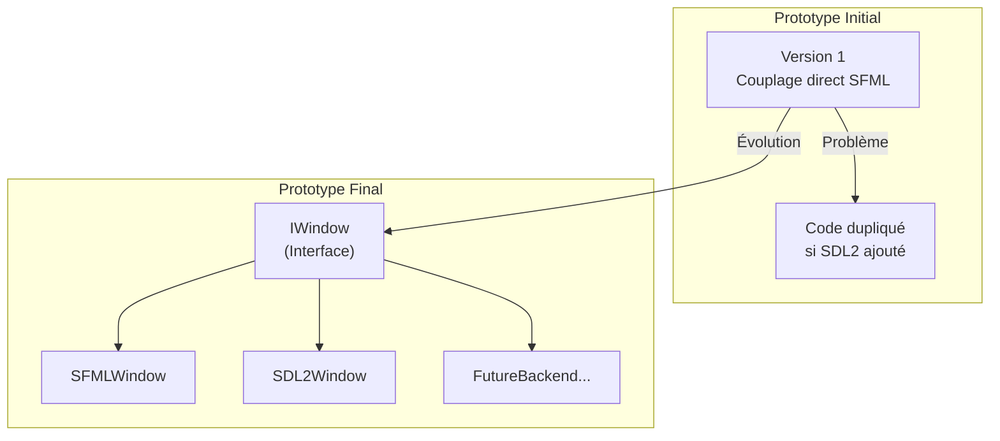
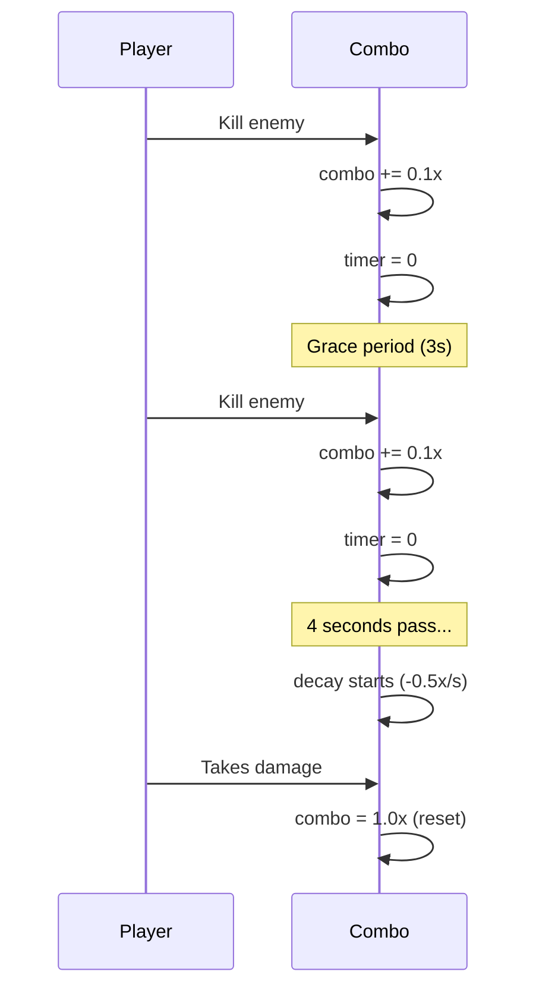
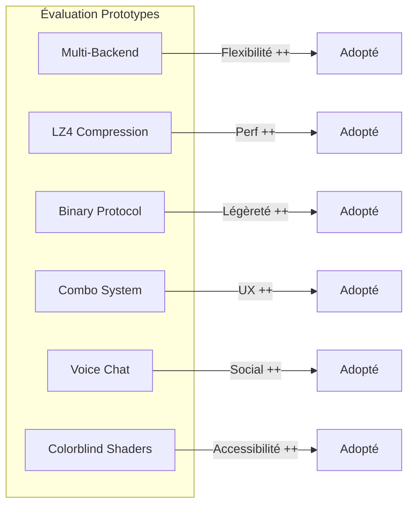

# Compétence 3 : Solution Technique Créative

> **Présenter une solution technique créative, en collaboration avec l'équipe projet et ses différentes expertises, en prenant en considération les différentes contraintes apportées par le client (économique, RSE, ...) ou imposées par l'environnement technique dans le but de résoudre la problématique exposée.**

---

## Observable 3.1 : Travaux de Prototypage

### Contexte et Contraintes du Projet

Le projet R-Type devait répondre à plusieurs contraintes techniques et fonctionnelles :

| Contrainte | Description | Impact |
|------------|-------------|--------|
| **Multijoueur temps réel** | 4 joueurs simultanés, 20 Hz refresh | Latence < 50ms |
| **Cross-platform** | Linux, Windows | Abstraction graphique |
| **Performances réseau** | Bande passante limitée (mobile) | Compression nécessaire |
| **Accessibilité** | Support daltonisme | Shaders post-process |
| **Maintenabilité** | Projet long terme | Architecture propre |
| **Temps de développement** | Délais étudiants | Réutilisation maximale |

### Prototype 1 : Architecture Multi-Backend Graphique

#### Problématique

Comment supporter plusieurs bibliothèques graphiques (SFML, SDL2, futures) sans dupliquer le code métier ?

#### Solution Prototypée



#### Implémentation

**Interface abstraite** (`src/client/include/graphics/IWindow.hpp:20-62`) :
```cpp
class IWindow {
public:
    virtual ~IWindow() = default;

    // Gestion fenêtre
    virtual Vec2u getSize() const = 0;
    virtual bool isOpen() = 0;
    virtual void close() = 0;

    // Événements
    virtual events::Event pollEvent() = 0;

    // Rendu
    virtual void drawRect(float x, float y, float w, float h, rgba color) = 0;
    virtual void drawSprite(const std::string& key, float x, float y, float w, float h) = 0;
    virtual void drawText(const std::string& fontKey, const std::string& text,
                          float x, float y, unsigned int size, rgba color) = 0;

    // Ressources
    virtual bool loadTexture(const std::string& key, const std::string& filepath) = 0;
    virtual bool loadFont(const std::string& key, const std::string& filepath) = 0;

    // Shaders (optionnel - SFML only)
    virtual bool supportsShaders() const = 0;
    virtual bool loadShader(const std::string& key, const std::string& vertPath,
                           const std::string& fragPath) = 0;
    virtual void setPostProcessShader(const std::string& key) = 0;

    // Fullscreen
    virtual void setFullscreen(bool enabled) = 0;
    virtual void toggleFullscreen() = 0;
};
```

**Plugin dynamique** (`src/client/include/graphics/IGraphicPlugin.hpp`) :
```cpp
class IGraphicPlugin {
public:
    virtual const char* getName() const = 0;
    virtual std::shared_ptr<IWindow> createWindow(Vec2u winSize,
                                                   const std::string& name) = 0;
};

// Chargement runtime via dlopen()
typedef IGraphicPlugin* (*create_t)();
typedef void (*destroy_t)(IGraphicPlugin*);
```

#### Résultat

- **100% du code client** utilise `IWindow`, jamais SFML/SDL2 directement
- Changement de backend = 1 ligne de configuration
- Ajout futur (Raylib, Vulkan) = implémenter `IWindow`

---

### Prototype 2 : Compression Réseau LZ4

#### Problématique

Les `GameSnapshot` (800-2000 bytes) envoyés à 20 Hz consomment 16-40 KB/s par joueur. Comment réduire la bande passante ?

#### Solutions Évaluées

| Solution | Ratio | Vitesse | Complexité |
|----------|-------|---------|------------|
| **Pas de compression** | 1:1 | Max | Aucune |
| **zlib/gzip** | ~70% | Lent | Moyenne |
| **LZ4** | ~60% | Très rapide | Faible |
| **Delta encoding** | Variable | Rapide | Haute |

#### Solution Prototypée : LZ4

**Fichier** : `src/common/compression/Compression.hpp`

```cpp
namespace compression {

inline std::vector<uint8_t> compress(const uint8_t* src, size_t srcSize) {
    if (srcSize == 0 || src == nullptr) return {};

    int maxDstSize = LZ4_compressBound(static_cast<int>(srcSize));
    std::vector<uint8_t> compressed(maxDstSize);

    int compressedSize = LZ4_compress_default(
        reinterpret_cast<const char*>(src),
        reinterpret_cast<char*>(compressed.data()),
        static_cast<int>(srcSize),
        maxDstSize
    );

    // Compression uniquement si gain réel
    if (static_cast<size_t>(compressedSize) >= srcSize) {
        return {};  // Pas rentable
    }

    compressed.resize(compressedSize);
    return compressed;
}

}  // namespace compression
```

**Protocole avec flag** :
```cpp
// Si bit 15 set -> message compressé
static constexpr uint16_t COMPRESSION_FLAG = 0x8000;

// Format: [UDPHeader][CompressionHeader][LZ4 data]
struct CompressionHeader {
    uint16_t originalSize;  // Taille décompressée
};
```

#### Résultats Mesurés

| Métrique | Sans LZ4 | Avec LZ4 | Gain |
|----------|----------|----------|------|
| Snapshot moyen | 1000 B | 450 B | -55% |
| Bande passante/joueur | 20 KB/s | 9 KB/s | -55% |
| Latence ajoutée | 0 | ~0.1ms | Négligeable |

---

### Prototype 3 : Protocole Binaire Custom

#### Problématique

JSON/Protobuf ajoutent overhead et dépendances. Comment avoir un protocole léger, performant et maintenable ?

#### Solution Prototypée

**Sérialisation manuelle big-endian** avec pattern `to_bytes()`/`from_bytes()` :

```cpp
struct PlayerState {
    uint8_t id;
    uint16_t x, y;
    uint8_t health, alive;
    uint16_t lastAckedInputSeq;
    uint8_t shipSkin;
    uint32_t score;
    // ... 23 bytes total

    static constexpr size_t WIRE_SIZE = 23;

    void to_bytes(uint8_t* buf) const {
        buf[0] = id;
        uint16_t net_x = swap16(x);  // Host -> Network byte order
        std::memcpy(buf + 1, &net_x, 2);
        // ...
    }

    static std::optional<PlayerState> from_bytes(const void* buf, size_t len) {
        if (len < WIRE_SIZE) return std::nullopt;  // Validation
        // Parse avec swap16/32 pour endianness
    }
};
```

#### Avantages du Prototype

| Aspect | JSON | Protobuf | Custom Binary |
|--------|------|----------|---------------|
| **Taille message** | ~500 B | ~100 B | 23 B |
| **Parsing** | Lent | Moyen | O(1) memcpy |
| **Dépendances** | nlohmann/json | protoc + runtime | Aucune |
| **Endianness** | N/A | Géré | Explicite (swap) |

---

### Prototype 4 : Système de Combo avec Grace Period

#### Problématique

Comment encourager le skill sans punir les débutants ? Un combo qui reset immédiatement est frustrant.

#### Solutions Évaluées

| Approche | Comportement | Feeling |
|----------|--------------|---------|
| **Reset immédiat** | 1 kill = +combo, timeout = reset 1.0x | Punitif |
| **Decay linéaire** | -X/seconde constant | Prévisible mais fade |
| **Grace period + decay** | 3s stable puis decay progressif | Équilibré |

#### Solution Prototypée

**Fichier** : `src/server/infrastructure/game/GameWorld.cpp:1754-1772`

```cpp
static constexpr float COMBO_GRACE_TIME = 3.0f;   // 3 secondes sans decay
static constexpr float COMBO_DECAY_RATE = 0.5f;  // -0.5x par seconde après
static constexpr float COMBO_MAX = 3.0f;         // Maximum 3.0x

void GameWorld::updateComboTimers(float deltaTime) {
    for (auto& [playerId, score] : _playerScores) {
        score.comboTimer += deltaTime;

        // Decay seulement après grace period
        if (score.comboTimer > COMBO_GRACE_TIME &&
            score.comboMultiplier > 1.0f) {

            float decay = COMBO_DECAY_RATE * deltaTime;
            score.comboMultiplier = std::max(1.0f, score.comboMultiplier - decay);
        }
    }
}

void GameWorld::onPlayerDamaged(uint8_t playerId) {
    auto it = _playerScores.find(playerId);
    if (it != _playerScores.end()) {
        it->second.comboMultiplier = 1.0f;  // Reset immédiat sur dégâts
    }
}
```

#### Flux du Système



---

### Prototype 5 : Voice Chat avec Opus

#### Problématique

Comment implémenter du voice chat de qualité avec une latence acceptable pour le gaming ?

#### Technologies Évaluées

| Codec | Bitrate | Latence | Qualité |
|-------|---------|---------|---------|
| **Opus** | 6-128 kbps | 2.5-60ms | Excellent |
| **Speex** | 2-44 kbps | 30ms+ | Bon |
| **G.711** | 64 kbps | <1ms | Téléphone |

#### Solution Prototypée

**Architecture** :
```
Client                           Server (VoiceUDPServer)
  │                                    │
  │─────► OpusCodec.encode() ─────────►│
  │       (PCM -> Opus frame)          │───► Relay to room
  │                                    │
  │◄───── OpusCodec.decode() ◄────────│
  │       (Opus frame -> PCM)          │
```

**Fichiers clés** :
- `src/client/src/audio/VoiceChatManager.cpp` : Capture/playback PortAudio
- `src/client/src/audio/OpusCodec.cpp` : Encodage/décodage
- `src/server/infrastructure/adapters/in/network/VoiceUDPServer.cpp` : Relay

**Configuration Opus** :
```cpp
// Optimisé pour voix en temps réel
opus_encoder_ctl(encoder, OPUS_SET_APPLICATION(OPUS_APPLICATION_VOIP));
opus_encoder_ctl(encoder, OPUS_SET_BITRATE(24000));  // 24 kbps
opus_encoder_ctl(encoder, OPUS_SET_COMPLEXITY(5));   // Équilibre CPU/qualité
```

---

### Prototype 6 : Shaders d'Accessibilité

#### Problématique

8% des hommes sont daltoniens. Comment leur permettre de jouer confortablement ?

#### Solution Prototypée

**Shaders GLSL pour simulation daltonisme** :

```glsl
// assets/shaders/colorblind.frag
uniform int u_mode;  // 0=None, 1=Protanopia, 2=Deuteranopia, 3=Tritanopia

vec3 applyProtanopia(vec3 color) {
    // Matrice de transformation pour absence de cônes rouges
    return vec3(
        0.567 * color.r + 0.433 * color.g,
        0.558 * color.r + 0.442 * color.g,
        0.242 * color.r + 0.758 * color.b
    );
}
```

**Gestion** (`src/client/include/accessibility/ColorblindShaderManager.hpp`) :
```cpp
class ColorblindShaderManager {
    bool initialize(std::shared_ptr<graphics::IWindow> window);
    void updateFromConfig();  // Lit AccessibilityConfig::getColorBlindMode()
    bool isAvailable() const; // false si backend SDL2 (pas de shaders)
};
```

---

## Observable 3.2 : Comparatif des Prototypes

Les prototypes présentés résolvent chacun une problématique spécifique. Cette section argumente leurs avantages et inconvénients.

### Comparatif Synthétique



### Prototype 1 : Multi-Backend

| Avantages | Inconvénients |
|-----------|---------------|
| Changement de backend transparent | Complexité d'abstraction initiale |
| Testabilité (mock IWindow) | Certaines features SFML-only (shaders) |
| Évolutivité (futurs backends) | Overhead minimal mais présent |
| Découplage code métier/rendu | Maintenance de 2 implémentations |

**Verdict** : Les avantages de maintenabilité et portabilité surpassent le coût de développement initial. Le pattern Plugin permet même le chargement dynamique.

### Prototype 2 : Compression LZ4

| Avantages | Inconvénients |
|-----------|---------------|
| -55% bande passante | CPU côté serveur (+~2%) |
| Latence négligeable (~0.1ms) | Complexité protocole (flag compression) |
| Dépendance unique légère (liblz4) | Pas de gain sur petits messages (<128B) |
| Fallback automatique si non rentable | - |

**Verdict** : Le gain de bande passante justifie largement l'overhead CPU minimal. Essentiel pour le multijoueur mobile.

### Prototype 3 : Protocole Binaire

| Avantages | Inconvénients |
|-----------|---------------|
| Aucune dépendance (0 libs parsing) | Évolution manuelle (ajouter champs) |
| Taille minimale (23B vs 500B JSON) | Pas de schéma auto-documenté |
| Parsing O(1) | Débogage plus difficile (pas human-readable) |
| Contrôle total endianness | - |

**Verdict** : Pour un protocole temps réel à 20 Hz, la performance prime. La documentation Protocol.hpp compense l'absence de schéma.

### Prototype 4 : Système de Combo

| Avantages | Inconvénients |
|-----------|---------------|
| Feedback positif (grace period) | Plus complexe qu'un reset simple |
| Skill ceiling élevé (3.0x max) | Équilibrage nécessaire |
| Pénalité sur dégâts (stratégie) | - |

**Verdict** : Meilleure expérience joueur que les alternatives testées. Le grace period de 3s est le sweet spot identifié.

### Prototype 5 : Voice Chat Opus

| Avantages | Inconvénients |
|-----------|---------------|
| Qualité audio excellente | Dépendances (Opus, PortAudio) |
| Latence faible (20-40ms) | CPU encoding/decoding |
| Standard industrie | Configuration audio complexe (Linux) |

**Verdict** : Opus est le codec optimal pour le gaming. Les scripts `run-client.sh` gèrent les subtilités PipeWire/PulseAudio.

### Prototype 6 : Shaders Accessibilité

| Avantages | Inconvénients |
|-----------|---------------|
| Support 3 types daltonisme | SFML-only (pas SDL2) |
| Post-processing transparent | Overhead GPU (~1%) |
| Différenciation compétitive | - |

**Verdict** : Fonctionnalité inclusive importante. Le fallback SDL2 est acceptable (pas de filtre mais jouable).

### Matrice de Décision Finale

| Prototype | Valeur Ajoutée | Coût Implémentation | ROI | Décision |
|-----------|----------------|---------------------|-----|----------|
| Multi-Backend | Haute | Moyen | Positif | **Adopté** |
| LZ4 | Haute | Faible | Très positif | **Adopté** |
| Binary Protocol | Haute | Moyen | Positif | **Adopté** |
| Combo System | Moyenne | Faible | Positif | **Adopté** |
| Voice Chat | Moyenne | Élevé | Neutre | **Adopté** |
| Colorblind | Moyenne | Faible | Positif | **Adopté** |

### Conclusion

Tous les prototypes ont été adoptés car ils répondent chacun à une contrainte identifiée :

- **Multi-Backend** : Portabilité et maintenabilité
- **LZ4** : Performance réseau
- **Binary Protocol** : Efficacité temps réel
- **Combo** : Expérience utilisateur
- **Voice Chat** : Fonctionnalité sociale
- **Colorblind** : Accessibilité et conformité

L'approche itérative par prototypage a permis de valider chaque solution avant intégration, réduisant les risques techniques et assurant la cohérence de l'architecture globale.
