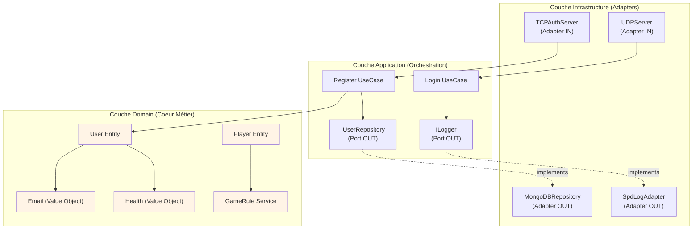
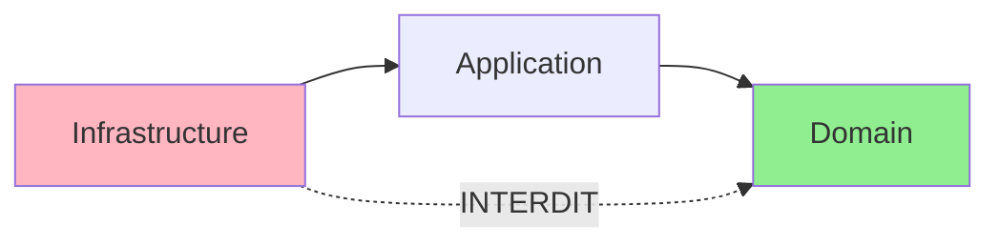
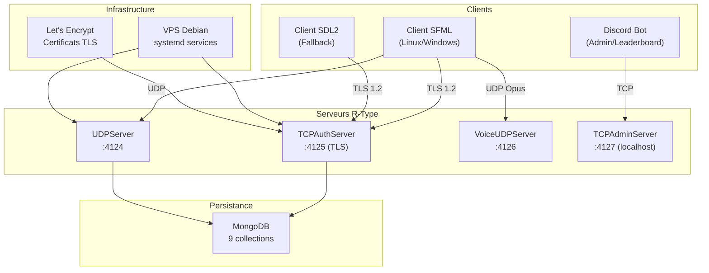

# Compétence 4 : Architecture Logicielle

> **Sélectionner une hypothèse d'architecture et l'urbanisme de la solution logicielle ou web, afin de garantir l'intégration et la pérennité d'une solution, en prenant en compte le reste de l'écosystème technique présent au sein de l'entreprise ainsi que l'accessibilité numérique de la solution.**

---

## Observable 4.1 : Architecture Hexagonale

### Choix Architectural

Le projet R-Type implémente une **Architecture Hexagonale** (Ports & Adapters), aussi connue sous le nom de Clean Architecture. Ce choix répond aux exigences de maintenabilité, testabilité et évolutivité d'un projet long terme.

### Principes de l'Architecture Hexagonale



### Structure des Répertoires

```
src/server/
├── include/
│   ├── domain/                      # Couche Domaine (coeur métier)
│   │   ├── entities/                # Entités métier
│   │   │   ├── Player.hpp
│   │   │   ├── User.hpp
│   │   │   └── Room.hpp
│   │   ├── value_objects/           # Objets de valeur immuables
│   │   │   ├── Health.hpp
│   │   │   ├── Position.hpp
│   │   │   ├── player/PlayerId.hpp
│   │   │   └── user/Email.hpp
│   │   ├── services/                # Services domaine (stateless)
│   │   │   └── GameRule.hpp
│   │   └── exceptions/              # Exceptions métier
│   │       └── DomainException.hpp
│   │
│   ├── application/                 # Couche Application
│   │   ├── use_cases/               # Cas d'usage
│   │   │   └── auth/
│   │   │       ├── Register.hpp
│   │   │       └── Login.hpp
│   │   ├── ports/out/               # Ports de sortie (interfaces)
│   │   │   ├── ILogger.hpp
│   │   │   ├── IIdGenerator.hpp
│   │   │   └── persistence/
│   │   │       ├── IUserRepository.hpp
│   │   │       └── ILeaderboardRepository.hpp
│   │   └── services/
│   │       └── AchievementChecker.hpp
│   │
│   └── infrastructure/              # Couche Infrastructure
│       ├── adapters/
│       │   ├── in/network/          # Adapters entrants
│       │   │   ├── UDPServer.hpp
│       │   │   ├── TCPAuthServer.hpp
│       │   │   └── VoiceUDPServer.hpp
│       │   └── out/                 # Adapters sortants
│       │       ├── SpdLogAdapter.hpp
│       │       └── persistence/
│       │           ├── MongoDBUserRepository.hpp
│       │           └── MongoDBLeaderboardRepository.hpp
│       └── game/
│           └── GameWorld.hpp
```

### La Règle de Dépendance

**Principe fondamental** : Les dépendances pointent toujours vers l'intérieur. Le Domain ne connaît jamais l'Infrastructure.



**Preuve dans le code** (`src/server/include/domain/entities/Player.hpp`) :
```cpp
namespace domain::entities {
    class Player {
    private:
        value_objects::Health _health;           // Domain seulement
        value_objects::player::PlayerId _id;    // Domain seulement
        value_objects::Position _position;      // Domain seulement
        // AUCUN include de MongoDB, Boost, spdlog, etc.
    };
}
```

### Couche Domain : Le Coeur Métier

#### Entités

Les entités représentent les concepts métier avec identité propre.

**User** (`src/server/include/domain/entities/User.hpp`) :
```cpp
class User {
private:
    value_objects::user::UserId _id;
    value_objects::user::Username _username;
    value_objects::user::Email _email;
    value_objects::user::Password _password;
public:
    bool verifyPassword(const std::string& attempt) const;
    void changePassword(const std::string& newPassword);
};
```

**Room** (`src/server/include/domain/entities/Room.hpp`) :
```cpp
class Room {
public:
    enum class State { Waiting, Starting, InGame, Closed };
private:
    std::string _code;
    std::vector<std::string> _playerIds;
    State _state = State::Waiting;
    uint8_t _maxPlayers = 4;
public:
    bool addPlayer(const std::string& playerId);
    void startGame();
    bool isFull() const;
};
```

#### Value Objects

Les objets de valeur sont **immuables** et identifiés par leur valeur, pas par une identité.

**Health** (`src/server/include/domain/value_objects/Health.hpp`) :
```cpp
class Health {
private:
    float _healthPoint;
    void validate(float value);  // Throws si invalide
public:
    // Méthodes retournent NOUVELLE instance (immuabilité)
    Health heal(float value) const {
        return Health(_healthPoint + value);
    }
    Health damage(float value) const {
        return Health(std::max(0.0f, _healthPoint - value));
    }
};
```

#### Services Domain

Les services domaine contiennent la logique métier pure, sans état.

**GameRule** (`src/server/include/domain/services/GameRule.hpp`) :
```cpp
class GameRule {
public:
    // Méthodes const, stateless, sans I/O
    uint8_t getMissileDamage(uint8_t weaponType, uint8_t weaponLevel) const;
    float getMissileSpeed(uint8_t weaponType, uint8_t weaponLevel) const;
    uint16_t getEnemyPointValue(uint8_t enemyType) const;
    bool shouldBossChangePhase(uint16_t currentHP, uint16_t maxHP, uint8_t phase) const;
};
```

### Couche Application : Orchestration

#### Ports de Sortie (Interfaces)

Les ports définissent les contrats que l'infrastructure doit implémenter.

**IUserRepository** (`src/server/include/application/ports/out/persistence/IUserRepository.hpp`) :
```cpp
class IUserRepository {
public:
    virtual ~IUserRepository() = default;
    virtual void save(const domain::entities::User& user) const = 0;
    virtual std::optional<domain::entities::User> findById(const std::string& id) = 0;
    virtual std::optional<domain::entities::User> findByEmail(const std::string& email) = 0;
    virtual std::optional<domain::entities::User> findByUsername(const std::string& username) = 0;
};
```

**ILogger** (`src/server/include/application/ports/out/ILogger.hpp`) :
```cpp
class ILogger {
public:
    virtual void debug(const std::string& message) = 0;
    virtual void info(const std::string& message) = 0;
    virtual void warn(const std::string& message) = 0;
    virtual void error(const std::string& message) = 0;

    // Template pour formatage C++20
    template<typename... Args>
    void info(std::format_string<Args...> fmt, Args&&... args) {
        info(std::format(fmt, std::forward<Args>(args)...));
    }
};
```

#### Use Cases

Les cas d'usage orchestrent le domaine via les ports.

**Register** (`src/server/include/application/use_cases/auth/Register.hpp`) :
```cpp
class Register {
private:
    std::shared_ptr<IUserRepository> _userRepository;  // Port OUT
    std::shared_ptr<IIdGenerator> _idGenerator;        // Port OUT
    std::shared_ptr<ILogger> _logger;                  // Port OUT

public:
    // Injection de dépendances
    explicit Register(
        std::shared_ptr<IUserRepository> userRepository,
        std::shared_ptr<IIdGenerator> idGenerator,
        std::shared_ptr<ILogger> logger
    );

    std::optional<domain::entities::User> execute(
        const std::string& username,
        const std::string& email,
        const std::string& unHashedPassword
    );
};
```

### Couche Infrastructure : Adapters

#### Adapters Entrants (IN)

Reçoivent les requêtes externes et appellent les Use Cases.

**TCPAuthServer** (`src/server/infrastructure/adapters/in/network/TCPAuthServer.hpp`) :
```cpp
class TCPAuthServer {
private:
    std::unique_ptr<application::use_cases::auth::Register> _registerUseCase;
    std::unique_ptr<application::use_cases::auth::Login> _loginUseCase;

public:
    void handle_login(const LoginMessage& msg) {
        auto userOpt = _loginUseCase->execute(msg.username, msg.password);
        // ...
    }
};
```

#### Adapters Sortants (OUT)

Implémentent les ports pour les services externes.

**MongoDBUserRepository** (`src/server/infrastructure/adapters/out/persistence/MongoDBUserRepository.hpp`) :
```cpp
class MongoDBUserRepository : public application::ports::out::persistence::IUserRepository {
private:
    std::shared_ptr<MongoDBConfiguration> _mongoDB;

public:
    void save(const domain::entities::User& user) const override {
        auto collection = getCollection();
        bsoncxx::builder::document builder;
        // Sérialisation vers BSON
        collection.insert_one(builder.view());
    }

    std::optional<domain::entities::User> findByEmail(const std::string& email) override {
        auto collection = getCollection();
        auto result = collection.find_one(make_document(kvp("email", email)));
        // Désérialisation depuis BSON
    }
};
```

**SpdLogAdapter** (`src/server/infrastructure/adapters/out/SpdLogAdapter.hpp`) :
```cpp
class SpdLogAdapter : public application::ports::out::ILogger {
public:
    void info(const std::string& message) override {
        server::logging::Logger::getMainLogger()->info(message);
    }
    void error(const std::string& message) override {
        server::logging::Logger::getMainLogger()->error(message);
    }
};
```

---

## Observable 4.2 : Intégration dans l'Écosystème Technique

L'architecture hexagonale de R-Type s'intègre naturellement dans un écosystème technique moderne.

### Diagramme d'Intégration



### Points d'Intégration

| Composant | Technologie | Port | Protocole |
|-----------|-------------|------|-----------|
| Authentification | Boost.ASIO + OpenSSL | 4125 | TCP/TLS 1.2 |
| Jeu temps réel | Boost.ASIO | 4124 | UDP binaire |
| Voice chat | Boost.ASIO + Opus | 4126 | UDP |
| Administration | Boost.ASIO | 4127 | TCP (localhost) |
| Persistance | mongocxx | - | MongoDB Wire |
| Logging | spdlog | - | Fichiers + console |

### Bénéfices de l'Architecture

#### 1. Testabilité

Les ports permettent de mocker les dépendances :
```cpp
// Test unitaire du UseCase Register
class MockUserRepository : public IUserRepository {
    void save(const User& user) const override { /* mock */ }
    std::optional<User> findByEmail(const std::string& email) override {
        return std::nullopt;  // Simule utilisateur non existant
    }
};

// Test
auto mockRepo = std::make_shared<MockUserRepository>();
Register registerUseCase(mockRepo, mockIdGen, mockLogger);
auto user = registerUseCase.execute("test", "test@test.com", "password");
EXPECT_TRUE(user.has_value());
```

#### 2. Évolutivité

Changer de base de données = implémenter un nouveau Repository :
```cpp
// Futur: PostgreSQL
class PostgresUserRepository : public IUserRepository {
    // Même interface, implémentation PostgreSQL
};

// Injection au démarrage
auto repo = std::make_shared<PostgresUserRepository>(pgConfig);
auto registerUseCase = std::make_unique<Register>(repo, ...);
```

#### 3. Maintenabilité

Chaque couche a une responsabilité claire :
- **Domain** : Règles métier (jamais de changement pour raison technique)
- **Application** : Orchestration (change si workflow change)
- **Infrastructure** : Implémentation technique (change si technologie change)

### Métriques d'Architecture

| Métrique | Valeur | Interprétation |
|----------|--------|----------------|
| Couches strictes | 3 | Domain, Application, Infrastructure |
| Dépendances Domain vers Infra | 0 | Règle de dépendance respectée |
| Ports abstraits | 11+ | Découplage complet |
| Adapters MongoDB | 9 | Couverture complète |
| Value Objects | 10+ | Immutabilité respectée |
| Injection de dépendances | 100% UseCases | Testabilité maximale |

### Conformité aux Principes SOLID

| Principe | Application | Preuve |
|----------|-------------|--------|
| **S**ingle Responsibility | Chaque classe = 1 rôle | `Health.hpp` gère uniquement la santé |
| **O**pen/Closed | Extensible sans modification | Ajouter arme = nouvelle enum, pas modifier GameRule |
| **L**iskov Substitution | Adapters interchangeables | `MongoDBUserRepository` remplaçable par `PostgresUserRepository` |
| **I**nterface Segregation | Ports ciblés | `ILogger` séparé de `IUserRepository` |
| **D**ependency Inversion | UseCases → Ports (abstractions) | `Register` dépend de `IUserRepository`, pas `MongoDBUserRepository` |

### Conclusion

L'architecture hexagonale de R-Type :
- **Isole le domaine** des préoccupations techniques
- **Facilite les tests** via l'injection de mocks
- **Permet l'évolution** sans refactoring majeur
- **S'intègre** dans l'écosystème technique existant (MongoDB, TLS, systemd)

Cette architecture garantit la **pérennité** du projet face aux évolutions technologiques futures.
