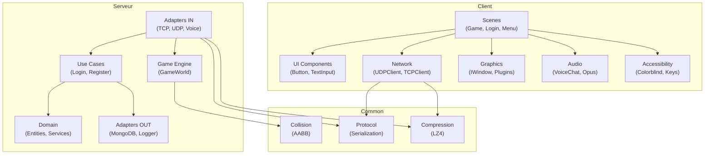
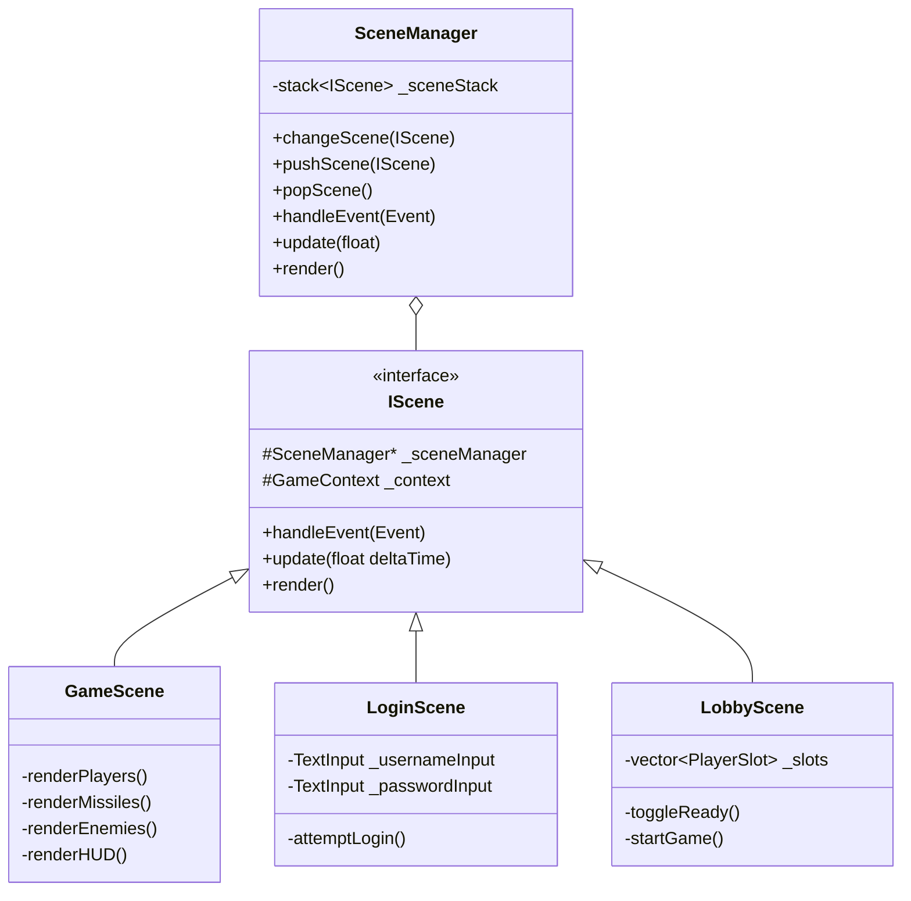
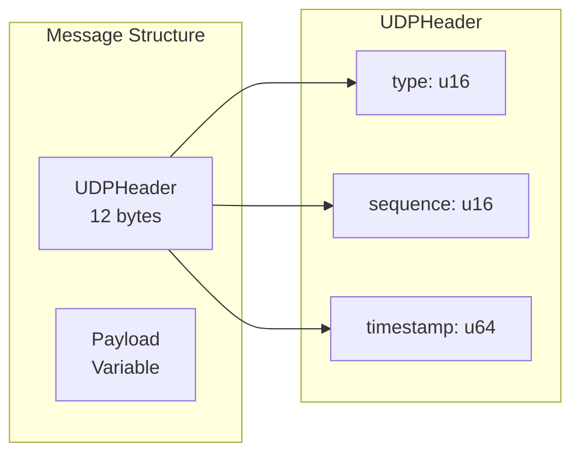
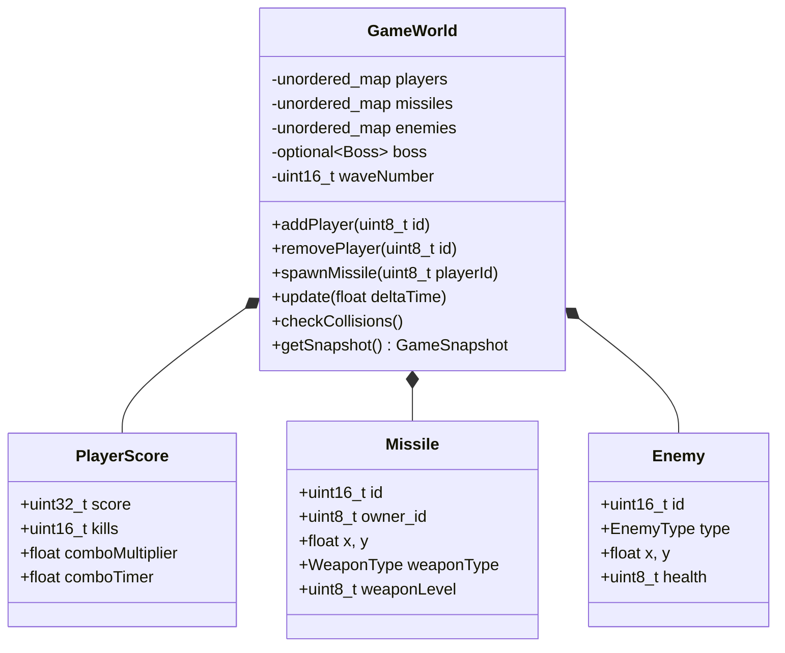
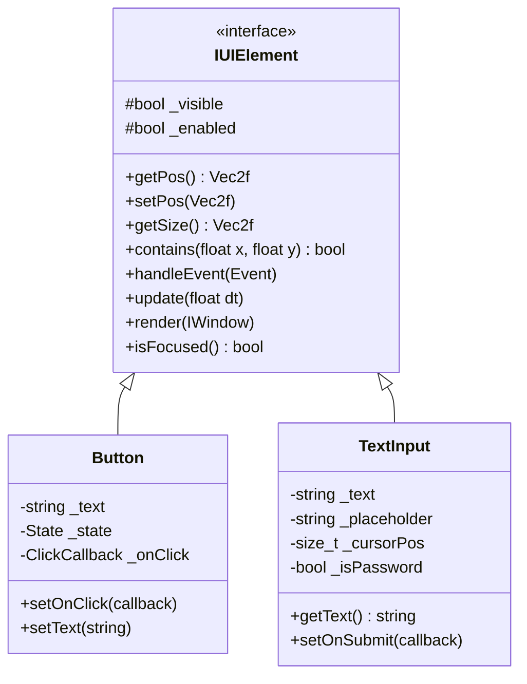

# Compétence 5 : Composants Logiciels

> **Traduire les spécifications techniques et fonctionnelles en un système cohérent de composants logiciels en mobilisant son expertise et en s'appuyant sur l'état de l'art en termes d'architecture logicielle afin de produire une solution technique adaptée au besoin du client.**

---

## Observable 5.1 : Implémentation de l'Architecture

### Vue d'Ensemble des Composants

Le projet R-Type se compose de composants logiciels distincts, chacun avec une responsabilité claire.



### Composant 1 : Système de Scènes (Client)

#### Architecture



#### Implémentation

**Interface IScene** (`src/client/include/scenes/IScene.hpp:20-42`) :
```cpp
struct GameContext {
    std::shared_ptr<graphics::IWindow> window;
    std::shared_ptr<network::UDPClient> udpClient;
    std::shared_ptr<network::TCPClient> tcpClient;
    std::string sessionToken;
};

class IScene {
public:
    virtual void handleEvent(const events::Event& event) = 0;
    virtual void update(float deltatime) = 0;
    virtual void render() = 0;

    void setSceneManager(SceneManager* manager) { _sceneManager = manager; }
    void setContext(const GameContext& ctx) { _context = ctx; }

protected:
    SceneManager* _sceneManager = nullptr;
    GameContext _context;
};
```

**SceneManager avec Stack** (`src/client/include/scenes/SceneManager.hpp:17-72`) :
```cpp
class SceneManager {
public:
    void changeScene(std::unique_ptr<IScene> newScene);  // Remplace toute la pile
    void pushScene(std::unique_ptr<IScene> scene);       // Overlay (pause)
    void popScene();                                     // Ferme overlay

    void handleEvent(const events::Event& event) {
        if (!_sceneStack.empty()) {
            _sceneStack.top()->handleEvent(event);
        }
    }

private:
    std::stack<std::unique_ptr<IScene>> _sceneStack;
    enum class PendingAction { None, Change, Push, Pop };
    PendingAction _pendingAction = PendingAction::None;
};
```

### Composant 2 : Protocole Réseau (Common)

#### Structure des Messages



**UDPHeader** (`src/common/protocol/Protocol.hpp:1536-1583`) :
```cpp
struct UDPHeader {
    uint16_t type;
    uint16_t sequence_num;
    uint64_t timestamp;

    static constexpr size_t WIRE_SIZE = 12;

    void to_bytes(void* buf) const {
        auto* ptr = static_cast<uint8_t*>(buf);
        uint16_t net_type = swap16(type);
        uint16_t net_seq = swap16(sequence_num);
        uint64_t net_ts = swap64(timestamp);

        std::memcpy(ptr, &net_type, 2);
        std::memcpy(ptr + 2, &net_seq, 2);
        std::memcpy(ptr + 4, &net_ts, 8);
    }

    static std::optional<UDPHeader> from_bytes(const void* buf, size_t len) {
        if (buf == nullptr || len < WIRE_SIZE) return std::nullopt;
        // ... parsing avec swap pour endianness
    }
};
```

**Types de Messages** (40+ types) :
```cpp
enum class MessageType : uint16_t {
    // Core
    HeartBeat = 0x0001,

    // Game (0x004x-0x00Cx)
    Snapshot = 0x0040,
    PlayerInput = 0x0061,
    ShootMissile = 0x0080,
    MissileSpawned = 0x0081,
    EnemyDestroyed = 0x0091,
    BossSpawn = 0x00C0,

    // Social (0x050x-0x069x)
    GetLeaderboard = 0x0500,
    SendFriendRequest = 0x0600,
    SendPrivateMessage = 0x0690,
    // ...
};
```

### Composant 3 : GameWorld (Serveur)

#### Responsabilités

Le composant `GameWorld` gère l'état complet d'une partie.



**Implémentation** (`src/server/include/infrastructure/game/GameWorld.hpp`) :
```cpp
class GameWorld {
private:
    std::unordered_map<uint8_t, ConnectedPlayer> _players;
    std::unordered_map<uint16_t, Missile> _missiles;
    std::unordered_map<uint16_t, Enemy> _enemies;
    std::unordered_map<uint8_t, PlayerScore> _playerScores;

    std::optional<Boss> _boss;
    uint16_t _waveNumber = 0;

    std::vector<uint16_t> _destroyedMissiles;  // Events par frame
    std::vector<uint16_t> _destroyedEnemies;

public:
    void addPlayer(uint8_t id);
    void removePlayer(uint8_t id);
    void updatePlayerPosition(uint8_t id, uint16_t x, uint16_t y);

    void spawnMissile(uint8_t playerId, WeaponType type, uint8_t level);
    void update(float deltaTime);
    void checkCollisions();

    protocol::GameSnapshot getSnapshot() const;  // Pour broadcast 20Hz
};
```

### Composant 4 : Système UI (Client)

#### Hiérarchie des Composants UI



**IUIElement** (`src/client/include/ui/IUIElement.hpp:20-52`) :
```cpp
class IUIElement {
public:
    virtual Vec2f getPos() const = 0;
    virtual void setPos(const Vec2f& pos) = 0;
    virtual Vec2f getSize() const = 0;

    virtual bool contains(float x, float y) const {
        Vec2f pos = getPos();
        Vec2f size = getSize();
        return x >= pos.x && x <= pos.x + size.x &&
               y >= pos.y && y <= pos.y + size.y;
    }

    virtual void handleEvent(const events::Event& event) = 0;
    virtual void update(float deltaTime) = 0;
    virtual void render(graphics::IWindow& window) = 0;

protected:
    bool _visible = true;
    bool _enabled = true;
};
```

**Button avec États** (`src/client/include/ui/Button.hpp:20-78`) :
```cpp
class Button : public IUIElement {
public:
    enum class State { Normal, Hovered, Pressed, Disabled };
    using ClickCallback = std::function<void()>;

    void setOnClick(ClickCallback callback) { _onClick = std::move(callback); }

    void handleEvent(const events::Event& event) override {
        if (auto* pressed = std::get_if<events::MouseButtonPressed>(&event)) {
            if (contains(pressed->x, pressed->y)) {
                _state = State::Pressed;
                if (_onClick) _onClick();
            }
        }
    }

private:
    State _state = State::Normal;
    ClickCallback _onClick;
    rgba _normalColor{60, 60, 80, 255};
    rgba _hoveredColor{80, 80, 110, 255};
};
```

---

## Observable 5.2 : Bonnes Pratiques de Développement

### Design Patterns Utilisés

Le projet mobilise 10 design patterns reconnus de l'état de l'art.

#### 1. Hexagonal Architecture (Ports & Adapters)

**Localisation** : Structure globale du serveur

```cpp
// Port (abstraction)
class IUserRepository {
    virtual void save(const User& user) = 0;
};

// Adapter (implémentation)
class MongoDBUserRepository : public IUserRepository {
    void save(const User& user) override { /* MongoDB */ }
};
```

#### 2. Dependency Injection

**Localisation** : `Register.hpp:33-36`

```cpp
explicit Register(
    std::shared_ptr<IUserRepository> userRepository,  // Injecté
    std::shared_ptr<IIdGenerator> idGenerator,        // Injecté
    std::shared_ptr<ILogger> logger                   // Injecté
);
```

#### 3. Repository Pattern

**Localisation** : `application/ports/out/persistence/`

```cpp
// Interface
class IUserRepository {
    virtual std::optional<User> findById(const std::string& id) = 0;
    virtual std::optional<User> findByEmail(const std::string& email) = 0;
};
```

#### 4. Singleton Pattern

**Localisation** : `Logger.hpp:26-40`

```cpp
class Logger {
public:
    static void init();
    static std::shared_ptr<spdlog::logger> getMainLogger();
    static std::shared_ptr<spdlog::logger> getNetworkLogger();
private:
    static std::shared_ptr<spdlog::logger> s_mainLogger;
};
```

#### 5. Strategy Pattern (Armes)

**Localisation** : `GameWorld.hpp:104-234`

```cpp
struct Missile {
    WeaponType weaponType;  // Strategy selector

    static uint8_t getBaseDamage(WeaponType type) {
        switch (type) {
            case WeaponType::Spread: return 8;
            case WeaponType::Laser: return 12;
            case WeaponType::Missile: return 50;
            default: return 20;
        }
    }
};
```

| Arme | Dégâts | Vitesse | Comportement |
|------|--------|---------|--------------|
| Standard | 20 | 600 | Ligne droite |
| Spread | 8×3 | 550 | 3 projectiles en éventail |
| Laser | 12 | 900 | Rapide, fin |
| Missile | 50 | 350 | Guidé (homing) |

#### 6. Observer Pattern (Signal)

**Localisation** : `src/client/include/events/Signal.hpp`

```cpp
template<typename ...Args>
class Signal {
public:
    using Slot = std::function<void(Args...)>;

    void connect(const Slot& slot) {
        slots_.push_back(slot);
    }

    void emit(Args... args) {
        for (const auto& slot : slots_) {
            slot(args...);
        }
    }

private:
    std::vector<Slot> slots_;
};
```

#### 7. State Pattern (Room)

**Localisation** : `Room.hpp:44-49`

```cpp
enum class State {
    Waiting,   // Attente de joueurs
    Starting,  // Compte à rebours
    InGame,    // Partie en cours
    Closed     // Fermée
};
```

#### 8. Template Method (Scenes)

**Localisation** : `IScene.hpp:27-42`

```cpp
class IScene {
public:
    virtual void handleEvent(const events::Event& event) = 0;  // Hook
    virtual void update(float deltatime) = 0;                  // Hook
    virtual void render() = 0;                                 // Hook
};
```

#### 9. Factory Pattern (Graphics Plugin)

**Localisation** : `IGraphicPlugin.hpp`

```cpp
class IGraphicPlugin {
    virtual std::shared_ptr<IWindow> createWindow(Vec2u size, const std::string& name) = 0;
};

// Usage
auto plugin = loadPlugin("sfml.so");
auto window = plugin->createWindow({1920, 1080}, "R-Type");
```

#### 10. Chain of Responsibility (Scene Manager)

**Localisation** : `SceneManager.hpp:17-72`

```cpp
void SceneManager::handleEvent(const events::Event& event) {
    if (!_sceneStack.empty()) {
        _sceneStack.top()->handleEvent(event);  // Passe à la scène courante
    }
}
```

### Clean Code : Conventions Respectées

#### Nommage

| Type | Convention | Exemple |
|------|------------|---------|
| Classes | PascalCase | `GameScene`, `UDPClient` |
| Interfaces | I + PascalCase | `IWindow`, `IScene` |
| Méthodes | camelCase | `handleEvent()`, `getSnapshot()` |
| Membres privés | _prefix | `_position`, `_health` |
| Constantes | SCREAMING_SNAKE | `MAX_PLAYERS`, `MOVE_SPEED` |
| Namespaces | snake_case | `domain::entities`, `events` |

#### Exemple de Code Propre

**Fichier** : `src/client/src/ui/Button.cpp:13-22`

```cpp
Button::Button(const Vec2f& pos, const Vec2f& size,
               const std::string& text, const std::string& fontKey)
    : _pos(pos)          // Initialiseur aligné
    , _size(size)        // Un par ligne
    , _text(text)        // Virgule en début
    , _fontKey(fontKey)
    , _state(State::Normal)
    , _focused(false)
{
}
```

#### Constantes Nommées

**Fichier** : `GameScene.hpp:121-174`

```cpp
static constexpr float MOVE_SPEED = 200.0f;
static constexpr float SHIP_WIDTH = 64.0f;
static constexpr float SHIP_HEIGHT = 30.0f;
static constexpr float HUD_HEALTH_BAR_WIDTH = 200.0f;
static constexpr uint8_t MAX_HEALTH = 100;
static constexpr float SHOOT_COOLDOWN_TIME = 0.3f;
static constexpr float SCREEN_WIDTH = 1920.0f;
static constexpr float SCREEN_HEIGHT = 1080.0f;
```

### Tableau Récapitulatif des Patterns

| Pattern | Localisation | Bénéfice |
|---------|--------------|----------|
| Hexagonal | Serveur global | Découplage domaine/infra |
| Dependency Injection | UseCases | Testabilité |
| Repository | Persistence | Abstraction DB |
| Singleton | Logger | Instance unique |
| Strategy | Weapons | Comportements interchangeables |
| Observer | Events | Découplage émetteur/récepteur |
| State | Room | Transitions explicites |
| Template Method | Scenes | Structure commune |
| Factory | Graphics | Création abstraite |
| Chain of Resp. | SceneManager | Propagation événements |

### Conclusion

L'implémentation de R-Type respecte l'architecture hexagonale présentée et mobilise les bonnes pratiques :

- **10 design patterns** de l'état de l'art
- **Conventions de code** cohérentes (nommage, formatage)
- **Constantes nommées** pour la maintenabilité
- **Séparation des responsabilités** claire entre composants

Cette approche produit une solution technique adaptée aux besoins (jeu multijoueur temps réel) tout en garantissant maintenabilité et évolutivité.
