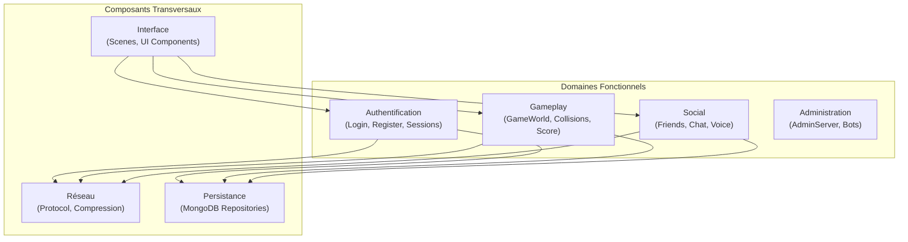
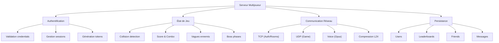
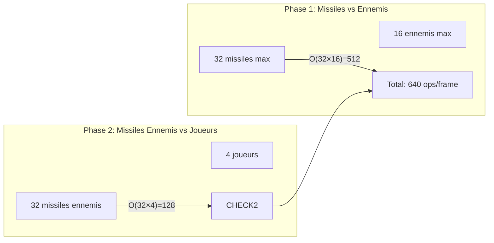
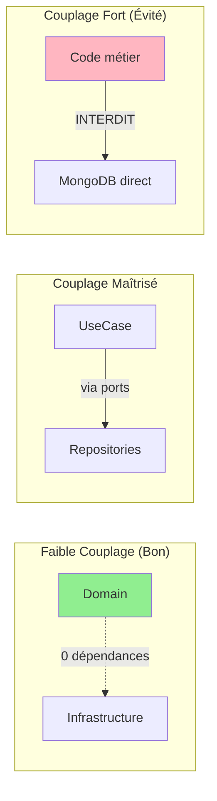

# Compétence 6 : Segmentation du Code

> **Segmenter chaque problème complexe en un ensemble de sous-problèmes afin d'obtenir des tâches atomiques dans un objectif de performance, d'adaptabilité et de maintenabilité en fonction des besoins du client.**

---

## Observable 6.1 : Organisation Rationnelle du Code

### Structure Globale du Projet

Le projet R-Type est organisé selon une structure modulaire claire, séparant les responsabilités.

```
rtype/
├── src/
│   ├── server/                    # Application serveur
│   │   ├── include/               # Headers
│   │   │   ├── domain/            # Logique métier pure
│   │   │   ├── application/       # Cas d'usage et ports
│   │   │   └── infrastructure/    # Adapters et implémentations
│   │   └── src/                   # Implémentations
│   │
│   ├── client/                    # Application cliente
│   │   ├── include/               # Headers
│   │   │   ├── scenes/            # Scènes (Game, Login, Menu)
│   │   │   ├── ui/                # Composants UI
│   │   │   ├── network/           # Clients réseau
│   │   │   ├── graphics/          # Abstraction graphique
│   │   │   ├── audio/             # Voice chat
│   │   │   ├── events/            # Système d'événements
│   │   │   └── accessibility/     # Accessibilité
│   │   ├── src/                   # Implémentations
│   │   └── lib/                   # Backends graphiques
│   │       ├── sfml/              # Plugin SFML
│   │       └── sdl2/              # Plugin SDL2
│   │
│   └── common/                    # Code partagé
│       ├── protocol/              # Définitions protocole
│       ├── compression/           # LZ4 wrapper
│       └── collision/             # AABB
│
├── assets/                        # Ressources
│   ├── sprites/                   # Images
│   ├── fonts/                     # Polices
│   ├── audio/                     # Sons
│   └── shaders/                   # GLSL
│
├── tests/                         # Tests unitaires
├── docs/                          # Documentation
├── scripts/                       # Scripts build/deploy
└── discord-bot/                   # Bots Discord
```

### Segmentation par Domaine Fonctionnel



### Organisation des Namespaces

Les namespaces reflètent la structure des répertoires :

| Namespace | Contenu | Fichiers |
|-----------|---------|----------|
| `domain::entities` | Entités métier | `User.hpp`, `Player.hpp`, `Room.hpp` |
| `domain::value_objects` | Objets de valeur | `Health.hpp`, `Position.hpp` |
| `domain::services` | Services domaine | `GameRule.hpp` |
| `application::use_cases` | Cas d'usage | `Register.hpp`, `Login.hpp` |
| `application::ports::out` | Ports sortie | `ILogger.hpp`, `IUserRepository.hpp` |
| `infrastructure::adapters` | Adapters | `TCPAuthServer.hpp`, `MongoDBUserRepository.hpp` |
| `events` | Événements client | `Event.hpp`, `Signal.hpp` |
| `graphics` | Abstraction graphique | `IWindow.hpp` |
| `ui` | Composants UI | `Button.hpp`, `TextInput.hpp` |
| `protocol` | Protocole réseau | `Protocol.hpp` |
| `collision` | Détection collision | `AABB.hpp` |
| `compression` | Compression | `Compression.hpp` |

### Exemple de Segmentation : Serveur

**Problème complexe** : Gérer un serveur de jeu multijoueur temps réel

**Segmentation en sous-problèmes** :



**Mapping vers le code** :

| Sous-problème | Fichier(s) | Responsabilité |
|---------------|------------|----------------|
| Validation credentials | `Password.cpp`, `Login.hpp` | Vérifier username/password |
| Gestion sessions | `SessionManager.hpp` | Créer/valider/expirer sessions |
| Génération tokens | `SessionManager.hpp` | CSPRNG via OpenSSL |
| Collision detection | `AABB.hpp`, `GameWorld.cpp` | Intersections AABB |
| Score & Combo | `GameWorld.cpp:1683-1772` | Calculs points, multiplicateurs |
| TCP Auth | `TCPAuthServer.hpp` | TLS, login, rooms |
| UDP Game | `UDPServer.hpp` | Inputs, snapshots 20Hz |
| MongoDB Users | `MongoDBUserRepository.hpp` | CRUD utilisateurs |

---

## Observable 6.2 : Objectifs de Performance, Adaptabilité et Maintenabilité

### Performance : Segmentation Optimisée

#### Collision Detection

**Problème** : Vérifier collisions entre N entités = O(N²) naïf

**Segmentation appliquée** :



**Implémentation** (`GameWorld.cpp:1474-1632`) :
```cpp
void GameWorld::checkCollisions() {
    // Phase 1: Player missiles vs enemies (O(M×E))
    for (auto& [missileId, missile] : _missiles) {
        collision::AABB missileBox(missile.x, missile.y, Missile::WIDTH, Missile::HEIGHT);

        for (auto& [enemyId, enemy] : _enemies) {
            collision::AABB enemyBox(enemy.x, enemy.y, Enemy::WIDTH, Enemy::HEIGHT);

            if (missileBox.intersects(enemyBox)) {  // O(1)
                // Handle collision
                break;  // Missile détruit, sortir de la boucle interne
            }
        }
    }

    // Phase 2: Enemy missiles vs players (O(EM×P))
    for (auto& [missileId, missile] : _enemyMissiles) {
        // Similar logic
    }
}
```

**Résultat** : ~640 opérations/frame à 20 fps = 12 800 ops/sec (négligeable CPU)

#### Sérialisation Protocole

**Segmentation** : Chaque structure a son propre `to_bytes()`/`from_bytes()`

```cpp
// Chaque structure est atomique
struct PlayerState {
    static constexpr size_t WIRE_SIZE = 23;
    void to_bytes(uint8_t* buf) const;
    static std::optional<PlayerState> from_bytes(const void* buf, size_t len);
};

struct MissileState {
    static constexpr size_t WIRE_SIZE = 8;
    // Same pattern
};

// Composition pour GameSnapshot
struct GameSnapshot {
    void to_bytes(uint8_t* buf) const {
        // Sérialise chaque sous-composant
        for (const auto& player : players) {
            player.to_bytes(ptr);
            ptr += PlayerState::WIRE_SIZE;
        }
    }
};
```

### Adaptabilité : Points d'Extension

#### 1. Ajout d'un Nouveau Backend Graphique

**Segmentation** : Interface `IWindow` découple le code métier du rendu

```cpp
// Ajouter Raylib = 1 nouveau fichier
class RaylibWindow : public IWindow {
    void drawSprite(...) override { /* Raylib */ }
    void drawRect(...) override { /* Raylib */ }
};
```

**Fichiers impactés** : `lib/raylib/` (nouveau) uniquement

#### 2. Ajout d'un Nouveau Type d'Arme

**Segmentation** : Pattern Strategy avec enum

```cpp
// Étape 1: Ajouter à l'enum
enum class WeaponType { Standard, Spread, Laser, Missile, WaveCannon, NewWeapon };

// Étape 2: Ajouter le case dans getDamage/getSpeed
static uint8_t getBaseDamage(WeaponType type) {
    switch (type) {
        case WeaponType::NewWeapon: return 30;  // Nouveau
        // ...
    }
}
```

**Fichiers impactés** : `Protocol.hpp` (enum), `GameWorld.hpp` (constantes)

#### 3. Ajout d'un Nouveau Repository

**Segmentation** : Pattern Repository avec interface

```cpp
// Étape 1: Créer l'interface (port)
class IAchievementRepository {
    virtual void save(const Achievement& a) = 0;
    virtual std::vector<Achievement> findByUserId(const std::string& id) = 0;
};

// Étape 2: Implémenter l'adapter
class MongoDBAchievementRepository : public IAchievementRepository {
    // Implementation
};

// Étape 3: Injecter dans les UseCases
```

**Fichiers impactés** :
- `application/ports/out/persistence/IAchievementRepository.hpp` (nouveau)
- `infrastructure/adapters/out/persistence/MongoDBAchievementRepository.hpp` (nouveau)

### Maintenabilité : Isolation des Changements

#### Tableau d'Impact des Modifications

| Type de Changement | Fichiers Impactés | Risque Régression |
|-------------------|-------------------|-------------------|
| Changer cipher TLS | `TCPAuthServer.cpp` | Faible |
| Ajouter champ User | `User.hpp`, `MongoDBUserRepository.cpp` | Moyen |
| Modifier collision | `AABB.hpp`, `GameWorld.cpp` | Faible |
| Nouveau message protocole | `Protocol.hpp`, handlers | Moyen |
| Ajouter scène | `NewScene.hpp/cpp`, `SceneManager` | Faible |
| Changer DB (MongoDB→Postgres) | `infrastructure/adapters/out/` | Faible (ports isolent) |

#### Métriques de Couplage



### Tests Unitaires : Bénéfice de la Segmentation

La segmentation permet de tester chaque composant isolément :

```cpp
// Test du Domain (aucune dépendance)
TEST(HealthTest, DamageReducesHealth) {
    Health h(100.0f);
    Health damaged = h.damage(30.0f);
    EXPECT_EQ(damaged.getValue(), 70.0f);
}

// Test du UseCase (mock des ports)
TEST(RegisterTest, SuccessfulRegistration) {
    auto mockRepo = std::make_shared<MockUserRepository>();
    auto mockIdGen = std::make_shared<MockIdGenerator>();
    auto mockLogger = std::make_shared<MockLogger>();

    Register useCase(mockRepo, mockIdGen, mockLogger);
    auto result = useCase.execute("user", "email@test.com", "password");

    EXPECT_TRUE(result.has_value());
}

// Test du Protocol (parsing)
TEST(ProtocolTest, PlayerStateSerialization) {
    PlayerState ps{.id = 1, .x = 100, .y = 200, .health = 75};

    uint8_t buffer[PlayerState::WIRE_SIZE];
    ps.to_bytes(buffer);

    auto parsed = PlayerState::from_bytes(buffer, sizeof(buffer));
    EXPECT_TRUE(parsed.has_value());
    EXPECT_EQ(parsed->id, 1);
    EXPECT_EQ(parsed->x, 100);
}
```

### Conclusion

La segmentation du code R-Type répond aux trois objectifs :

| Objectif | Réalisation |
|----------|-------------|
| **Performance** | Collisions O(M×E), sérialisation O(n) |
| **Adaptabilité** | Interfaces (IWindow, IRepository), enums extensibles |
| **Maintenabilité** | Isolation domaine/infra, namespaces clairs, tests isolés |

Cette organisation permet :
- **Développement parallèle** : Équipes peuvent travailler sur serveur/client/common séparément
- **Évolution incrémentale** : Ajouter features sans refactoring massif
- **Debugging ciblé** : Problème localisé dans un namespace/fichier spécifique
- **Documentation automatique** : Structure reflète l'architecture logique
