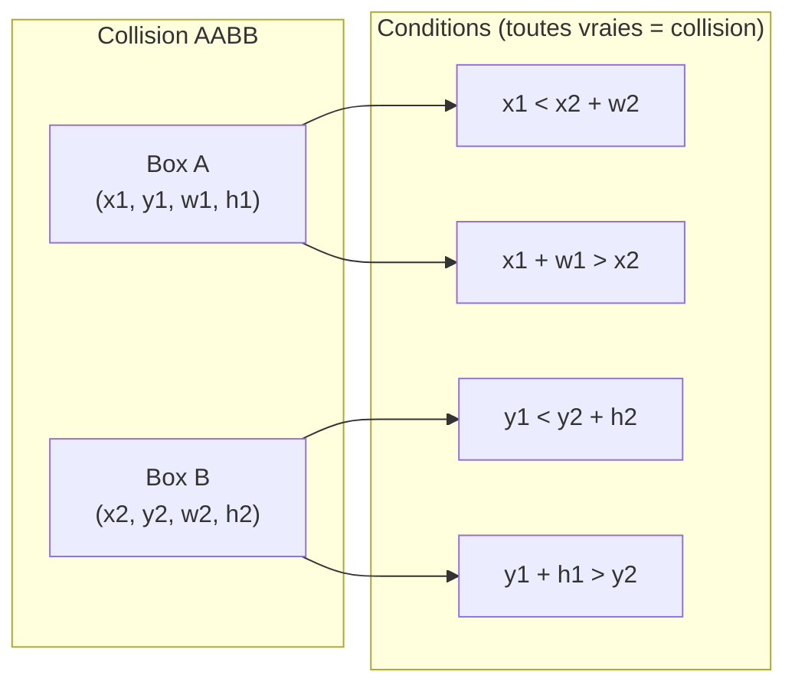
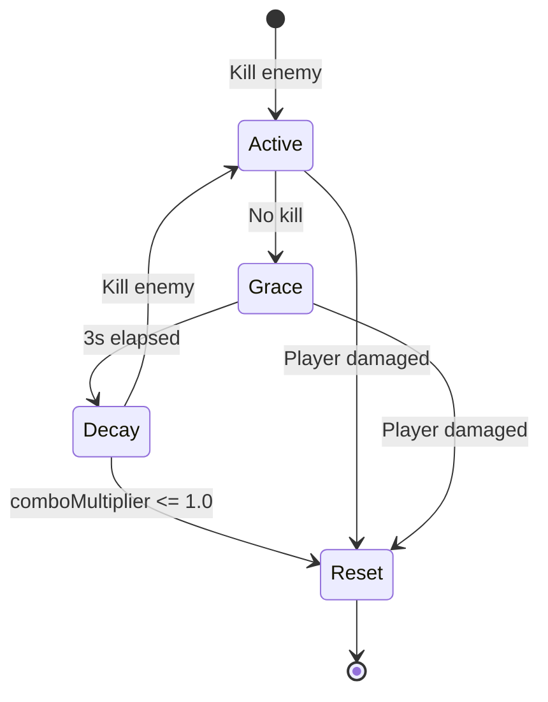
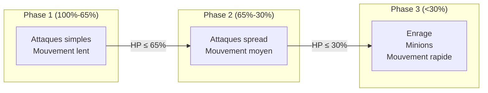

# Compétence 7 : Algorithmes

> **Identifier des solutions existantes ou originales afin de répondre à chaque problème posé en tenant compte des contraintes de performance et de scalabilité de la solution et de son environnement d'exécution.**

---

## Observable 7.1 : Algorithmes Existants Optimaux

### Collision Detection : AABB (Axis-Aligned Bounding Box)

#### Problème

Détecter les collisions entre entités (missiles, ennemis, joueurs) en temps réel à 20 Hz.

#### Solution Standard : AABB

L'algorithme AABB est un standard de l'industrie pour la détection de collision 2D, offrant une complexité O(1) par paire d'entités.

**Fichier** : `src/common/collision/AABB.hpp`

```cpp
namespace collision {

struct AABB {
    float x, y, width, height;

    constexpr AABB(float px, float py, float w, float h)
        : x(px), y(py), width(w), height(h) {}

    // O(1) - 4 comparaisons
    constexpr bool intersects(const AABB& other) const {
        return x < other.x + other.width &&      // Gauche < Droite autre
               x + width > other.x &&            // Droite > Gauche autre
               y < other.y + other.height &&     // Haut < Bas autre
               y + height > other.y;             // Bas > Haut autre
    }

    // O(1) - 4 comparaisons
    constexpr bool contains(float px, float py) const {
        return px >= x && px <= x + width &&
               py >= y && py <= y + height;
    }

    constexpr float centerX() const { return x + width / 2.0f; }
    constexpr float centerY() const { return y + height / 2.0f; }
};

}  // namespace collision
```

#### Visualisation



#### Hitboxes Définies

| Entité | Largeur | Hauteur | Fichier |
|--------|---------|---------|---------|
| Vaisseau (Ship) | 64 | 30 | `GameWorld.hpp` |
| Missile | 16 | 8 | `GameWorld.hpp` |
| Ennemi | 40 | 40 | `GameWorld.hpp` |
| Missile ennemi | 16 | 8 | `GameWorld.hpp` |
| Boss | 150 | 120 | `GameWorld.hpp` |

#### Complexité Totale

```
Par frame (20 Hz):
- Missiles joueurs vs Ennemis: O(32 × 16) = O(512)
- Missiles ennemis vs Joueurs: O(32 × 4) = O(128)
- Total: ~640 vérifications AABB par frame
- Par seconde: 640 × 20 = 12,800 ops/s (négligeable)
```

### Génération Aléatoire : Mersenne Twister

#### Problème

Générer des positions aléatoires pour les ennemis et les power-ups.

#### Solution Standard : `std::mt19937`

**Fichier** : `src/server/infrastructure/game/GameWorld.hpp`

```cpp
class GameWorld {
private:
    std::mt19937 _rng{std::random_device{}()};  // Mersenne Twister, seed aléatoire

    void spawnEnemy() {
        std::uniform_int_distribution<int> yDist(50, 1030);  // Écran 1080p
        int y = yDist(_rng);
        // ...
    }
};
```

#### Propriétés

| Propriété | Valeur |
|-----------|--------|
| Période | 2^19937 - 1 |
| Qualité statistique | Excellente (passe Diehard tests) |
| Performance | ~10ns par nombre |
| Usage | Gameplay (non cryptographique) |

### Compression : LZ4

#### Problème

Réduire la bande passante des snapshots (800-2000 bytes à 20 Hz).

#### Solution Standard : LZ4

**Fichier** : `src/common/compression/Compression.hpp`

```cpp
inline std::vector<uint8_t> compress(const uint8_t* src, size_t srcSize) {
    int maxDstSize = LZ4_compressBound(static_cast<int>(srcSize));
    std::vector<uint8_t> compressed(maxDstSize);

    int compressedSize = LZ4_compress_default(
        reinterpret_cast<const char*>(src),
        reinterpret_cast<char*>(compressed.data()),
        static_cast<int>(srcSize),
        maxDstSize
    );

    // Compression seulement si gain réel
    if (static_cast<size_t>(compressedSize) >= srcSize) {
        return {};  // Pas rentable
    }

    compressed.resize(compressedSize);
    return compressed;
}
```

#### Performances Mesurées

| Métrique | Valeur |
|----------|--------|
| Ratio compression | 40-60% |
| Vitesse compression | ~400 MB/s |
| Vitesse décompression | ~1.5 GB/s |
| Latence ajoutée | ~0.1ms |

### Hachage : SHA-256

#### Problème

Stocker les mots de passe de manière sécurisée.

#### Solution Standard : SHA-256 (OpenSSL)

**Fichier** : `src/server/domain/value_objects/user/PasswordUtils.cpp`

```cpp
std::string hashPassword(std::string password) {
    unsigned char hash[SHA256_DIGEST_LENGTH];
    SHA256(reinterpret_cast<const unsigned char*>(password.c_str()),
           password.length(), hash);

    std::stringstream ss;
    for(int i = 0; i < SHA256_DIGEST_LENGTH; i++) {
        ss << std::hex << std::setw(2) << std::setfill('0')
           << static_cast<int>(hash[i]);
    }
    return ss.str();  // 64 caractères hex
}
```

---

## Observable 7.2 : Algorithmes Originaux

Lorsque les algorithmes standards ne suffisent pas, des solutions originales ont été développées.

### Système de Combo avec Grace Period

#### Problème

Un système de combo classique (reset immédiat) est frustrant. Comment encourager le skill tout en restant accessible ?

#### Solution Originale



**Fichier** : `src/server/infrastructure/game/GameWorld.cpp:1754-1772`

```cpp
static constexpr float COMBO_GRACE_TIME = 3.0f;   // Période sans pénalité
static constexpr float COMBO_DECAY_RATE = 0.5f;  // -0.5x par seconde après
static constexpr float COMBO_INCREMENT = 0.1f;   // +0.1x par kill
static constexpr float COMBO_MAX = 3.0f;         // Maximum 3.0x

void GameWorld::updateComboTimers(float deltaTime) {
    for (auto& [playerId, score] : _playerScores) {
        score.comboTimer += deltaTime;

        // Decay progressif APRÈS grace period
        if (score.comboTimer > COMBO_GRACE_TIME &&
            score.comboMultiplier > 1.0f) {

            float decay = COMBO_DECAY_RATE * deltaTime;
            score.comboMultiplier = std::max(1.0f, score.comboMultiplier - decay);
        }
    }
}

void GameWorld::awardKillScore(uint8_t playerId, EnemyType enemyType, WeaponType weapon) {
    auto& score = _playerScores[playerId];

    // Formula: basePoints × comboMultiplier
    uint16_t basePoints = getEnemyPointValue(enemyType);
    uint32_t points = static_cast<uint32_t>(basePoints * score.comboMultiplier);

    score.score += points;
    score.kills++;

    // Augmente combo (cap à 3.0x)
    score.comboMultiplier = std::min(COMBO_MAX, score.comboMultiplier + COMBO_INCREMENT);
    score.comboTimer = 0.0f;  // Reset timer
}

void GameWorld::onPlayerDamaged(uint8_t playerId) {
    auto& score = _playerScores[playerId];
    score.comboMultiplier = 1.0f;  // Reset immédiat sur dégâts
}
```

#### Exemple de Flux

| Action | Temps | Combo | Timer |
|--------|-------|-------|-------|
| Kill Basic | 0.0s | 1.1x | 0.0s |
| Kill Tracker | 0.5s | 1.2x | 0.0s |
| Attente | 3.0s | 1.2x | 3.0s |
| Attente | 4.0s | 0.7x | 4.0s (decay) |
| Kill Fast | 4.2s | 0.8x | 0.0s |
| Player hit | 5.0s | 1.0x | reset |

### Mouvement des Ennemis : Patterns Algorithmiques

#### Problème

Les ennemis doivent avoir des comportements variés et prévisibles pour le gameplay.

#### Solutions Originales

**Fichier** : `src/server/infrastructure/game/GameWorld.hpp:259-323`

```cpp
enum class EnemyType : uint8_t {
    Basic,      // Ligne droite
    Tracker,    // Poursuite joueur
    Zigzag,     // Oscillation verticale
    Fast,       // Haute vitesse + sine
    Bomber,     // Lent + tirs
    POWArmor    // Moyenne + lâche power-up
};

void GameWorld::updateEnemyPosition(Enemy& enemy, float dt) {
    switch (enemy.type) {
        case EnemyType::Basic:
            enemy.x += SPEED_X_BASIC * dt;  // -120 px/s
            break;

        case EnemyType::Tracker: {
            // Poursuite du joueur le plus proche
            auto target = findNearestPlayer(enemy.x, enemy.y);
            if (target) {
                float dy = target->y - enemy.y;
                enemy.y += std::copysign(TRACKING_SPEED, dy) * dt;
            }
            enemy.x += SPEED_X_TRACKER * dt;  // -100 px/s
            break;
        }

        case EnemyType::Zigzag:
            enemy.x += SPEED_X_ZIGZAG * dt;  // -140 px/s
            enemy.zigzagTimer += dt;
            if (enemy.zigzagTimer > ZIGZAG_INTERVAL) {
                enemy.zigzagTimer = 0;
                enemy.zigzagDirection *= -1;  // Inverse direction Y
            }
            enemy.y += ZIGZAG_SPEED * enemy.zigzagDirection * dt;
            break;

        case EnemyType::Fast:
            enemy.x += SPEED_X_FAST * dt;  // -220 px/s
            enemy.y += std::sin(enemy.x * 0.02f) * SINE_AMPLITUDE;  // Onde sinusoïdale
            break;

        // ... autres types
    }
}
```

#### Visualisation des Patterns

```
Basic:      ────────────────────────────────►

Tracker:    ────────┐
                    └──────────────────────►
            (suit le joueur en Y)

Zigzag:     ────╱────╲────╱────╲────╱────╲──►

Fast:       ∿∿∿∿∿∿∿∿∿∿∿∿∿∿∿∿∿∿∿∿∿∿∿∿∿∿∿∿∿∿►
            (sine wave rapide)
```

### Boss Phase Transitions

#### Problème

Le boss doit changer de comportement selon ses points de vie.

#### Solution Originale

**Fichier** : `src/server/infrastructure/game/GameWorld.cpp`

```cpp
static constexpr float BOSS_PHASE2_THRESHOLD = 0.65f;  // 65% HP
static constexpr float BOSS_PHASE3_THRESHOLD = 0.30f;  // 30% HP

void GameWorld::updateBossPhase() {
    if (!_boss) return;

    float hpRatio = static_cast<float>(_boss->health) /
                    static_cast<float>(_boss->maxHealth);

    if (hpRatio <= BOSS_PHASE3_THRESHOLD && _boss->phase != BossPhase::Phase3) {
        _boss->phase = BossPhase::Phase3;  // Enrage
        _boss->attackSpeed *= 1.5f;
        _boss->spawnMinions = true;
    }
    else if (hpRatio <= BOSS_PHASE2_THRESHOLD && _boss->phase != BossPhase::Phase2) {
        _boss->phase = BossPhase::Phase2;  // Attaques multiples
        _boss->attackPattern = AttackPattern::Spread;
    }
}
```

#### Diagramme de Phases



### Homing Missiles

#### Problème

Les missiles guidés doivent suivre leur cible sans être parfaits (sinon impossible à éviter).

#### Solution Originale

```cpp
static constexpr float HOMING_TURN_RATE = 2.0f;  // rad/s max

void GameWorld::updateHomingMissile(Missile& missile, float dt) {
    auto target = findNearestEnemy(missile.x, missile.y);
    if (!target) {
        // Continue tout droit si pas de cible
        return;
    }

    // Calcul angle vers cible
    float dx = target->x - missile.x;
    float dy = target->y - missile.y;
    float targetAngle = std::atan2(dy, dx);

    // Rotation limitée (2 rad/s max)
    float angleDiff = targetAngle - missile.angle;

    // Normaliser entre -PI et PI
    while (angleDiff > M_PI) angleDiff -= 2 * M_PI;
    while (angleDiff < -M_PI) angleDiff += 2 * M_PI;

    // Appliquer rotation limitée
    float maxTurn = HOMING_TURN_RATE * dt;
    missile.angle += std::clamp(angleDiff, -maxTurn, maxTurn);

    // Mouvement dans la direction
    missile.x += std::cos(missile.angle) * missile.speed * dt;
    missile.y += std::sin(missile.angle) * missile.speed * dt;
}
```

### Récapitulatif des Algorithmes

| Algorithme | Type | Complexité | Usage |
|------------|------|------------|-------|
| AABB Intersection | Standard | O(1) | Collision detection |
| Mersenne Twister | Standard | O(1) | Spawn positions |
| LZ4 | Standard | O(n) | Network compression |
| SHA-256 | Standard | O(n) | Password hashing |
| Combo Decay | **Original** | O(players) | Score system |
| Enemy Patterns | **Original** | O(1) each | AI movement |
| Boss Phases | **Original** | O(1) | Boss behavior |
| Homing Turn | **Original** | O(1) | Guided missiles |

### Conclusion

Le projet R-Type combine :
- **Algorithmes standards optimaux** : AABB, LZ4, SHA-256, Mersenne Twister
- **Algorithmes originaux** : Combo avec grace period, patterns ennemis, phases boss, homing limité

Cette approche garantit **performance** (algorithmes prouvés) et **gameplay unique** (mécaniques originales).
