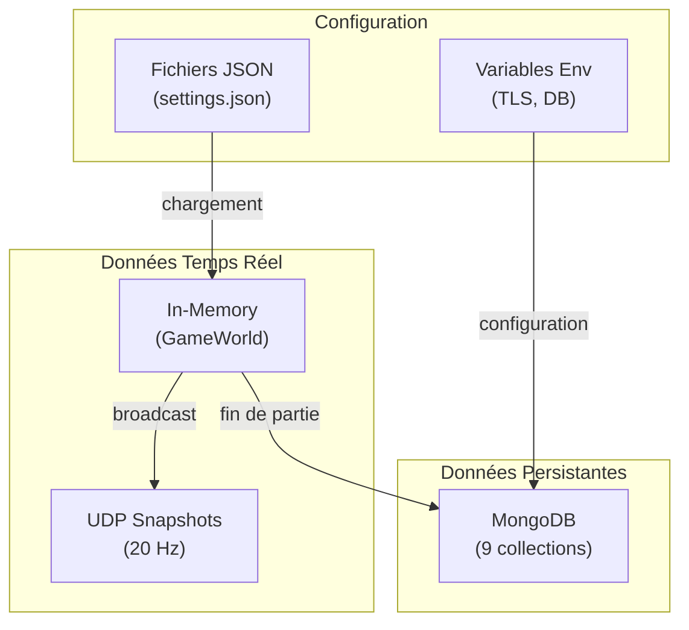
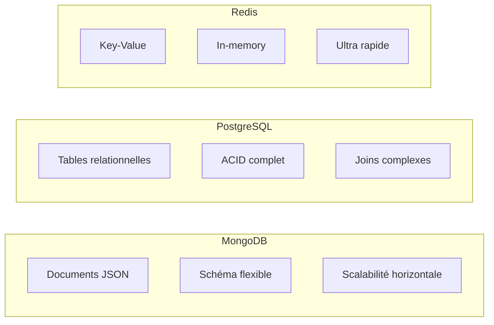
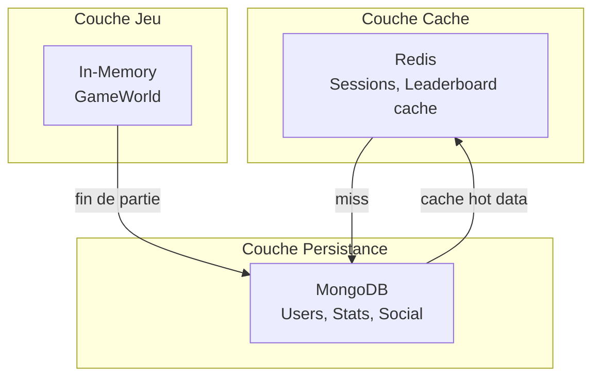

# Compétence 8 : Persistance des Données

> **Sélectionner les solutions de persistance de données (fichier texte ou binaire, format de fichier structuré, base de données...) en s'appuyant sur son expertise et celle de l'équipe projet et en mobilisant l'état de l'art afin de s'adapter aux contraintes techniques, fonctionnelles et de sécurité de l'application en terme de stockage de données.**

---

## Observable 8.1 : Choix Techniques de Persistance

### Architecture de Persistance Multi-Couches

R-Type utilise une architecture de persistance hybride adaptée aux différentes contraintes :



### Solution 1 : MongoDB (NoSQL Document Store)

#### Justification du Choix

| Critère | MongoDB | SQL (PostgreSQL) | Verdict |
|---------|---------|-----------------|---------|
| **Schéma** | Flexible | Rigide | MongoDB (évolution rapide) |
| **Scalabilité** | Horizontale native | Verticale principalement | MongoDB |
| **Joins** | Non nécessaires | Complexes | MongoDB (données dénormalisées) |
| **Performances lecture** | Excellent pour documents | Bon avec indexes | MongoDB |
| **Transactions** | Support limité | ACID complet | SQL légèrement meilleur |
| **Setup** | Simple | Plus complexe | MongoDB |

#### Collections MongoDB (9 au total)

| Collection | Contenu | Taille Estimée |
|------------|---------|----------------|
| `user` | Comptes utilisateurs | ~1 KB/user |
| `leaderboard` | Classements (All/Weekly/Monthly) | ~100 B/entry |
| `player_stats` | Statistiques cumulatives | ~500 B/player |
| `achievements` | Succès débloqués | ~50 B/achievement |
| `friendships` | Relations d'amitié | ~50 B/relation |
| `friend_requests` | Demandes en attente | ~100 B/request |
| `private_messages` | Messages privés | ~200 B/message |
| `blocked_users` | Utilisateurs bloqués | ~50 B/block |
| `user_settings` | Paramètres utilisateur | ~100 B/user |

#### Implémentation Repository Pattern

**Port (Interface)** : `src/server/include/application/ports/out/persistence/IUserRepository.hpp`
```cpp
class IUserRepository {
public:
    virtual void save(const domain::entities::User& user) const = 0;
    virtual void update(const domain::entities::User& user) = 0;
    virtual std::optional<domain::entities::User> findById(const std::string& id) = 0;
    virtual std::optional<domain::entities::User> findByEmail(const std::string& email) = 0;
    virtual std::vector<domain::entities::User> findAll() = 0;
};
```

**Adapter MongoDB** : `src/server/infrastructure/adapters/out/persistence/MongoDBUserRepository.hpp`
```cpp
class MongoDBUserRepository : public IUserRepository {
private:
    std::shared_ptr<MongoDBConfiguration> _mongoDB;

    mongocxx::collection getCollection() {
        auto client = _mongoDB->acquireClient();
        return client->database(_mongoDB->getDbName())["user"];
    }

public:
    void save(const domain::entities::User& user) const override {
        auto collection = getCollection();
        bsoncxx::builder::basic::document doc;
        doc.append(kvp("username", user.getUsername()));
        doc.append(kvp("email", user.getEmail()));
        doc.append(kvp("password", user.getPassword()));  // Hashed
        collection.insert_one(doc.view());
    }

    std::optional<domain::entities::User> findByEmail(const std::string& email) override {
        auto collection = getCollection();
        auto result = collection.find_one(make_document(kvp("email", email)));
        if (!result) return std::nullopt;
        // Désérialisation BSON -> User
    }
};
```

### Solution 2 : Stockage In-Memory (GameWorld)

#### Contraintes Temps Réel

| Contrainte | Valeur | Impact |
|------------|--------|--------|
| Refresh rate | 20 Hz | 50ms par frame |
| Joueurs max | 4 | Faible mémoire |
| Missiles max | 32 | Structures fixes |
| Ennemis max | 16 | Structures fixes |

#### Structures Utilisées

**Fichier** : `src/server/include/infrastructure/game/GameWorld.hpp`
```cpp
class GameWorld {
private:
    // O(1) access par ID
    std::unordered_map<uint8_t, ConnectedPlayer> _players;
    std::unordered_map<uint16_t, Missile> _missiles;
    std::unordered_map<uint16_t, Enemy> _enemies;
    std::unordered_map<uint8_t, PlayerScore> _playerScores;

    // Boss optionnel
    std::optional<Boss> _boss;

    // Events par frame (vidés après broadcast)
    std::vector<uint16_t> _destroyedMissiles;
    std::vector<uint16_t> _destroyedEnemies;
};
```

### Solution 3 : Configuration Fichiers

#### settings.json (Client)

```json
{
  "keyBindings": {
    "moveUp": "Z",
    "moveDown": "S",
    "shoot": "Space"
  },
  "colorBlindMode": "None",
  "gameSpeedMultiplier": 1.0,
  "shipSkin": 1
}
```

**Chargement** (`AccessibilityConfig.hpp`) :
```cpp
bool loadFromFile(const std::string& filepath);
bool saveToFile(const std::string& filepath) const;
```

### Sécurité des Données

| Donnée | Protection |
|--------|------------|
| Mots de passe | SHA-256 hash (jamais en clair) |
| Session tokens | CSPRNG 256-bit |
| Communication | TLS 1.2+ |
| Credentials DB | Variables d'environnement |

---

## Observable 8.2 : Comparatif des Solutions de Persistance

### Analyse des Alternatives Considérées

#### MongoDB vs PostgreSQL vs Redis



#### Tableau Comparatif Détaillé

| Critère | MongoDB | PostgreSQL | Redis |
|---------|---------|------------|-------|
| **Type** | Document NoSQL | Relationnel SQL | Key-Value In-Memory |
| **Schéma** | Flexible | Strict | Aucun |
| **Requêtes** | JSON queries | SQL complet | Commands simples |
| **Scalabilité** | Sharding natif | Réplication | Cluster |
| **Latence** | 1-10ms | 1-10ms | <1ms |
| **Persistance** | Oui (disque) | Oui (disque) | Optionnel (AOF/RDB) |
| **Transactions** | Limitées | ACID complet | Atomiques simples |
| **Coût opérationnel** | Moyen | Moyen | Élevé (RAM) |

### Justification : Pourquoi MongoDB ?

#### 1. Données Utilisateurs et Statistiques

**Besoin** : Stocker profils, stats, achievements avec évolution fréquente du schéma.

**MongoDB avantage** : Schéma flexible, ajout de champs sans migration.

```javascript
// Avant
{ "username": "player1", "score": 1000 }

// Après (ajout achievements)
{ "username": "player1", "score": 1000, "achievements": [1, 3, 5] }
// Pas de migration nécessaire
```

#### 2. Leaderboards

**Besoin** : Classements par période (All-time, Weekly, Monthly).

**MongoDB avantage** : Index composites efficaces.

```javascript
// Index pour requêtes leaderboard
db.leaderboard.createIndex({ "period": 1, "score": -1 })

// Query efficace O(log N + k)
db.leaderboard.find({ "period": "weekly" }).sort({ "score": -1 }).limit(100)
```

#### 3. Système Social (Friends, Messages)

**Besoin** : Relations N:N, messages par conversation.

**MongoDB avantage** : Documents imbriqués, pas de joins coûteux.

```javascript
// Conversation optimisée
{
  "participants": ["alice@mail.com", "bob@mail.com"],
  "lastMessage": "Hello!",
  "lastTimestamp": ISODate("2025-01-20T10:00:00Z"),
  "messages": [
    { "sender": "alice@mail.com", "text": "Hi!", "timestamp": ... },
    { "sender": "bob@mail.com", "text": "Hello!", "timestamp": ... }
  ]
}
```

### Pourquoi PAS Redis Seul ?

| Limitation | Impact R-Type |
|------------|---------------|
| Tout en RAM | Coût prohibitif pour historique |
| Pas de requêtes complexes | Leaderboards difficiles |
| Persistance optionnelle | Risque de perte |

### Pourquoi PAS PostgreSQL ?

| Limitation | Impact R-Type |
|------------|---------------|
| Schéma rigide | Migrations fréquentes |
| Joins pour social | Performance dégradée |
| Setup plus complexe | Temps de développement |

### Architecture Hybride Recommandée (Production)



**R-Type actuel** : MongoDB seul (suffisant pour la charge étudiante).

**Production recommandée** : MongoDB + Redis cache pour performances optimales.

### Métriques de Performance MongoDB

| Opération | Latence Moyenne | Index |
|-----------|-----------------|-------|
| `findByEmail` | < 1ms | Unique sur email |
| `getLeaderboard(100)` | 2-5ms | Composite (period, score) |
| `saveScore` | 1-2ms | N/A (insert) |
| `getFriends(50)` | 2-3ms | Sur email |

### Conclusion

Le choix de **MongoDB** comme solution de persistance principale est justifié par :

1. **Flexibilité schéma** : Évolution rapide des features (achievements, social)
2. **Performance lectures** : Leaderboards sans joins
3. **Simplicité opérationnelle** : Déploiement et maintenance faciles
4. **Adéquation au modèle** : Documents JSON correspondent aux structures C++

Pour une mise en production à grande échelle, l'ajout d'un **cache Redis** améliorerait les performances des données chaudes (sessions, leaderboards temps réel).
