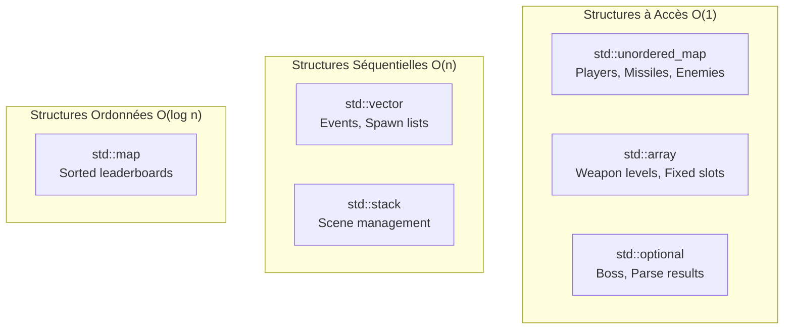

# Compétence 9 : Structures de Données

> **Sélectionner les structures de données répondant aux contraintes de l'application en tenant compte de leur complexité algorithmique et spatiale (tableaux, listes, sets, tables de hashage...) dans un objectif de performance, de maintenabilité et d'évolutivité de l'application.**

---

## Observable 9.1 : Structures de Données Implémentées

### Vue d'Ensemble des Structures Utilisées



### Structure 1 : `std::unordered_map` - État du Jeu

#### Usage dans GameWorld

**Fichier** : `src/server/include/infrastructure/game/GameWorld.hpp`

```cpp
class GameWorld {
private:
    // Joueurs indexés par ID (0-3)
    std::unordered_map<uint8_t, ConnectedPlayer> _players;

    // Missiles indexés par ID unique
    std::unordered_map<uint16_t, Missile> _missiles;

    // Ennemis indexés par ID unique
    std::unordered_map<uint16_t, Enemy> _enemies;

    // Missiles ennemis
    std::unordered_map<uint16_t, Missile> _enemyMissiles;

    // Scores par joueur
    std::unordered_map<uint8_t, PlayerScore> _playerScores;
};
```

#### Complexité

| Opération | Complexité | Usage |
|-----------|------------|-------|
| `operator[]` | O(1) moyen | Accès par ID |
| `find()` | O(1) moyen | Vérification existence |
| `insert()` | O(1) moyen | Ajout entité |
| `erase()` | O(1) moyen | Suppression entité |
| `begin()/end()` | O(1) | Itération |

#### Exemple d'Utilisation

```cpp
void GameWorld::updatePlayerPosition(uint8_t playerId, uint16_t x, uint16_t y) {
    auto it = _players.find(playerId);  // O(1)
    if (it != _players.end()) {
        it->second.x = x;
        it->second.y = y;
    }
}

Missile* GameWorld::getMissile(uint16_t missileId) {
    auto it = _missiles.find(missileId);  // O(1)
    return (it != _missiles.end()) ? &it->second : nullptr;
}
```

### Structure 2 : `std::vector` - Collections Dynamiques

#### Usage pour Événements

```cpp
class GameWorld {
private:
    // Événements par frame (vidés après broadcast)
    std::vector<uint16_t> _destroyedMissiles;
    std::vector<uint16_t> _destroyedEnemies;
    std::vector<std::pair<uint8_t, uint8_t>> _playerDamageEvents;
    std::vector<uint8_t> _deadPlayers;

    // Liste de spawn pour la vague courante
    std::vector<SpawnEntry> _waveSpawnList;
};
```

#### Complexité

| Opération | Complexité | Usage |
|-----------|------------|-------|
| `push_back()` | O(1) amorti | Ajout événement |
| `clear()` | O(n) | Reset par frame |
| `operator[]` | O(1) | Accès indexé |
| `begin()/end()` | O(1) | Itération |
| `size()` | O(1) | Comptage |

#### Avantage : Cache Locality

```cpp
void GameWorld::broadcastDestroyedMissiles() {
    // Itération séquentielle = excellent cache
    for (uint16_t id : _destroyedMissiles) {
        // Broadcast message
    }
    _destroyedMissiles.clear();  // O(1) car trivially destructible
}
```

### Structure 3 : `std::optional` - Valeurs Nullables

#### Usage pour Boss et Parsing

```cpp
// Boss optionnel (0 ou 1)
std::optional<Boss> _boss;

// Utilisation
if (_boss.has_value()) {  // O(1)
    updateBossPhase(*_boss);
}

// Parsing sécurisé
static std::optional<PlayerState> from_bytes(const void* buf, size_t len) {
    if (len < WIRE_SIZE) return std::nullopt;  // Erreur explicite
    // ... parsing
    return playerState;
}
```

#### Avantages vs Pointeurs

| Aspect | `std::optional<T>` | `T*` |
|--------|-------------------|------|
| Sémantique | Valeur optionnelle claire | Ambigu (nullable? ownership?) |
| Sécurité | Accès vérifié via `.value()` | Déréférencement null possible |
| Mémoire | Inline (pas d'allocation) | Peut pointer vers heap |
| Copie | Copie la valeur | Copie le pointeur |

### Structure 4 : `std::array` - Tailles Fixes

#### Usage pour Armes et Slots

```cpp
// Niveaux d'armes (4 types)
std::array<uint8_t, MAX_SELECTABLE_WEAPONS> _weaponLevels;

// Utilisation
uint8_t level = _weaponLevels[static_cast<size_t>(weaponType)];  // O(1)
```

#### Avantages vs Vector

| Aspect | `std::array<T, N>` | `std::vector<T>` |
|--------|-------------------|------------------|
| Taille | Fixe (compile-time) | Dynamique |
| Mémoire | Stack (inline) | Heap |
| Bounds check | `at()` optionnel | `at()` optionnel |
| Cache | Excellent | Bon |

### Structure 5 : `std::stack` - Navigation Scènes

#### Usage dans SceneManager

**Fichier** : `src/client/include/scenes/SceneManager.hpp`

```cpp
class SceneManager {
private:
    std::stack<std::unique_ptr<IScene>> _sceneStack;

public:
    void pushScene(std::unique_ptr<IScene> scene) {
        _sceneStack.push(std::move(scene));  // O(1)
    }

    void popScene() {
        if (!_sceneStack.empty()) {
            _sceneStack.pop();  // O(1)
        }
    }

    IScene* currentScene() {
        return _sceneStack.empty() ? nullptr : _sceneStack.top().get();  // O(1)
    }
};
```

#### Sémantique LIFO

```
pushScene(GameScene)     -> [GameScene]
pushScene(PauseOverlay)  -> [GameScene, PauseOverlay]
popScene()               -> [GameScene]
changeScene(MenuScene)   -> [MenuScene]
```

### Structure 6 : `std::variant` - Événements Typés

#### Usage pour Système d'Événements

**Fichier** : `src/client/include/events/Event.hpp`

```cpp
namespace events {
    struct KeyPressed { Key key; };
    struct KeyReleased { Key key; };
    struct MouseMoved { int x, y; };
    struct MouseButtonPressed { MouseButton button; int x, y; };
    struct WindowClosed {};
    struct None {};

    using Event = std::variant<None, KeyPressed, KeyReleased, MouseMoved,
                               MouseButtonPressed, MouseButtonReleased,
                               TextEntered, WindowClosed>;
}
```

#### Utilisation avec `std::get_if`

```cpp
void Button::handleEvent(const events::Event& event) {
    if (auto* pressed = std::get_if<events::MouseButtonPressed>(&event)) {
        if (contains(pressed->x, pressed->y)) {
            _onClick();
        }
    }
}
```

---

## Observable 9.2 : Justification des Choix

### Tableau Récapitulatif des Structures

| Structure | Usage | Complexité Accès | Complexité Insertion | Mémoire | Justification |
|-----------|-------|------------------|---------------------|---------|---------------|
| `unordered_map` | Players, Missiles | O(1) | O(1) | Overhead hash | Lookups fréquents par ID |
| `vector` | Events, Spawns | O(1) | O(1) amorti | Contiguë | Itération séquentielle |
| `optional` | Boss, Parse | O(1) | N/A | Inline | Valeur nullable explicite |
| `array` | Weapon levels | O(1) | N/A | Inline | Taille fixe connue |
| `stack` | Scenes | O(1) | O(1) | Adapter | Sémantique LIFO |
| `variant` | Events | O(1) | N/A | Inline | Type-safe union |

### Critère 1 : Performance

#### Collisions - O(M × E) avec O(1) par lookup

```cpp
void GameWorld::checkCollisions() {
    for (auto& [missileId, missile] : _missiles) {      // O(M)
        for (auto& [enemyId, enemy] : _enemies) {       // O(E)
            // AABB intersection O(1)
        }
    }
}
// Total: O(32 × 16) = O(512) par frame
```

**Justification** : `unordered_map` permet des suppressions O(1) lors des collisions.

#### Snapshot Generation - O(P + M + E)

```cpp
GameSnapshot GameWorld::getSnapshot() const {
    GameSnapshot snap;
    for (const auto& [id, player] : _players) {     // O(4)
        snap.players.push_back(player.toState());
    }
    for (const auto& [id, missile] : _missiles) {   // O(32)
        snap.missiles.push_back(missile.toState());
    }
    // ...
    return snap;
}
```

### Critère 2 : Maintenabilité

#### `std::optional` vs Raw Pointers

```cpp
// AVANT (pointer)
Boss* _boss = nullptr;
if (_boss != nullptr) { /* ... */ }  // Facile à oublier

// APRÈS (optional)
std::optional<Boss> _boss;
if (_boss.has_value()) { /* ... */ }  // Intention claire
```

#### `std::variant` vs enum + union

```cpp
// AVANT (C-style)
struct Event {
    enum Type { KEY_PRESSED, MOUSE_MOVED, ... } type;
    union {
        struct { int key; } keyPressed;
        struct { int x, y; } mouseMoved;
    } data;
};

// APRÈS (type-safe)
using Event = std::variant<KeyPressed, MouseMoved, ...>;
// Impossible d'accéder au mauvais membre
```

### Critère 3 : Évolutivité

#### Ajout d'un Nouveau Type d'Ennemi

```cpp
// 1. Ajouter à l'enum (Protocol.hpp)
enum class EnemyType : uint8_t {
    Basic, Tracker, Zigzag, Fast, Bomber, POWArmor,
    NewEnemy  // Ajout
};

// 2. Ajouter comportement (GameWorld.cpp)
case EnemyType::NewEnemy:
    // Nouveau pattern de mouvement
    break;

// Structures existantes inchangées (unordered_map<uint16_t, Enemy>)
```

#### Ajout d'un Nouvel Événement

```cpp
// 1. Définir la structure
struct ControllerConnected { int controllerId; };

// 2. Ajouter au variant
using Event = std::variant<..., ControllerConnected>;

// 3. Handler (pattern matching)
if (auto* controller = std::get_if<ControllerConnected>(&event)) {
    // ...
}
```

### Métriques Mémoire

| Structure | Taille Instance | Instances Max | Total Max |
|-----------|-----------------|---------------|-----------|
| `ConnectedPlayer` | ~100 B | 4 | 400 B |
| `Missile` | ~32 B | 32 | 1 KB |
| `Enemy` | ~40 B | 16 | 640 B |
| `PlayerScore` | ~50 B | 4 | 200 B |
| `Boss` | ~120 B | 1 | 120 B |
| **GameWorld total** | | | **~3 KB** |

### Conclusion

Les structures de données de R-Type sont sélectionnées selon :

1. **Performance** : `unordered_map` pour O(1) lookups, `vector` pour cache locality
2. **Maintenabilité** : `optional` pour nullabilité explicite, `variant` pour type-safety
3. **Évolutivité** : Structures génériques (`unordered_map<ID, T>`) adaptables

Cette sélection garantit des performances optimales (20 Hz gameplay) tout en maintenant un code clair et extensible.
