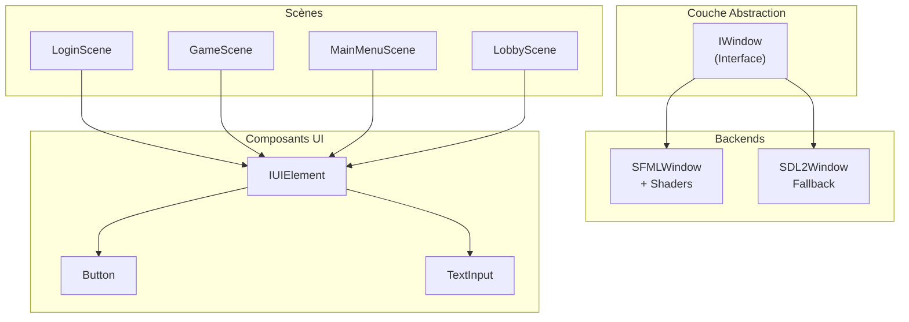
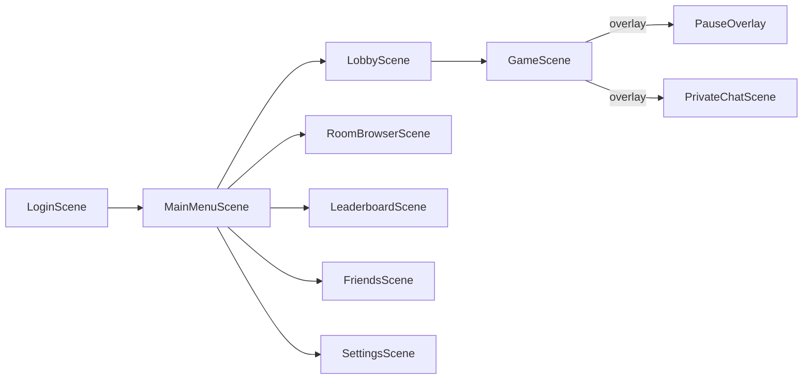
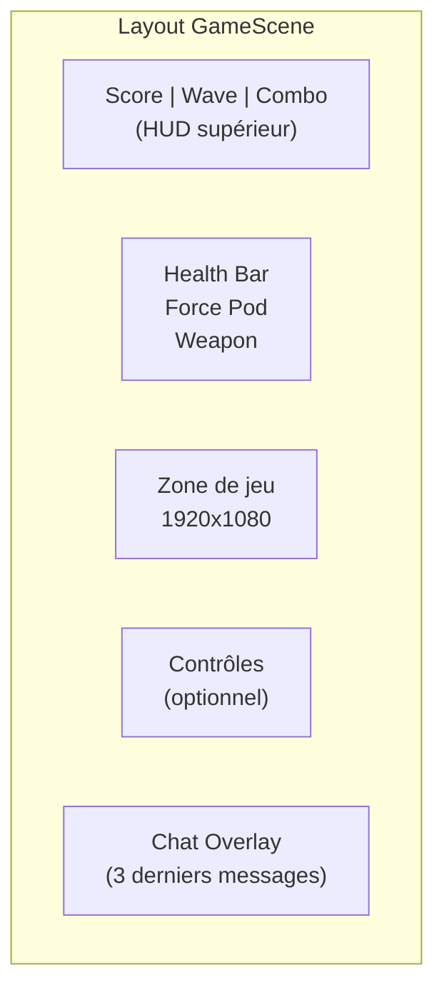

# Compétence 10 : Interfaces Utilisateur

> **Concevoir les interfaces (GUI, TUI, CLI, ...) afin de garantir une bonne expérience utilisateur dans le respect des conventions d'UI et d'UX spécifiques aux modalités d'interactions concernées, en optimisant les vues et en respectant les critères reconnus d'accessibilité.**

---

## Observable 10.1 : Interfaces Graphiques et Textuelles

### Architecture des Interfaces

R-Type implémente un système d'interfaces graphiques modulaire avec abstraction multi-backend.



### Système de Scènes

#### Navigation Stack-Based

**Fichier** : `src/client/include/scenes/SceneManager.hpp`

```cpp
class SceneManager {
public:
    void changeScene(std::unique_ptr<IScene> newScene);  // Remplace
    void pushScene(std::unique_ptr<IScene> scene);       // Overlay
    void popScene();                                     // Ferme overlay

    void handleEvent(const events::Event& event);
    void update(float deltatime);
    void render();

private:
    std::stack<std::unique_ptr<IScene>> _sceneStack;
};
```

#### Flux de Navigation



### Scènes Principales

#### LoginScene - Authentification

| Élément | Type | Fonction |
|---------|------|----------|
| Username input | `TextInput` | Saisie identifiant |
| Password input | `TextInput (masked)` | Saisie mot de passe |
| Login button | `Button` | Connexion |
| Register button | `Button` | Inscription |
| Server config | `TextInput` | Adresse serveur |

#### GameScene - Interface de Jeu



**Éléments HUD** (`src/client/include/scenes/GameScene.hpp:47-73`) :
```cpp
void renderHUD();                // Score, santé, arme
void renderScoreHUD();           // Score + combo + wave
void renderTeamScoreboard();     // Scores équipe
void renderWeaponHUD();          // Arme courante
void renderChargeGauge();        // Jauge Wave Cannon
void renderSpeedIndicator();     // Niveau vitesse
void renderControlsHUD();        // Aide contrôles (H)
void renderChatOverlay();        // Messages chat
void renderVoiceIndicator();     // Push-to-talk actif
```

#### LobbyScene - Salle d'Attente

| Zone | Contenu |
|------|---------|
| Slots joueurs | 4 emplacements avec état Ready/Not Ready |
| Chat | Zone de messages texte |
| Ship skins | Sélection d'apparence |
| Game speed | Slider vitesse (host only) |
| Start button | Lancement partie (host, tous ready) |

### Composants UI Réutilisables

#### IUIElement (Interface)

**Fichier** : `src/client/include/ui/IUIElement.hpp`

```cpp
class IUIElement {
public:
    virtual Vec2f getPos() const = 0;
    virtual void setPos(const Vec2f& pos) = 0;
    virtual Vec2f getSize() const = 0;

    virtual bool contains(float x, float y) const {
        Vec2f pos = getPos(), size = getSize();
        return x >= pos.x && x <= pos.x + size.x &&
               y >= pos.y && y <= pos.y + size.y;
    }

    virtual void handleEvent(const events::Event& event) = 0;
    virtual void update(float deltaTime) = 0;
    virtual void render(graphics::IWindow& window) = 0;

    virtual bool isFocused() const = 0;
    virtual void setFocused(bool focused) = 0;

protected:
    bool _visible = true;
    bool _enabled = true;
};
```

#### Button - États Visuels

**Fichier** : `src/client/include/ui/Button.hpp`

```cpp
class Button : public IUIElement {
public:
    enum class State { Normal, Hovered, Pressed, Disabled };

    void handleEvent(const events::Event& event) override {
        if (auto* moved = std::get_if<events::MouseMoved>(&event)) {
            bool hover = contains(moved->x, moved->y);
            _state = hover ? State::Hovered : State::Normal;
        }
        if (auto* pressed = std::get_if<events::MouseButtonPressed>(&event)) {
            if (contains(pressed->x, pressed->y)) {
                _state = State::Pressed;
                if (_onClick) _onClick();
            }
        }
    }

private:
    rgba _normalColor{60, 60, 80, 255};
    rgba _hoveredColor{80, 80, 110, 255};
    rgba _pressedColor{40, 40, 60, 255};
};
```

#### TextInput - Saisie Texte

**Fichier** : `src/client/include/ui/TextInput.hpp`

```cpp
class TextInput : public IUIElement {
public:
    TextInput(const Vec2f& pos, const Vec2f& size,
              const std::string& placeholder, const std::string& fontKey,
              bool isPassword = false);

    void handleEvent(const events::Event& event) override {
        if (auto* text = std::get_if<events::TextEntered>(&event)) {
            if (_focused && _text.size() < _maxLength) {
                if (text->unicode >= 32 && text->unicode < 127) {
                    _text.insert(_cursorPos, 1, static_cast<char>(text->unicode));
                    _cursorPos++;
                }
            }
        }
    }

private:
    std::string _text;
    std::string _placeholder;
    size_t _cursorPos = 0;
    float _cursorBlinkTimer = 0.0f;
    bool _isPassword;
    static constexpr float CURSOR_BLINK_RATE = 0.5f;
};
```

### Système d'Événements

**Fichier** : `src/client/include/events/Event.hpp`

```cpp
namespace events {
    enum class Key { A, B, ..., Z, Num0, ..., Num9, Space, Enter, Escape, ... };
    enum class MouseButton { Left, Right, Middle };

    struct KeyPressed { Key key; };
    struct KeyReleased { Key key; };
    struct MouseMoved { int x, y; };
    struct MouseButtonPressed { MouseButton button; int x, y; };
    struct TextEntered { uint32_t unicode; };
    struct WindowClosed {};

    using Event = std::variant<None, KeyPressed, KeyReleased, MouseMoved,
                               MouseButtonPressed, MouseButtonReleased,
                               TextEntered, WindowClosed>;
}
```

---

## Observable 10.2 : Accessibilité des Interfaces

### Fonctionnalités d'Accessibilité Implémentées

#### 1. Filtres Daltonisme (Shaders)

**Fichier** : `src/client/include/accessibility/AccessibilityConfig.hpp`

```cpp
enum class ColorBlindMode {
    None,           // Pas de filtre
    Protanopia,     // Rouge-aveugle (1% hommes)
    Deuteranopia,   // Vert-aveugle (6% hommes)
    Tritanopia,     // Bleu-jaune aveugle (0.01%)
    HighContrast    // Contraste élevé
};
```

**Gestionnaire** (`ColorblindShaderManager.hpp`) :
```cpp
class ColorblindShaderManager {
public:
    bool initialize(std::shared_ptr<graphics::IWindow> window);
    void updateFromConfig();

private:
    static constexpr const char* VERTEX_SHADER = "assets/shaders/colorblind.vert";
    static constexpr const char* FRAGMENT_SHADER = "assets/shaders/colorblind.frag";
};
```

#### 2. Remapping des Touches

```cpp
enum class GameAction {
    MoveUp, MoveDown, MoveLeft, MoveRight,
    Shoot, Pause, PushToTalk,
    WeaponPrev, WeaponNext,
    OpenChat, ExpandChat,
    ForceToggle, ToggleControls,
    ActionCount
};

class AccessibilityConfig {
public:
    void setKeyBinding(GameAction action, events::Key primaryKey,
                       events::Key secondaryKey = events::Key::Unknown);
    events::Key getPrimaryKey(GameAction action) const;
    bool isActionKey(GameAction action, events::Key key) const;
    void resetKeyBindings();
};
```

**Bindings par Défaut** :

| Action | Primaire | Secondaire |
|--------|----------|------------|
| MoveUp | Z | W |
| MoveDown | S | Down |
| MoveLeft | Q | A |
| MoveRight | D | Right |
| Shoot | Space | - |
| Pause | Escape | P |
| OpenChat | T | - |
| ForceToggle | F | - |
| ToggleControls | H | - |

#### 3. Vitesse de Jeu Ajustable

```cpp
void setGameSpeedMultiplier(float multiplier);  // 0.5x à 2.0x
float getGameSpeedMultiplier() const;
```

Permet aux joueurs avec des temps de réaction différents de profiter du jeu.

#### 4. Fullscreen avec Letterboxing

**Fichier** : `src/client/lib/sfml/src/SFMLWindow.cpp:336-384`

```cpp
void SFMLWindow::handleResize(unsigned int newWidth, unsigned int newHeight) {
    constexpr float targetRatio = 1920.f / 1080.f;
    float windowRatio = static_cast<float>(newWidth) / static_cast<float>(newHeight);

    sf::View view(sf::FloatRect({0.f, 0.f}, {1920.f, 1080.f}));

    if (windowRatio > targetRatio) {
        // Fenêtre plus large -> barres noires côtés
        float viewportWidth = targetRatio / windowRatio;
        view.setViewport(sf::FloatRect({(1.f - viewportWidth) / 2.f, 0.f},
                                       {viewportWidth, 1.f}));
    } else {
        // Fenêtre plus haute -> barres noires haut/bas
        float viewportHeight = windowRatio / targetRatio;
        view.setViewport(sf::FloatRect({0.f, (1.f - viewportHeight) / 2.f},
                                       {1.f, viewportHeight}));
    }

    _window.setView(view);
}
```

**Avantage** : L'interface reste lisible quelle que soit la résolution d'écran.

#### 5. Support Multi-Input

- **Clavier** : Toutes les actions
- **Souris** : Boutons UI, menus
- **Futur** : Controller support via SDL2

#### 6. Chat avec Historique

```cpp
struct ChatDisplayMessage {
    std::string displayName;
    std::string message;
    float displayTime;  // Temps restant
    bool expired = false;
};

static constexpr float CHAT_MESSAGE_DISPLAY_TIME = 8.0f;
static constexpr size_t MAX_CHAT_DISPLAY_MESSAGES = 20;
static constexpr size_t ALWAYS_VISIBLE_MESSAGES = 3;  // Derniers messages toujours visibles
```

- Touche **T** : Ouvrir chat
- Touche **O** : Agrandir/réduire historique

### Tableau de Conformité Accessibilité

| Guideline | Niveau | Implémenté | Détail |
|-----------|--------|------------|--------|
| Remapping touches | Basic | Oui | Primary + secondary keys |
| Filtres daltonisme | Intermediate | Oui | 4 modes via shaders |
| Contraste élevé | Intermediate | Oui | Mode HighContrast |
| Vitesse ajustable | Intermediate | Oui | 0.5x à 2.0x |
| Fullscreen adaptatif | Basic | Oui | Letterboxing 16:9 |
| Multi-input | Basic | Oui | Clavier + souris |
| Indicateurs visuels | Basic | Oui | HUD complet |
| Texte lisible | Basic | Oui | Polices taille configurable |

### Persistance des Paramètres

```cpp
bool loadFromFile(const std::string& filepath);   // Charge settings.json
bool saveToFile(const std::string& filepath) const;
```

Les préférences sont :
1. Sauvegardées localement (`settings.json`)
2. Synchronisées avec MongoDB (`user_settings` collection) pour cross-device

### Conclusion

Les interfaces R-Type respectent :

1. **Conventions UI/UX** : Composants standard (Button, TextInput), feedback visuel (hover, pressed)
2. **Accessibilité** : Daltonisme, remapping, vitesse, contraste
3. **Expérience utilisateur** : Navigation claire, HUD informatif, chat intégré
4. **Adaptabilité** : Fullscreen letterboxing, multi-backend (SFML/SDL2)

Ces fonctionnalités positionnent R-Type au-dessus de la moyenne pour un projet étudiant en matière d'accessibilité.
