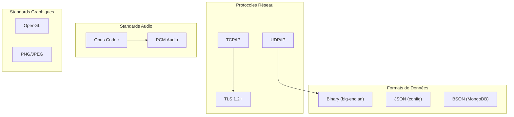
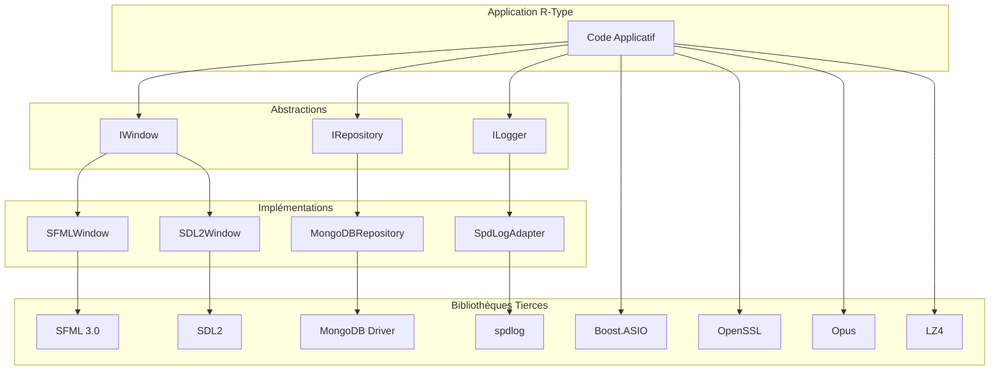

# Compétence 12 : Interopérabilité

> **Sélectionner les solutions techniques adaptées (protocoles, formats de fichiers...) en utilisant des composants logiciels tiers (bibliothèque) afin de proposer des implémentations permettant l'interopérabilité avec d'autres systèmes.**

---

## Observable 12.1 : Normes et Composants Tiers

### Vue d'Ensemble des Standards Utilisés



### Composants Tiers Intégrés

| Composant | Version | Licence | Usage |
|-----------|---------|---------|-------|
| **Boost.ASIO** | 1.83+ | BSL-1.0 | Networking async |
| **OpenSSL** | 3.x | Apache 2.0 | TLS, cryptographie |
| **MongoDB C++ Driver** | 3.8+ | Apache 2.0 | Persistance |
| **SFML** | 3.0 | zlib/png | Graphics, audio |
| **SDL2** | 2.28+ | zlib | Graphics fallback |
| **Opus** | 1.4+ | BSD | Audio codec |
| **PortAudio** | 19.7+ | MIT | Audio I/O |
| **LZ4** | 1.9+ | BSD | Compression |
| **spdlog** | 1.12+ | MIT | Logging |
| **Google Test** | 1.14+ | BSD | Tests unitaires |

### Protocole Binaire : Interopérabilité Réseau

#### Format Big-Endian (Network Byte Order)

**Fichier** : `src/common/protocol/Protocol.hpp:17-19`

```cpp
// Conversion endianness via GCC builtins
inline uint64_t swap64(uint64_t v) { return __builtin_bswap64(v); }
inline uint32_t swap32(uint32_t v) { return __builtin_bswap32(v); }
inline uint16_t swap16(uint16_t v) { return __builtin_bswap16(v); }
```

#### Structure UDPHeader

```cpp
struct UDPHeader {
    uint16_t type;           // Message type (big-endian)
    uint16_t sequence_num;   // Sequence number (big-endian)
    uint64_t timestamp;      // Timestamp ms (big-endian)

    static constexpr size_t WIRE_SIZE = 12;

    void to_bytes(void* buf) const {
        auto* ptr = static_cast<uint8_t*>(buf);
        uint16_t net_type = swap16(type);
        uint16_t net_seq = swap16(sequence_num);
        uint64_t net_ts = swap64(timestamp);

        std::memcpy(ptr, &net_type, 2);
        std::memcpy(ptr + 2, &net_seq, 2);
        std::memcpy(ptr + 4, &net_ts, 8);
    }
};
```

**Garantie** : Un client Linux x86_64 (little-endian) communique avec un serveur ARM (big-endian) sans problème.

### TLS 1.2+ : Standard de Sécurité

**Configuration** (`TCPAuthServer.cpp:819-840`) :

```cpp
// Conformité NIST SP 800-52
SSL_CTX_set_min_proto_version(_sslContext.native_handle(), TLS1_2_VERSION);

// Cipher suites recommandées
"ECDHE-ECDSA-AES256-GCM-SHA384:"
"ECDHE-RSA-AES256-GCM-SHA384:"
"ECDHE-RSA-CHACHA20-POLY1305"
```

### Opus : Standard Audio VoIP

**Configuration** (`src/client/src/audio/OpusCodec.cpp`) :

```cpp
// Encodeur Opus optimisé pour voix
opus_encoder_ctl(encoder, OPUS_SET_APPLICATION(OPUS_APPLICATION_VOIP));
opus_encoder_ctl(encoder, OPUS_SET_BITRATE(24000));    // 24 kbps
opus_encoder_ctl(encoder, OPUS_SET_COMPLEXITY(5));     // Équilibre CPU/qualité

// Sample rate standard
static constexpr int SAMPLE_RATE = 48000;  // Hz
static constexpr int CHANNELS = 1;         // Mono
static constexpr int FRAME_SIZE = 960;     // 20ms @ 48kHz
```

### LZ4 : Compression Standard

**Fichier** : `src/common/compression/Compression.hpp`

```cpp
// Compression compatible avec liblz4 standard
int compressedSize = LZ4_compress_default(
    reinterpret_cast<const char*>(src),
    reinterpret_cast<char*>(compressed.data()),
    static_cast<int>(srcSize),
    maxDstSize
);

// Décompression compatible
int decompressedSize = LZ4_decompress_safe(
    reinterpret_cast<const char*>(src),
    reinterpret_cast<char*>(decompressed.data()),
    static_cast<int>(srcSize),
    static_cast<int>(originalSize)
);
```

**Interopérabilité** : Tout système avec liblz4 peut décompresser les données.

---

## Observable 12.2 : Justification des Composants Tiers

### Critères de Sélection

| Critère | Poids | Description |
|---------|-------|-------------|
| **Maturité** | Élevé | Bibliothèque éprouvée (années d'utilisation) |
| **Licence** | Élevé | Compatible usage commercial (BSD, MIT, Apache) |
| **Performance** | Élevé | Adapté au temps réel (20 Hz) |
| **Portabilité** | Moyen | Linux + Windows minimum |
| **Documentation** | Moyen | API bien documentée |
| **Communauté** | Moyen | Support actif |

### Justification par Composant

#### Boost.ASIO vs Alternatives

| Critère | Boost.ASIO | libuv | Qt Network |
|---------|------------|-------|------------|
| Langage | C++ natif | C | C++ (Qt) |
| Async model | Proactor | Reactor | Signals/Slots |
| TLS intégré | Via OpenSSL | Via OpenSSL | Oui |
| Portabilité | Excellent | Excellent | Bon |
| Overhead | Faible | Très faible | Moyen (Qt) |
| **Verdict** | **Choisi** | Alternative viable | Dépendance Qt trop lourde |

**Justification** : Boost.ASIO offre un modèle async C++ idiomatique avec intégration OpenSSL native.

#### SFML vs SDL2 vs Raylib

| Critère | SFML | SDL2 | Raylib |
|---------|------|------|--------|
| API | C++ OOP | C | C simple |
| Shaders | GLSL natif | Via extension | OpenGL brut |
| Audio | Intégré | SDL_mixer | Intégré |
| Network | Intégré | Non | Non |
| Maturité | 15 ans | 25 ans | 9 ans |
| **Verdict** | **Principal** | **Fallback** | Non retenu |

**Justification** : SFML pour sa modernité C++ et ses shaders ; SDL2 en fallback pour sa stabilité éprouvée.

#### MongoDB vs PostgreSQL vs Redis

| Critère | MongoDB | PostgreSQL | Redis |
|---------|---------|------------|-------|
| Schéma | Flexible | Strict | Aucun |
| Scalabilité | Horizontale | Verticale | Horizontale |
| Requêtes | JSON | SQL | Commands |
| Latence | 1-10ms | 1-10ms | <1ms |
| Setup | Simple | Complexe | Simple |
| **Verdict** | **Choisi** | Non retenu | Cache futur |

**Justification** : MongoDB pour sa flexibilité schéma (évolution rapide) et ses performances lectures.

#### Opus vs Autres Codecs

| Critère | Opus | Speex | G.711 |
|---------|------|-------|-------|
| Bitrate | 6-128 kbps | 2-44 kbps | 64 kbps |
| Latence | 2.5-60ms | 30ms+ | <1ms |
| Qualité | Excellent | Bon | Téléphone |
| Licence | BSD | BSD | Propriétaire |
| **Verdict** | **Choisi** | Obsolète | Trop bas niveau |

**Justification** : Opus est le codec standard pour la VoIP gaming, avec le meilleur ratio qualité/bitrate.

#### LZ4 vs Autres Compressions

| Critère | LZ4 | zlib | zstd |
|---------|-----|------|------|
| Ratio | ~60% | ~70% | ~75% |
| Vitesse compress | 400 MB/s | 50 MB/s | 300 MB/s |
| Vitesse decompress | 1.5 GB/s | 200 MB/s | 800 MB/s |
| Latence ajoutée | ~0.1ms | ~1ms | ~0.3ms |
| **Verdict** | **Choisi** | Trop lent | Alternative viable |

**Justification** : LZ4 privilégie la vitesse sur le ratio, idéal pour le temps réel à 20 Hz.

### Architecture d'Intégration



### Gestion des Dépendances : vcpkg

**Fichier** : `vcpkg.json`

```json
{
  "dependencies": [
    "boost-asio",
    "openssl",
    "mongo-cxx-driver",
    "sfml",
    "sdl2",
    "sdl2-image",
    "opus",
    "portaudio",
    "lz4",
    "spdlog",
    "gtest"
  ]
}
```

**Avantages** :
- Versions reproductibles
- Cross-platform (Linux/Windows)
- Intégration CMake native

### Conclusion

La sélection des composants tiers pour R-Type repose sur :

1. **Standards reconnus** : TLS 1.2, Opus, LZ4, network byte order
2. **Maturité éprouvée** : Boost (20+ ans), SDL (25 ans), OpenSSL
3. **Licences permissives** : BSD, MIT, Apache, zlib
4. **Performance temps réel** : LZ4 rapide, Opus faible latence
5. **Abstraction** : Interfaces pour découpler du tiers (IWindow, IRepository)

Cette approche garantit **interopérabilité**, **maintenabilité** et **évolutivité**.
