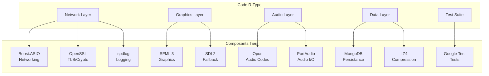

# Compétence 14 : Intégration de Codes Tiers

> **Intégrer l'usage de codes tiers au code produit en s'appuyant sur la documentation et en suivant les instructions relatives aux solutions retenues afin d'optimiser le temps de production et l'efficacité ainsi que la maintenabilité du code.**

---

## Observable 14.1 : Appels aux Composants Tiers

### Vue d'Ensemble des Intégrations

R-Type intègre **13 bibliothèques tierces** pour couvrir ses besoins fonctionnels.



### Intégration 1 : Boost.ASIO (Networking)

#### API Utilisée

**Fichier** : `src/server/infrastructure/adapters/in/network/UDPServer.cpp:53-64`

```cpp
UDPServer::UDPServer(boost::asio::io_context& io_ctx, ...)
    : _io_ctx(io_ctx)
    , _socket(io_ctx, udp::endpoint(udp::v4(), 4124))     // Socket UDP
    , _instanceManager(io_ctx)
    , _broadcastTimer(io_ctx)                              // Timer async
    , _statsTimer(io_ctx)
    , _autoSaveTimer(io_ctx)
{
    // ...
}
```

#### Opérations Async

```cpp
// Réception asynchrone
void UDPServer::do_receive() {
    _socket.async_receive_from(
        boost::asio::buffer(_recv_buffer),
        _remote_endpoint,
        [this](boost::system::error_code ec, std::size_t bytes_recvd) {
            handle_receive(ec, bytes_recvd);
            do_receive();  // Continue listening
        }
    );
}

// Timer périodique
void UDPServer::startBroadcastLoop() {
    _broadcastTimer.expires_after(std::chrono::milliseconds(50));  // 20 Hz
    _broadcastTimer.async_wait([this](boost::system::error_code ec) {
        if (!ec) {
            broadcastSnapshots();
            startBroadcastLoop();
        }
    });
}
```

### Intégration 2 : OpenSSL (TLS)

#### API Utilisée

**Fichier** : `src/server/infrastructure/adapters/in/network/TCPAuthServer.cpp:819-840`

```cpp
// Configuration du contexte SSL
_sslContext.set_options(
    ssl::context::no_sslv2 |
    ssl::context::no_sslv3 |
    ssl::context::no_tlsv1 |
    ssl::context::no_tlsv1_1
);

// Version minimale TLS 1.2
SSL_CTX_set_min_proto_version(_sslContext.native_handle(), TLS1_2_VERSION);

// Cipher suites
SSL_CTX_set_cipher_list(_sslContext.native_handle(),
    "ECDHE-ECDSA-AES256-GCM-SHA384:"
    "ECDHE-RSA-AES256-GCM-SHA384:"
    // ...
);
```

### Intégration 3 : Opus (Audio Codec)

#### API Utilisée

**Fichier** : `src/client/src/audio/OpusCodec.cpp:46-89`

```cpp
bool OpusCodec::init() {
    int error;

    // Création encodeur
    _encoder = opus_encoder_create(SAMPLE_RATE, CHANNELS,
                                   OPUS_APPLICATION_VOIP, &error);
    if (error != OPUS_OK || !_encoder) {
        logger->error("Opus encoder create failed: {}", opus_strerror(error));
        return false;
    }

    // Configuration
    opus_encoder_ctl(_encoder, OPUS_SET_BITRATE(BITRATE));
    opus_encoder_ctl(_encoder, OPUS_SET_SIGNAL(OPUS_SIGNAL_VOICE));
    opus_encoder_ctl(_encoder, OPUS_SET_VBR(1));
    opus_encoder_ctl(_encoder, OPUS_SET_COMPLEXITY(5));

    // Création décodeur
    _decoder = opus_decoder_create(SAMPLE_RATE, CHANNELS, &error);
    if (error != OPUS_OK || !_decoder) {
        logger->error("Opus decoder create failed: {}", opus_strerror(error));
        opus_encoder_destroy(_encoder);
        return false;
    }

    _initialized = true;
    return true;
}
```

#### Encodage/Décodage

```cpp
std::vector<uint8_t> OpusCodec::encode(const float* pcmData, int frameSize) {
    std::vector<uint8_t> encoded(MAX_PACKET_SIZE);

    int bytesWritten = opus_encode_float(
        _encoder, pcmData, frameSize,
        encoded.data(), encoded.size()
    );

    if (bytesWritten < 0) {
        logger->error("Opus encode failed: {}", opus_strerror(bytesWritten));
        return {};
    }

    encoded.resize(bytesWritten);
    return encoded;
}
```

### Intégration 4 : PortAudio (Audio I/O)

#### API Utilisée

**Fichier** : `src/client/src/audio/VoiceChatManager.cpp:39-58`

```cpp
bool VoiceChatManager::init() {
    PaError err = Pa_Initialize();
    if (err != paNoError) {
        logger->error("PortAudio init failed: {}", Pa_GetErrorText(err));
        return false;
    }

    // Détection des devices
    int numDevices = Pa_GetDeviceCount();
    for (int i = 0; i < numDevices; i++) {
        const PaDeviceInfo* info = Pa_GetDeviceInfo(i);
        if (info && info->maxInputChannels > 0) {
            // Filtrer les devices virtuels
            if (!isVirtualDevice(info->name)) {
                _inputDevices.push_back({i, info->name});
            }
        }
    }

    return true;
}
```

### Intégration 5 : LZ4 (Compression)

#### API Utilisée

**Fichier** : `src/common/compression/Compression.hpp:27-58`

```cpp
inline std::vector<uint8_t> compress(const uint8_t* src, size_t srcSize) {
    int maxDstSize = LZ4_compressBound(static_cast<int>(srcSize));

    std::vector<uint8_t> compressed(maxDstSize);

    int compressedSize = LZ4_compress_default(
        reinterpret_cast<const char*>(src),
        reinterpret_cast<char*>(compressed.data()),
        static_cast<int>(srcSize),
        maxDstSize
    );

    if (compressedSize <= 0 ||
        static_cast<size_t>(compressedSize) >= srcSize) {
        return {};  // Compression non rentable
    }

    compressed.resize(compressedSize);
    return compressed;
}
```

### Intégration 6 : MongoDB

#### API Utilisée

**Fichier** : `src/server/infrastructure/adapters/out/persistence/MongoDBUserRepository.cpp`

```cpp
void MongoDBUserRepository::save(const domain::entities::User& user) const {
    auto client = _mongoDB->acquireClient();
    auto collection = client->database(_mongoDB->getDbName())["user"];

    bsoncxx::builder::basic::document doc;
    doc.append(kvp("username", user.getUsername()));
    doc.append(kvp("email", user.getEmail()));
    doc.append(kvp("password", user.getPassword()));
    doc.append(kvp("createAt", bsoncxx::types::b_date(
        std::chrono::system_clock::now())));

    collection.insert_one(doc.view());
}

std::optional<domain::entities::User> MongoDBUserRepository::findByEmail(
    const std::string& email
) {
    auto client = _mongoDB->acquireClient();
    auto collection = client->database(_mongoDB->getDbName())["user"];

    auto result = collection.find_one(
        bsoncxx::builder::basic::make_document(kvp("email", email))
    );

    if (!result) return std::nullopt;

    // Désérialisation BSON -> User
    auto view = result->view();
    return domain::entities::User(
        view["_id"].get_oid().value.to_string(),
        view["username"].get_string().value,
        view["email"].get_string().value,
        view["password"].get_string().value
    );
}
```

---

## Observable 14.2 : Gestion des Cas d'Erreur

### Patterns de Gestion d'Erreurs

Chaque bibliothèque tierce a son propre modèle de gestion d'erreurs. R-Type les intègre de manière cohérente.

#### Pattern 1 : Codes Retour C (Opus, PortAudio, LZ4)

```cpp
// Opus
int error;
_encoder = opus_encoder_create(SAMPLE_RATE, CHANNELS, APPLICATION, &error);
if (error != OPUS_OK) {
    logger->error("Opus error: {}", opus_strerror(error));
    return false;
}

// PortAudio
PaError err = Pa_Initialize();
if (err != paNoError) {
    logger->error("PortAudio error: {}", Pa_GetErrorText(err));
    return false;
}

// LZ4
int result = LZ4_compress_default(...);
if (result <= 0) {
    return {};  // Échec silencieux, retour vide
}
```

#### Pattern 2 : error_code Boost.ASIO

```cpp
// Lecture asynchrone avec error_code
_socket.async_receive_from(
    buffer, endpoint,
    [this](boost::system::error_code ec, std::size_t bytes) {
        if (ec) {
            if (ec == boost::asio::error::operation_aborted) {
                return;  // Fermeture intentionnelle
            }
            logger->error("Receive error: {}", ec.message());
            return;
        }
        // Process data
    }
);

// Shutdown SSL avec error_code
boost::system::error_code ec;
_socket.shutdown(ec);
if (ec && ec != boost::asio::error::eof &&
    ec != boost::asio::ssl::error::stream_truncated) {
    logger->debug("SSL shutdown: {}", ec.message());
}
```

#### Pattern 3 : Exceptions (SFML, SDL2)

```cpp
// SFML texture loading
if (!texture.loadFromFile(filepath)) {
    throw std::runtime_error("Failed to load texture: " + filepath);
}

// SDL2 init
if (SDL_Init(SDL_INIT_VIDEO) < 0) {
    throw std::runtime_error("SDL init failed: " + std::string(SDL_GetError()));
}
```

#### Pattern 4 : std::optional (LZ4, Protocol)

```cpp
// Décompression LZ4
inline std::optional<std::vector<uint8_t>> decompress(
    const uint8_t* src, size_t srcSize, size_t originalSize
) {
    if (srcSize == 0 || src == nullptr || originalSize == 0) {
        return std::nullopt;
    }

    std::vector<uint8_t> decompressed(originalSize);
    int result = LZ4_decompress_safe(...);

    if (result < 0 || static_cast<size_t>(result) != originalSize) {
        return std::nullopt;  // Corruption détectée
    }

    return decompressed;
}

// Utilisation
auto data = compression::decompress(compressed, size, originalSize);
if (!data) {
    logger->error("Decompression failed");
    return;
}
```

### Tableau Récapitulatif

| Bibliothèque | Pattern Erreur | Fonction de Message | Gestion R-Type |
|--------------|----------------|---------------------|----------------|
| **Boost.ASIO** | error_code | `ec.message()` | Logging + continue/return |
| **OpenSSL** | Via Boost | Via error_code | Logging |
| **Opus** | Return code | `opus_strerror()` | Logging + return false |
| **PortAudio** | PaError | `Pa_GetErrorText()` | Logging + cleanup |
| **LZ4** | Return int | N/A | optional/empty vector |
| **MongoDB** | Exceptions | `e.what()` | Domain exceptions |
| **SFML** | Return bool | N/A | throw runtime_error |
| **SDL2** | Return int | `SDL_GetError()` | throw runtime_error |
| **spdlog** | N/A | N/A | Fire-and-forget |
| **GTest** | Assertions | N/A | Test failure |

### Exemples de Gestion Complète

#### Opus : Lifecycle Complet

```cpp
bool OpusCodec::init() {
    int error;

    // Création avec vérification
    _encoder = opus_encoder_create(SAMPLE_RATE, CHANNELS, APP, &error);
    if (error != OPUS_OK || !_encoder) {
        logger->error("Encoder creation failed: {}", opus_strerror(error));
        return false;
    }

    _decoder = opus_decoder_create(SAMPLE_RATE, CHANNELS, &error);
    if (error != OPUS_OK || !_decoder) {
        logger->error("Decoder creation failed: {}", opus_strerror(error));
        opus_encoder_destroy(_encoder);  // Cleanup partiel
        _encoder = nullptr;
        return false;
    }

    _initialized = true;
    return true;
}

OpusCodec::~OpusCodec() {
    if (_encoder) opus_encoder_destroy(_encoder);
    if (_decoder) opus_decoder_destroy(_decoder);
}
```

#### PortAudio : Retry Logic

**Fichier** : `tests/client/PortAudioTest.cpp:96-101`

```cpp
// Ouverture stream avec fallback
PaError err = Pa_OpenStream(&stream, &inputParams, nullptr, ...);
if (err != paNoError) {
    // Retry avec moins de canaux
    inputParams.channelCount = 1;
    err = Pa_OpenStream(&stream, &inputParams, nullptr, ...);
    if (err != paNoError) {
        logger->error("Stream open failed even with mono: {}",
                     Pa_GetErrorText(err));
        return false;
    }
}
```

#### VoiceChatManager : Cleanup RAII

```cpp
VoiceChatManager::~VoiceChatManager() {
    try {
        stop();
        if (_inputStream) {
            Pa_CloseStream(_inputStream);
        }
        Pa_Terminate();
    } catch (const std::exception& e) {
        // Log mais ne pas propager depuis destructeur
        auto logger = server::logging::Logger::getAudioLogger();
        logger->error("Cleanup error: {}", e.what());
    }
}
```

### Logging Structuré

```cpp
// Loggers spécialisés
auto networkLogger = server::logging::Logger::getNetworkLogger();
auto audioLogger = server::logging::Logger::getAudioLogger();
auto gameLogger = server::logging::Logger::getGameLogger();

// Exemples de logs
networkLogger->error("TLS handshake failed from {}: {}",
                     endpoint.address().to_string(), ec.message());
audioLogger->warn("Virtual device skipped: {}", deviceName);
gameLogger->info("Player {} scored {} points", playerId, points);
```

### Conclusion

L'intégration des codes tiers dans R-Type respecte les bonnes pratiques :

1. **Documentation suivie** : Appels conformes aux API officielles (Opus, PortAudio, LZ4)
2. **Gestion d'erreurs complète** : Chaque pattern (codes, exceptions, optional) traité
3. **Cleanup RAII** : Ressources libérées même en cas d'erreur
4. **Logging contextuel** : Messages d'erreur informatifs avec fonctions tierces (`opus_strerror`, `Pa_GetErrorText`)
5. **Fallback gracieux** : Retry logic, valeurs par défaut

Cette approche garantit **robustesse**, **maintenabilité** et **debuggabilité** du code intégrant les composants tiers.
