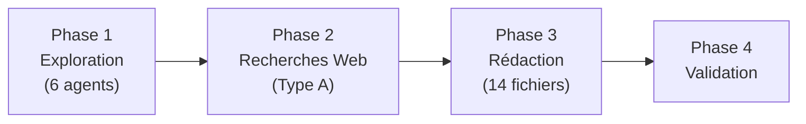

# Observables - Validation des Compétences

Cette section contient les **28 observables** (14 compétences × 2 observables) requis pour la validation du diplôme.

---

## Structure des Observables

Chaque compétence dispose d'un fichier contenant deux observables avec :

- Description officielle de la compétence
- Preuves extraites du code (références `fichier:ligne`)
- Diagrammes Mermaid
- Tableaux récapitulatifs
- Sources externes (si applicable)

---

## Liste des Compétences

### Bloc 1 : Veille et Sécurité

| # | Compétence | Observables |
|---|------------|-------------|
| 1 | [Veille Technologique](competence-01-veille-technologique.md) | Étude comparative + Technologies PSH |
| 2 | [Sécurité Protocoles](competence-02-securite-protocoles.md) | Failles sécurité + Veille cybersécurité |

### Bloc 2 : Conception et Architecture

| # | Compétence | Observables |
|---|------------|-------------|
| 3 | [Solution Créative](competence-03-solution-creative.md) | Prototypes + Comparatif |
| 4 | [Architecture](competence-04-architecture.md) | Hexagonale + Intégration écosystème |
| 5 | [Composants Logiciels](competence-05-composants-logiciels.md) | Implémentation + Bonnes pratiques |
| 6 | [Segmentation](competence-06-segmentation.md) | Organisation code + Objectifs |

### Bloc 3 : Développement

| # | Compétence | Observables |
|---|------------|-------------|
| 7 | [Algorithmes](competence-07-algorithmes.md) | Standards optimaux + Originaux |
| 8 | [Persistance](competence-08-persistance.md) | Choix techniques + Comparatif |
| 9 | [Structures de Données](competence-09-structures-donnees.md) | Implémentation + Justification |
| 10 | [Interfaces](competence-10-interfaces.md) | GUI/UX + Accessibilité |

### Bloc 4 : Qualité et Intégration

| # | Compétence | Observables |
|---|------------|-------------|
| 11 | [Intégrité des Données](competence-11-integrite-donnees.md) | Vérifications + Confidentialité |
| 12 | [Interopérabilité](competence-12-interoperabilite.md) | Normes + Composants tiers |
| 13 | [Code Opérationnel](competence-13-code-operationnel.md) | Exigences fonctionnelles + Conventions |
| 14 | [Intégration Tiers](competence-14-integration-tiers.md) | Appels API + Gestion erreurs |

---

## Méthodologie

La production des observables a suivi une méthodologie en 3 phases :

### Phase 1 : Exploration du Codebase

6 agents spécialisés ont analysé le code :

| Agent | Focus | Compétences |
|-------|-------|-------------|
| Sécurité | TLS, auth, validation | 2, 11 |
| Architecture | Hexagonal, patterns | 4, 5, 6 |
| Réseau | Protocol, compression | 7, 9, 12 |
| UI/Client | Scenes, accessibility | 10, 13 |
| Data | MongoDB, structures | 8, 9 |
| Intégration | Libs tierces, erreurs | 12, 14 |

### Phase 2 : Recherches Web

Pour les observables nécessitant des données externes :

- Comparatifs technologies (SFML/SDL2/Raylib)
- Veille sécurité 2025-2026
- Technologies d'accessibilité (RGAA, Game Accessibility Guidelines)
- Benchmarks bases de données

### Phase 3 : Rédaction

Production des 14 fichiers Markdown avec :

- Diagrammes Mermaid
- Extraits de code avec références
- Tableaux comparatifs
- Sources citées

---

## Rapports Intermédiaires

Les rapports d'exploration sont disponibles dans le dossier `rapports/` :

- [Rapport Sécurité](rapports/rapport_securite.md)
- [Rapport Architecture](rapports/rapport_architecture.md)
- [Rapport Réseau](rapports/rapport_reseau.md)
- [Rapport UI](rapports/rapport_ui.md)
- [Rapport Data](rapports/rapport_data.md)
- [Rapport Intégration](rapports/rapport_integration.md)

---

## Technologies Démontrées

Les observables couvrent l'ensemble des technologies du projet R-Type :

| Catégorie | Technologies |
|-----------|--------------|
| **Langage** | C++23 |
| **Architecture** | Hexagonale (Ports & Adapters) |
| **Réseau** | Boost.ASIO, TLS 1.2+, UDP/TCP |
| **Graphics** | SFML 3, SDL2 (multi-backend) |
| **Audio** | Opus, PortAudio |
| **Persistance** | MongoDB |
| **Compression** | LZ4 |
| **Tests** | Google Test |
