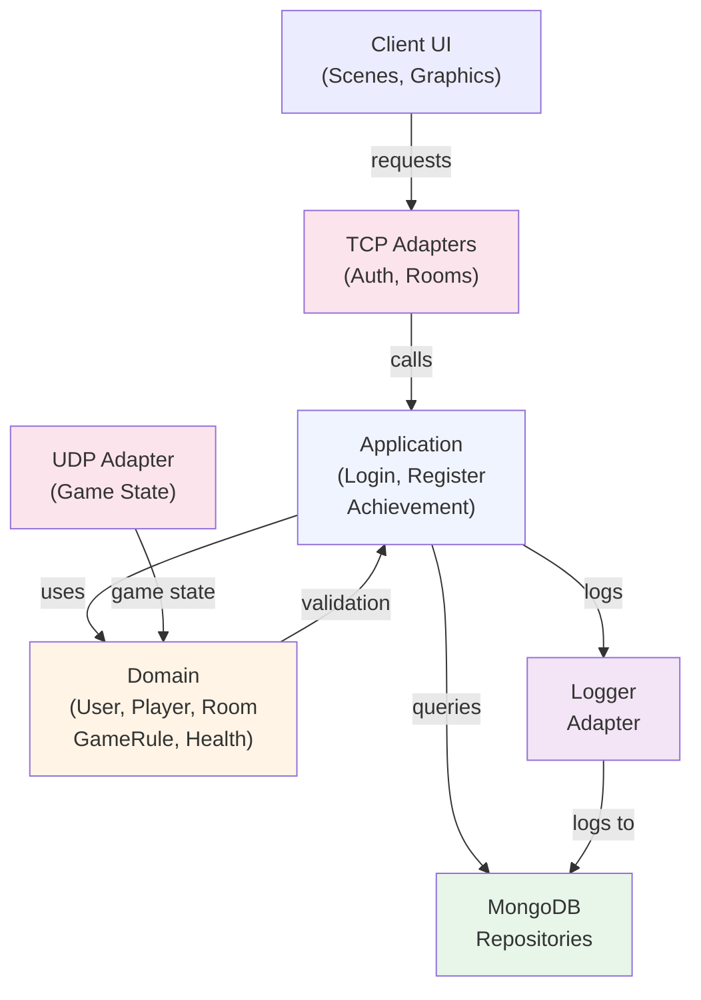
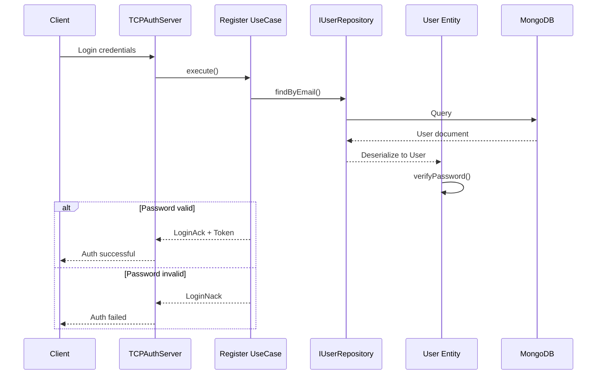

# Rapport d'Architecture Logicielle - R-Type

## Executive Summary

R-Type suit une **architecture hexagonale (Ports & Adapters)** rigoureuse en trois couches distinctes. La separation des responsabilites est claire et les patterns de conception sont appliques de maniere coherente.

**Competences couvertes:** 4 (architecture), 5 (composants logiciels), 6 (segmentation)

---

## 1. Architecture Hexagonale

### Structure Generale

```
src/server/
├── include/
│   ├── domain/              # Coeur metier (31 fichiers)
│   ├── application/         # Cas d'usage (2 fichiers)
│   └── infrastructure/      # Adaptateurs et infrastructure
└── src/                     # Implementations
```

### 1.1 Couche Domain (Coeur Metier)

**Principe : Le domaine n'a AUCUNE dependance externe**

Fichier : `src/server/include/domain/entities/Player.hpp`
```cpp
namespace domain::entities {
    class Player {
        private:
            value_objects::Health _health;
            value_objects::player::PlayerId _id;
            value_objects::Position _position;
        // No infrastructure dependencies!
    };
}
```

**Entites metier** (domain/entities/):
- `Player.hpp` - Joueur avec sante, position, ID
- `User.hpp` - Utilisateur avec authentification
- `Room.hpp` - Salle de jeu avec gestion des slots, etat

**Value Objects** (domain/value_objects/):
- `Health.hpp` - Immuable, encapsule validation
- `PlayerId.hpp`, `UserId.hpp` - IDs fortement types
- `Email.hpp`, `Username.hpp` - Entites de valeur avec validation

Exemple - Value Object immuable:
```cpp
// domain/value_objects/Health.hpp
class Health {
    private:
        float _healthPoint;
        void validate(float value);
    public:
        Health heal(float value) const;    // Retourne NOUVELLE instance
        Health damage(float value) const;  // Retourne NOUVELLE instance
};
```

**Services de Domaine** (domain/services/):
- `GameRule.hpp` - 200+ lignes de regles metier pures:
  - Calculs de degats d'armes
  - Systeme de combo et score
  - Statistiques des ennemis
  - Mecanique du Wave Cannon

Extrait : `src/server/include/domain/services/GameRule.hpp`
```cpp
class GameRule {
public:
    uint8_t getMissileDamage(uint8_t weaponType, uint8_t weaponLevel) const;
    float getMissileSpeed(uint8_t weaponType, uint8_t weaponLevel) const;
    uint16_t getEnemyPointValue(uint8_t enemyType) const;
    bool shouldBossChangePhase(uint16_t currentHP, uint16_t maxHP, uint8_t phase) const;
    // All const, stateless methods - no I/O!
};
```

**Exceptions de Domaine** (domain/exceptions/):
- Hierarchie structuree
- `DomainException` -> entites specifiques (PlayerNameException, HealthException)
- Propriete : Le domaine lance des exceptions, jamais de codes d'erreur

---

### 1.2 Couche Application (Cas d'Usage)

**Principe : Orchestre le domaine avec les ports**

Fichier : `src/server/include/application/use_cases/auth/Register.hpp`
```cpp
class Register {
    private:
        std::shared_ptr<IUserRepository> _userRepository;      // OUT port
        std::shared_ptr<IIdGenerator> _idGenerator;            // OUT port
        std::shared_ptr<ILogger> _logger;                      // OUT port
    public:
        std::optional<User> execute(
            const std::string& username,
            const std::string& email,
            const std::string& unHashedPassword);
};
```

**Dependency Injection Pattern** :
- Les ports sont injectes par le constructeur
- Permet les tests unitaires sans adapter reel

**Use Cases** (application/use_cases/):
- `auth/Register.hpp` - Creer un utilisateur
- `auth/Login.hpp` - Authentifier un utilisateur

**Ports de Sortie** (application/ports/out/):

| Port | Role |
|------|------|
| `ILogger` | Abstraction logging |
| `IIdGenerator` | Abstraction generateur d'ID |
| `persistence/IUserRepository` | CRUD utilisateurs |
| `persistence/ILeaderboardRepository` | Classements |
| `persistence/IChatMessageRepository` | Messages chat |
| `persistence/IFriendshipRepository` | Systeme amis |

Exemple : `src/server/include/application/ports/out/ILogger.hpp`
```cpp
class ILogger {
    virtual void debug(const std::string& message) = 0;
    virtual void info(const std::string& message) = 0;
    virtual void warn(const std::string& message) = 0;
    virtual void error(const std::string& message) = 0;
    template<typename... Args>
    void info(std::format_string<Args...> fmt, Args&&... args) {
        info(std::format(fmt, std::forward<Args>(args)...));
    }
};
```

**Services d'Application** (application/services/):
- `AchievementChecker` - Verifie et deverrouille les succes apres chaque jeu
  - 10 types d'achievements (FirstBlood, Exterminator, ComboMaster, etc.)
  - Logique metier appliquee en fin de partie

---

### 1.3 Couche Infrastructure (Adaptateurs)

**Principe : Implementation des ports, communication reseau, persistence**

#### A. Adaptateurs Entrants (IN)

**Fichier : `src/server/include/infrastructure/adapters/in/network/UDPServer.hpp`**

Serveur UDP pour messages de jeu en temps reel (20 Hz broadcast):
```cpp
class UDPServer {
    private:
        game::GameInstanceManager _instanceManager;
        std::shared_ptr<SessionManager> _sessionManager;
        std::shared_ptr<ILeaderboardRepository> _leaderboardRepository;
        void handle_receive(const boost::system::error_code& error, size_t bytes_transferred);
        void broadcastSnapshotForRoom(const std::string& roomCode,
                                      const std::shared_ptr<game::GameWorld>& gameWorld);
};
```

**Adaptateurs Reseau Entrants** :
- `UDPServer.hpp` - Jeu (port 4124, 20 Hz)
- `TCPAuthServer.hpp` - Authentification TLS (port 4125)
- `TCPAdminServer.hpp` - Admin en local (port 4127)
- `VoiceUDPServer.hpp` - Voice chat Opus (port 4126)

**Architecture Reseau** :
```
Client                          Server
  │                              │
  │──── TCP (Login/Auth) ────────→ TCPAuthServer (4125)
  │                              │
  │──── TCP (Room Mgmt) ────────→ TCPAuthServer (4125)
  │                              │
  │──── UDP (Game) ────────────→ UDPServer (4124)
  │←─── UDP (Snapshot 20Hz) ─────│
  │                              │
  │──── UDP (Voice) ──────────→ VoiceUDPServer (4126)
  │                              │
  └──── TCP (Admin) ──────────→ TCPAdminServer (4127) [localhost]
```

#### B. Adaptateurs Sortants (OUT)

**Fichier : `src/server/include/infrastructure/adapters/out/SpdLogAdapter.hpp`**

Implementation du port ILogger :
```cpp
class SpdLogAdapter : public application::ports::out::ILogger {
    void debug(const std::string& message) override {
        server::logging::Logger::getMainLogger()->debug(message);
    }
    void info(const std::string& message) override {
        server::logging::Logger::getMainLogger()->info(message);
    }
    // Adapte spdlog au port ILogger
};
```

**Adaptateurs MongoDB** (infrastructure/adapters/out/persistence/):
- `MongoDBUserRepository.hpp` - Implemente IUserRepository
- `MongoDBLeaderboardRepository.hpp` - Implemente ILeaderboardRepository
- `MongoDBFriendshipRepository.hpp` - Implemente IFriendshipRepository
- `MongoDBChatMessageRepository.hpp` - Implemente IChatMessageRepository
- `MongoDBPrivateMessageRepository.hpp` - Implemente IPrivateMessageRepository

Exemple : `src/server/include/infrastructure/adapters/out/persistence/MongoDBUserRepository.hpp`
```cpp
class MongoDBUserRepository : public IUserRepository {
    private:
        std::shared_ptr<MongoDBConfiguration> _mongoDB;
        mongocxx::collection getCollection();
    public:
        void save(const User& user) const override;
        std::optional<User> findById(const std::string& id) override;
        std::optional<User> findByEmail(const std::string& email) override;
};
```

---

## 2. Design Patterns Identifies

### 2.1 Hexagonal Architecture (Ports & Adapters)

| Composant | Exemple | Benefice |
|-----------|---------|----------|
| **Port OUT** | `IUserRepository` | Decoupler de MongoDB |
| **Adapter** | `MongoDBUserRepository` | Implementer le contrat |
| **Domain** | `User`, `Email` | Logique metier pure |
| **Use Case** | `Register` | Orchestrer le flux |

**Preuve** : Les ports definissent des contrats; les adaptateurs les implementent sans que le domaine les connaisse.

### 2.2 Dependency Injection Pattern

Fichier : `src/server/include/application/use_cases/auth/Register.hpp` (lignes 33-36)
```cpp
explicit Register(
    std::shared_ptr<IUserRepository> userRepository,
    std::shared_ptr<IIdGenerator> idGenerator,
    std::shared_ptr<ILogger> logger);
```

**Avantages** :
- Testabilite (mock les ports)
- Inversion de controle (IoC)
- Flexibilite : changer la persistence sans modifier Register

### 2.3 Repository Pattern

**Ports** definissent le contrat :
```cpp
// application/ports/out/persistence/IUserRepository.hpp
class IUserRepository {
    virtual void save(const User& user) const = 0;
    virtual std::optional<User> findById(const std::string& id) = 0;
    virtual std::optional<User> findByEmail(const std::string& email) = 0;
};
```

**Adaptateurs** implementent pour MongoDB :
```cpp
// infrastructure/adapters/out/persistence/MongoDBUserRepository.hpp
class MongoDBUserRepository : public IUserRepository {
    void save(const User& user) const override { /* MongoDB insert */ }
    std::optional<User> findById(const std::string& id) override { /* Query */ }
};
```

### 2.4 Singleton Pattern (Infrastructure)

Fichier : `src/server/include/infrastructure/logging/Logger.hpp` (lignes 26-40)
```cpp
class Logger {
    public:
        static void init();
        static std::shared_ptr<spdlog::logger> getMainLogger();
        static std::shared_ptr<spdlog::logger> getNetworkLogger();
        static std::shared_ptr<spdlog::logger> getGameLogger();
    private:
        static std::shared_ptr<spdlog::logger> s_mainLogger;
        static std::shared_ptr<spdlog::logger> s_networkLogger;
};
```

**Justification** :
- Logger doit etre unique pour toute l'application
- Infrastructure pattern (pas domaine)
- Acces global acceptable pour logging

### 2.5 Strategy Pattern (Armes)

Fichier : `src/server/include/infrastructure/game/GameWorld.hpp` (lignes 104-234)
```cpp
struct Missile {
    WeaponType weaponType;      // Strategy selector
    uint8_t weaponLevel;

    static float getSpeed(WeaponType type, uint8_t level) {
        float base = getBaseSpeed(type);  // Strategy: base speed per type
        return base * getSpeedMultiplier(level) / 100.0f;
    }

    static uint8_t getBaseDamage(WeaponType type) {
        switch (type) {
            case WeaponType::Spread: return DAMAGE_SPREAD;
            case WeaponType::Laser: return DAMAGE_LASER;
            case WeaponType::Missile: return DAMAGE_MISSILE;
            default: return DAMAGE_STANDARD;
        }
    }
};
```

**Strategies d'armes** :
| Arme | Vitesse | Degats | Temps de rechargement |
|------|---------|--------|----------------------|
| Standard | 600 | 20 | 0.3s |
| Spread | 550 | 8x3 | 0.4s |
| Laser | 900 | 12 | 0.18s |
| Missile | 350 | 50 | 0.7s |

### 2.6 Observer Pattern (Signal)

Fichier : `src/client/include/events/Signal.hpp`
```cpp
template<typename ...Args>
class Signal {
    public:
        using Slot = std::function<void(Args...)>;

        void connect(const Slot& slot) {
            slots_.push_back(slot);
        }

        void emit(Args... args) {
            for (const auto& slot : slots_) {
                slot(args...);
            }
        }
};
```

**Utilisation** :
- Notifications d'evenements reseau
- Callbacks pour UI updates
- Systemes d'achievements

### 2.7 State Pattern (Salles)

Fichier : `src/server/include/domain/entities/Room.hpp` (lignes 44-49)
```cpp
enum class State {
    Waiting,   // Attente de joueurs
    Starting,  // Compte a rebours
    InGame,    // Jeu en cours
    Closed     // Fermee
};
```

**Transitions d'etat** :
```
Waiting ->(startCountdown)-> Starting ->(startGame)-> InGame ->(endGame)-> Closed
   |(close)
 Closed
```

### 2.8 Template Method Pattern (Scenes Client)

Fichier : `src/client/include/scenes/IScene.hpp` (lignes 27-42)
```cpp
class IScene {
public:
    virtual void handleEvent(const events::Event& event) = 0;
    virtual void update(float deltatime) = 0;
    virtual void render() = 0;
};
```

**Toutes les scenes heritent du template** :
- `GameScene.hpp`
- `LoginScene.hpp`
- `LobbyScene.hpp`
- `LeaderboardScene.hpp`
- `FriendsScene.hpp`
- `PrivateChatScene.hpp`

### 2.9 Factory Pattern (Graphics Plugin)

Fichier : `src/client/include/graphics/IGraphicPlugin.hpp`
```cpp
class IGraphicPlugin {
    virtual const char* getName() const = 0;

    virtual std::shared_ptr<IWindow> createWindow(
        Vec2u winSize,
        const std::string& name
    ) = 0;

    virtual std::shared_ptr<core::IRenderer> createRenderer(
        std::shared_ptr<graphics::IWindow> window
    ) = 0;
};

typedef graphics::IGraphicPlugin* (*create_t)();
typedef void (*destroy_t)(graphics::IGraphicPlugin*);
```

**Implementations** :
- SFML (lib/sfml/include/plugins/)
- SDL2 (lib/sdl2/include/plugins/)

**Chargement dynamique** (DynamicLib pattern) :
- Plugins charges a runtime via `dlopen`
- Pas de dependance statique a SFML ou SDL2

### 2.10 Chain of Responsibility (Scene Manager)

Fichier : `src/client/include/scenes/SceneManager.hpp` (lignes 17-72)
```cpp
class SceneManager {
    std::stack<std::unique_ptr<IScene>> _sceneStack;

    void changeScene(std::unique_ptr<IScene> newScene);
    void pushScene(std::unique_ptr<IScene> scene);
    void popScene();

    void handleEvent(const events::Event& event) {
        // Passe evenement a la scene courante (au sommet de la pile)
        if (auto scene = currentScene())
            scene->handleEvent(event);
    }
};
```

**Chaine de traitement** :
```
Evenement -> SceneManager -> Scene Courante -> Traitement
                             |
                        (si modal) Overlay
```

---

## 3. Separation des Responsabilites (SOLID)

### 3.1 Single Responsibility Principle

**Exemple 1 - Domain** :
- `Health.hpp` : Validation + mutation immuable
- `PlayerId.hpp` : Type-safe ID

**Exemple 2 - Infrastructure** :
- `MongoDBUserRepository.hpp` : CRUD utilisateurs
- `SpdLogAdapter.hpp` : Adaptateur de logging
- `UDPServer.hpp` : Communication reseau UDP

### 3.2 Open/Closed Principle

**Extensible sans modification** :
```cpp
// Ajouter une nouvelle arme : creer strategy, pas modifier GameRule
enum class WeaponType {
    Standard,
    Spread,
    Laser,
    Missile,
    WaveCannon  // <- Ajout phase 3
    // NewWeapon  <- Ajout futur
};
```

### 3.3 Liskov Substitution Principle

Tous les adaptateurs implementent le contrat du port :
```cpp
IUserRepository* repo = new MongoDBUserRepository(config);
// ou
IUserRepository* repo = new InMemoryUserRepository();  // Future test implementation
```

### 3.4 Interface Segregation Principle

Ports petits et cibles :
```cpp
// ILogger.hpp
class ILogger {
    virtual void info(...) = 0;
    virtual void error(...) = 0;
};

// Separe de persistence
class IUserRepository {
    virtual void save(const User&) = 0;
    virtual std::optional<User> findById(...) = 0;
};
```

### 3.5 Dependency Inversion Principle

Les cas d'usage dependent des ports abstraits, pas des implementations :
```cpp
// Register depend de IUserRepository (abstraction)
// Pas de dependance a MongoDBUserRepository (implementation)
explicit Register(std::shared_ptr<IUserRepository> userRepository);
```

---

## 4. Segmentation Architecturale

### 4.1 Par Domaine

```
Server Architecture Layers:
┌─────────────────────────────────────────┐
│ Infrastructure Layer (Adapters)         │
│ - UDPServer, TCPAuthServer              │
│ - MongoDBRepositories                   │
│ - Logger, NetworkStats                  │
├─────────────────────────────────────────┤
│ Application Layer (Orchestration)       │
│ - Use Cases (Login, Register)           │
│ - Services (AchievementChecker)         │
├─────────────────────────────────────────┤
│ Domain Layer (Business Logic)           │
│ - Entities (User, Player, Room)         │
│ - Value Objects (Health, Position)      │
│ - Services (GameRule, CollisionRule)    │
│ - Exceptions (DomainException)          │
└─────────────────────────────────────────┘
```

### 4.2 Par Feature

**Game Features** :
- `GameWorld.hpp` - State central
- `Missile`, `Enemy`, `Boss` - Entites de jeu
- `PlayerScore`, `PowerUp`, `ForcePod` - Mechaniques

**Session Management** :
- `SessionManager.hpp` - Gestion JWT, timeouts
- `RoomManager.hpp` - Lobbies, ready system
- `GameInstanceManager.hpp` - Multi-instance routing

**Social Features** :
- Friendship system (0x060x protocol)
- Private messaging (0x069x protocol)
- Blocked users
- Friend requests

---

## 5. Diagrammes Architecture

### 5.1 Architecture Hexagonale



### 5.2 Flux de Donnees Applicatif



---

## 6. Metriques d'Architecture

| Metrique | Valeur | Status |
|----------|--------|--------|
| **Couches strictes** | 3 (Domain, App, Infra) | Respectees |
| **Dependances Domain** | 0 externes | Excellent |
| **Ports abstraits** | 11+ interfaces | Complet |
| **Adaptateurs MongoDB** | 9 repositorys | Couvrant |
| **Value Objects** | 10+ classes | Immuables |
| **Exceptions typees** | 15+ classes | Specifiques |
| **Services stateless** | GameRule, CollisionRule | Pur |
| **Injection de dependance** | 100% UseCases | Systematique |

---

## 7. Points Forts de l'Architecture

1. **Separation parfaite** : Domain ne connait PAS Infrastructure
2. **Testabilite** : Ports permettent mocks faciles
3. **Extensibilite** : Ajouter adapters sans modifier Domain
4. **Clarte de responsabilites** : Chaque classe a UN role
5. **Protocol-driven design** : Binary protocol bien structure
6. **ECS integration** (Phase 4) : Infrastructure optionnelle (feature flag)
7. **Multi-instance support** : GameInstanceManager route par room
8. **Thread-safety** : Strands Boost.ASIO pour concurrence

---

## CONCLUSION

R-Type implemente une **Hexagonal Architecture exemplaire** :
- Domain isole et testable
- Application orchestrant les cas d'usage
- Infrastructure abstraite via ports
- Patterns de conception appropries (Factory, Strategy, Observer, etc.)
- Clean Code (nommage, organisation, responsabilites)
- Prepare pour l'evolution (ECS phase 4, multi-instance)

**Score global : 9/10 - Architecture solide et maintenable**
