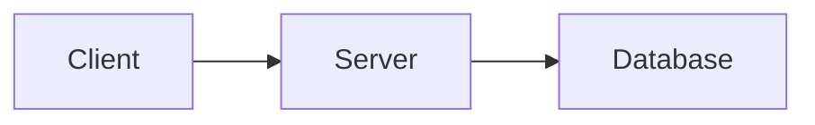

# FAQ - Questions Fréquentes

Cette page répond aux questions les plus fréquemment posées sur le projet R-Type.

## Installation et Configuration

### Quels sont les prérequis système ?

**Linux :**

- Ubuntu 22.04 LTS (recommandé) ou distribution équivalente
- GCC 11+ avec support C++23
- CMake 3.30+
- 4 GB RAM minimum, 8 GB recommandé
- 5 GB d'espace disque libre

**Alternative :**

- Docker Engine 20.10+ (évite l'installation des dépendances)

### Puis-je utiliser Windows ?

Oui, via WSL2 (Windows Subsystem for Linux) :

```powershell
# Dans PowerShell administrateur
wsl --install -d Ubuntu-22.04
```

Puis suivez les instructions Linux dans WSL2.

### Combien de temps prend la première installation ?

- **Installation des outils système :** 2-5 minutes
- **Clone et bootstrap de vcpkg :** 5-10 minutes
- **Installation des dépendances :** 10-30 minutes (compilation depuis sources)

**Total :** Environ 20-45 minutes selon votre machine et connexion.

!!! tip
Les installations suivantes sont beaucoup plus rapides grâce au cache de vcpkg.

### Puis-je utiliser Clang au lieu de GCC ?

Oui :

```bash
cmake -S . -B build \
    -DCMAKE_CXX_COMPILER=clang++ \
    -DCMAKE_C_COMPILER=clang \
    -DCMAKE_TOOLCHAIN_FILE=third_party/vcpkg/scripts/buildsystems/vcpkg.cmake \
    -G "Ninja"
```

Assurez-vous que Clang supporte C++23 (Clang 15+).

## Compilation

### Comment recompiler après modification du code ?

```bash
# Compilation rapide (ne reconfigure pas CMake)
./scripts/compile.sh

# Ou directement avec Ninja
ninja -C build
```

### La compilation est très lente, que faire ?

1. **Utiliser ccache** (cache de compilation) :

```bash
sudo apt-get install ccache
export CCACHE_DIR=$HOME/.ccache
cmake -DCMAKE_CXX_COMPILER_LAUNCHER=ccache -S . -B build
```

2. **Limiter les jobs parallèles** (si RAM insuffisante) :

```bash
ninja -C build -j2
```

3. **Compiler en Release** (plus rapide que Debug) :

```bash
cmake -S . -B build -DCMAKE_BUILD_TYPE=Release
cmake --build build
```

### Erreur : "CMake version too old"

Installez CMake 3.30+ depuis le site officiel :

```bash
wget https://github.com/Kitware/CMake/releases/download/v3.28.1/cmake-3.28.1-linux-x86_64.sh
chmod +x cmake-3.28.1-linux-x86_64.sh
sudo ./cmake-3.28.1-linux-x86_64.sh --prefix=/usr/local --skip-license
```

### Erreur : "undefined reference to boost::..."

Problème de linkage. Reconfigurer CMake :

```bash
# Pour Linux
rm -rf buildLinux/
./scripts/build.sh
./scripts/compile.sh

# Pour Windows
rm -rf buildWin/
./scripts/build.sh --platform=windows
./scripts/compile.sh --platform=windows
```

### Comment nettoyer complètement le projet ?

```bash
# Supprimer tous les builds et artifacts
rm -rf build*/ artifacts/

# Optionnel : supprimer vcpkg (réinstallation complète)
rm -rf third_party/vcpkg vcpkg_installed/

# Reconfigurer pour votre plateforme
./scripts/build.sh                    # Linux
./scripts/build.sh --platform=windows # Windows
./scripts/compile.sh
```

## vcpkg

### Qu'est-ce que vcpkg ?

vcpkg est un gestionnaire de paquets C++ développé par Microsoft. Il :

- Télécharge les sources des librairies
- Les compile pour votre plateforme
- Les intègre automatiquement avec CMake

### Où sont installées les dépendances ?

```
third_party/vcpkg/         # Sources vcpkg
vcpkg_installed/           # Librairies compilées
```

### Comment lister les dépendances installées ?

```bash
./third_party/vcpkg/vcpkg list
```

### Comment mettre à jour vcpkg ?

```bash
cd third_party/vcpkg
git pull
./bootstrap-vcpkg.sh
cd ../..

# Réinstaller les dépendances
./third_party/vcpkg/vcpkg install
```

### Comment ajouter une nouvelle dépendance ?

1. Ajouter dans `vcpkg.json` :

```json
{
  "dependencies": ["boost-asio", "gtest", "mongo-cxx-driver", "nouvelle-lib"]
}
```

2. Reconfigurer :

```bash
./scripts/build.sh
```

## Exécution

### Comment lancer le serveur ?

```bash
./artifacts/server/linux/rtype_server
```

### Comment lancer les tests ?

```bash
./artifacts/server/linux/server_tests
```

### Le serveur affiche juste "Hello world", est-ce normal ?

Oui, le serveur est en développement initial. C'est un placeholder pour vérifier que la compilation fonctionne.

### Comment déboguer le serveur ?

Avec GDB :

```bash
gdb ./artifacts/server/linux/rtype_server
(gdb) run
# En cas de crash
(gdb) backtrace
```

Avec Valgrind (détection de fuites mémoire) :

```bash
valgrind --leak-check=full ./artifacts/server/linux/rtype_server
```

!!! info
Le mode Debug inclut déjà AddressSanitizer pour détecter les erreurs mémoire.

## Docker

### Comment utiliser Docker pour compiler ?

Pour le développement local, utilisez la compilation native :

```bash
./scripts/build.sh
./scripts/compile.sh
```

Pour l'infrastructure CI/CD (Jenkins + Builder permanent) :

```bash
cd ci_cd/docker
docker-compose up -d
```

Consultez le [Guide CI/CD](../development/ci-cd.md) pour plus de détails.

### Comment lancer la documentation avec Docker ?

```bash
cd ci_cd/docker
docker-compose -f docker-compose.docs.yml up
```

Ouvrez http://localhost:8000

### Erreur : "docker: permission denied"

Ajoutez votre utilisateur au groupe docker :

```bash
sudo usermod -aG docker $USER
newgrp docker
```

### Comment nettoyer les images Docker ?

```bash
# Arrêter et supprimer les containers
docker-compose down

# Supprimer les images
docker-compose down --rmi all

# Nettoyer tout Docker
docker system prune -a
```

## CI/CD

### Comment lancer Jenkins localement ?

```bash
cd ci_cd/docker
docker-compose up -d
```

Accédez à http://localhost:8081

### Où trouver le mot de passe Jenkins initial ?

```bash
docker-compose exec jenkins cat /var/jenkins_home/secrets/initialAdminPassword
```

### Comment relancer le pipeline Jenkins ?

1. Ouvrez http://localhost:8081
2. Cliquez sur le job "rtype"
3. Cliquez sur "Build Now"

### Le pipeline Jenkins échoue, comment déboguer ?

1. Consultez les logs :

   - Ouvrez le build dans Jenkins
   - Cliquez sur "Console Output"

2. Reproduisez localement :

```bash
# Mêmes étapes que Jenkins
./scripts/build.sh
./scripts/compile.sh
./artifacts/server/linux/server_tests
```

## Tests

### Comment ajouter un nouveau test ?

Éditez `tests/server/main.cpp` :

```cpp
TEST(MaClasse, MonTest) {
    EXPECT_EQ(2 + 2, 4);
    ASSERT_TRUE(maFonction());
}
```

Recompilez :

```bash
./scripts/compile.sh
./artifacts/server/linux/server_tests
```

### Comment lancer un test spécifique ?

```bash
# Lancer un test par nom
./artifacts/server/linux/server_tests --gtest_filter=CalculTests.AdditionSimple

# Lancer une suite de tests
./artifacts/server/linux/server_tests --gtest_filter=CalculTests.*
```

### Comment voir plus de détails sur les tests ?

```bash
./artifacts/server/linux/server_tests --gtest_verbose
```

## Documentation

### Comment générer la documentation localement ?

**Avec Docker (recommandé) :**

```bash
cd ci_cd/docker
docker-compose -f docker-compose.docs.yml up
```

**Sans Docker :**

```bash
pip install mkdocs-material
mkdocs serve
```

Ouvrez http://localhost:8000

### Comment ajouter une page de documentation ?

1. Créez un fichier Markdown dans `docs/` :

```bash
nano docs/ma-nouvelle-page.md
```

2. Ajoutez-la dans `mkdocs.yml` :

```yaml
nav:
  - Ma Section:
      - Ma Page: ma-nouvelle-page.md
```

3. La documentation se met à jour automatiquement en live-reload.

### Comment ajouter un diagramme ?

Utilisez Mermaid dans votre Markdown :

````markdown

````

## Développement

### Comment contribuer au projet ?

Consultez le [Guide de contribution](../development/contributing.md).

### Quelle est la convention de commit ?

Consultez [Politiques de Commit](../development/COMMIT_POLICES.md).

### Comment créer une branche ?

```bash
git checkout -b feature/ma-fonctionnalite
# Développez...
git add .
git commit -m "feat: ajout de ma fonctionnalité"
git push origin feature/ma-fonctionnalite
```

### Comment exécuter les sanitizers ?

Ils sont activés par défaut en mode Debug :

```bash
./scripts/build.sh  # Mode Debug par défaut
./scripts/compile.sh
./artifacts/server/linux/rtype_server
```

En cas d'erreur mémoire, le sanitizer affiche un rapport détaillé.

## Performance

### Comment compiler en mode Release ?

```bash
cmake -S . -B build \
    -DCMAKE_BUILD_TYPE=Release \
    -DCMAKE_TOOLCHAIN_FILE=third_party/vcpkg/scripts/buildsystems/vcpkg.cmake \
    -G "Ninja"

cmake --build build
```

Le mode Release active `-O3` et désactive les sanitizers.

### Comment profiler le serveur ?

**Avec perf (Linux) :**

```bash
# Compiler en RelWithDebInfo
cmake -B build -DCMAKE_BUILD_TYPE=RelWithDebInfo
cmake --build build

# Profiler
perf record ./artifacts/server/linux/rtype_server
perf report
```

**Avec gprof :**

```bash
# Ajouter -pg au flags
cmake -B build -DCMAKE_CXX_FLAGS="-pg"
cmake --build build

./artifacts/server/linux/rtype_server
gprof ./artifacts/server/linux/rtype_server gmon.out
```

## Erreurs Courantes

### "fatal error: boost/asio.hpp: No such file"

Dépendances vcpkg non installées :

```bash
./third_party/vcpkg/vcpkg install
cmake --build build
```

### "error: 'std::ranges' has not been declared"

Compilateur trop ancien. Vérifiez :

```bash
gcc --version  # Doit être >= 11
```

Installez GCC 11+ si nécessaire.

### "ninja: error: loading 'build.ninja'"

CMake n'est pas configuré :

```bash
./scripts/build.sh
```

### Les tests échouent avec "AddressSanitizer: heap-buffer-overflow"

Erreur mémoire dans votre code. Le sanitizer vous indique :

- Le fichier et la ligne de l'erreur
- Le type d'erreur (buffer overflow, use-after-free, etc.)

Corrigez le code et recompilez.

### "Error: Port 8000 already in use"

Un serveur tourne déjà sur ce port :

```bash
# Trouver le processus
lsof -i :8000

# Tuer le processus
kill -9 <PID>
```

Ou changez le port :

```bash
mkdocs serve -a localhost:8001
```

## Ressources Additionnelles

### Où trouver de l'aide ?

1. Cette FAQ
2. [Issues GitHub](https://github.com/Pluenet-Killian/rtype/issues)
3. [Guide d'installation](../getting-started/installation.md)
4. [Guide de compilation](../getting-started/building.md)

### Documentation des dépendances

- [Boost.ASIO](https://www.boost.org/doc/libs/release/doc/html/boost_asio.html)
- [Google Test](https://google.github.io/googletest/)
- [MongoDB C++ Driver](https://mongocxx.org/)
- [CMake](https://cmake.org/documentation/)
- [vcpkg](https://vcpkg.io/en/docs/README.html)

### Tutoriels externes

- [Modern CMake](https://cliutils.gitlab.io/modern-cmake/)
- [C++23 Features](https://en.cppreference.com/w/cpp/23)
- [Asynchronous Programming with Boost.ASIO](https://www.boost.org/doc/libs/release/doc/html/boost_asio/tutorial.html)

## Vous ne trouvez pas votre réponse ?

Ouvrez une issue sur GitHub :

[Créer une issue](https://github.com/Pluenet-Killian/rtype/issues/new)

Incluez :

- Votre système d'exploitation et version
- Les versions de GCC, CMake, etc.
- Les logs d'erreur complets
- Les étapes pour reproduire le problème
