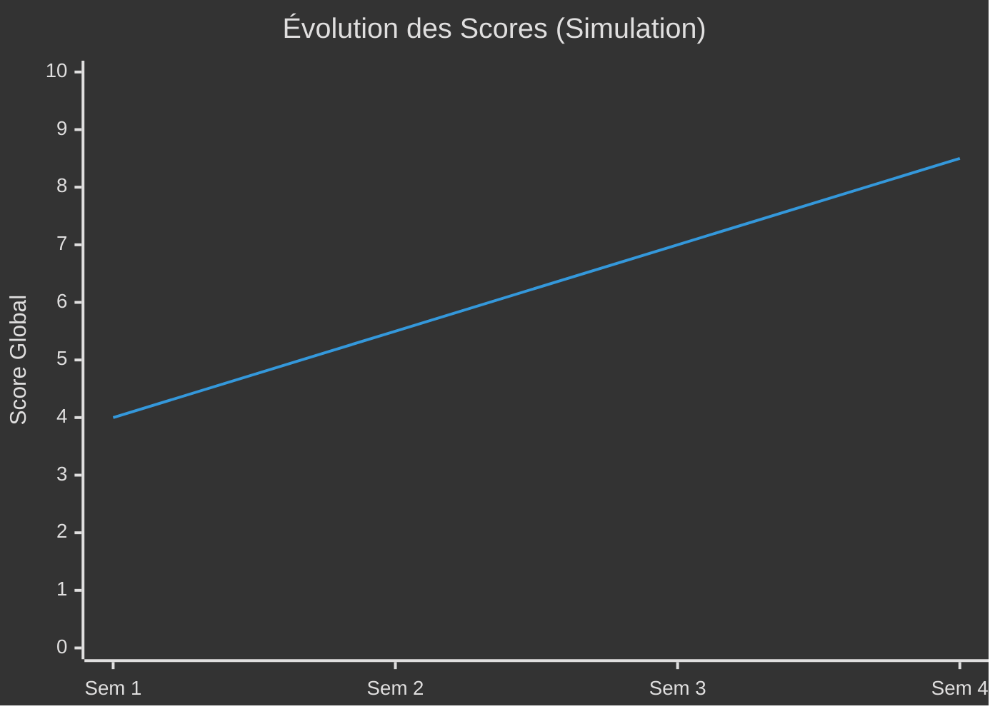

# :material-archive: Archives des Rapports

<div class="archives-header" markdown>

!!! abstract "Historique Complet"

    Cette section contient l'historique de tous les rapports générés par Army2077.
    Les rapports sont classés par date et par type.

</div>

---

## :material-calendar: Rapports par Date

### Novembre 2025

| Date | Agent | Type | Score | Lien |
|:-----|:------|:-----|:-----:|:-----|
| 2025-11-26 | :material-shield-star: Général | Audit Complet | **5.5/10** | [Voir](../general/latest.md) |
| 2025-11-26 | :material-shield-lock: CMD Sécurité | Audit Sécurité | **3/10** | [Voir](../commanders/security/latest.md) |
| 2025-11-26 | :material-test-tube: CMD Tests | Audit Tests | **70%** | [Voir](../commanders/tests/latest.md) |
| 2025-11-26 | :material-book-open-variant: CMD Doc | Audit Doc | **7.5/10** | [Voir](../commanders/documentation/latest.md) |
| 2025-11-26 | :material-clipboard-check: CMD Qualité | Audit Qualité | **7/10** | [Voir](../commanders/quality/latest.md) |
| 2025-11-26 | :material-source-branch: CMD Git | Audit Git | **9/10** | [Voir](../commanders/git/latest.md) |

---

## :material-filter: Rapports par Type

=== ":material-shield-star: Général"

    | Date | Titre | Score |
    |:-----|:------|:-----:|
    | 2025-11-26 | Audit Multi-Niveaux Complet | **5.5/10** |

=== ":material-shield-lock: Sécurité"

    | Date | Titre | Vulnérabilités |
    |:-----|:------|:--------------:|
    | 2025-11-26 | Audit Sécurité | **5 critiques** |

=== ":material-test-tube: Tests"

    | Date | Titre | Couverture |
    |:-----|:------|:----------:|
    | 2025-11-26 | Analyse Couverture | **70%** |

=== ":material-sitemap: Architecture"

    | Date | Titre | Patterns |
    |:-----|:------|:--------:|
    | 2025-11-26 | Analyse Architecture | **8 patterns** |

---

## :material-chart-timeline-variant: Évolution des Scores



---

## :material-information: Convention de Nommage

Les rapports archivés suivent la convention :

```
reports/[type]/[YYYY-MM-DD]-[titre].md
```

**Exemples**:

- `reports/general/2025-11-26-audit-complet.md`
- `reports/commanders/security/2025-11-26-vulnerabilities.md`

---

[:material-arrow-left: Retour au Dashboard](../index.md){ .md-button }
