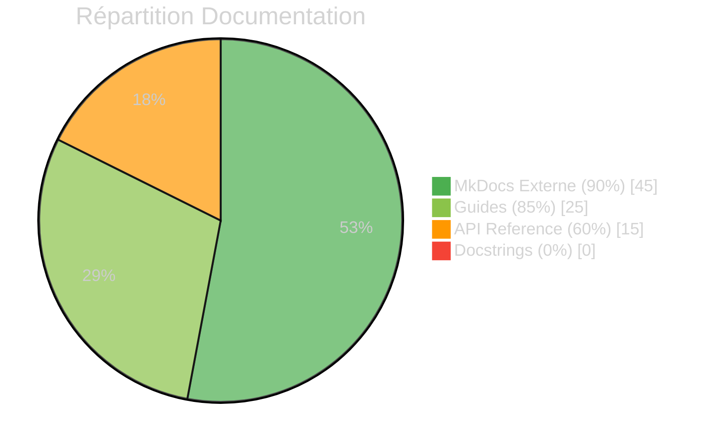

# :material-book-open-variant: Rapport du Commandant Documentation

<div class="report-header" markdown>

!!! success "Bonne Couverture Externe"

    | Attribut | Valeur |
    |:---------|:-------|
    | **Date** | 2025-11-26 |
    | **Score** | **7.5/10** |
    | **Pages Documentation** | **50+** |
    | **Statut** | :material-check-circle:{ .status-ok } Opérationnel |

</div>

---

## :material-chart-donut: Vue d'Ensemble



---

## :material-check-circle: Points Forts

### :material-book-multiple: Documentation Externe - 9/10

!!! success "Excellente"

    La documentation MkDocs est **exceptionnellement complète**.

| Section | Pages | Qualité |
|:--------|------:|:-------:|
| Getting Started | 4 | :material-star:{ .status-ok } Excellent |
| Architecture | 6 | :material-star:{ .status-ok } Excellent |
| Guides | 8 | :material-star:{ .status-ok } Excellent |
| Client | 12 | :material-check:{ .status-ok } Bon |
| Développement | 10 | :material-star:{ .status-ok } Excellent |
| Army2077 | 15 | :material-star:{ .status-ok } Excellent |
| API Reference | 4 | :material-check:{ .status-ok } Bon |

### :material-file-tree: Structure Exemplaire

```
docs/
├── index.md                    # Page d'accueil complète
├── getting-started/            # Installation, quickstart
├── client/                     # Architecture client
├── guides/                     # Guides techniques
├── development/                # Roadmap, CI/CD, tests
├── hive/                       # Army2077 complet
├── learning/                   # Centre d'apprentissage
├── reports/                    # Rapports (nouveau!)
└── reference/                  # FAQ
```

### :material-palette: Qualité Visuelle

- [x] Theme Material for MkDocs
- [x] Mode sombre/clair
- [x] Diagrammes Mermaid
- [x] Admonitions colorées
- [x] Code syntax highlighting
- [x] Navigation intuitive
- [x] Recherche intégrée

---

## :material-close-circle: Points Faibles

### :material-code-braces: Docstrings Doxygen - 0/10

!!! danger "CRITIQUE"

    **Aucun fichier header** ne contient de documentation Doxygen.

    **Impact**:

    - Impossible de générer une API reference automatique
    - Nouveaux développeurs doivent lire tout le code
    - IntelliSense sans informations

??? example "État Actuel vs Attendu"

    **Actuel** (Health.hpp):
    ```cpp
    /*
    ** EPITECH PROJECT, 2024
    ** r-type
    ** File description:
    ** Health
    */

    #ifndef HEALTH_HPP_
        #define HEALTH_HPP_

    namespace domain::value_objects {
        class Health {
            public:
                explicit Health(float value);
                Health heal(float value) const;
                Health damage(float value) const;
            // ...
        };
    }
    ```

    **Attendu**:
    ```cpp
    /**
     * @file Health.hpp
     * @brief Value Object représentant la santé d'une entité
     * @author AREA Team
     * @date 2024
     */

    #ifndef HEALTH_HPP_
        #define HEALTH_HPP_

    namespace domain::value_objects {

    /**
     * @class Health
     * @brief Value Object immutable représentant la santé d'une entité
     *
     * La santé est bornée entre 0 et une valeur maximale.
     * Toutes les opérations retournent une nouvelle instance (immutabilité).
     *
     * @invariant 0 <= _healthPoint <= maxHealth
     *
     * @example
     * @code
     * Health hp(100.0f);
     * Health damaged = hp.damage(30.0f);  // 70.0f
     * Health healed = damaged.heal(10.0f); // 80.0f
     * @endcode
     */
    class Health {
    public:
        /**
         * @brief Constructeur avec valeur initiale
         * @param value Valeur de santé initiale (>= 0)
         * @throws HealthException si value < 0
         */
        explicit Health(float value);

        /**
         * @brief Soigne l'entité
         * @param value Montant de soin (>= 0)
         * @return Nouvelle instance Health avec santé augmentée
         */
        [[nodiscard]] Health heal(float value) const;

        /**
         * @brief Inflige des dégâts
         * @param value Montant de dégâts (>= 0)
         * @return Nouvelle instance Health avec santé diminuée (min 0)
         */
        [[nodiscard]] Health damage(float value) const;
    };

    } // namespace domain::value_objects
    ```

### :material-comment-text: Commentaires Inline - 0/10

!!! danger "CRITIQUE"

    Les fichiers `.cpp` ne contiennent **aucun commentaire explicatif**.

    | Fichier | Lignes | Commentaires |
    |:--------|-------:|-------------:|
    | Engine.cpp | 40 | 0 |
    | GameLoop.cpp | 62 | 0 |
    | Login.cpp | 35 | 0 |
    | TCPClient.cpp | 259 | 0 |

### :material-sync-alert: Cohérence Code ↔ Documentation - 6/10

!!! warning "Attention"

    Certaines parties du code ne correspondent pas à la documentation.

    | Aspect | Documentation | Code | Cohérence |
    |:-------|:--------------|:-----|:---------:|
    | Architecture client | Expliquée | Refactorée | :material-alert:{ .status-warning } 70% |
    | ECS | Roadmap détaillée | Partiel | :material-alert:{ .status-warning } 50% |
    | Plugin system | Mentionné | Commenté | :material-close:{ .status-critical } 20% |
    | Value Objects | Architecturé | Implémenté | :material-check:{ .status-ok } 90% |

---

## :material-clipboard-check: Plan d'Action

### Priorité 1 - Docstrings

```
[ ] Ajouter @brief à tous les headers (60+ fichiers)
[ ] Ajouter @param et @return aux méthodes publiques
[ ] Configurer Doxygen pour génération auto
[ ] Intégrer Doxygen → MkDocs
```

### Priorité 2 - Commentaires

```
[ ] Documenter les algorithmes complexes
[ ] Expliquer les choix d'architecture dans le code
[ ] Ajouter TODO/FIXME là où nécessaire
```

### Priorité 3 - Cohérence

```
[ ] Mettre à jour doc client après refactoring
[ ] Documenter le système de plugins
[ ] Synchroniser ECS doc avec implémentation
```

---

## :material-file-document-edit: Templates Disponibles

### Template Header (.hpp)

```cpp
/**
 * @file ${FILENAME}
 * @brief ${BRIEF_DESCRIPTION}
 * @author ${AUTHOR}
 * @date ${DATE}
 *
 * @details
 * ${DETAILED_DESCRIPTION}
 */

#ifndef ${HEADER_GUARD}
    #define ${HEADER_GUARD}

namespace ${NAMESPACE} {

/**
 * @class ${CLASS_NAME}
 * @brief ${CLASS_BRIEF}
 *
 * ${CLASS_DETAILS}
 */
class ${CLASS_NAME} {
public:
    /**
     * @brief ${METHOD_BRIEF}
     * @param ${PARAM_NAME} ${PARAM_DESC}
     * @return ${RETURN_DESC}
     * @throws ${EXCEPTION} ${EXCEPTION_DESC}
     */
    ReturnType methodName(ParamType param);
};

} // namespace ${NAMESPACE}

#endif // ${HEADER_GUARD}
```

---

<div class="report-footer" markdown>

!!! quote "Devise du Commandant Documentation"

    *"La documentation n'est pas une option, c'est une responsabilité."*

:material-book-open-variant: **Rapport généré par le Commandant Documentation - Army2077**

</div>

---

[:material-arrow-left: Retour aux Commandants](../index.md){ .md-button }
