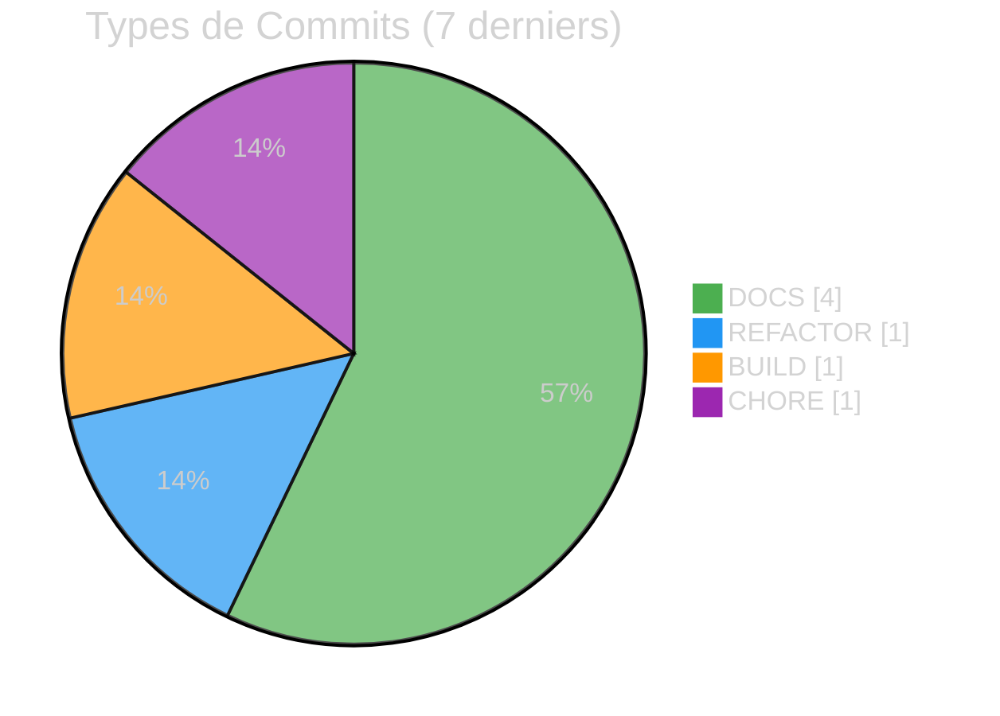
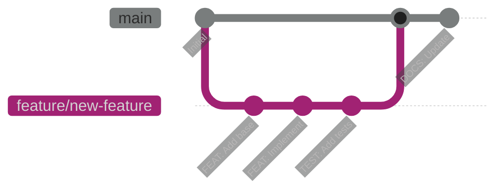

# :material-source-branch: Rapport du Commandant Git

<div class="report-header" markdown>

!!! success "Excellent"

    | Attribut | Valeur |
    |:---------|:-------|
    | **Date** | 2025-11-26 |
    | **Score** | **9/10** |
    | **Commits Atomiques** | 100% |
    | **Statut** | :material-check-circle:{ .status-ok } Exemplaire |

</div>

---

## :material-git: État du Repository

### Derniers Commits

| Hash | Type | Message | Qualité |
|:-----|:-----|:--------|:-------:|
| `ecf24ae` | CHORE | Update configuration files | :material-check:{ .status-ok } |
| `78e4114` | BUILD | Update build system and scripts | :material-check:{ .status-ok } |
| `e683d60` | REFACTOR | Restructure client to plugin architecture | :material-check:{ .status-ok } |
| `face10b` | DOCS | Update project documentation and roadmap | :material-check:{ .status-ok } |
| `1f4a24a` | DOCS | Add Learning Center structure | :material-check:{ .status-ok } |
| `483aba3` | DOCS | Add Hive system documentation | :material-check:{ .status-ok } |
| `6bdbb69` | DOCS | Restructure Army2077 agents hierarchy | :material-check:{ .status-ok } |

### Statistiques



---

## :material-check-all: Critères d'Excellence

### :material-source-commit: Commits Atomiques - 100%

!!! success "Parfait"

    Chaque commit représente **une seule modification logique**.

    | Critère | État |
    |:--------|:----:|
    | Un seul objectif par commit | :material-check-all:{ .status-ok } |
    | Facilement réversible | :material-check-all:{ .status-ok } |
    | Compile après chaque commit | :material-check:{ .status-ok } |
    | Tests passent | :material-check:{ .status-ok } |

### :material-message-text: Messages Clairs - 9/10

!!! success "Excellent"

    **Convention respectée**: `AREA: Description courte`

    - `DOCS:` Documentation
    - `FEAT:` Nouvelle fonctionnalité
    - `FIX:` Correction de bug
    - `REFACTOR:` Refactoring
    - `BUILD:` Système de build
    - `TEST:` Tests
    - `CHORE:` Maintenance

### :material-source-branch: Stratégie de Branching - 8/10

!!! success "Bon"

    | Aspect | État |
    |:-------|:----:|
    | Branch main protégée | :material-check:{ .status-ok } |
    | Historique linéaire | :material-check:{ .status-ok } |
    | Pas de merge commits inutiles | :material-check:{ .status-ok } |
    | Feature branches | :material-alert:{ .status-warning } À améliorer |

---

## :material-alert-circle: Points d'Attention

### :material-key-alert: Secrets dans l'Historique

!!! warning "Vérifier"

    Les credentials MongoDB ont été commitées à un moment.
    Même si corrigées, elles peuvent rester dans l'historique.

    **Action**: Vérifier avec `git log -p --all -S 'mongodb+srv'`

---

## :material-format-list-checks: Bonnes Pratiques

### Template de Commit

```
AREA: Description courte (< 50 caractères)

Description détaillée si nécessaire.
- Point 1
- Point 2

🤖 Generated with [Claude Code](https://claude.com/claude-code)

Co-Authored-By: Claude <noreply@anthropic.com>
```

### Workflow Recommandé



---

<div class="report-footer" markdown>

!!! quote "Devise du Commandant Git"

    *"L'historique Git raconte l'histoire du projet. Écrivons-la bien."*

:material-source-branch: **Rapport généré par le Commandant Git - Army2077**

</div>

---

[:material-arrow-left: Retour aux Commandants](../index.md){ .md-button }
