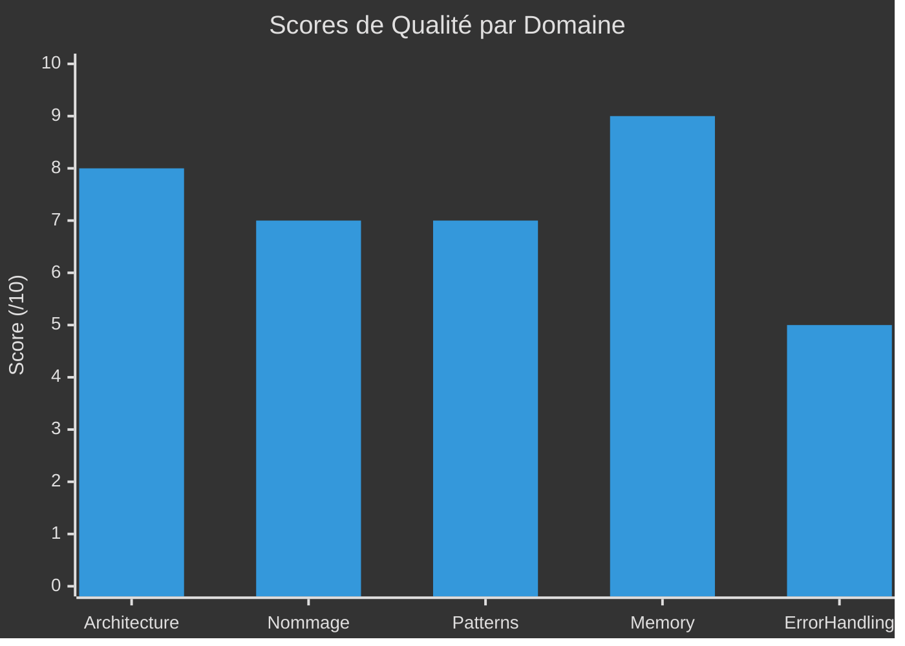

# :material-clipboard-check: Rapport du Commandant Qualité

<div class="report-header" markdown>

!!! info "Qualité en Amélioration"

    | Attribut | Valeur |
    |:---------|:-------|
    | **Date** | 2025-11-26 |
    | **Score** | **7/10** |
    | **Standards Respectés** | 75% |
    | **Statut** | :material-check-circle:{ .status-ok } Opérationnel |

</div>

---

## :material-chart-bar: Métriques de Qualité



---

## :material-check-circle: Points Forts

### :material-sitemap: Architecture - 8/10

!!! success "Solide"

    - [x] Architecture hexagonale bien appliquée
    - [x] Séparation claire des couches
    - [x] Interfaces pour abstraction
    - [x] Dependency Injection partielle
    - [x] Single Responsibility respecté

### :material-memory: Gestion Mémoire - 9/10

!!! success "Excellent"

    | Aspect | État |
    |:-------|:----:|
    | Smart pointers | :material-check-all:{ .status-ok } Utilisés partout |
    | unique_ptr pour ownership | :material-check:{ .status-ok } Correct |
    | shared_ptr pour partage | :material-check:{ .status-ok } Correct |
    | Pas de raw new/delete | :material-check:{ .status-ok } Vérifié |
    | RAII | :material-check:{ .status-ok } Appliqué |

### :material-code-tags: Patterns Utilisés - 7/10

!!! success "Bon"

    | Pattern | Utilisation |
    |:--------|:------------|
    | Strategy | IGraphicPlugin |
    | Observer | Signal/Slot |
    | Factory | Value Objects |
    | Singleton | Logger (implicit) |
    | State | SceneManager |

---

## :material-alert-circle: Points d'Attention

### :material-bug: Gestion d'Erreurs - 5/10

!!! warning "À Améliorer"

    ```cpp
    // Exemple problématique - MongoDBUserRepository.cpp
    User MongoDBUserRepository::documentToUser(const bsoncxx::document::view& doc) {
        auto id = doc["_id"].get_oid().value.to_string();  // Pas de try/catch!
        auto username = doc["username"].get_string().value;  // Assume existence
        // ...
    }
    ```

    **Risques**:

    - Exceptions non gérées
    - Crash si structure BD change
    - Pas de fallback

### :material-code-braces: Code Commenté - 4/10

!!! danger "Problématique"

    **Beaucoup de code commenté** qui devrait être supprimé ou réactivé.

    ```cpp
    // Engine.cpp
    // _window = std::make_shared<SFMLWindow>(...);  // Pourquoi commenté?

    // GameLoop.cpp
    // if (_deltatime > 0.1f) _deltatime = 0.1f;  // Limiter?
    // _sceneManager->handleEvent(*pEvent.value());  // Désactivé?
    ```

    **Règle**: Le code commenté n'a pas sa place en production.

### :material-format-align-left: Cohérence Nommage - 7/10

!!! info "Bon mais Améliorable"

    | Aspect | Convention | Respect |
    |:-------|:-----------|:-------:|
    | Classes | PascalCase | :material-check:{ .status-ok } 95% |
    | Méthodes | camelCase | :material-check:{ .status-ok } 90% |
    | Membres | _prefix | :material-alert:{ .status-warning } 80% |
    | Namespaces | snake_case | :material-alert:{ .status-warning } 70% |
    | Interfaces | I prefix | :material-check:{ .status-ok } 100% |

---

## :material-format-list-checks: Standards à Implémenter

### C++23 Best Practices

```cpp
// Utiliser [[nodiscard]] pour les retours importants
[[nodiscard]] Health heal(float value) const;

// Utiliser std::expected pour les erreurs (C++23)
std::expected<User, Error> findByEmail(const std::string& email);

// Utiliser constexpr où possible
constexpr float MAX_HEALTH = 100.0f;

// Utiliser std::string_view pour les paramètres
void setName(std::string_view name);
```

### Règles de Code

```
[x] Pas de magic numbers
[x] Const correctness
[ ] Explicit constructors
[ ] Override keyword systématique
[ ] Final keyword quand approprié
[ ] noexcept quand garanti
```

---

## :material-clipboard-check: Plan d'Action

### Priorité 1 - Nettoyage

```
[ ] Supprimer tout code commenté non pertinent
[ ] Réactiver ou documenter le code commenté nécessaire
[ ] Ajouter try/catch dans les adaptateurs
```

### Priorité 2 - Standardisation

```
[ ] Uniformiser les namespaces
[ ] Ajouter [[nodiscard]] aux getters
[ ] Ajouter override systématiquement
[ ] Documenter les conventions dans CONTRIBUTING.md
```

---

<div class="report-footer" markdown>

!!! quote "Devise du Commandant Qualité"

    *"La qualité n'est pas un acte, c'est une habitude."*

:material-clipboard-check: **Rapport généré par le Commandant Qualité - Army2077**

</div>

---

[:material-arrow-left: Retour aux Commandants](../index.md){ .md-button }
