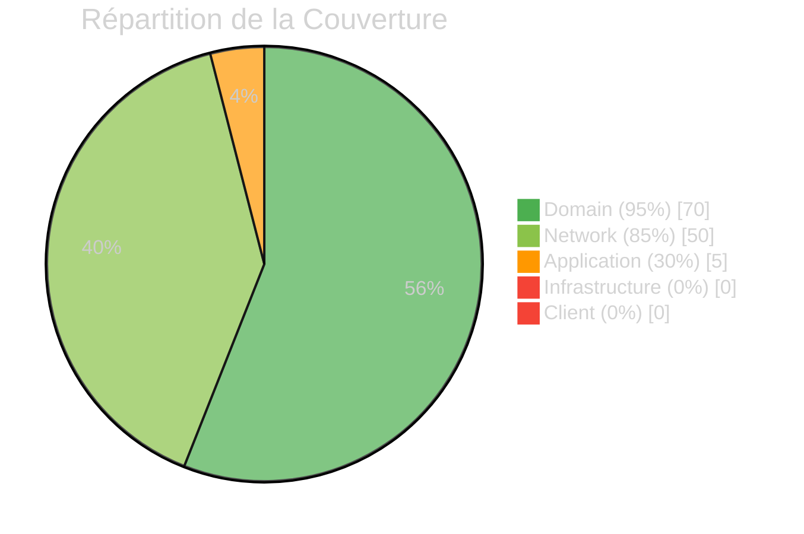
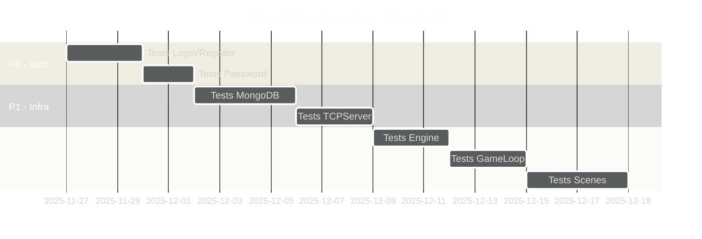

# :material-test-tube: Rapport du Commandant Tests

<div class="report-header" markdown>

!!! warning "Couverture Partielle"

    | Attribut | Valeur |
    |:---------|:-------|
    | **Date** | 2025-11-26 |
    | **Couverture Globale** | **70%** |
    | **Total Tests** | **210+** |
    | **Statut** | :material-alert-circle:{ .status-warning } Amélioration Requise |

</div>

---

## :material-chart-donut: Vue d'Ensemble



---

## :material-check-circle: Modules Bien Testés

### :material-domain: Domain Layer - 95%

!!! success "Excellent"

    Les Value Objects et Entities sont excellemment testés.

| Composant | Tests | Couverture |
|:----------|------:|:----------:|
| `Health` | 25 | :material-check-all:{ .status-ok } 100% |
| `Position` | 25 | :material-check-all:{ .status-ok } 100% |
| `Email` | 20 | :material-check-all:{ .status-ok } 100% |
| `Username` | 20 | :material-check-all:{ .status-ok } 100% |
| `Player` | 20+ | :material-check:{ .status-ok } 90% |

??? example "Exemples de Tests Domain"

    ```cpp
    // HealthTest.cpp
    TEST(HealthTest, HealIncreasesHealth) {
        Health health(50.0f);
        Health healed = health.heal(20.0f);
        EXPECT_EQ(healed.getValue(), 70.0f);
    }

    TEST(HealthTest, DamageDecreasesHealth) {
        Health health(100.0f);
        Health damaged = health.damage(30.0f);
        EXPECT_EQ(damaged.getValue(), 70.0f);
    }

    TEST(HealthTest, HealthCannotGoNegative) {
        Health health(10.0f);
        Health damaged = health.damage(50.0f);
        EXPECT_EQ(damaged.getValue(), 0.0f);
    }
    ```

### :material-lan: Network Protocol - 85%

!!! success "Bon"

    Les protocoles Protobuf et les tests d'intégration réseau sont solides.

| Composant | Tests | Couverture |
|:----------|------:|:----------:|
| Protobuf User | 10 | :material-check:{ .status-ok } 90% |
| Protobuf Auth | 15 | :material-check:{ .status-ok } 85% |
| Protobuf Game | 20 | :material-check:{ .status-ok } 85% |
| TCP Integration | 19 | :material-check:{ .status-ok } 80% |
| UDP Integration | 16 | :material-check:{ .status-ok } 80% |
| CommandParser | 30+ | :material-check:{ .status-ok } 85% |

### :material-wrench: Client Utils - 90%

!!! success "Excellent"

| Composant | Tests | Couverture |
|:----------|------:|:----------:|
| `Vecs` (Vec2, Vec3, Vec4) | 30 | :material-check-all:{ .status-ok } 95% |
| `Signal` | 25 | :material-check:{ .status-ok } 90% |

---

## :material-close-circle: Modules Non Testés

### :material-application: Application Layer - 30%

!!! danger "CRITIQUE - Logique Métier Non Testée"

    Les Use Cases d'authentification ne sont PAS testés.

| Composant | Tests | Impact |
|:----------|------:|:-------|
| `Login` | 0 | :material-alert-decagram:{ .status-critical } Authentification non validée |
| `Register` | 0 | :material-alert-decagram:{ .status-critical } Enregistrement non validé |
| `MovePlayerUseCase` | 0 | :material-alert:{ .status-warning } Gameplay non testé |

??? danger "Risques"

    - Bugs d'authentification non détectés (ex: logique inversée)
    - Régressions silencieuses
    - Comportement non prévisible en production

### :material-database: Infrastructure Layer - 0%

!!! danger "CRITIQUE - Persistance Non Testée"

| Composant | Tests | Impact |
|:----------|------:|:-------|
| `MongoDBUserRepository` | 0 | :material-alert-decagram:{ .status-critical } Accès BD non validé |
| `MongoDBConfiguration` | 0 | :material-alert-decagram:{ .status-critical } Config non testée |
| `TCPServer` | 0 | :material-alert-decagram:{ .status-critical } Serveur non testé |
| `UDPServer` | 0 | :material-alert-decagram:{ .status-critical } Serveur non testé |
| `Execute` adapters | 0 | :material-alert:{ .status-warning } Routing non testé |

### :material-monitor: Client Layer - 0%

!!! danger "CRITIQUE - Client Entièrement Non Testé"

| Composant | Tests | Impact |
|:----------|------:|:-------|
| `Engine` | 0 | :material-alert-decagram:{ .status-critical } Core non testé |
| `GameLoop` | 0 | :material-alert-decagram:{ .status-critical } Boucle non testée |
| `SceneManager` | 0 | :material-alert:{ .status-warning } Gestion scènes non testée |
| `LoginScene` | 0 | :material-alert:{ .status-warning } UI non testée |
| `SFMLRenderer` | 0 | :material-alert:{ .status-warning } Rendu non testé |

---

## :material-format-list-checks: Tests Manquants Prioritaires

### Priorité 1 - Authentification

```cpp
// tests/server/application/use_cases/auth/LoginTest.cpp

TEST_F(LoginTest, ValidCredentialsReturnsSuccess) {
    // Arrange
    auto user = createTestUser("test@email.com", "hashedPassword");
    EXPECT_CALL(*mockRepo, findByEmail("test@email.com"))
        .WillOnce(Return(user));

    // Act
    auto result = loginUseCase.execute("test@email.com", "password");

    // Assert
    EXPECT_TRUE(result.isSuccess());
}

TEST_F(LoginTest, InvalidPasswordReturnsFailure) {
    auto user = createTestUser("test@email.com", "differentHash");
    EXPECT_CALL(*mockRepo, findByEmail("test@email.com"))
        .WillOnce(Return(user));

    auto result = loginUseCase.execute("test@email.com", "wrongPassword");

    EXPECT_FALSE(result.isSuccess());
}

TEST_F(LoginTest, UserNotFoundReturnsFailure) {
    EXPECT_CALL(*mockRepo, findByEmail("unknown@email.com"))
        .WillOnce(Return(std::nullopt));

    auto result = loginUseCase.execute("unknown@email.com", "password");

    EXPECT_FALSE(result.isSuccess());
}
```

### Priorité 2 - Persistance MongoDB

```cpp
// tests/server/infrastructure/persistence/MongoDBUserRepositoryTest.cpp

class MongoDBUserRepositoryTest : public ::testing::Test {
protected:
    void SetUp() override {
        // Connexion à MongoDB de test
        testUri = "mongodb://localhost:8089/rtype_test";
        repo = std::make_unique<MongoDBUserRepository>(testUri);
    }

    void TearDown() override {
        // Nettoyer la base de test
        repo->deleteAll();
    }
};

TEST_F(MongoDBUserRepositoryTest, SaveAndFindByEmail) {
    User user("test@email.com", "username", "hashedPassword");

    repo->save(user);
    auto found = repo->findByEmail("test@email.com");

    ASSERT_TRUE(found.has_value());
    EXPECT_EQ(found->getEmail(), "test@email.com");
}
```

### Priorité 3 - Client Engine

```cpp
// tests/client/core/EngineTest.cpp

TEST(EngineTest, InitializeCreatesWindow) {
    auto mockTcpClient = std::make_shared<MockTCPClient>();
    Engine engine;

    engine.initialize(mockTcpClient);

    EXPECT_NE(engine.getWindow(), nullptr);
    EXPECT_TRUE(engine.isInitialized());
}

TEST(EngineTest, RunStartsGameLoop) {
    Engine engine;
    engine.initialize(/*...*/);

    // Simulate running for a few frames
    auto future = std::async([&]() { engine.run(); });

    std::this_thread::sleep_for(100ms);
    engine.stop();

    EXPECT_NO_THROW(future.get());
}
```

---

## :material-chart-line: Métriques

### Statistiques Actuelles

| Métrique | Valeur | Cible | État |
|:---------|:------:|:-----:|:----:|
| Tests totaux | 210+ | 500+ | :material-alert:{ .status-warning } |
| Couverture globale | 70% | 85% | :material-alert:{ .status-warning } |
| Couverture critique | 30% | 90% | :material-close:{ .status-critical } |
| Tests E2E | 0 | 20+ | :material-close:{ .status-critical } |
| Tests Performance | 2 | 15+ | :material-close:{ .status-critical } |

### Évolution Recommandée



---

## :material-tools: Infrastructure de Test

### Configuration Actuelle

!!! success "Points Forts"

    - [x] Google Test intégré (GTest)
    - [x] CMake bien configuré
    - [x] Script `test.sh` complet
    - [x] Sanitizers activés en Debug
    - [x] gtest_discover_tests() automatique

### Améliorations Suggérées

```cmake
# Ajouter au CMakeLists.txt

# Coverage
if(ENABLE_COVERAGE)
    target_compile_options(tests PRIVATE --coverage)
    target_link_options(tests PRIVATE --coverage)
endif()

# Mocking
find_package(GTest CONFIG REQUIRED)
# GMock est inclus avec GTest

# Timeout pour éviter tests bloquants
set_tests_properties(${TEST_NAME} PROPERTIES TIMEOUT 10)
```

---

## :material-clipboard-check: Plan d'Action

### Semaine 1

```
[ ] Ajouter tests Login use case (5+ tests)
[ ] Ajouter tests Register use case (5+ tests)
[ ] Ajouter tests Password (3+ tests)
[ ] Setup GMock pour repositories
```

### Semaine 2

```
[ ] Tests MongoDBUserRepository (10+ tests)
[ ] Tests TCPServer (8+ tests)
[ ] Tests UDPServer (8+ tests)
[ ] Tests Execute adapters (5+ tests)
```

### Semaine 3

```
[ ] Tests Engine (5+ tests)
[ ] Tests GameLoop (5+ tests)
[ ] Tests SceneManager (5+ tests)
[ ] Setup coverage report
```

---

<div class="report-footer" markdown>

!!! quote "Devise du Commandant Tests"

    *"Le code non testé est du code cassé qu'on ne le sait pas encore."*

:material-test-tube: **Rapport généré par le Commandant Tests - Army2077**

</div>

---

[:material-arrow-left: Retour aux Commandants](../index.md){ .md-button }
[:material-shield-star: Voir Rapport Général](../../general/latest.md){ .md-button .md-button--primary }
