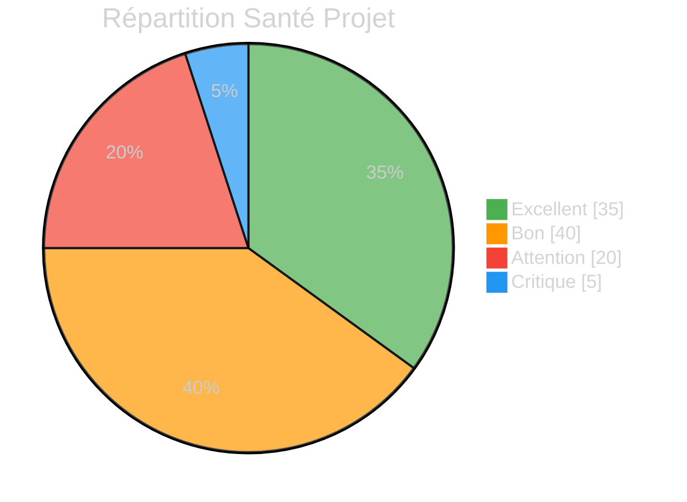

# :material-chart-areaspline: Centre de Commandement - Rapports

<div class="report-hero" markdown>

!!! abstract "Mission Control - Army2077"

    **Bienvenue au Centre de Commandement.** Cette section centralise tous les rapports
    générés par le Général et ses forces. Chaque rapport est une analyse approfondie
    de l'état du projet R-Type.

</div>

---

## :material-view-dashboard: Dashboard Exécutif

<div class="grid cards" markdown>

-   :material-shield-star:{ .lg .middle } **Rapport du Général**

    ---

    Vue stratégique globale du projet. Coordination des forces et décisions de commandement.

    [:octicons-arrow-right-24: Dernier rapport](general/latest.md)

-   :material-file-document-multiple:{ .lg .middle } **Rapports Commandants**

    ---

    Rapports détaillés par domaine : Documentation, Qualité, Sécurité, Git, Tests.

    [:octicons-arrow-right-24: Tous les rapports](commanders/index.md)

-   :material-account-group:{ .lg .middle } **Rapports Soldats**

    ---

    Analyses spécialisées : Architecture, Code Review, Conseils d'apprentissage.

    [:octicons-arrow-right-24: Analyses](soldiers/index.md)

-   :material-archive:{ .lg .middle } **Archives**

    ---

    Historique complet de tous les rapports passés, classés par date.

    [:octicons-arrow-right-24: Consulter](archives/index.md)

</div>

---

## :material-pulse: État des Forces en Temps Réel

!!! tip "Dernière mise à jour"
    Les métriques ci-dessous reflètent l'état du projet lors du dernier audit.

### Indicateurs de Santé Projet



### Tableau de Bord des Commandants

| Commandant | Domaine | État | Score | Dernière Action |
|:-----------|:--------|:----:|:-----:|:----------------|
| :material-book-open-variant: CMD Documentation | Documentation | :material-check-circle:{ .status-ok } | **7.5/10** | Mise à jour roadmap |
| :material-test-tube: CMD Qualité | Tests & Qualité | :material-alert-circle:{ .status-warning } | **3.5/5** | Audit couverture |
| :material-shield-lock: CMD Sécurité | Sécurité & CI/CD | :material-close-circle:{ .status-critical } | **3/10** | 5 vulnérabilités |
| :material-source-branch: CMD Git | Versioning | :material-check-circle:{ .status-ok } | **9/10** | 7 commits atomiques |
| :material-clipboard-check: CMD Tests | Testing | :material-alert-circle:{ .status-warning } | **70%** | Tests manquants |

### Progression Globale

=== ":material-security: Sécurité"

    !!! danger "CRITIQUE - Actions Requises"

        **5 vulnérabilités critiques** détectées nécessitant une action immédiate.

        - [ ] MongoDB credentials en dur
        - [ ] Hachage sans salt
        - [ ] Passwords dans logs
        - [ ] Logique Register inversée
        - [ ] Password::verify() cassée

=== ":material-code-braces: Architecture"

    !!! warning "Attention - Blockers"

        **Score: 6.5/10** - Conception solide, réalisation incomplète.

        - [x] Séparation en couches claire
        - [x] Interfaces bien définies
        - [ ] Engine::initialize() non fonctionnel
        - [ ] GameLoop incomplet
        - [ ] SFMLPlugin commenté

=== ":material-test-tube: Tests"

    !!! info "Couverture Partielle"

        **210+ tests** - Domain excellemment couvert, Application/Client à 0%.

        | Couche | Couverture |
        |--------|-----------|
        | Domain | 95% :material-check: |
        | Network | 85% :material-check: |
        | Application | 30% :material-alert: |
        | Client | 0% :material-close: |

=== ":material-file-document: Documentation"

    !!! success "Bonne Couverture Externe"

        **Score: 7.5/10** - Documentation MkDocs excellente.

        - [x] Architecture documentée
        - [x] Guides complets
        - [x] Army2077 documenté
        - [ ] Docstrings Doxygen: 0%
        - [ ] Commentaires inline: 0%

---

## :material-clock-outline: Rapports Récents

<div class="timeline" markdown>

### :material-star: Audit Complet - Aujourd'hui

!!! note "Rapport du Général"
    Audit multi-niveaux complet du projet R-Type.
    **Verdict**: Ne pas déployer en production avant correction des vulnérabilités.

    [:octicons-arrow-right-24: Lire le rapport complet](general/latest.md)

### :material-shield-alert: Audit Sécurité - Aujourd'hui

!!! danger "Commandant Sécurité"
    5 vulnérabilités critiques détectées.
    **Priorité**: MAXIMALE

    [:octicons-arrow-right-24: Détails sécurité](commanders/security/latest.md)

### :material-test-tube: Audit Tests - Aujourd'hui

!!! warning "Commandant Tests"
    Couverture globale: 70%. Application/Infrastructure non testées.

    [:octicons-arrow-right-24: Rapport tests](commanders/tests/latest.md)

</div>

---

## :material-target: Prochaines Actions Prioritaires

!!! danger "Phase 1 - URGENCE (Immédiat)"

    ```
    [ ] SÉCURITÉ: Migrer MongoDB URI vers env var
    [ ] SÉCURITÉ: Implémenter salt dans PasswordUtils
    [ ] SÉCURITÉ: Supprimer logs de passwords
    [ ] SÉCURITÉ: Corriger Register.cpp (logique inversée)
    [ ] SÉCURITÉ: Corriger Password::verify()
    ```

!!! warning "Phase 2 - BLOCKERS (Cette semaine)"

    ```
    [ ] ARCHI: Activer initialization Window dans Engine
    [ ] ARCHI: Compléter GameLoop (deltatime, events)
    [ ] ARCHI: Découpler SFML des interfaces
    [ ] ARCHI: Implémenter SFMLPlugin
    ```

!!! info "Phase 3 - QUALITÉ (2 semaines)"

    ```
    [ ] TESTS: Tests authentification (Login/Register)
    [ ] TESTS: Tests MongoDB repository
    [ ] TESTS: Tests TCPServer
    [ ] DOC: Ajouter docstrings Doxygen
    ```

---

## :material-help-circle: Navigation Rapide

<div class="grid" markdown>

[:material-star: Rapport Général](general/latest.md){ .md-button .md-button--primary }
[:material-shield-lock: Sécurité](commanders/security/latest.md){ .md-button }
[:material-test-tube: Tests](commanders/tests/latest.md){ .md-button }
[:material-code-braces: Architecture](soldiers/architecture/latest.md){ .md-button }

</div>

---

<div class="report-footer" markdown>

!!! quote "Devise du Général"

    *"Discipline, Excellence, Apprentissage"*

    - **Discipline** : Standards rigoureux, processus clairs
    - **Excellence** : Qualité professionnelle à tous les niveaux
    - **Apprentissage** : Chaque action améliore les compétences

</div>
