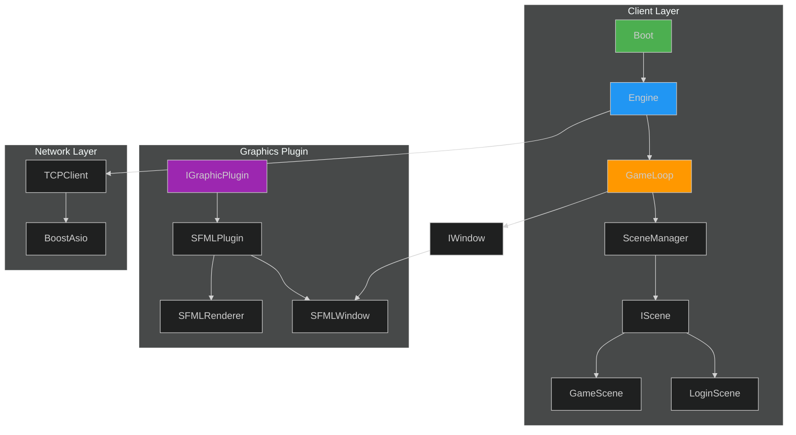

# :material-sitemap: Rapport du Soldat Architecture

<div class="report-header" markdown>

!!! info "Analyse Architecturale"

    | Attribut | Valeur |
    |:---------|:-------|
    | **Date** | 2025-11-26 |
    | **Score** | **6.5/10** |
    | **Patterns Identifiés** | 8 |
    | **Anti-Patterns** | 4 |

</div>

---

## :material-layers: Vue d'Ensemble



---

## :material-check-circle: Patterns Identifiés

### 1. Interface Segregation

!!! success "Bien Appliqué"

    ```cpp
    class IWindow { /* ... */ };
    class IRenderer { /* ... */ };
    class IScene { /* ... */ };
    class IGraphicPlugin { /* ... */ };
    ```

### 2. Strategy Pattern

!!! success "Plugin System"

    ```cpp
    // IGraphicPlugin permet de switcher entre SFML, SDL, etc.
    extern "C" {
        graphics::IGraphicPlugin* createGraphPlugin();
    }
    ```

### 3. Observer Pattern

!!! success "Signal/Slot"

    ```cpp
    template<typename ...Args>
    class Signal {
        void connect(const Slot& slot);
        void emit(Args... args);
    };
    ```

### 4. State Pattern

!!! info "SceneManager"

    Gestion des états via scenes (Login, Game).

---

## :material-close-circle: Anti-Patterns Détectés

### 1. :material-alert: Couplage SFML dans Interfaces

!!! danger "Violation DIP"

    ```cpp
    // IScene.hpp
    #include <SFML/Window/Event.hpp>  // Couplage direct!
    virtual void handleEvent(const sf::Event &event) = 0;
    ```

    **Impact**: Impossible de vraiment utiliser le plugin system.

### 2. :material-alert: Code Commenté en Production

!!! warning "Dead Code"

    ```cpp
    // Engine.cpp
    // _window = std::make_shared<SFMLWindow>(...);  // ???
    ```

### 3. :material-alert: Initialization Incomplète

!!! danger "NPE Garanti"

    ```cpp
    void Engine::initialize(...) {
        // Window jamais créée!
        _gameLoop = std::make_unique<GameLoop>(_window, ...);
        // _window est nullptr!
    }
    ```

### 4. :material-alert: Namespaces Incohérents

!!! warning "Organisation"

    ```cpp
    namespace graphics { }      // OK
    namespace core { }          // OK
    class GameScene { }         // Pas de namespace!
    class SFMLWindow { }        // Pas de namespace!
    ```

---

## :material-clipboard-check: Recommandations

### Priorité 1 - Découpler SFML

```cpp
// Créer une abstraction pour les événements
namespace core::events {
    struct KeyPressed { int keyCode; };
    struct WindowClosed {};
    using Event = std::variant<KeyPressed, WindowClosed>;
}
```

### Priorité 2 - Compléter Initialization

```cpp
void Engine::initialize(/*...*/) {
    // Créer la window via plugin ou directement
    _window = std::make_shared<SFMLWindow>(/*...*/);
    _gameLoop = std::make_unique<GameLoop>(_window, /*...*/);
}
```

---

<div class="report-footer" markdown>

:material-sitemap: **Rapport généré par le Soldat Architecture - Army2077**

</div>

---

[:material-arrow-left: Retour aux Soldats](../index.md){ .md-button }
