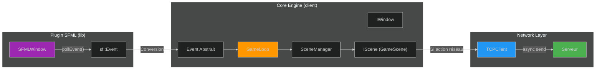
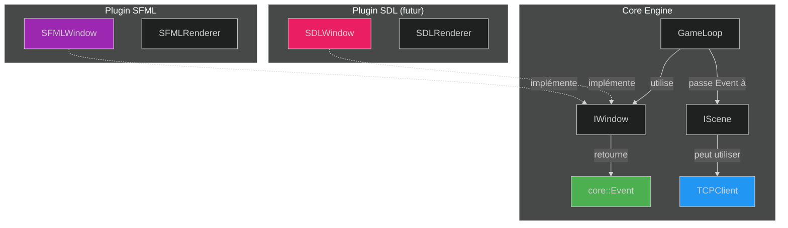

# :material-transit-connection-variant: Rapport - Flux des Événements

<div class="report-header" markdown>

!!! info "Analyse du Flux Input → Réseau"

    | Attribut | Valeur |
    |:---------|:-------|
    | **Date** | 2025-11-26 |
    | **Question** | Communication SFML ↔ Serveur |
    | **Statut** | :material-alert: Architecture à compléter |

</div>

---

## :material-help-circle: Question Posée

> "Si le joueur appuie sur B, c'est côté SFML qu'il recevra l'info que le joueur a appuyé sur B et du coup exécuter une action. Faut-il que je lie mon serveur et ma SFML pour envoyer les informations ?"

---

## :material-close-circle: Réponse Courte

!!! danger "NON - Ne jamais lier directement SFML au Serveur"

    Le plugin SFML ne doit **JAMAIS** connaître l'existence du réseau.
    C'est le **Core Engine** qui fait le pont entre les deux.

---

## :material-layers: Architecture Correcte

### Principe de Séparation des Responsabilités



---

## :material-numeric-1-circle: Flux Complet : Appui sur "B"

### Étape 1 - Capture par SFML (Plugin)

```
┌─────────────────────────────────────────────────────────┐
│                    Plugin SFML                          │
├─────────────────────────────────────────────────────────┤
│  1. sf::RenderWindow détecte l'appui sur "B"            │
│  2. SFMLWindow::pollEvent() récupère sf::Event          │
│  3. Convertit sf::Event → Event abstrait du Core        │
│  4. Retourne l'Event abstrait (pas sf::Event!)          │
└─────────────────────────────────────────────────────────┘
                           │
                           ▼
```

### Étape 2 - Traitement par le Core Engine

```
┌─────────────────────────────────────────────────────────┐
│                    Core Engine                          │
├─────────────────────────────────────────────────────────┤
│  5. GameLoop reçoit l'Event abstrait                    │
│  6. GameLoop::update() appelle SceneManager             │
│  7. SceneManager passe l'event à la Scene active        │
│  8. GameScene::handleEvent() interprète l'action        │
│     → "B" = Tirer une bombe                             │
└─────────────────────────────────────────────────────────┘
                           │
                           ▼
```

### Étape 3 - Communication Réseau (si nécessaire)

```
┌─────────────────────────────────────────────────────────┐
│                    Network Layer                        │
├─────────────────────────────────────────────────────────┤
│  9. GameScene décide d'envoyer au serveur               │
│  10. Construit le message/packet (protocole)            │
│  11. Appelle _tcpClient->send(packet)                   │
│  12. TCPClient envoie de manière asynchrone             │
└─────────────────────────────────────────────────────────┘
```

---

## :material-numeric-2-circle: Ce qui Existe Déjà

### Réseau - OK

!!! success "TCPClient est prêt"

    Le `TCPClient` existe et fonctionne avec Boost.ASIO en asynchrone.
    Les scenes y ont déjà accès via le constructeur.

### Plugin System - OK

!!! success "Plugin SFML chargé dynamiquement"

    `DynamicLib` charge `librtype_sfml.so` via `dlopen()`.
    L'abstraction `IGraphicPlugin` fonctionne.

---

## :material-numeric-3-circle: Ce qui Manque

### Problème 1 - Couplage sf::Event

!!! danger "IScene dépend de SFML"

    ```cpp
    // IScene.hpp - PROBLÈME
    #include <SFML/Window/Event.hpp>  // Couplage!
    virtual void handleEvent(const sf::Event &event) = 0;
    ```

    **Conséquence**: Les scenes connaissent SFML directement.

### Problème 2 - Events non propagés

!!! danger "GameLoop ignore les events"

    ```cpp
    // GameLoop.cpp - PROBLÈME
    while (_window->pollEvent()) {}  // Events jetés!
    _sceneManager->update(_deltatime);  // Pas d'events passés
    ```

### Problème 3 - Pas d'Event Abstrait

!!! warning "Besoin d'une abstraction"

    Il manque un système d'événements agnostique :

    ```cpp
    namespace core::events {
        struct KeyPressed { int keyCode; bool shift; bool ctrl; };
        struct KeyReleased { int keyCode; };
        struct MousePressed { int button; Vec2i position; };
        struct WindowClosed {};

        using Event = std::variant<KeyPressed, KeyReleased, MousePressed, WindowClosed>;
    }
    ```

---

## :material-numeric-4-circle: Architecture Cible

### Diagramme de Dépendances Correct



### Flux de Données Correct

```
┌──────────────┐      ┌──────────────┐      ┌──────────────┐
│    Plugin    │      │     Core     │      │   Network    │
│    (SFML)    │      │   (Engine)   │      │   (TCP)      │
└──────────────┘      └──────────────┘      └──────────────┘
       │                     │                     │
       │  pollEvent()        │                     │
       │ ─────────────────►  │                     │
       │  core::Event        │                     │
       │ ◄───────────────────│                     │
       │                     │                     │
       │                     │  handleEvent()      │
       │                     │ ──────────────────► │
       │                     │  (si besoin réseau) │
       │                     │                     │
       │                     │  tcpClient->send()  │
       │                     │ ──────────────────► │
       │                     │                     │
```

---

## :material-clipboard-check: Recommandations

### Étape 1 - Créer Event Abstrait

Créer `src/client/include/events/InputEvent.hpp` :

```cpp
namespace core::events {
    enum class Key { A, B, C, ..., Space, Enter, Escape };

    struct KeyPressed { Key key; };
    struct KeyReleased { Key key; };
    struct WindowClosed {};

    using InputEvent = std::variant<KeyPressed, KeyReleased, WindowClosed>;
}
```

### Étape 2 - Modifier IWindow

```cpp
class IWindow {
    // Retourne un Event abstrait, pas sf::Event
    virtual std::optional<core::events::InputEvent> pollEvent() = 0;
};
```

### Étape 3 - SFMLWindow Convertit

```cpp
std::optional<core::events::InputEvent> SFMLWindow::pollEvent() {
    sf::Event sfEvent;
    if (!_window.pollEvent(sfEvent)) return std::nullopt;

    // Conversion SFML → Core
    if (sfEvent.type == sf::Event::KeyPressed) {
        return core::events::KeyPressed{ convertKey(sfEvent.key.code) };
    }
    // ...
}
```

### Étape 4 - GameLoop Propage

```cpp
void GameLoop::run() {
    while (_window->isOpen()) {
        while (auto event = _window->pollEvent()) {
            _sceneManager->handleEvent(*event);  // Propager!
        }
        _sceneManager->update(_deltatime);
        // ...
    }
}
```

### Étape 5 - Scene Décide

```cpp
void GameScene::handleEvent(const core::events::InputEvent& event) {
    if (auto* key = std::get_if<core::events::KeyPressed>(&event)) {
        if (key->key == core::events::Key::B) {
            // Créer le packet et envoyer au serveur
            Packet packet = createBombPacket(_playerId);
            _tcpClient->send(packet);
        }
    }
}
```

---

## :material-chart-box: Résumé

| Couche | Responsabilité | Connaît le Réseau ? |
|:-------|:---------------|:-------------------:|
| **Plugin SFML** | Capturer les inputs, convertir en Event abstrait | :material-close: NON |
| **Core Engine** | Propager les events aux Scenes | :material-close: NON |
| **Scenes** | Interpréter les actions, décider d'envoyer au serveur | :material-check: OUI |
| **TCPClient** | Envoyer/recevoir les données réseau | :material-check: OUI |

---

<div class="report-footer" markdown>

:material-transit-connection-variant: **Rapport généré par le Soldat Architecture - Army2077**

</div>

---

[:material-arrow-left: Retour aux Soldats](../index.md){ .md-button }
