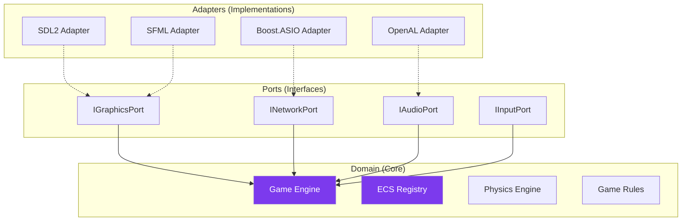
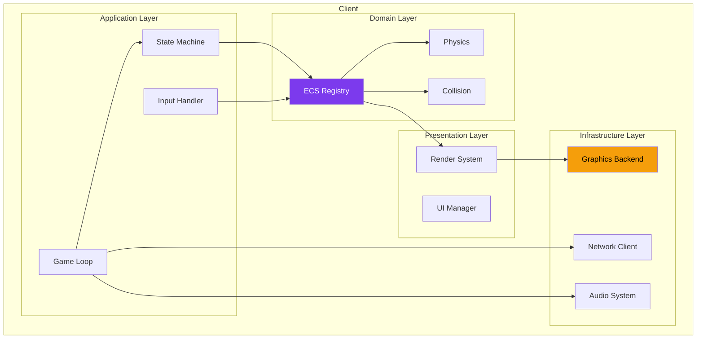
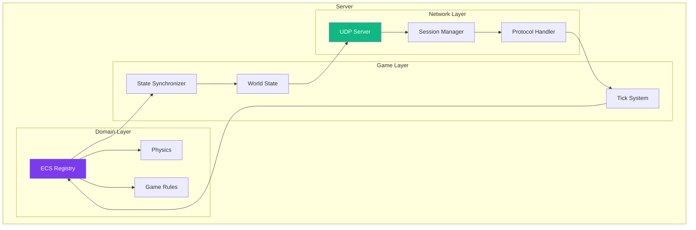
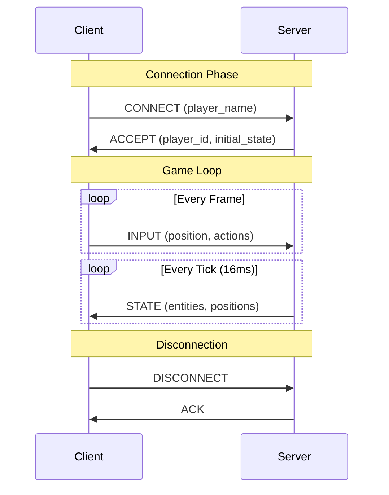
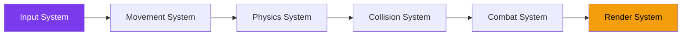
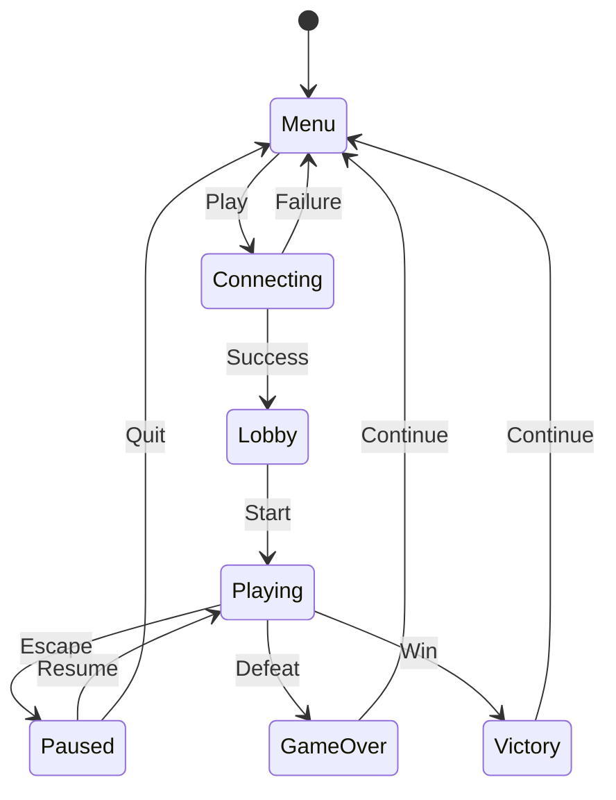

---
tags:
  - technique
  - architecture
---

# Architecture Système

Vision détaillée de l'architecture R-Type.

## Architecture Hexagonale

R-Type suit les principes de l'**architecture hexagonale** (Ports & Adapters) pour une séparation claire des responsabilités.



### Avantages

- **Testabilité** : Le domaine peut être testé sans infrastructure
- **Flexibilité** : Changement de backend sans toucher au cœur
- **Maintenabilité** : Responsabilités clairement définies

---

## Client Architecture



### Game Loop

```cpp
void GameLoop::run() {
    while (running_) {
        auto dt = clock_.restart();

        // 1. Input
        input_handler_.poll();

        // 2. Network
        network_client_.receive();

        // 3. Update
        ecs_.update(dt);

        // 4. Render
        renderer_.render(ecs_);

        // 5. Present
        graphics_backend_.present();
    }
}
```

---

## Server Architecture



### Tick System

Le serveur fonctionne en tick fixe (60 Hz par défaut) :

```cpp
void Server::run() {
    constexpr auto tick_duration = 16.67ms;  // 60 Hz

    while (running_) {
        auto start = Clock::now();

        // 1. Process incoming packets
        network_.process_incoming();

        // 2. Update game state
        game_world_.tick();

        // 3. Broadcast state to clients
        synchronizer_.broadcast();

        // 4. Sleep until next tick
        auto elapsed = Clock::now() - start;
        if (elapsed < tick_duration) {
            std::this_thread::sleep_for(tick_duration - elapsed);
        }
    }
}
```

---

## Communication Client-Server



### Protocole UDP

| Type | Direction | Description |
|------|-----------|-------------|
| `CONNECT` | C→S | Demande de connexion |
| `ACCEPT` | S→C | Connexion acceptée |
| `REJECT` | S→C | Connexion refusée |
| `INPUT` | C→S | Actions du joueur |
| `STATE` | S→C | État du monde |
| `EVENT` | S→C | Événements (mort, spawn) |
| `DISCONNECT` | C↔S | Déconnexion propre |

---

## Entity Component System

### Composants Core

```cpp
// Identité
struct EntityInfo {
    EntityType type;
    uint32_t owner_id;
};

// Transform
struct Position { float x, y; };
struct Velocity { float dx, dy; };
struct Rotation { float angle; };

// Rendering
struct Sprite {
    TextureId texture;
    IntRect source_rect;
    int z_order;
};

// Gameplay
struct Health { int current, max; };
struct Weapon { WeaponType type; float cooldown; };
struct Hitbox { float width, height; };
```

### Systèmes



| Système | Responsabilité |
|---------|----------------|
| `InputSystem` | Convertit les inputs en intentions |
| `MovementSystem` | Applique la vélocité aux positions |
| `PhysicsSystem` | Gère la gravité, friction |
| `CollisionSystem` | Détecte et résout les collisions |
| `CombatSystem` | Gère les dégâts et la mort |
| `RenderSystem` | Prépare les entités pour le rendu |

---

## State Machine

Les états du jeu sont gérés par une machine à états :



```cpp
class StateMachine {
    std::stack<std::unique_ptr<IState>> states_;

public:
    void push(std::unique_ptr<IState> state);
    void pop();
    void update(float dt);
    void render();
};
```
