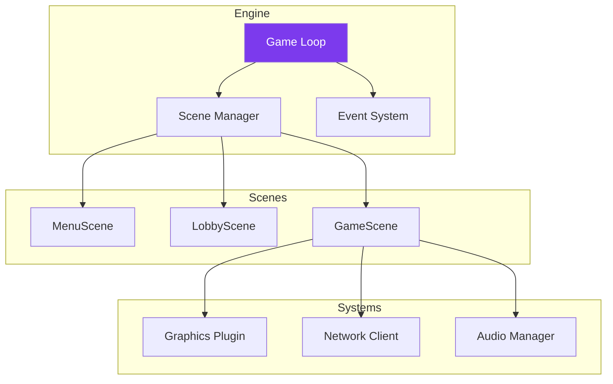
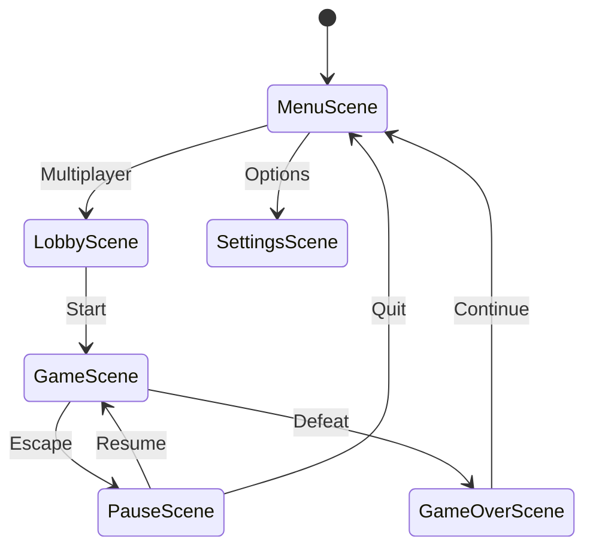

---
tags:
  - technique
  - architecture
  - client
---

# Architecture Client

Le client R-Type utilise une architecture **Scene-based** avec **plugins** graphiques.

## Vue d'Ensemble



---

## Scene System

### Interface IScene

```cpp
class IScene {
public:
    virtual ~IScene() = default;

    virtual void onEnter() = 0;
    virtual void onExit() = 0;
    virtual void handleEvent(const Event& event) = 0;
    virtual void update(float dt) = 0;
    virtual void render() = 0;
};
```

### Scene Manager

```cpp
class SceneManager {
    std::stack<std::unique_ptr<IScene>> scenes_;

public:
    void push(std::unique_ptr<IScene> scene) {
        if (!scenes_.empty())
            scenes_.top()->onExit();
        scenes_.push(std::move(scene));
        scenes_.top()->onEnter();
    }

    void pop() {
        if (!scenes_.empty()) {
            scenes_.top()->onExit();
            scenes_.pop();
        }
        if (!scenes_.empty())
            scenes_.top()->onEnter();
    }

    void update(float dt) {
        if (!scenes_.empty())
            scenes_.top()->update(dt);
    }

    void render() {
        if (!scenes_.empty())
            scenes_.top()->render();
    }
};
```

### Scenes du Jeu



---

## Game Loop

```cpp
class Engine {
    SceneManager scenes_;
    IGraphicsBackend& graphics_;
    NetworkClient& network_;
    AudioManager& audio_;
    Clock clock_;
    bool running_ = true;

public:
    void run() {
        while (running_) {
            float dt = clock_.restart();

            // 1. Events
            Event event;
            while (graphics_.getWindow().pollEvent(event)) {
                if (event.type == EventType::Closed)
                    running_ = false;
                scenes_.handleEvent(event);
            }

            // 2. Network
            network_.poll();

            // 3. Update
            scenes_.update(dt);

            // 4. Render
            graphics_.clear();
            scenes_.render();
            graphics_.present();
        }
    }
};
```

---

## Event System

Système d'événements type-safe avec `std::variant` :

```cpp
// Event types
struct KeyEvent { KeyCode key; bool pressed; };
struct MouseEvent { int x, y; };
struct NetworkEvent { PacketType type; Packet data; };
struct GameEvent { std::string name; };

using Event = std::variant<
    KeyEvent,
    MouseEvent,
    NetworkEvent,
    GameEvent
>;

// Event handler
class EventDispatcher {
public:
    template<typename T, typename Handler>
    void on(Handler&& handler) {
        handlers_[typeid(T).hash_code()] =
            [h = std::forward<Handler>(handler)](const Event& e) {
                h(std::get<T>(e));
            };
    }

    void dispatch(const Event& event) {
        std::visit([this](auto&& e) {
            auto it = handlers_.find(typeid(e).hash_code());
            if (it != handlers_.end())
                it->second(event);
        }, event);
    }
};
```

---

## Plugin System (Graphics)

```cpp
// Plugin interface
class IGraphicsPlugin {
public:
    virtual std::unique_ptr<IGraphicsBackend> create() = 0;
    virtual std::string name() const = 0;
};

// Plugin loader
class PluginLoader {
public:
    template<typename T>
    std::unique_ptr<T> load(const std::string& name) {
        auto handle = dlopen(
            ("lib" + name + ".so").c_str(),
            RTLD_LAZY
        );

        auto factory = reinterpret_cast<T*(*)()>(
            dlsym(handle, "createPlugin")
        );

        return std::unique_ptr<T>(factory());
    }
};
```

---

## Structure des Dossiers

```
client/
├── main.cpp
├── engine/
│   ├── Engine.hpp
│   ├── SceneManager.hpp
│   └── Clock.hpp
├── scenes/
│   ├── IScene.hpp
│   ├── MenuScene.hpp
│   ├── LobbyScene.hpp
│   ├── GameScene.hpp
│   └── SettingsScene.hpp
├── graphics/
│   ├── IGraphicsBackend.hpp
│   ├── sdl2/
│   └── sfml/
├── network/
│   ├── TCPClient.hpp
│   └── UDPClient.hpp
├── audio/
│   ├── AudioManager.hpp
│   └── VoiceChatManager.hpp
└── ui/
    ├── Button.hpp
    └── TextInput.hpp
```
