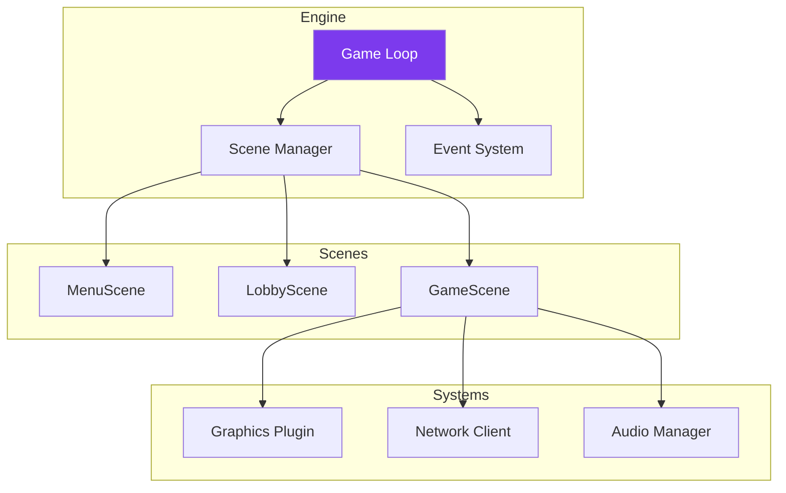
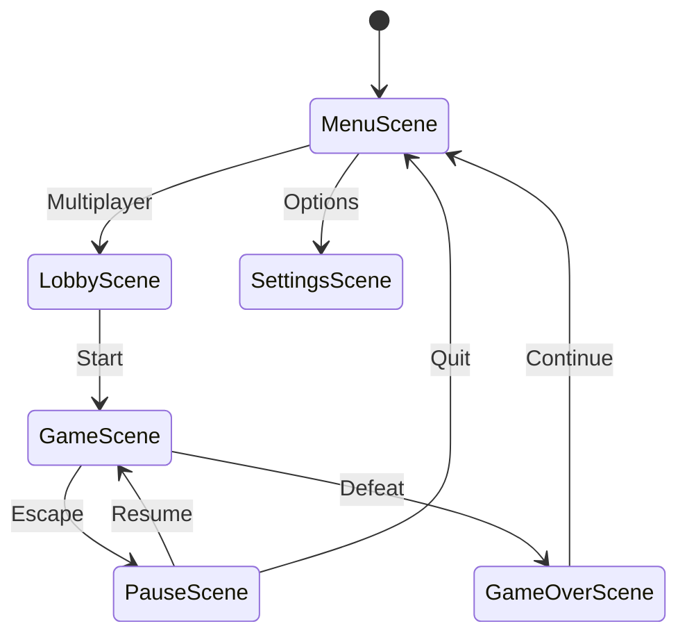

---
tags:
  - technique
  - architecture
  - client
---

# Architecture Client

Le client R-Type utilise une architecture **Scene-based** avec **plugins** graphiques.

## Vue d'Ensemble



---

## Scene System

### Interface IScene

```cpp
// src/client/include/scenes/IScene.hpp
struct GameContext {
    std::shared_ptr<graphics::IWindow> window;
    std::shared_ptr<client::network::UDPClient> udpClient;
    std::shared_ptr<client::network::TCPClient> tcpClient;
    std::string sessionToken;
};

class IScene {
public:
    virtual ~IScene() = default;

    virtual void handleEvent(const events::Event& event) = 0;
    virtual void update(float deltatime) = 0;
    virtual void render() = 0;

    void setSceneManager(SceneManager* manager) { _sceneManager = manager; }
    void setContext(const GameContext& ctx) { _context = ctx; }

protected:
    SceneManager* _sceneManager = nullptr;
    GameContext _context;
};
```

### Scene Manager

```cpp
// Gère la scène courante et les transitions
class SceneManager {
    std::unique_ptr<IScene> _currentScene;
    std::unique_ptr<IScene> _nextScene;
    GameContext _context;

public:
    void setContext(const GameContext& ctx) { _context = ctx; }

    template<typename T, typename... Args>
    void changeScene(Args&&... args) {
        _nextScene = std::make_unique<T>(std::forward<Args>(args)...);
        _nextScene->setSceneManager(this);
        _nextScene->setContext(_context);
    }

    void update(float dt) {
        if (_nextScene) {
            _currentScene = std::move(_nextScene);
        }
        if (_currentScene) {
            _currentScene->update(dt);
        }
    }

    void handleEvent(const events::Event& event) {
        if (_currentScene)
            _currentScene->handleEvent(event);
    }

    void render() {
        if (_currentScene)
            _currentScene->render();
    }
};
```

### Scenes du Jeu



---

## Game Loop

```cpp
class Engine {
    SceneManager scenes_;
    IGraphicsBackend& graphics_;
    NetworkClient& network_;
    AudioManager& audio_;
    Clock clock_;
    bool running_ = true;

public:
    void run() {
        while (running_) {
            float dt = clock_.restart();

            // 1. Events
            Event event;
            while (graphics_.getWindow().pollEvent(event)) {
                if (event.type == EventType::Closed)
                    running_ = false;
                scenes_.handleEvent(event);
            }

            // 2. Network
            network_.poll();

            // 3. Update
            scenes_.update(dt);

            // 4. Render
            graphics_.clear();
            scenes_.render();
            graphics_.present();
        }
    }
};
```

---

## Event System

Système d'événements type-safe avec `std::variant` :

```cpp
// Event types
struct KeyEvent { KeyCode key; bool pressed; };
struct MouseEvent { int x, y; };
struct NetworkEvent { PacketType type; Packet data; };
struct GameEvent { std::string name; };

using Event = std::variant<
    KeyEvent,
    MouseEvent,
    NetworkEvent,
    GameEvent
>;

// Event handler
class EventDispatcher {
public:
    template<typename T, typename Handler>
    void on(Handler&& handler) {
        handlers_[typeid(T).hash_code()] =
            [h = std::forward<Handler>(handler)](const Event& e) {
                h(std::get<T>(e));
            };
    }

    void dispatch(const Event& event) {
        std::visit([this](auto&& e) {
            auto it = handlers_.find(typeid(e).hash_code());
            if (it != handlers_.end())
                it->second(event);
        }, event);
    }
};
```

---

## Plugin System (Graphics)

Les backends graphiques sont chargés **dynamiquement** via `dlopen` (Linux) / `LoadLibrary` (Windows).

### Interface IGraphicPlugin

```cpp
// src/client/include/graphics/IGraphicPlugin.hpp
class IGraphicPlugin {
public:
    virtual ~IGraphicPlugin() = default;
    virtual const char* getName() const = 0;
    virtual std::shared_ptr<IWindow> createWindow(Vec2u size, const std::string& name) = 0;
    virtual std::shared_ptr<IRenderer> createRenderer(std::shared_ptr<IWindow> window) = 0;
};

// Fonctions exportées par chaque plugin
typedef IGraphicPlugin* (*create_t)();
typedef void (*destroy_t)(IGraphicPlugin*);
```

### DynamicLib (Cross-Platform Loader)

```cpp
// src/client/include/core/DynamicLib.hpp
class DynamicLib {
public:
    IGraphicPlugin* openGraphicLib(const std::string& libName);
    void destroyGraphicLib(IGraphicPlugin* graphLib);
private:
    LibHandle _handle;  // HMODULE (Win) ou void* (Linux)
    create_t _create_lib;
    destroy_t _destroy_lib;
};

// Utilisation
#ifdef _WIN32
    _handle = LoadLibraryA(libName.c_str());
    _create_lib = (create_t)GetProcAddress(_handle, "create");
#else
    _handle = dlopen(libName.c_str(), RTLD_LAZY);
    _create_lib = (create_t)dlsym(_handle, "create");
#endif
```

### Plugins Disponibles

| Plugin | Bibliothèque | Fichier |
|--------|--------------|---------|
| SFML | `librtype_sfml.so` | `lib/sfml/src/SFMLPlugin.cpp` |
| SDL2 | `librtype_sdl2.so` | `lib/sdl2/src/SDL2Plugin.cpp` |

---

## Structure des Dossiers

```
src/client/
├── main.cpp
├── include/
│   ├── scenes/
│   │   ├── IScene.hpp
│   │   ├── SceneManager.hpp
│   │   ├── MenuScene.hpp
│   │   ├── LobbyScene.hpp
│   │   └── GameScene.hpp
│   ├── graphics/
│   │   ├── IWindow.hpp
│   │   ├── IDrawable.hpp
│   │   └── IGraphicPlugin.hpp   # Interface plugin
│   ├── network/
│   │   ├── TCPClient.hpp
│   │   └── UDPClient.hpp
│   ├── audio/
│   │   ├── AudioManager.hpp
│   │   ├── VoiceChatManager.hpp
│   │   └── OpusCodec.hpp
│   ├── events/
│   │   └── Event.hpp
│   └── core/
│       ├── Engine.hpp
│       ├── GameLoop.hpp
│       └── DynamicLib.hpp       # Loader dlopen/LoadLibrary
├── src/                  # Implémentations
└── lib/                  # Plugins graphiques (.so/.dll)
    ├── sfml/
    │   ├── include/
    │   │   └── SFMLWindow.hpp
    │   └── src/
    │       └── SFMLPlugin.cpp   # Exporte create()/destroy()
    └── sdl2/
        ├── include/
        │   └── SDL2Window.hpp
        └── src/
            └── SDL2Plugin.cpp   # Exporte create()/destroy()
```
