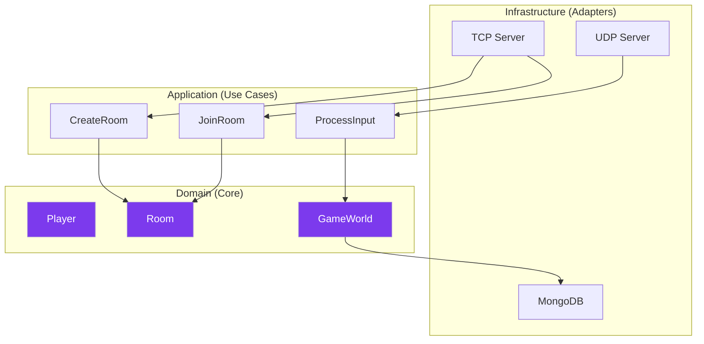

---
tags:
  - technique
  - architecture
  - serveur
---

# Architecture Hexagonale

Le serveur R-Type utilise l'**architecture hexagonale** (Ports & Adapters).

## Concept



---

## Couches

### Domain (Core)

Le cœur métier, **aucune dépendance externe**.

```cpp
// Entities
class Player {
    PlayerId id_;
    std::string name_;
    Position position_;
    int health_;
};

class Room {
    RoomId id_;
    std::vector<Player> players_;
    GameState state_;
};

// Value Objects
struct Position { float x, y; };
struct PlayerId { uint32_t value; };

// Domain Exceptions
class RoomFullException : public std::exception {};
```

### Application (Use Cases)

Orchestration des cas d'usage via **Ports**.

```cpp
// Port (interface) - src/server/include/application/ports/out/persistence/
class IUserRepository {
public:
    virtual std::optional<User> findByEmail(const std::string& email) = 0;
    virtual void save(const User& user) = 0;
    virtual std::vector<User> findAll() = 0;
};

class IUserSettingsRepository {
public:
    virtual std::optional<UserSettingsData> findByEmail(const std::string& email) = 0;
    virtual void save(const UserSettingsData& settings) = 0;
};

// Use Case - src/server/include/application/use_cases/auth/
class LoginUseCase {
    IUserRepository& userRepo_;
    IPasswordHasher& hasher_;

public:
    AuthResult execute(const std::string& email, const std::string& password);
};
```

### Infrastructure (Adapters)

Implémentations concrètes des **Ports**.

```cpp
// Adapter MongoDB - src/server/infrastructure/adapters/out/persistence/
class MongoDBUserRepository : public IUserRepository {
    mongocxx::database db_;

public:
    std::optional<User> findByEmail(const std::string& email) override {
        auto doc = db_["users"].find_one(
            bsoncxx::builder::basic::make_document(
                bsoncxx::builder::basic::kvp("email", email)
            )
        );
        if (!doc) return std::nullopt;
        return User::fromBson(*doc);
    }
};

// Adapter TCP Server - src/server/infrastructure/adapters/in/network/
class TCPAuthServer {
    boost::asio::io_context& io_;
    LoginUseCase& login_;
    SessionManager& sessions_;

    void handleLoginRequest(const LoginMessage& msg) {
        auto result = login_.execute(msg.email, msg.password);
        if (result.success) {
            auto token = sessions_.createSession(result.user);
            // Send AuthResponseWithToken
        }
    }
};
```

---

## Structure des Dossiers

```
src/server/
├── include/
│   ├── domain/
│   │   ├── entities/
│   │   │   └── Player.hpp
│   │   ├── value_objects/
│   │   │   ├── Position.hpp
│   │   │   └── Health.hpp
│   │   ├── exceptions/
│   │   └── services/
│   │       └── GameRule.hpp
│   ├── application/
│   │   ├── ports/out/
│   │   │   ├── persistence/
│   │   │   │   ├── IUserRepository.hpp
│   │   │   │   ├── IUserSettingsRepository.hpp
│   │   │   │   └── ILeaderboardRepository.hpp
│   │   │   └── ILogger.hpp
│   │   ├── use_cases/auth/
│   │   │   ├── LoginUseCase.hpp
│   │   │   └── RegisterUseCase.hpp
│   │   └── services/
│   │       └── AchievementChecker.hpp
│   └── infrastructure/
│       ├── adapters/
│       │   ├── in/network/
│       │   │   ├── TCPAuthServer.hpp
│       │   │   ├── UDPServer.hpp
│       │   │   ├── VoiceUDPServer.hpp
│       │   │   └── TCPAdminServer.hpp
│       │   └── out/persistence/
│       │       ├── MongoDBUserRepository.hpp
│       │       └── MongoDBLeaderboardRepository.hpp
│       ├── game/
│       │   └── GameWorld.hpp
│       ├── session/
│       │   └── SessionManager.hpp
│       └── logging/
│           └── Logger.hpp
```

---

## Avantages

| Avantage | Description |
|----------|-------------|
| **Testabilité** | Domain testable sans infra |
| **Flexibilité** | Changer de BDD sans toucher au core |
| **Maintenabilité** | Responsabilités claires |
| **Découplage** | Dépendances inversées |

---

## Tests

```cpp
// Test avec mock repository
class MockRoomRepository : public IRoomRepository {
    std::map<RoomId, Room> rooms_;
public:
    Room findById(RoomId id) override {
        return rooms_.at(id);
    }
    void save(const Room& room) override {
        rooms_[room.id()] = room;
    }
};

TEST(JoinRoom, AddsPlayerToRoom) {
    MockRoomRepository repo;
    JoinRoomUseCase useCase(repo);

    Room room(RoomId{1}, "Test");
    repo.save(room);

    Player player(PlayerId{42}, "Alice");
    useCase.execute(RoomId{1}, player);

    auto updated = repo.findById(RoomId{1});
    EXPECT_EQ(updated.playerCount(), 1);
}
```
