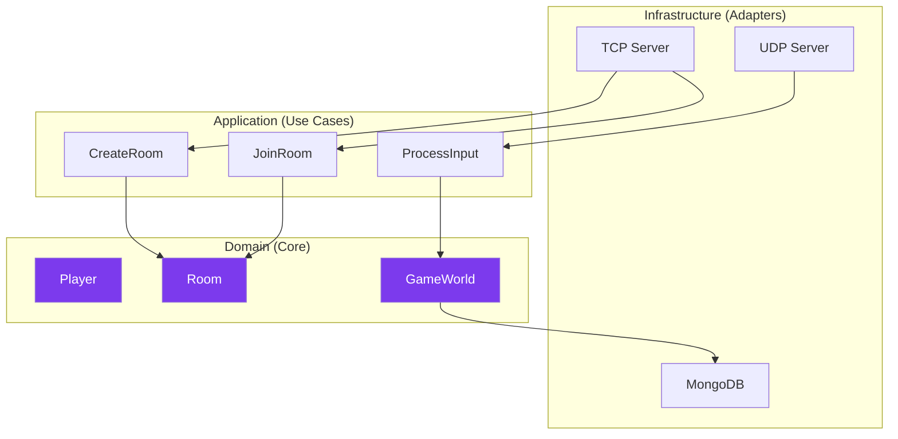

---
tags:
  - technique
  - architecture
  - serveur
---

# Architecture Hexagonale

Le serveur R-Type utilise l'**architecture hexagonale** (Ports & Adapters).

## Concept



---

## Couches

### Domain (Core)

Le cœur métier, **aucune dépendance externe**.

```cpp
// Entities
class Player {
    PlayerId id_;
    std::string name_;
    Position position_;
    int health_;
};

class Room {
    RoomId id_;
    std::vector<Player> players_;
    GameState state_;
};

// Value Objects
struct Position { float x, y; };
struct PlayerId { uint32_t value; };

// Domain Exceptions
class RoomFullException : public std::exception {};
```

### Application (Use Cases)

Orchestration des cas d'usage via **Ports**.

```cpp
// Port (interface)
class IRoomRepository {
public:
    virtual Room findById(RoomId id) = 0;
    virtual void save(const Room& room) = 0;
};

// Use Case
class JoinRoomUseCase {
    IRoomRepository& repo_;

public:
    void execute(RoomId roomId, Player player) {
        auto room = repo_.findById(roomId);
        room.addPlayer(player);
        repo_.save(room);
    }
};
```

### Infrastructure (Adapters)

Implémentations concrètes des **Ports**.

```cpp
// Adapter MongoDB
class MongoRoomRepository : public IRoomRepository {
    mongocxx::database db_;

public:
    Room findById(RoomId id) override {
        auto doc = db_["rooms"].find_one(
            bsoncxx::builder::basic::make_document(
                bsoncxx::builder::basic::kvp("_id", id.value)
            )
        );
        return Room::fromBson(*doc);
    }
};

// Adapter TCP Server
class TCPServer {
    boost::asio::io_context& io_;
    JoinRoomUseCase& joinRoom_;

    void handleJoinRequest(const Packet& packet) {
        auto roomId = packet.read<RoomId>();
        auto player = packet.read<Player>();
        joinRoom_.execute(roomId, player);
    }
};
```

---

## Structure des Dossiers

```
server/
├── domain/
│   ├── entities/
│   │   ├── Player.hpp
│   │   ├── Room.hpp
│   │   └── GameWorld.hpp
│   ├── value_objects/
│   │   ├── Position.hpp
│   │   └── PlayerId.hpp
│   └── exceptions/
├── application/
│   ├── ports/
│   │   ├── IRoomRepository.hpp
│   │   └── IPlayerRepository.hpp
│   └── use_cases/
│       ├── CreateRoomUseCase.hpp
│       └── JoinRoomUseCase.hpp
└── infrastructure/
    ├── adapters/
    │   ├── MongoRoomRepository.hpp
    │   └── InMemoryRoomRepository.hpp
    └── servers/
        ├── TCPServer.hpp
        └── UDPServer.hpp
```

---

## Avantages

| Avantage | Description |
|----------|-------------|
| **Testabilité** | Domain testable sans infra |
| **Flexibilité** | Changer de BDD sans toucher au core |
| **Maintenabilité** | Responsabilités claires |
| **Découplage** | Dépendances inversées |

---

## Tests

```cpp
// Test avec mock repository
class MockRoomRepository : public IRoomRepository {
    std::map<RoomId, Room> rooms_;
public:
    Room findById(RoomId id) override {
        return rooms_.at(id);
    }
    void save(const Room& room) override {
        rooms_[room.id()] = room;
    }
};

TEST(JoinRoom, AddsPlayerToRoom) {
    MockRoomRepository repo;
    JoinRoomUseCase useCase(repo);

    Room room(RoomId{1}, "Test");
    repo.save(room);

    Player player(PlayerId{42}, "Alice");
    useCase.execute(RoomId{1}, player);

    auto updated = repo.findById(RoomId{1});
    EXPECT_EQ(updated.playerCount(), 1);
}
```
