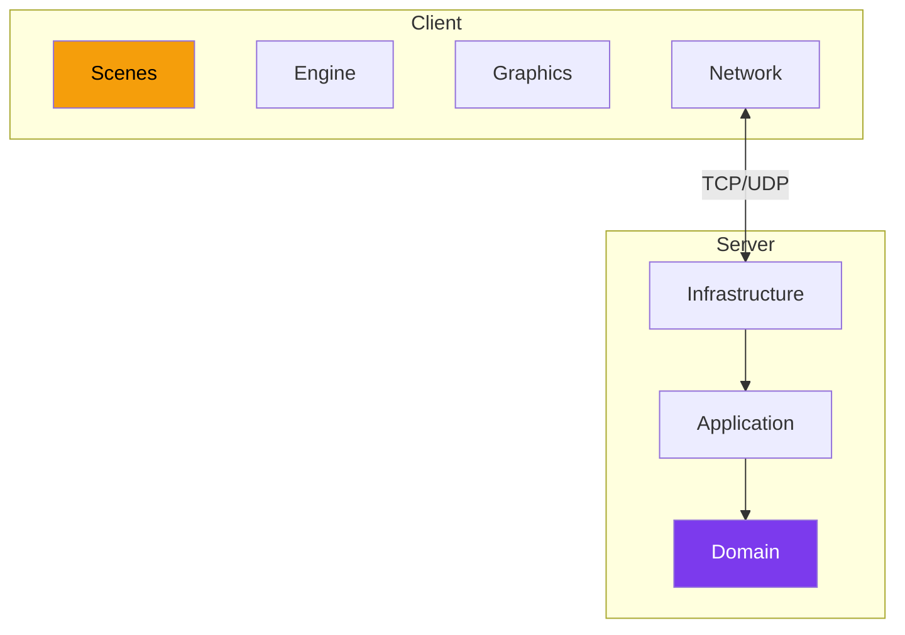

---
tags:
  - technique
  - architecture
---

# Architecture

Vue d'ensemble de l'architecture R-Type.

  

    <h3><a href="hexagonale/">🔷 Hexagonale</a></h3>
    
Architecture serveur (Ports & Adapters)

  

  

    <h3><a href="client/">🎮 Client</a></h3>
    
Scenes, Engine, Plugins

  

  

    <h3><a href="protocoles/">📡 Protocoles</a></h3>
    
TCP, UDP, Voice

  

---

## Vue Globale

---

## Principes

| Principe | Application |
|----------|-------------|
| **Hexagonal** | Serveur (Ports & Adapters) |
| **Plugin** | Client (backends graphiques) |
| **DDD** | Domain-Driven Design serveur |
| **ECS** | Entity Component System (optionnel) |

---

## Technologies

| Composant | Technologie |
|-----------|-------------|
| Langage | C++23 |
| Build | CMake 3.20+ |
| Réseau | Boost.ASIO |
| Logging | spdlog |
| JSON | nlohmann/json |
| Graphiques | SDL2 / SFML |
| Audio | PortAudio, Opus |
| BDD | MongoDB |
