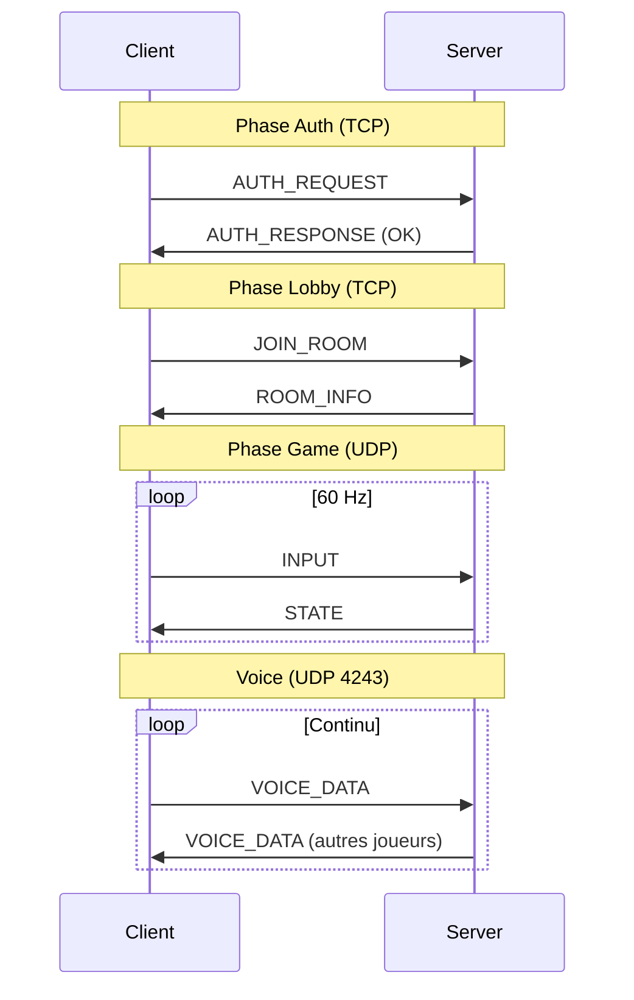

---
tags:
  - technique
  - architecture
  - reseau
---

# Vue d'Ensemble des Protocoles

R-Type utilise 3 protocoles de communication.

## Résumé

| Protocole | Port | Usage |
|-----------|------|-------|
| **TCP** | 4242 | Auth, rooms, chat |
| **UDP** | 4242 | Game sync |
| **Voice** | 4243 | Audio temps réel |


---

## TCP - Fiable

Pour les opérations **critiques** qui nécessitent garantie de livraison.

| Type | Description |
|------|-------------|
| `AUTH_REQUEST` | Connexion |
| `AUTH_RESPONSE` | Résultat auth |
| `CREATE_ROOM` | Créer une room |
| `JOIN_ROOM` | Rejoindre |
| `LEAVE_ROOM` | Quitter |
| `CHAT_MESSAGE` | Message texte |
| `ROOM_LIST` | Liste des rooms |

---

## UDP - Rapide

Pour le **game state** où la latence est critique.

| Type | Description |
|------|-------------|
| `INPUT` | Actions joueur |
| `STATE` | État du monde |
| `SPAWN` | Nouvelle entité |
| `DESTROY` | Entité détruite |
| `HIT` | Collision/dégâts |

---

## Voice - Temps Réel

Pour l'**audio** avec codec Opus.

| Type | Description |
|------|-------------|
| `VOICE_DATA` | Données audio |
| `VOICE_MUTE` | Joueur mute |
| `VOICE_UNMUTE` | Joueur unmute |

---

## Format Commun

Tous les paquets partagent un header commun :

```
┌─────────┬──────┬─────────┬──────┬─────────┐
│ Magic   │ Type │ Seq     │ Size │ Data    │
│ 2 bytes │ 1 B  │ 4 bytes │ 2 B  │ ...     │
└─────────┴──────┴─────────┴──────┴─────────┘
```

```cpp
struct PacketHeader {
    uint16_t magic = 0x5254;  // "RT"
    uint8_t type;
    uint32_t sequence;
    uint16_t size;
};
```

---

## Diagramme de Séquence



---

## Détails

- [TCP Protocol](../reseau/tcp.md) - Authentification et rooms
- [UDP Protocol](../reseau/udp.md) - Synchronisation jeu
- [Voice Protocol](../reseau/voice.md) - Audio temps réel
- [Structures](../reseau/structures.md) - Référence binaire
