---
tags:
  - technique
  - audio
---

# Système Audio

Vue d'ensemble du système audio R-Type.

## Composants

```mermaid
flowchart TB
    subgraph AudioSystem
        AM[AudioManager]
        VCM[VoiceChatManager]
    end

    subgraph Sources
        Music[🎵 Musique]
        SFX[💥 Effets]
        Voice[🎤 Voice Chat]
    end

    subgraph Output
        Mix[Mixer]
        Out[🔊 Sortie]
    end

    Music --> AM
    SFX --> AM
    Voice --> VCM
    AM --> Mix
    VCM --> Mix
    Mix --> Out

    style AM fill:#7c3aed,color:#fff
    style VCM fill:#f59e0b,color:#000
```



---

## Technologies

| Composant | Technologie | Usage |
|-----------|-------------|-------|
| **SFX/Music** | SDL2_mixer / SFML Audio | Effets et musique |
| **Voice Capture** | PortAudio | Capture micro |
| **Voice Codec** | Opus | Compression audio |
| **Voice Transport** | UDP | Temps réel |

---

## Architecture

### AudioManager

Gère la musique de fond et les effets sonores.

```cpp
class AudioManager {
    std::map<std::string, Sound> sounds_;
    Music* currentMusic_ = nullptr;
    float masterVolume_ = 0.8f;
    float musicVolume_ = 0.6f;
    float sfxVolume_ = 1.0f;

public:
    void loadSound(const std::string& name, const std::string& path);
    void playSound(const std::string& name);
    void playMusic(const std::string& path, bool loop = true);
    void stopMusic();

    void setMasterVolume(float vol);
    void setMusicVolume(float vol);
    void setSfxVolume(float vol);
};
```

### VoiceChatManager

Gère la capture, l'encodage Opus et la transmission UDP.

```cpp
class VoiceChatManager {
    OpusEncoder* encoder_;
    OpusDecoder* decoder_;
    PaStream* inputStream_;
    PaStream* outputStream_;
    UDPSocket& socket_;

public:
    void startCapture();
    void stopCapture();
    void processIncoming(const VoicePacket& packet);
    void setMode(VoiceMode mode);  // PTT or VAD
    void setMuted(bool muted);
};
```

---

## Documentation

<div class="grid-cards">
  <div class="card">
    <h3><a href="voice-chat/">🎤 Voice Chat</a></h3>
    <p>Opus, PortAudio, UDP</p>
  </div>
  <div class="card">
    <h3><a href="sfx-music/">🎵 SFX & Musique</a></h3>
    <p>AudioManager, formats</p>
  </div>
</div>
