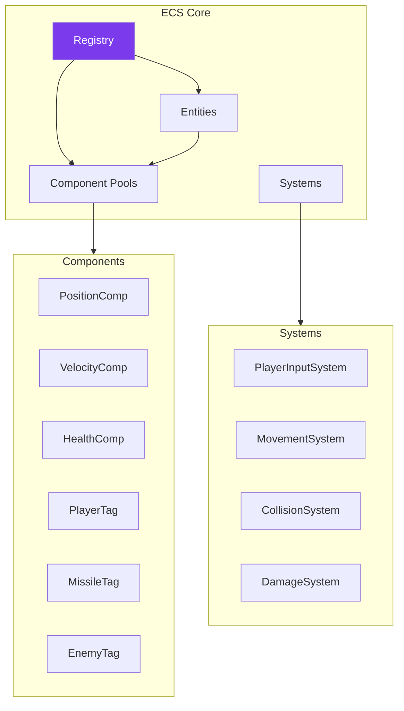
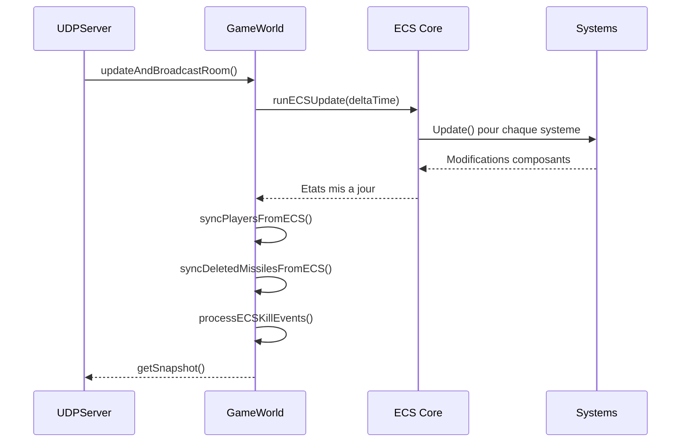

---
tags:
  - technique
  - ecs
  - architecture
---

# Entity Component System (ECS)

Systeme de gestion d'entites haute performance utilise cote serveur pour la logique de jeu.

## Vue d'ensemble

R-Type utilise **Blob-ECS**, un ECS custom en C++20 concu pour la performance et la securite des types.

| Caracteristique | Valeur |
|-----------------|--------|
| **Performances** | ~51M operations/seconde |
| **Architecture** | Sparse Set (O(1) access) |
| **Standard** | C++20 (concepts) |
| **Header-only** | Oui |

---

## Architecture



### Principes fondamentaux

1. **Entites comme IDs** : Les entites sont de simples `uint32_t`, pas d'objets lourds
2. **Sparse Set Storage** : Composants stockes avec acces O(1)
3. **Type-Indexed Pools** : Chaque type de composant a son propre pool
4. **Data-Oriented Design** : Composants en tableaux contigus (cache-friendly)

---

## Composants (15)

### Base (6)

| Composant | Champs | Usage |
|-----------|--------|-------|
| `PositionComp` | `float x, y` | Position de l'entite |
| `VelocityComp` | `float vx, vy` | Vitesse de deplacement |
| `HealthComp` | `uint16_t current, max; bool invulnerable` | Points de vie |
| `HitboxComp` | `float width, height, offsetX, offsetY` | Boite de collision AABB |
| `LifetimeComp` | `float remaining, total` | Duree de vie (missiles, power-ups) |
| `OwnerComp` | `uint32_t ownerId; bool isPlayerOwned` | Proprietaire (missiles) |

### Tags (5)

| Composant | Champs | Usage |
|-----------|--------|-------|
| `MissileTag` | `weaponType, baseDamage, isHoming, targetId` | Identificateur missile |
| `EnemyTag` | `type, points` | Identificateur ennemi |
| `EnemyAIComp` | `shootCooldown, shootInterval, movementPattern, ...` | Etat IA |
| `PowerUpTag` | `type` | Type de power-up |
| `WaveCannonTag` | `chargeLevel, width` | Wave Cannon charge |

### Joueur (4)

| Composant | Champs | Usage |
|-----------|--------|-------|
| `PlayerTag` | `playerId, shipSkin, isAlive` | Identificateur joueur |
| `ScoreComp` | `total, kills, comboMultiplier, comboTimer, maxCombo, deaths` | Score et combo |
| `WeaponComp` | `currentType, shootCooldown, isCharging, chargeTime, weaponLevels[4]` | Armes |
| `SpeedLevelComp` | `level` (0-3) | Niveau de vitesse |

---

## Systemes (9)

Les systemes s'executent dans l'ordre de priorite (plus bas = plus tot).

| Priorite | Systeme | Query | Responsabilite |
|----------|---------|-------|----------------|
| 0 | `PlayerInputSystem` | `<PlayerTag, Position, Velocity, SpeedLevel>` | Input → Velocity |
| 100 | `EnemyAISystem` | `<EnemyTag, EnemyAIComp, Position, Velocity>` | Patterns de mouvement |
| 200 | `WeaponSystem` | `<PlayerTag, WeaponComp, Position>` | Cooldowns, spawn missiles |
| 300 | `MovementSystem` | `<Position, Velocity>` | `pos += vel × dt` |
| 400 | `CollisionSystem` | Par EntityGroup | Detection AABB par paires |
| 500 | `DamageSystem` | Consomme `CollisionEvent` | Applique degats via DomainBridge |
| 600 | `LifetimeSystem` | `<Lifetime>` | Decremente, expire |
| 700 | `CleanupSystem` | `<Position, Hitbox>` | Supprime entites hors ecran |
| 800 | `ScoreSystem` | `<PlayerTag, ScoreComp>` | Decay du combo |

---

## Integration GameWorld

L'ECS est integre dans `GameWorld` et pilote la logique de jeu principale.



### Flux de donnees

1. **Input** : `applyPlayerInput()` → queues dans PlayerInputSystem
2. **Update ECS** : Tous les 9 systemes s'executent
3. **Sync** : ECS → structures legacy pour compatibilite
4. **Snapshot** : Lecture depuis ECS pour broadcast

---

## DomainBridge

Le `DomainBridge` encapsule les regles metier du domaine R-Type pour les systemes ECS.

```cpp
class DomainBridge {
    // Degats & Sante
    DamageResult applyDamage(HealthComp& health, uint16_t damage);
    bool wouldDie(uint16_t currentHealth, uint16_t damage);

    // Score & Combo
    uint32_t calculateKillScore(uint16_t basePoints, float comboMultiplier);
    float incrementCombo(float currentCombo);

    // Armes
    uint8_t getMissileDamage(uint8_t weaponType, uint8_t level);
    float getMissileSpeed(uint8_t weaponType, uint8_t level);

    // Collision
    bool checkCollision(float x1, y1, w1, h1, float x2, y2, w2, h2);
    bool isOutOfBounds(float x, y, w, h);
};
```

---

## Decisions de conception

| Decision | Justification |
|----------|---------------|
| **Collision par paires** | Seules les paires pertinentes verifiees (missiles↔ennemis) |
| **KillEvent pour score** | Decouple DamageSystem de ScoreSystem |
| **Joueurs exclus du Cleanup** | Mort/respawn geres par GameWorld |
| **Suppression differee** | Evite modification pendant iteration |
| **Pas de contact damage player↔enemy** | Design R-Type authentique |
| **Niveaux d'armes independants** | Chaque arme s'upgrade separement |

---

## Structure des fichiers

```
src/server/infrastructure/ecs/
├── core/
│   ├── ECS.hpp              # Classe principale
│   ├── Component.hpp        # ComponentPool<T>
│   ├── Registry.hpp         # Gestion composants
│   └── System.hpp           # Interface ISystem
├── components/
│   ├── PositionComp.hpp     # Position
│   ├── VelocityComp.hpp     # Velocite
│   ├── HealthComp.hpp       # Sante
│   ├── PlayerTag.hpp        # Tag joueur
│   ├── MissileTag.hpp       # Tag missile
│   ├── EnemyTag.hpp         # Tag ennemi
│   └── ...
├── systems/
│   ├── MovementSystem.cpp
│   ├── CollisionSystem.cpp
│   ├── DamageSystem.cpp
│   └── ...
└── bridge/
    └── DomainBridge.cpp     # Regles metier
```

---

## Tests

Plus de 640 tests couvrent le systeme ECS.

```bash
# Tous les tests ECS
./artifacts/tests/server_tests --gtest_filter="*ECS*:*Component*:*DomainBridge*"

# Tests par systeme
./artifacts/tests/server_tests --gtest_filter="*MovementSystem*"
./artifacts/tests/server_tests --gtest_filter="*CollisionSystem*"
./artifacts/tests/server_tests --gtest_filter="*DamageSystem*"
```

---

## Exemple d'utilisation

```cpp
// Initialisation
ECS::ECS ecs;
ecs.registerComponent<PositionComp>();
ecs.registerComponent<VelocityComp>();
ecs.registerComponent<HealthComp>();

// Creation d'entite
ECS::EntityID player = ecs.entityCreate();

// Ajout de composants
auto& pos = ecs.entityAddComponent<PositionComp>(player);
pos.x = 100.0f;
pos.y = 200.0f;

auto& vel = ecs.entityAddComponent<VelocityComp>(player);
vel.vx = 5.0f;
vel.vy = 0.0f;

// Query d'entites
auto entities = ecs.getEntitiesByComponentsAllOf<PositionComp, VelocityComp>();

// Update
for (auto entity : entities) {
    auto& p = ecs.entityGetComponent<PositionComp>(entity);
    auto& v = ecs.entityGetComponent<VelocityComp>(entity);
    p.x += v.vx * deltaTime;
    p.y += v.vy * deltaTime;
}
```

---

## Liens

- [Architecture Hexagonale](../architecture/hexagonale.md)
- [GameWorld](../gameplay/game-world.md)
- [Collisions](../gameplay/collisions.md)
- [Documentation ECS originale](https://github.com/guilec06/Blob-ECS)
