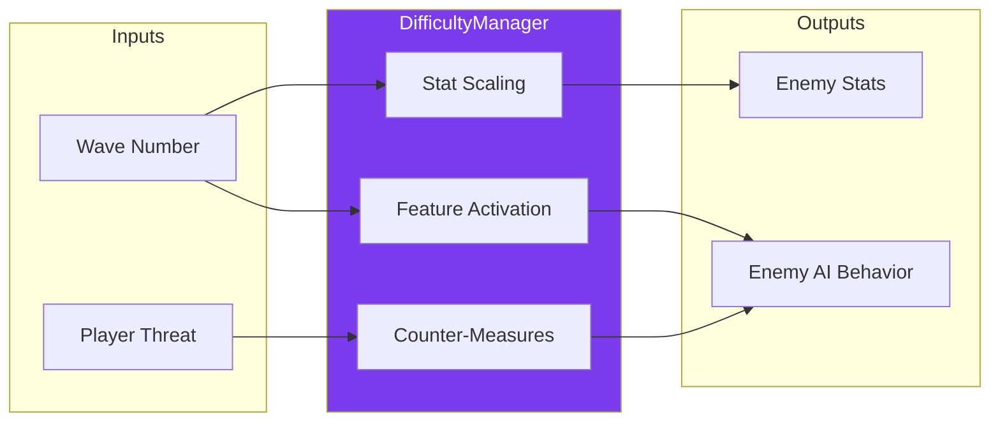

---
tags:
  - technique
  - gameplay
  - ia
  - design
---

# IA Ennemie Avancee

Systeme d'intelligence artificielle evolutive pour les ennemis.

## Vue d'Ensemble

Le systeme d'IA ennemie evolue avec la progression du joueur pour maintenir le challenge.



---

## Types d'Ennemis

| Type | HP | Vitesse | Comportement | Tir |
|------|-----|---------|--------------|-----|
| **Basic** | 40 | -120 | Sinusoidal vertical | 2.5s |
| **Tracker** | 35 | -100 | Suit position Y joueur | 2.0s |
| **Zigzag** | 30 | -140 | Alternance haut/bas | 3.0s |
| **Fast** | 25 | -220 | Ligne droite rapide | 1.5s |
| **Bomber** | 80 | -80 | Lent, tank | 1.0s |
| **POWArmor** | 60 | -90 | Drop power-ups | 4.0s |

---

## Scaling par Wave

### Formules

```cpp
// Multiplicateur base sur la wave
float getDifficultyMultiplier(uint16_t wave) {
    return 1.0f + 0.15f * std::log2(1.0f + wave * 0.5f);
}

// HP scale avec le multiplicateur complet
float getScaledHealth(uint8_t baseHP, uint16_t wave) {
    return baseHP * getDifficultyMultiplier(wave);
}

// Vitesse scale moins vite (cap a +50%)
float getScaledSpeed(float baseSpeed, uint16_t wave) {
    float mult = 1.0f + 0.1f * std::log2(1.0f + wave * 0.3f);
    return baseSpeed * std::min(mult, 1.5f);
}
```

### Table de Progression

| Wave | HP | Speed | Fire Rate | Comportement |
|------|-----|-------|-----------|--------------|
| 1-5 | x1.00 | x1.00 | x1.00 | Standard |
| 6-10 | x1.15 | x1.05 | x0.95 | + Tir vise |
| 11-15 | x1.25 | x1.10 | x0.90 | + Esquive |
| 16-20 | x1.35 | x1.15 | x0.85 | + Formations |
| 21-30 | x1.45 | x1.20 | x0.80 | + Tir predictif |
| 31+ | x1.65+ | x1.30+ | x0.70- | Mode Hardcore |

---

## Tir Predictif

Les ennemis calculent ou le joueur **sera** pour intercepter.

```cpp
struct PredictiveShot {
    static Vec2f calculateLeadDirection(
        Vec2f enemyPos,
        Vec2f playerPos,
        Vec2f playerVelocity,
        float bulletSpeed,
        float leadFactor  // 0.0 = pas de prediction, 1.0 = parfait
    ) {
        float distance = (playerPos - enemyPos).length();
        float timeToHit = distance / bulletSpeed;
        Vec2f predictedPos = playerPos + playerVelocity * timeToHit * leadFactor;
        return (predictedPos - enemyPos).normalized();
    }
};
```

### Lead Factor par Type

| Type | Wave 1-10 | Wave 11-20 | Wave 21-30 | Wave 31+ |
|------|-----------|------------|------------|----------|
| Basic | 0.0 | 0.2 | 0.4 | 0.6 |
| Tracker | 0.3 | 0.5 | 0.7 | 0.9 |
| Fast | 0.2 | 0.4 | 0.6 | 0.8 |
| Bomber | 0.1 | 0.3 | 0.5 | 0.7 |

---

## Esquive

Certains ennemis detectent les missiles et tentent d'eviter.

```cpp
struct DodgeAI {
    float detectionRadius;
    float dodgeSpeed;
    float dodgeChance;

    bool isThreatened(const Enemy& enemy, const std::vector<Missile>& missiles) {
        for (const auto& missile : missiles) {
            if (missile.owner_id == ENEMY_OWNER_ID) continue;

            Vec2f missileDir = Vec2f(missile.vx, missile.vy).normalized();
            Vec2f toEnemy = Vec2f(enemy.x - missile.x, enemy.y - missile.y);

            float projection = toEnemy.dot(missileDir);
            if (projection < 0) continue;

            Vec2f closest = Vec2f(missile.x, missile.y) + missileDir * projection;
            float perpDist = (Vec2f(enemy.x, enemy.y) - closest).length();

            if (perpDist < detectionRadius) return true;
        }
        return false;
    }
};
```

### Capacite d'Esquive

| Type | Detection | Chance | Vitesse |
|------|-----------|--------|---------|
| Fast | 150px | 70% | 300 |
| Zigzag | 100px | 50% | 250 |
| Tracker | 120px | 40% | 200 |
| Basic | 80px | 20% | 150 |
| Bomber | - | 0% | - |

---

## Formations

Les ennemis agissent en groupes coordonnes.

```
V-SHAPE (5 ennemis)         WALL (6 ennemis)

       *                    * * * * * *
      * *                   ------------>
     *   *
    ----------->
```

### Types de Formations

| Formation | Ennemis | Wave Min | Mouvement |
|-----------|---------|----------|-----------|
| VShape | 5 | 11 | Lineaire |
| Wall | 6 | 11 | Lineaire |
| Snake | 6 | 16 | Sinusoidal |
| Diamond | 9 | 16 | Lineaire |
| Pincer | 8 | 21 | Encerclement |
| Helix | 8 | 26 | Rotation |

---

## Adaptation au Joueur

Le jeu analyse l'equipement du joueur pour ajuster l'IA.

```cpp
struct PlayerThreatLevel {
    uint8_t weaponLevel;      // 0-3
    bool hasForce;            // Force Pod?
    bool hasBits;             // Bit Devices?
    uint8_t speedLevel;       // 0-3
    float recentKillRate;     // Kills/seconde

    uint8_t calculateThreatScore() const {
        uint8_t score = 0;
        score += weaponLevel * 10;         // 0-30
        score += hasForce ? 20 : 0;        // +20
        score += hasBits ? 15 : 0;         // +15
        score += speedLevel * 5;           // 0-15
        score += std::min(recentKillRate * 10, 10.0f);
        return std::min(score, (uint8_t)100);
    }
};
```

### Reactions par Threat Score

| Score | Niveau | Reaction IA |
|-------|--------|-------------|
| 0-20 | Debutant | Standard, tirs lents |
| 21-40 | Intermediaire | Tirs vises, patterns |
| 41-60 | Avance | Esquive, formations |
| 61-80 | Expert | Tir predictif, coordination |
| 81-100 | Maitre | Tout active, spawn bonus |

---

## Nouveaux Types (Futurs)

| Type | Wave | Specialite |
|------|------|------------|
| Sniper | 15+ | Tir charge precis |
| Swarm | 20+ | Essaim de mini-ennemis |
| Mirror | 25+ | Copie mouvements joueur |
| Shield | 30+ | Protege les allies |
| Splitter | 35+ | Se divise en 2 a la mort |

---

## References Code

| Fichier | Description |
|---------|-------------|
| `GameWorld.cpp` | Spawn et update des ennemis |
| `Protocol.hpp` | EnemyState, EnemyType |
| `AABB.hpp` | Hitboxes et collisions |
