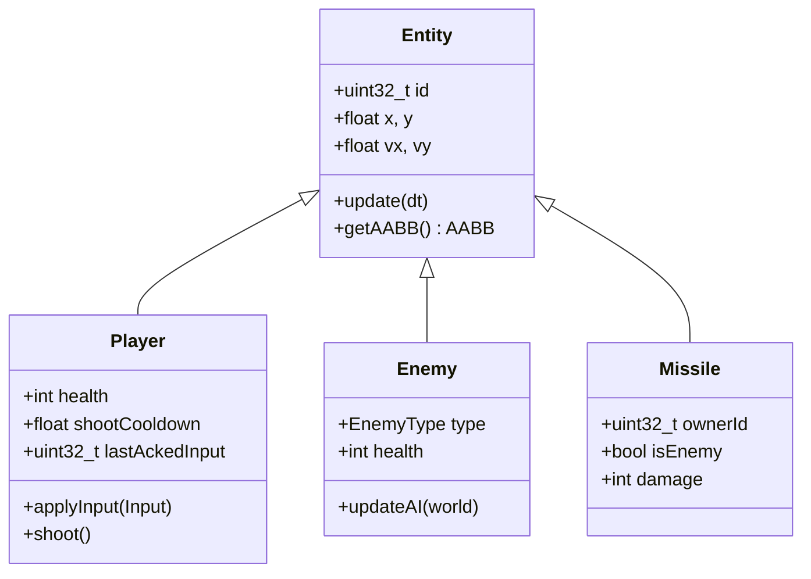

---
tags:
  - technique
  - gameplay
  - entites
---

# Entités

Types d'entités dans R-Type.

## Hiérarchie



---

## Player

```cpp
class Player : public Entity {
public:
    static constexpr int MAX_HEALTH = 100;
    static constexpr float SPEED = 300.0f;
    static constexpr float SHOOT_COOLDOWN = 0.2f;  // 5 tirs/sec
    static constexpr int WIDTH = 64;
    static constexpr int HEIGHT = 32;

    int health_ = MAX_HEALTH;
    float shootCooldown_ = 0;
    uint32_t lastAckedInput_ = 0;
    uint8_t shipSkin_ = 1;

    void update(float dt) override {
        if (shootCooldown_ > 0)
            shootCooldown_ -= dt;
    }

    bool canShoot() const {
        return shootCooldown_ <= 0;
    }

    void shoot() {
        shootCooldown_ = SHOOT_COOLDOWN;
    }

    void takeDamage(int damage) {
        health_ -= damage;
        if (health_ <= 0) {
            health_ = 0;
            alive_ = false;
        }
    }

    AABB getAABB() const override {
        return {x_, y_, WIDTH, HEIGHT};
    }
};
```

---

## Types d'Ennemis (5 types)

### 1. Basic

Mouvement linéaire simple.

```cpp
class BasicEnemy : public Enemy {
public:
    static constexpr float SPEED = 150.0f;
    static constexpr int HEALTH = 1;

    void updateAI(GameWorld& world) override {
        vx_ = -SPEED;  // Vers la gauche
    }
};
```

### 2. Zigzag

Mouvement en zigzag.

```cpp
class ZigzagEnemy : public Enemy {
    float phase_ = 0;

public:
    static constexpr float SPEED_X = 100.0f;
    static constexpr float SPEED_Y = 200.0f;
    static constexpr float FREQ = 3.0f;

    void updateAI(GameWorld& world) override {
        vx_ = -SPEED_X;
        vy_ = std::sin(phase_) * SPEED_Y;
        phase_ += FREQ * TICK_DURATION;
    }
};
```

### 3. Follower

Suit le joueur le plus proche.

```cpp
class FollowerEnemy : public Enemy {
public:
    static constexpr float SPEED = 80.0f;

    void updateAI(GameWorld& world) override {
        auto* target = world.findNearestPlayer(x_, y_);
        if (!target) return;

        float dx = target->x - x_;
        float dy = target->y - y_;
        float dist = std::sqrt(dx*dx + dy*dy);

        if (dist > 0) {
            vx_ = (dx / dist) * SPEED;
            vy_ = (dy / dist) * SPEED;
        }
    }
};
```

### 4. Shooter

Tire des projectiles.

```cpp
class ShooterEnemy : public Enemy {
    float shootTimer_ = 0;

public:
    static constexpr float SHOOT_INTERVAL = 2.0f;

    void updateAI(GameWorld& world) override {
        vx_ = -50.0f;  // Lent

        shootTimer_ -= TICK_DURATION;
        if (shootTimer_ <= 0) {
            world.spawnEnemyMissile(x_, y_);
            shootTimer_ = SHOOT_INTERVAL;
        }
    }
};
```

### 5. Boss

Ennemi de fin de niveau.

```cpp
class BossEnemy : public Enemy {
    enum class Phase { Enter, Attack, Rage };
    Phase phase_ = Phase::Enter;
    float phaseTimer_ = 0;

public:
    static constexpr int HEALTH = 50;
    static constexpr int WIDTH = 256;
    static constexpr int HEIGHT = 128;

    void updateAI(GameWorld& world) override {
        switch (phase_) {
            case Phase::Enter:
                // Entrer lentement
                if (x_ > WORLD_WIDTH - 300) {
                    vx_ = -50.0f;
                } else {
                    phase_ = Phase::Attack;
                }
                break;

            case Phase::Attack:
                // Pattern d'attaque
                attackPattern(world);
                if (health_ < HEALTH / 2) {
                    phase_ = Phase::Rage;
                }
                break;

            case Phase::Rage:
                // Plus agressif
                ragePattern(world);
                break;
        }
    }
};
```

---

## Missiles

```cpp
class Missile : public Entity {
public:
    uint32_t ownerId_;
    bool isEnemy_;
    int damage_;

    static constexpr float PLAYER_MISSILE_SPEED = 600.0f;
    static constexpr float ENEMY_MISSILE_SPEED = 300.0f;
    static constexpr int WIDTH = 16;
    static constexpr int HEIGHT = 8;

    Missile(uint32_t owner, bool enemy)
        : ownerId_(owner)
        , isEnemy_(enemy)
        , damage_(enemy ? 20 : 10)
    {
        vx_ = enemy ? -ENEMY_MISSILE_SPEED : PLAYER_MISSILE_SPEED;
    }

    bool isOutOfBounds() const {
        return x_ < -WIDTH || x_ > WORLD_WIDTH + WIDTH;
    }
};
```

---

## Résumé

| Type | Health | Vitesse | Comportement |
|------|--------|---------|--------------|
| Basic | 1 | 150 | Ligne droite |
| Zigzag | 2 | 100 | Sinusoïdal |
| Follower | 2 | 80 | Suit joueur |
| Shooter | 3 | 50 | Tire projectiles |
| Boss | 50 | Variable | Patterns |
