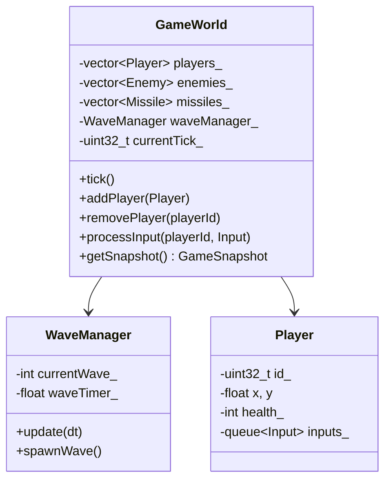

---
tags:
  - technique
  - gameplay
  - serveur
---

# GameWorld

Le GameWorld est le **cœur du serveur**, responsable de l'état du jeu.

## Responsabilités

- Gestion des entités (joueurs, ennemis, missiles)
- Simulation physique
- Détection de collisions
- Gestion des vagues d'ennemis
- Broadcast de l'état aux clients

---

## Architecture



---

## Tick System

Le serveur broadcast les snapshots à **20 Hz** (50ms par tick).

```cpp
// Dans UDPServer.cpp
static constexpr int BROADCAST_INTERVAL_MS = 50;  // 20 Hz

class GameWorld {
    static constexpr float TICK_DURATION = 0.05f;  // 50ms

public:
    void tick() {
        processInputs();
        updatePhysics();
        updateEnemies();
        checkCollisions();
        cleanup();
        currentTick_++;
    }

private:
    void processInputs() {
        for (auto& player : players_) {
            while (auto input = player.popInput()) {
                applyInput(player, *input);
            }
        }
    }

    void applyInput(Player& player, const Input& input) {
        const float SPEED = 300.0f;

        if (input.keys & KEY_UP)    player.y -= SPEED * TICK_DURATION;
        if (input.keys & KEY_DOWN)  player.y += SPEED * TICK_DURATION;
        if (input.keys & KEY_LEFT)  player.x -= SPEED * TICK_DURATION;
        if (input.keys & KEY_RIGHT) player.x += SPEED * TICK_DURATION;

        // Clamp to bounds
        player.x = std::clamp(player.x, 0.0f, WORLD_WIDTH);
        player.y = std::clamp(player.y, 0.0f, WORLD_HEIGHT);

        if (input.keys & KEY_SHOOT) {
            tryShoot(player);
        }

        player.lastAckedInput = input.sequence;
    }
};
```

---

## Wave Manager

Gestion des vagues d'ennemis.

```cpp
class WaveManager {
    struct WaveConfig {
        int basicCount;
        int zigzagCount;
        int followerCount;
        int shooterCount;
        bool hasBoss;
    };

    static constexpr WaveConfig WAVES[] = {
        {5, 0, 0, 0, false},   // Wave 1
        {3, 3, 0, 0, false},   // Wave 2
        {2, 2, 2, 0, false},   // Wave 3
        {2, 2, 2, 2, false},   // Wave 4
        {0, 0, 0, 0, true},    // Wave 5 - BOSS
    };

    int currentWave_ = 0;
    float spawnTimer_ = 0;
    int enemiesRemaining_ = 0;

public:
    void update(GameWorld& world, float dt) {
        if (enemiesRemaining_ <= 0 && world.enemies().empty()) {
            // Wave complete
            currentWave_++;
            if (currentWave_ < std::size(WAVES)) {
                spawnWave(world);
            } else {
                world.setVictory();
            }
        }
    }

    void spawnWave(GameWorld& world) {
        auto& config = WAVES[currentWave_];

        for (int i = 0; i < config.basicCount; i++)
            world.spawnEnemy(EnemyType::Basic);
        for (int i = 0; i < config.zigzagCount; i++)
            world.spawnEnemy(EnemyType::Zigzag);
        // ...

        if (config.hasBoss)
            world.spawnEnemy(EnemyType::Boss);
    }
};
```

---

## Snapshot Generation

Création de l'état pour broadcast.

```cpp
GameSnapshot GameWorld::getSnapshot() const {
    GameSnapshot snapshot;
    snapshot.tick = currentTick_;

    // Players
    snapshot.playerCount = players_.size();
    for (size_t i = 0; i < players_.size(); i++) {
        auto& p = players_[i];
        snapshot.players[i] = {
            .id = p.id_,
            .x = static_cast<uint16_t>(p.x),
            .y = static_cast<uint16_t>(p.y),
            .health = static_cast<uint8_t>(p.health_),
            .alive = p.isAlive(),
            .lastAckedInput = p.lastAckedInput_
        };
    }

    // Enemies
    snapshot.enemyCount = enemies_.size();
    for (size_t i = 0; i < enemies_.size(); i++) {
        auto& e = enemies_[i];
        snapshot.enemies[i] = {
            .id = e.id_,
            .type = static_cast<uint8_t>(e.type_),
            .x = static_cast<uint16_t>(e.x),
            .y = static_cast<uint16_t>(e.y),
            .health = static_cast<uint8_t>(e.health_)
        };
    }

    // Missiles...

    return snapshot;
}
```

---

## Constantes

| Constante | Valeur | Description |
|-----------|--------|-------------|
| `BROADCAST_INTERVAL_MS` | 50 | Broadcast 20 Hz |
| `WORLD_WIDTH` | 1920 | Largeur monde |
| `WORLD_HEIGHT` | 1080 | Hauteur monde |
| `PLAYER_SPEED` | 200 | Pixels/seconde |
| `MISSILE_SPEED` | 600 | Pixels/seconde |
| `MAX_PLAYERS` | 4 | Joueurs max |
| `PLAYER_TIMEOUT_MS` | 2000 | Timeout déconnexion |
