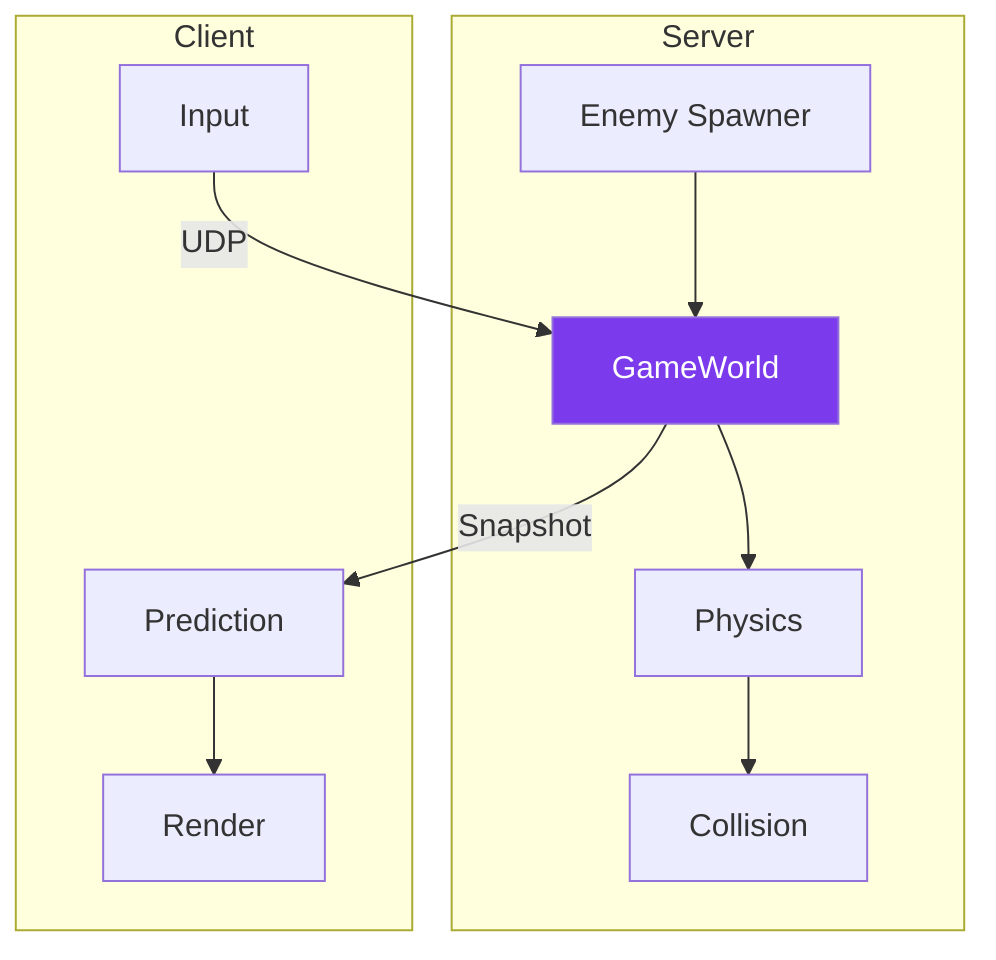

---
tags:
  - technique
  - gameplay
---

# Mécanique de Jeu

Architecture du gameplay R-Type.

## Vue d'Ensemble



---

## Modèle Autoritatif

Le **serveur est la source de vérité** :

| Responsabilité | Serveur | Client |
|----------------|---------|--------|
| Position joueurs | ✅ Calcul | Prédiction |
| Spawn ennemis | ✅ Décision | Affichage |
| Collisions | ✅ Détection | - |
| Score | ✅ Calcul | Affichage |
| Inputs | Validation | ✅ Capture |

---

## Boucle de Jeu (Serveur)

```cpp
void GameWorld::tick() {
    // 1. Process inputs
    for (auto& player : players_) {
        if (auto input = player.popInput()) {
            processInput(player, *input);
        }
    }

    // 2. Update physics
    for (auto& entity : entities_) {
        entity.position += entity.velocity * TICK_DURATION;
    }

    // 3. Spawn enemies
    waveManager_.update(TICK_DURATION);

    // 4. Check collisions
    checkCollisions();

    // 5. Remove dead entities
    removeDeadEntities();

    currentTick_++;
}
```

---

## Documentation

<div class="grid-cards">
  <div class="card">
    <h3><a href="game-world/">🌍 GameWorld</a></h3>
    <p>Serveur autoritatif</p>
  </div>
  <div class="card">
    <h3><a href="entites/">👾 Entités</a></h3>
    <p>Joueurs, ennemis, missiles</p>
  </div>
  <div class="card">
    <h3><a href="collisions/">💥 Collisions</a></h3>
    <p>Système AABB</p>
  </div>
  <div class="card">
    <h3><a href="prediction/">🔮 Prédiction</a></h3>
    <p>Client-side prediction</p>
  </div>
</div>
