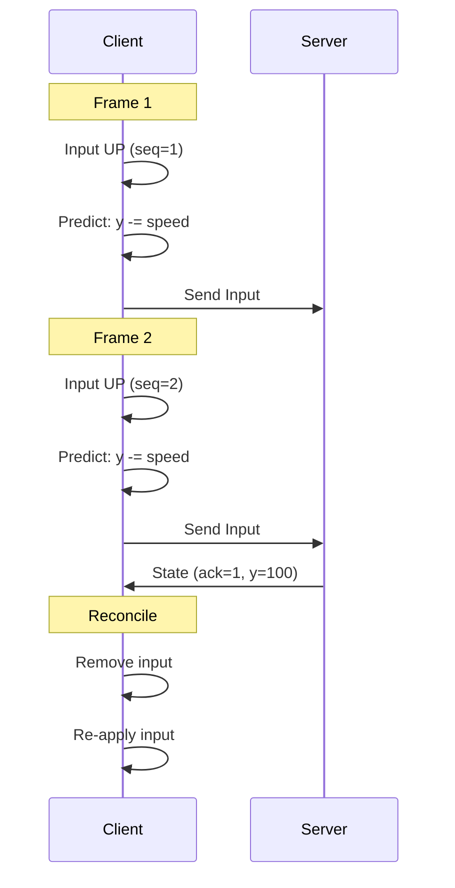

---
tags:
  - technique
  - gameplay
  - reseau
---

# Client-Side Prediction

Technique pour masquer la latence réseau.

## Problème

Sans prédiction, le joueur ressent un délai :

```
Input → [Réseau 50ms] → Serveur → [Réseau 50ms] → Affichage
Total : 100ms de latence perçue
```

---

## Solution

Le client **prédit** le résultat de ses inputs :



---

## Implémentation Client

```cpp
class PlayerController {
    struct PendingInput {
        uint32_t sequence;
        Input input;
        Vector2f predictedPos;
    };

    std::deque<PendingInput> pendingInputs_;
    uint32_t inputSequence_ = 0;
    Vector2f position_;

public:
    void update(float dt) {
        // 1. Collect input
        Input input = collectInput();
        input.sequence = ++inputSequence_;

        // 2. Predict locally
        Vector2f predictedPos = position_;
        applyInput(predictedPos, input, dt);

        // 3. Store for reconciliation
        pendingInputs_.push_back({
            .sequence = input.sequence,
            .input = input,
            .predictedPos = predictedPos
        });

        // 4. Apply prediction
        position_ = predictedPos;

        // 5. Send to server
        network_.send(input);
    }

    void onServerState(const PlayerState& state) {
        // Remove acknowledged inputs
        while (!pendingInputs_.empty() &&
               pendingInputs_.front().sequence <= state.lastAckedInput) {
            pendingInputs_.pop_front();
        }

        // Start from server position
        position_ = {state.x, state.y};

        // Re-apply unacknowledged inputs
        for (auto& pending : pendingInputs_) {
            applyInput(position_, pending.input, TICK_DURATION);
        }
    }

private:
    void applyInput(Vector2f& pos, const Input& input, float dt) {
        const float SPEED = 300.0f;

        if (input.keys & KEY_UP)    pos.y -= SPEED * dt;
        if (input.keys & KEY_DOWN)  pos.y += SPEED * dt;
        if (input.keys & KEY_LEFT)  pos.x -= SPEED * dt;
        if (input.keys & KEY_RIGHT) pos.x += SPEED * dt;

        // Clamp
        pos.x = std::clamp(pos.x, 0.0f, WORLD_WIDTH);
        pos.y = std::clamp(pos.y, 0.0f, WORLD_HEIGHT);
    }
};
```

---

## Réconciliation

Quand l'état serveur diffère de la prédiction :

```cpp
void PlayerController::reconcile(const PlayerState& serverState) {
    Vector2f serverPos = {serverState.x, serverState.y};
    Vector2f predictedPos = position_;

    float error = distance(serverPos, predictedPos);

    if (error > SNAP_THRESHOLD) {
        // Erreur trop grande - snap direct
        position_ = serverPos;
        pendingInputs_.clear();
    } else if (error > SMOOTH_THRESHOLD) {
        // Erreur moyenne - interpolation douce
        position_ = lerp(position_, serverPos, 0.3f);
    }
    // Sinon : garder la prédiction
}
```

---

## Interpolation (autres entités)

Pour les entités qu'on ne contrôle pas :

```cpp
class EntityInterpolator {
    struct Snapshot {
        uint32_t tick;
        Vector2f position;
    };

    std::deque<Snapshot> history_;
    static constexpr float INTERP_DELAY = 100.0f;  // ms

public:
    void addSnapshot(uint32_t tick, Vector2f pos) {
        history_.push_back({tick, pos});

        // Garder seulement 1 seconde d'historique
        while (history_.size() > 60)
            history_.pop_front();
    }

    Vector2f getInterpolatedPosition(float currentTime) {
        float renderTime = currentTime - INTERP_DELAY;

        // Trouver les 2 snapshots encadrant renderTime
        Snapshot* before = nullptr;
        Snapshot* after = nullptr;

        for (auto& snap : history_) {
            float snapTime = snap.tick * TICK_DURATION * 1000;
            if (snapTime <= renderTime) {
                before = &snap;
            } else {
                after = &snap;
                break;
            }
        }

        if (!before || !after)
            return history_.empty() ? Vector2f{} : history_.back().position;

        // Interpolation linéaire
        float t0 = before->tick * TICK_DURATION * 1000;
        float t1 = after->tick * TICK_DURATION * 1000;
        float t = (renderTime - t0) / (t1 - t0);

        return lerp(before->position, after->position, t);
    }
};
```

---

## Diagramme Temporel

```
Server:  T0 ──────── T1 ──────── T2 ──────── T3
          │          │          │          │
          ▼          ▼          ▼          ▼
Client:  [    Interp Delay    ][   Render   ]
         ├──────────────────────┼───────────┤
         t-100ms                t            t+frame
```

---

## Paramètres

| Paramètre | Valeur | Description |
|-----------|--------|-------------|
| `TICK_RATE` | 60 Hz | Serveur |
| `INTERP_DELAY` | 100 ms | Délai d'interpolation |
| `SNAP_THRESHOLD` | 50 px | Seuil de téléportation |
| `SMOOTH_THRESHOLD` | 5 px | Seuil de lissage |
