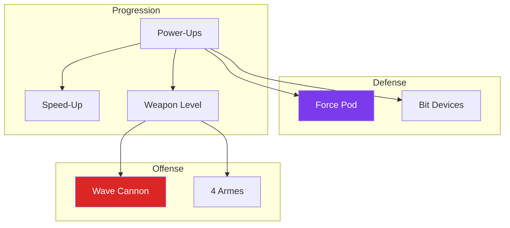

---
tags:
  - technique
  - gameplay
  - rtype
  - mecaniques
---

# Mecaniques R-Type Authentiques

Implementation des mecaniques signature du R-Type original (1987).

## Vue d'Ensemble



---

## Wave Cannon (Charge Shot)

La mecanique **signature** du R-Type : maintenir le tir pour charger un beam devastateur.

### Fonctionnement

```
MAINTENIR TIR:    [##########----------] BEAM GAUGE
                   ▲
                   │ Charge progressive
                   │ (ne peut pas tirer normal pendant)

NIVEAU 1 (0.6s):  *------>  Petit beam
NIVEAU 2 (1.3s):  ***=====>  Beam moyen, traverse faibles
NIVEAU 3 (2.2s):  *****=========>  MEGA BEAM, traverse tout
```

### Statistiques

| Niveau | Temps | Degats | Largeur | Vitesse |
|--------|-------|--------|---------|---------|
| Lv.1 | 0.6s | 50 | 20px | 850 px/s |
| Lv.2 | 1.3s | 100 | 35px | 850 px/s |
| Lv.3 | 2.2s | 250 | 55px | 850 px/s |

### Protocol Messages

```cpp
// Client -> Serveur
ChargeStart     = 0x0400  // Debut charge
ChargeRelease   = 0x0401  // Relache (charge_level)

// Serveur -> Client
WaveCannonFired = 0x0402  // WaveCannonState

struct WaveCannonState {
    uint16_t id;
    uint8_t owner_id;
    uint16_t x, y;
    uint8_t charge_level;  // 1-3
    uint8_t width;         // Largeur du beam
};
```

---

## Force Pod

L'orbe iconique du R-Type : bouclier et arme combinee.

### Modes

```
MODE ATTACHE AVANT:        MODE ATTACHE ARRIERE:

    [FORCE]<==>[SHIP]          [SHIP]<==>[FORCE]
       │                                    │
       ▼                                    ▼
  - Bouclier frontal              - Bouclier arriere
  - Tir laser amplifie            - Tir vers l'arriere

MODE DETACHE:

    [SHIP]          [FORCE]
                       │
                       ▼
                - Flotte librement
                - Tire independamment
```

### Statistiques

| Propriete | Valeur |
|-----------|--------|
| Taille | 32x32 px |
| Degats contact | 30 |
| Invincible | Oui (bloque projectiles) |

### Niveaux

| Niveau | Effet |
|--------|-------|
| Lv.1 | 1 tir forward |
| Lv.2 | 2 tirs en V + laser faible |
| Lv.3 | 4 tirs + laser puissant |

### Protocol Messages

```cpp
ForceToggle      = 0x0420  // C->S: Toggle attach/detach
ForceStateUpdate = 0x0421  // S->C: ForceState

struct ForceState {
    uint8_t owner_id;
    uint16_t x, y;
    uint8_t is_attached;
    uint8_t level;  // 0 = pas de force, 1-2
};
```

---

## Bit Devices

2 orbes defensifs orbitant autour du vaisseau.

```
                [BIT]
                  │
                  │
[SHIP] <=========>
                  │
                  │
                [BIT]
```

### Statistiques

| Propriete | Valeur |
|-----------|--------|
| Taille | 24x24 px |
| Rayon orbite | 50 px |
| Vitesse orbite | 3.0 rad/s |
| Degats contact | 15 |
| Cooldown tir | 0.4s |
| Invincible | Oui |

### Protocol

```cpp
struct BitDeviceStateSnapshot {
    uint8_t owner_id;
    uint8_t bit_index;  // 0 = premier, 1 = second
    uint16_t x, y;
    uint8_t is_attached;
};
```

---

## Systeme de Power-Ups

Les power-ups apparaissent quand on detruit un **POWArmor** (50% de chance).

### Types de Power-Ups

| Type | Effet | Couleur |
|------|-------|---------|
| Health | +25 HP | Rouge |
| SpeedUp | +1 niveau vitesse | Bleu |
| WeaponCrystal | +1 niveau arme | Rouge |
| ForcePod | Donne/upgrade Force | Orange |
| BitDevice | 2 Bits orbitaux | Violet |

### Statistiques

| Propriete | Valeur |
|-----------|--------|
| Taille | 32x32 px |
| Duree de vie | 10s |
| Drop chance (normal) | 8% |
| Drop chance (POWArmor) | 50% |

### Protocol Messages

```cpp
PowerUpSpawned   = 0x0410  // S->C: PowerUpState
PowerUpCollected = 0x0411  // S->C: PowerUpCollected
PowerUpExpired   = 0x0412  // S->C: powerup_id

enum class PowerUpType : uint8_t {
    Health = 0,        // +25 HP
    SpeedUp = 1,       // +1 vitesse
    WeaponCrystal = 2, // +1 arme
    ForcePod = 3,      // Force Pod
    BitDevice = 4,     // 2 Bits
    COUNT = 5
};

struct PowerUpState {
    uint16_t id;
    uint16_t x, y;
    uint8_t type;
    uint8_t remaining_time;  // Secondes
};
```

---

## Speed-Up

Augmente la vitesse du joueur jusqu'a 3 niveaux.

| Niveau | Multiplicateur | Vitesse |
|--------|----------------|---------|
| 0 (base) | 1.0x | 200 px/s |
| 1 | 1.3x | 260 px/s |
| 2 | 1.6x | 320 px/s |
| 3 (max) | 1.9x | 380 px/s |

**Bonus** : Collecter un SpeedUp au niveau max donne +500 points.

---

## Weapon Level

Le cristal d'arme augmente le niveau de TOUTES les armes.

| Niveau | Degats | Cooldown | Vitesse |
|--------|--------|----------|---------|
| Lv.0 | x1.00 | x1.00 | x1.00 |
| Lv.1 | x1.15 | x0.95 | x1.00 |
| Lv.2 | x1.30 | x0.90 | x1.00 |
| Lv.3 | x1.50 | x0.85 | x1.10 |

---

## Constantes (Protocol.hpp)

```cpp
// Wave Cannon
constexpr float CHARGE_TIME_LV1 = 0.6f;
constexpr float CHARGE_TIME_LV2 = 1.3f;
constexpr float CHARGE_TIME_LV3 = 2.2f;
constexpr uint8_t DAMAGE_LV1 = 50;
constexpr uint8_t DAMAGE_LV2 = 100;
constexpr uint8_t DAMAGE_LV3 = 250;
constexpr float WAVE_CANNON_SPEED = 850.0f;

// Force Pod
constexpr float FORCE_POD_SIZE = 32.0f;
constexpr uint8_t FORCE_CONTACT_DAMAGE = 30;

// Bit Device
constexpr float BIT_SIZE = 24.0f;
constexpr float BIT_ORBIT_RADIUS = 50.0f;
constexpr float BIT_ORBIT_SPEED = 3.0f;
constexpr uint8_t BIT_CONTACT_DAMAGE = 15;
constexpr float BIT_SHOOT_COOLDOWN = 0.4f;

// Power-Ups
constexpr float POWERUP_SIZE = 32.0f;
constexpr float POWERUP_LIFETIME = 10.0f;
constexpr float POWERUP_DROP_CHANCE = 0.08f;
constexpr float POWERUP_POW_ARMOR_CHANCE = 0.50f;

// Speed
constexpr float SPEED_MULTIPLIERS[] = {1.0f, 1.3f, 1.6f, 1.9f};
constexpr uint16_t SPEEDUP_MAX_BONUS = 500;
```

---

## References Code

| Fichier | Description |
|---------|-------------|
| `Protocol.hpp` | Structures et constantes |
| `GameWorld.cpp` | Logique serveur |
| `GameScene.cpp` | Rendu client |
